### 计算机体系结构

------

#### 第一讲 概述：从集成电路到数据中心

- 计算机架构：设计、分析、选择和互连硬件部件以制造出满足功能、性能和成本目标的计算机的科学和艺术

##### See "small" in the 20th century

##### A short history of the IC industry

- IC (integrated circuit) 集成电路
  - Geoffrey Dummer (UK), First conceptualize the idea
  - Jack Kilby and Robert Noyce (US), First independently invented IC
- 最早的电子通用计算机：ENIAC，by 1946
- 晶体管：替代笨重的真空管和机械继电器，现代计算机的基础

* VLSI (Very Large Scale Integration)：超大规模集成电路

##### A brief introduction to VLSI

* 抽象层级：Application - Software system - Hardware system - Module - Gates - Circuits - Devices - Physics

* 名词：Silicon Ingot 硅锭，Wafer 晶片,  Naked Die 裸模,  Packaged Die 组合模具

* 半导体：N型（自由电子），P型（空穴）

* 晶体管结构 transistor structure：**nMOS晶体管在栅极为低电平时OFF，高电平时ON；pMOS晶体管在栅极低电平时ON，高电平时OFF**

  

* N/P晶体管

  * NMOS switch closes when switch control input is high
  * PMOS switch closes when switch control input is high

* **From circuit to layout**

  * 活性区为薄氧化区, Active areas for thin oxide region, 绿色

  * 门用多晶硅，Polysilicon for the gate，红色

  * 金属互连，Metal for interconnection，蓝色

  * 用于层间连接的触点(Via)，Contact (Via) for inter-layer connection，黑色

    

* 晶体管Gate宽度：Gate Length = 2λ，**feature size**

  * 最低过程维度(The minimum process dimension)就是feature size= 2λ
  * feature size反映transistor channel(gate)的典型长度

  

* 摩尔定律：当价格不变时，集成电路上可容纳的元器件的数目，约每隔18-24个月便会增加一倍，性能也将提升一倍

##### Think “Big" in the 21st century

##### The server and data center industry

* Scale out ：横向扩展，往系统中添加更多组件（eg，增加集群中的结点数）

* Scale Up ：纵向扩展，往系统中的单一组件添加更多资源（eg，提升内存）

* HPC Center/supercomputer，高性能计算中心 ：高性能组件，**注重吞吐量 throughput**

* IDC(Internet Data Centers)，互联网数据中心：价格低廉，商用组件，**注重服务延迟 latency**

* 一个典型的数据中心

  名词：Server racks 服务器机架, A/C systems 空调系统, Power Distribution Units 配电单元, UPS(Uninterruptible Power System) 不间断电源, Energy Storage Cabinets 储能柜, Switch Gears 开关齿轮

  

* 数据中心的三大支柱：

  * power system
  * cooling facility
  * ICT Equipment (Information and Communication Technology，信息和通信技术)

* 数据中心TCO (Total Cost of Ownership) 总拥有成本：

  CapEX (Capital Expenditure) 资本支出 + OpEx (Operational Expenditure) 运营支出

##### Why energy is a big issue

* Energy Consumption Issue：cost，environment impact
  * 不断增长的能源消耗推高了数据中心的成本，需要考虑替代电源供应解决方案
  * 温室效应和气候变化：1MW数据中心→每年10~ 15kt CO2；数据中心必须受到碳排放的限制

* Power capacity issue：scalability
  * 数据中心是power-constrained，电量提供有限
* How to scale power capacity
  * improve efficiency：**Consolidate Servers 强化服务器**，Deploy Containers 部署容器
  * facility construction：**Upgrade Equipment 升级设备**，Build New Datacenters 建立新的数据中心
  * Third-party solutions：Lease Colocation 租赁场地出租，Move to the Cloud 迁移到云

##### Summary

* What is Computer Architecture：设计、分析、选择和互连硬件部件以制造出满足功能、性能和成本目标的计算机的科学和艺术
* History of IC(integrated circuit)
* Transistor basics
* Feature length
* HPC vs IDC
  * HPC Center/supercomputer，高性能计算中心 ：高性能组件，**注重吞吐量 throughput**
  * IDC(Internet Data Centers)，互联网数据中心：价格低廉，商用组件，**注重服务延迟 latency**
* Scale up/out
  * Scale Out：横向扩展，往系统中添加更多组件（eg，增加集群中的结点数）
  * Scale Up ：纵向扩展，往系统中的单一组件添加更多资源（eg，提升内存）
* Energy/power issues
* The trend of Computer Architecture research

*  

------

#### 第二讲 指令集架构

* Review

  * ENIAC：使用十进制，每个数字10个真空管，可以存储20个10位数字
  * 从晶体管到集成电路；从单体服务器到数据中心
  * 制造过程 (fabrication process) 的feature size：晶体管的最小横向维度
  * 可扩展性问题 (scale out/up)：指数增长的计算 vs 飞速增长的能源需求

##### Instruction Set Architecture

* 计算机设计的层次 aspects

  * 架构 architecture：指令集架构 - instruction set architecture
  * 实现 implementation：微架构 - micro-architecture
  * 物理层设计 physical design：chip realization

* 指令集架构 ISA

  * 定义：defines data and control flow
    * 保存数据的存储资源：memory，addressing
    * 转换数据的指令：arithmetic/logic，floating point
  *  另一种定义：defines set of programmer visible state (程序员可见状态集)，instruction format and semantics (指令格式和语义)

* 计算机架构的发展史

  

* **四种传统的架构：stack，accumulator（直接操作内存），register-memory（CISC），register-oriented（RISC）**

  

* 复杂指令集 CISC, Complex Instruction Set Computer

  * **80**年代中期的主导风格
  * 编译器容易实现，更少的代码
  * **stack-oriented instruction set**
    * 通过栈传递参数，保存程序计数器 IP
    * 显示地push/pop指令
  * **register-memory architecture**
    * 算术指令可以访问内存
  * **condition codes**：设置为算术和逻辑指令的副作用 side effect

* 采用CISC的处理器

  * IA-32：Intel Architecture， 32 bit
    
    
    
    * Processor State：为下一条指令提供上下文而在指令末尾保存在处理器中的信息
      * PC, general register values, special register values等
    * **Processor State 和 Processor Power State 是不同的**
    
  * X86-64： x86 instruction set, 64 bit

  * IA-64：一个完全新的高性能指令集架构，安腾系列的的Intel 64位微处理器

* 精简指令集 RISC, Reduced Instruction Set Computer

  - 现代的RISC可以追溯到1980s
  - 更少，更简单的指令
    - 完成相同的task需要更多的指令
    - 可以在small/fast的硬件上执行
  - **register-oriented instruction set**
    - 有许多提供给参数，返回值的寄存器（32个）
  - **load-store architecture**
    - 只有load/store指令可以访问内存
  - **no condition codes**

* 采用RISC的处理器：MIPS

  * 全拼：Microprocessor without Interlocked Pipeline Stages

  * 指令类型：R类型，I类型，J类型

    

    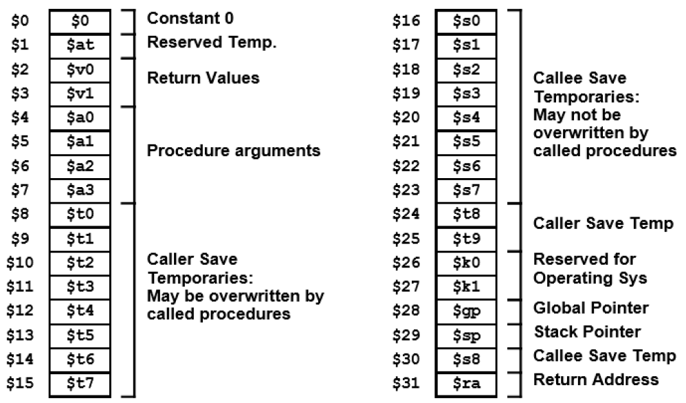

##### ISA：Programmer‘s View

* compiler和assembler

  * compiler：将高级程序语言转换为汇编语言
* assembler：将每个汇编语言指令转换为硬件可理解的位模式(机器码)
  
* **指令集是硬件软件直接的接口 interface between software and hardware**

  * 高级程序语言 high level language - 汇编程序 low level language 指令集 ISA - 数据通路 register level transfer - 逻辑门电路 - CMOS 晶体管

    

    

* User ISA 和 System ISA

  * **User ISA：使应用程序正常工作**

    * 这是编译器在将高级语言中指定的算法映射到机器指令时所使用的ISA的子集

    * 指代那些对应用程序可见的指令集：data flow，ALU operations， control flow

      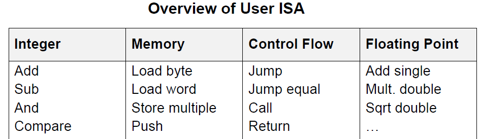

  * **System ISA：管理/共享资源**

    * 这是为低级O/S子系统用汇编语言精心编写的ISA的子集（eg. scheduler, virtual memory, device drivers）
    * 指代那些助管软件可见的指令集，比如OS，用于管理硬件资源
  * Overview of system ISA：privilege levels, control register, instruction that manage key source (processor - scheduling/time-sharing, memory - isolated address space, I/O - isolated disk storage space)
    

* Good interface design 优秀的指令集的特点

  * 背景：更大的CPU，技术瓶颈改变(power)，编译技术进步 (寄存器分配)，程序风格改变 (汇编，面向对象)，应用程序改变 (多媒体，深度学习)
  * 兼容性 compatibility：具有多种实现
  * 普遍性 generality：在多种场景使用
  * 提供在higher level能方便使用的功能
  * 允许在lower level做有效的实现

* RISC-V，可以自由用于任何目的的RISC ISA；支持小型、快速、低功耗系统设计

##### ISA： Microarchitecture level design - simple pipeline implementation

* 组合逻辑 Combinational logic 和时序逻辑 Synchronous sequential logic

  * 边缘触发 Edge-triggered：数据仅在clock edge被采样
  * 组合逻辑包括，mux，demux，alu等
  * 时序逻辑包括，latch，register等

* 简单的memory model，一个register file就可以了

  * read可以在任何时间完成(即组合逻辑)
  * write是在上升的时钟边缘执行的

* 普林斯顿风格：就是冯·诺依曼模型

* 哈佛架构 Harvard Architecture

  * 将指令和数据的存储和信号通路物理层面地分开

    

* 五级流水线：指令级并行

  * 流水线：一种实现技术，其中多个指令在执行中重叠

  * 阶段：Instruction fetch -> Instruction decode and Register file Read -> Execute or Address calculation -> Memory access -> Write back

    

* Pipeline speedup

  * 加速来源于吞吐量的增加，单条指令的延迟并不会减少
  * pipeline rate受限于最慢的那个pipeline stage
  * 理想情况下，pipeline应该加速stage数量的倍数
  
* **ideal pipeline 理想的流水线**

  * 一致的子过程划分 - 平衡pipeline状态 
    * **Uniform sub-computations - balancing pipeline states**
  * 相同的计算 - 统一的指令类型 
    * **Identical computations - unifying instruction types**
  * 独立的计算过程 - 最小化pipeline暂停 
    * **Independent computations  - minimizing pipeline stalls**

* Stage Quantization 阶段量化 

  * 将一些子过程合并：更短的stage间延迟

  * 将一些子过程拆分：子过程的更细粒度

    

* **pipeline slots 流水线部件 **

  * pipeline slot表示处理一个uOp所需的硬件资源 (如果全都绿了表示利用率最高)

  * **分类：front-end, back-end, retiring, bad speculation**

    

  * 前端表示处理器核心的第一部分，后端负责获取后面执行的操作
    * 分支预测：预测下一条执行指令的地址
    * cache lines：获取和解析指令
    * 解析成微指令 uOps

  * 前端绑定metric, 表示处理器前端对后端的slot fraction供应不足

##### Summary

* Architecture vs microarchitecture：一种给定指令集可以在不同的微架构中执行，计算机架构是微架构和指令集设计的结合
* Evolution of instruction sets：Four Classic Architectures
* CISC(IA32) vs RISC(MIPS)
* Machine interfaces：ISA
* User/System ISA：User ISA 负责使应用程序正常工作，System ISA负责管理/共享资源(上层是OS)
* MIPS instruction field
* Single-cycle MIPS
* Ideal pipeline
  * Uniform sub-computations - balancing pipeline states
  * Identical computations - unifying instruction types
  * Independent computations  - minimizing pipeline stalls
* Stage quantization，对pipeline进行加速的尝试
* Pipeline slot
*  

------

#### 第三讲 指令级并行化探索 I

* Review

  * ISA, micro-architecture, physical design
  * Evolution of ISA
  * CISC vs RISC, IA32 and x86
  * MIPS instruction fields
  * Machine interface, user ISA and system ISA
  * Good interface design
  * Hardware elements
  * Simple MIPS pipeline
  * Pipeline speedup and pipeline design challenge

##### Pipeline Hazards

* Dependence and Hazards

  * **依赖关系的定义：反应程序的执行顺序，暗示存在hazard的可能性，决定了parallel的程度**

* Hazard：是hardware organization的属性，由乱序指令，重叠执行等引起

  * 三种依赖：

    * **data dependence**：easy for determine for registers, hard for memory location，寄存器的话在解码阶段就可以看出来，内存就比较麻烦

      eg.  c = a + b; e = c + d;

    * **name dependence**：两个指令使用相同的寄存器或内存位置(称为name)，但实际上并不交换数据

      **anti-dependence** : eg. a = b + c; b = c + d;

      **output dependence**：eg. a = b + c; a = d + e;

    * **control dependence**：分支语句

      * **control dependence可以看作是一种RAW**

  * 可能的数据冒险类型：RAW, WAR, WAW

    

* 三种流水线冒险 Pipeline Hazard：

  * **structural hazard 结构冒险**
  * **data hazard 数据冒险**：通过转发和预测来避免 bypassing or forwarding，但不能规避load/use hazard
  * **control hazard 控制冒险**

  * pipeline interlock：检测数据冒险、暂停pipeline的硬件机制称为pipeline interlock，即使是数据转发，也不能违背时间顺序

    

##### Dynamic Scheduling：Scoreboarding

* Long-latency operations：有的指令的执行周期可以很长

* Dynamic Scheduling and Out-of-order Execution

  - 动态调度的想法：对issue和hazard进行动态的hardware control
  - 实现：有两种经典方法
    - **Control-centric: Scoreboarding**
    - **Data-centric: Tomasulo’s algorithm**

* 动态调度：记分牌算法 Scoreboarding

  * 核心：out-of-order execution, control-centric

  * FU/Function unit：一种基本的处理元素，它根据输入计算一些结果；包括Adders, multipliers, ALUs, register files, load/store units

  * **不同类型的FUs**

    

* Scoreboarding的四个阶段

  * Issue：**检查结构冒险和WAW冒险**，可能stall（如果是写同一个寄存器就不行）
    
    * unit是否有空闲
    
  * Read operands：**如果没有RAW冒险**，读取operands（如果现在要用的正在被写就要等等）

  * Execution：遵循记分牌的指示

  * Write result：**检查WAR冒险**，可能stall（如果现在要写的寄存器正在被读就要等等）
    
    * 是否有之前的指令读取自己目标寄存器中的值（RO阶段过后就可以了），遍历当前unit的Fi是否在其他unit的Fj，Fk中出现，并且Rj，Rk为Yes
    
  * 出现问题的原因就是这是基于寄存器号的，而不是tag的

    

* Scoreboarding的九个field

  * Op：unit中正在执行的操作
  * Fi：目标寄存器号
  * Fj, Fk：源寄存器号
  * Qj, Qk：产生Fj，Fk的function unit（Integer, Add等）
  * Rj, Rk：表示Fi，Fj是否ready的flag
  * Busy：表示unit是否busy

* Scoreboarding执行界面

  * **执行时间是指在RO处停留的时间**，贴图是中途的执行截图

    

    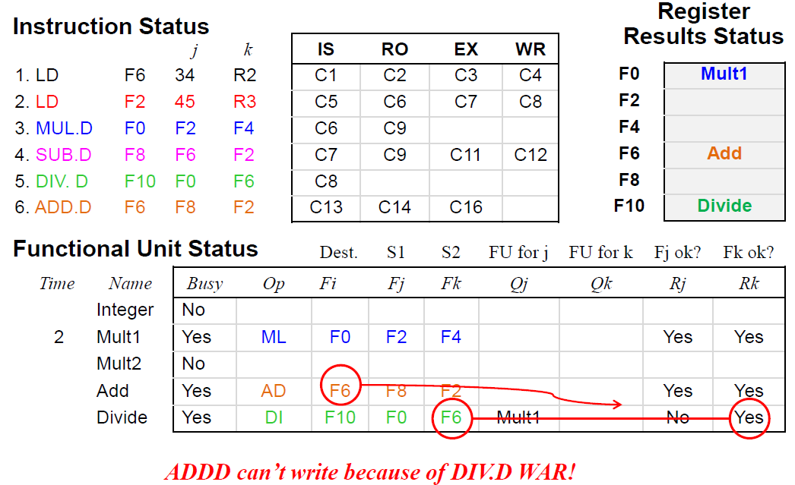

##### Dynamic Scheduling : Tomasulo's Algorithm

* Tomasulo's Algorithm的要点
  * 保留站 Reservation Station：一旦操作数可用，就fetch并buffer它；当所有操作数都存在时，启用关联的FU
  
  * Load/Store Buffers：表现几乎和和RS差不多
  
  * 公共数据总线 Common Data Bus：Data flow approach:，指令可以在操作数available的瞬间开始执行
  
  * 寄存器重命名 Register Renaming：指令中的寄存被tag/指向保留站的pointer代替
  
    * 寄存器重命名排除了name dependence
    * structural hazard：多个RS可以竞争一个共享的FU
    * RS比register多：提供编译器无法提供的优化
  
    

* Tomasulo's Algorithm的三个阶段

  * Issue：从queue中获取指令（顺序）
  * Execution：执行（可能乱序）
  * Write result：结束执行，写回数据（可能乱序）
  * 数据流方法：只要操作数可用，操作就会立即进行(instruction wake up)

* Tomasulo's Algorithm，保留站的field

  * Op：unit中正在执行的操作
  * Vj, Vk：源操作符的值（不是name）
  * Qj, Qk：产生Fj，Fk的RS
  * Busy：表示RS或FU是否busy

* Tomasulo's Algorithm执行界面

  * **执行时间是指在EX处停留的时间**
  
* 值在算出来存进register result status的同时更新保留站的内容
  
  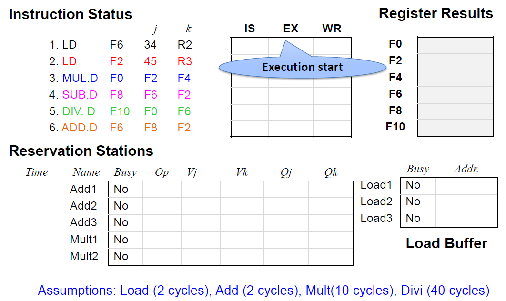
  
    
  
* Scoreboard 和 Tomasulo的对比

  * Tomasulo的关键特征
    * 用Reservation Stations (RS) 实现分布式控制
    * 用Common Data Bus (CDB) 广播所有结果
    * 用tags来标识数据的值
  * Tomasulo 与 scoreboard 不同的地方
    * 分布式冒险检测，用RS来控制
    * 数据结果被同时转发到function Unit
  * 用CDB传输结果

##### Summary

* Pipeline stall and bubble
* Dependency and hazards
* RAW, WAR, WAW：WAR和WAW在typical pipeline中都会被bypass和datapath处理掉
* Forwarding and pipeline interlock：一旦流水线互锁检测到上述数据相关，流水线暂停执行LW指令之后的所有指令，直到能够通过定向/转发解决该数据相关为止
* Functional units：Adders, multipliers, ALUs, register files, load/store units，etc
* Dynamic scheduling and OoO(Out-of-order execution)
* Scoreboarding
* Tomasulo's Algorithm
*  

------

####  第四讲 指令级并行化探索 II

* Review 
  * Hazards (data/name/control)
  * RAW, WAR, WAW hazards
  * Different types of functional units
  * Dynamic scheduling and out-of-order execution
  * Scoreboarding approach vs. Tomasulo's approach

##### Superscalar Pipeline

* **标量流水线 Scalar Pipelines 的不足**

    * 定义：single pipeline with multiple stages，organized in a linear sequential order
    * **标量流水线的吞吐量存在上限**
      * 最大吞吐量是1 instr per machine cycle
      * 更深层次的pipeline的成本效益
    * **单一管道的低效统一**
      * 需要不同的硬件资源支持
      * 指令需要长/可变的延迟
    * **执行僵化rigid导致的效率问题**
      * 一个stall会影响整个流水线

* 优化标量流水线的三种思路
  * make it parallel - superscalar pipelines 超标量流水线
    * 每个machine cycle中fetch多条指令，然后并行decode
  * make it diversified 多元化
    * EX阶段提供多个异构FU，以及合适数量的mix FU
  * make it dynamic
    * 尾随的指令可以绕过stall的前置指令
    * 复杂的multi-entry buffer，用于缓冲指令

* **Multi-issue processor有两种基本风格:**

    * 要得到CPI<1, CPU必须能够在每个周期发出多条指令。
    * **Superscalar processors**
    * **VLIW (very long instruction word) processors**

* SuperScalar Pipeline

  * 相对于scalar pipeline的性能提升：并行化的pipeline

    * **scalar主要关注pipeline的depth，superscalar关注pipeline的width**

  * 两个重要模块
    * Dispatch Buffer (DB) : 控制并行解码后的指令in order
    
      * Centralized：Pentium Pro
      * Distributed：PowerPC 604
    
    * Completion Buffer：控制执行结束后的指令in order
    
      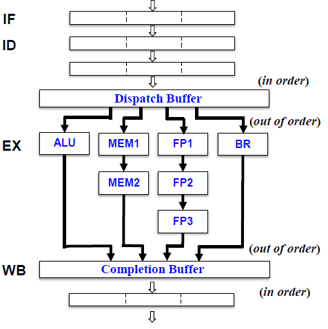

* 评价Pipeline的三个参数

  - Instruction-level parallelism required to fully utilize 利用率
  - Instruction issued per cycle (IPC) 每一时钟周期执行指令数量
  - Simple operation latency 简单指令延迟

* **不同Pipeline的性能评价，Classifying ILP Machines**

  - **Simple Scalar Pipeline ：利用率 : 1/cycle ; IPC : 1 ; latency : 1**

  - **Superscalar machine (n width) ：利用率 : n/cycle ; IPC : n ; latency : 1**

  - **Superpipelined machine (degree m) ：利用率 : m/base cycle ; IPC : 1 (cycle time : 1/m) ; latency : m**

  - **VLIW machine ：利用率 : n/cycle ; IPC : n instr/cycle (1 VLIW/cycle) ; latency : 1**

    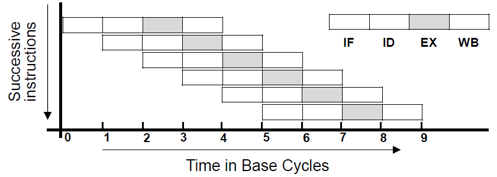

    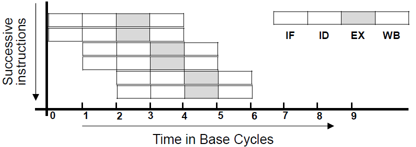

    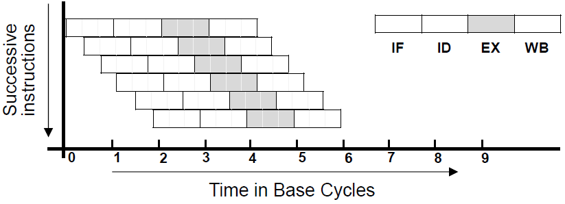

    

##### Speculation

* Branch Prediction 分支预测

  * 17% 的gcc指令是带分支的
  * **两个方面的预测：Branch target speculation和Branch condition speculation**
  * Static Branch Prediction 静态分支预测
    * 在编译时就预测分支的行为：预测always taken；根据分支方向预测；根据历史收集数据预测
  * Dynamic Branch Prediction
    * 根据分支的不同行为来预测：在程序整个生命周期中，可能会改变预测；**硬件支持 branch history tables, branch target buffer等**

* Branch History Tables 基于历史数据的预测

  * key-value设计：提取fetch PC中的一部分作为key，index是2bits的00/01/10/11

  * 效果：4K-entry的BHT，2bits一个entry，80-90%的预测正确率

    

  * 2-bits Branch Prediction

    * 只有在两次预测错误的情况下才改变预测
    * n位分支预测其实并不比2位版本(n>2)准确多少

  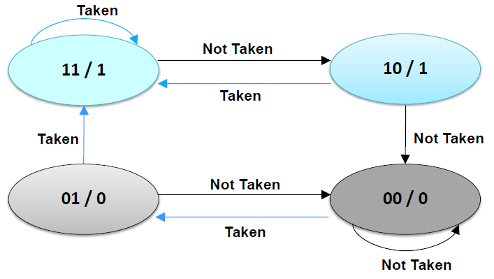

* Branch Target Buffer

  * 类似TLB的查表性质

  * BTB包括两个部分：Branch instruction address: BIA，Branch target address: BTA

    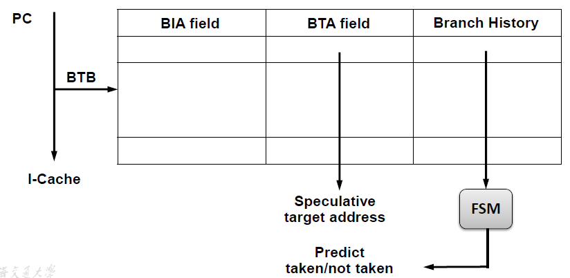

* Mis-prediction Recovery 分支预测错误恢复

  * In-order processor：kill掉所有之后的指令
  * out-of-order processor：可能已经有之后的指令做完了
  * 潜在的安全问题：Meltdown，Spectre，利用乱序执行和分支错误进行攻击
  * **相同的问题：Precise Exception**
    * 维护precise exception意味着要in-order completion
    * 要保证完成指令和访问内存的顺序，complete但没有commit的就buffer

* Hardware-based Speculation

  * 核心思想：
    * Dynamic branch prediction, 
    * Dynamic scheduling of basic blocks,
    * OoO execution with precise exception (in-order commit)
    * **乱序fetch，乱序complete，顺序commit（只有oldest且result valid的指令才可以提交）**

* **Reorder Buffer（ROB）**

  * 作为循环队列(FIFO)管理的指令完成缓冲区：包含in flight的所有指令；保存完成和提交之间的结果

  * ROB fields
    * Instruction type：指令类型（分支/访存/ALU）
    * Destination：写寄存器号/内存地址
    * Value：保存结果，直到指令提交

  * 实际案例（含原始Tomasulo对比）

    * ALU处理不含操作数的指令；Instr Q是指令队列；Reorder Buffer保证顺序commit，head是oldest；FP registers是commit，之前多了一个ROB，src表示即将写入的tag；IS/EX/WR的框实际应该还是有的

      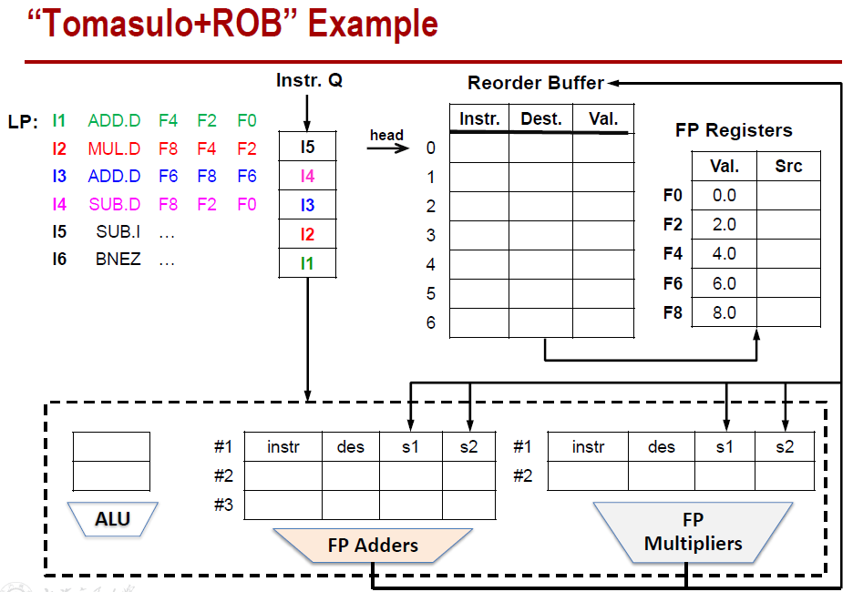

      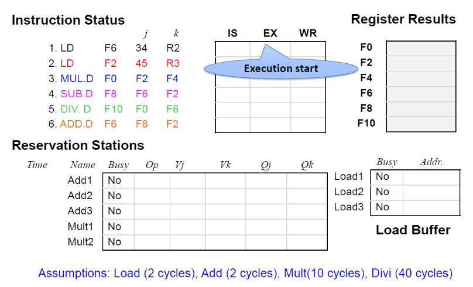

  * 实际执行表格（IS/EX/WR)
    * tag值全都填充后，下一周期开始执行
    * 如果没commit之前，register的src又改了，直接覆写（cycle 8）
    * 这里ADD/SUB周期为3，MUL周期12

  | 指令         | IS          | EX      | WR      | CM             |
  | ------------ | ----------- | ------- | ------- | -------------- |
  | l1 ADD.D     | C1          | C2      | C5      | C6             |
  | l2 MUL.D     | C2          | C6      | C17     | C18            |
  | l3 ADD.D     | C3          | C18     | C21     | C22            |
  | l4 SUB.D     | C4          | C5      | C8      | C23            |
  | l5 SUB.I     | C5          | C6      |         |                |
  | l6 BNEZ      | C6          |         |         |                |
  | ~~l1 ADD.D~~ | ~~C7~~      | ~~C8~~  | ~~C11~~ | ~~(分支错误)~~ |
  | ~~l2 MUL.D~~ | ~~C8~~      | ~~C12~~ |         |                |
  | ~~l3 ADD.D~~ | ~~(ROB满)~~ |         |         |                |

##### VLIW and EPIC

* VLIW 处理器 Very Long Instruction Word

  * 固定数量的operations被format成一条大指令，通常是3条operations
  * 目的：高性能，低硬件复杂度
    * 减少multiple-issue的硬件 Less multiple-issue hardware
    * 简单的指令调度 Simpler instruction dispatch
    * 省去结构冒险的检查逻辑 No structural hazard checking logic
  
    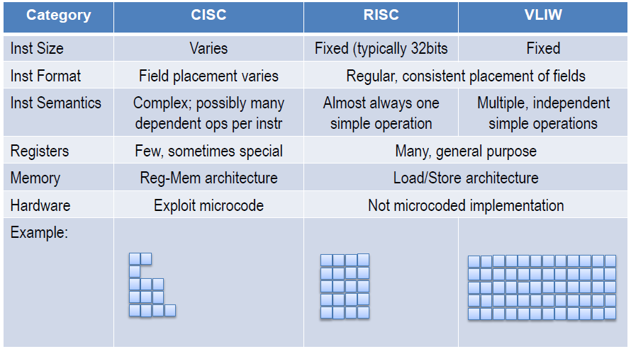

* Compiler Support for VLIW Processor
  
  * 调度的复杂性被转移到编译器中
    * 编译器来组成每条VLIW指令
    * 检查hazard，隐藏latency
    * 通过fill slots来优化指令
  * VLIM对于三种hazard的适应性
    * 结构冒险：不会有两条operations共用相同的FU或Memory bank
    * 数据冒险：同一个bundle的指令不存在数据冒险
    * 控制冒险：预测执行，静态分支预测
  
* Loop Unrolling 循环展开：避免delay，提高CPI

    * 循环展开只是多次复制循环体，调整循环终止代码

* EPIC 显示并行指令计算 Explicitly Parallel Instruction Computing

  * EPIC 是VLIW的进化，它吸收了超标量处理器的许多最佳思想
  * EPIC的哲学
    * 提供在编译时设计plan of execution(POE) 的能力
    * 提供允许编译器"play the statistics"的特性
    * 提供与硬件交流POE的能力

##### Summary

* Superscalar Pipeline
  * Limitations of scalar processor
  * Basic feature of superscalar pipeline：在每个机器周期中获取多个指令，并行解码指令
  * Multi-Issue Processor：得到CPI<1的机器, CPU必须能够在每个周期发出多条指令
  * Dispatch Buffer and Completion Buffer
  * Classification of ILP Machines
    * Baseline machine, superscalar machine, superpipelined machine, VLIW machine
  * Rationale of branch prediction; 2-bit prediction
* Speculation
  * Precise exception: in-order completion
  * Reorder buffer (ROB)
  * Tomasulo's Algorithm with ROB
* VLIW and EPIC
  * CISC vs RISC vs VLIM
  * Loop unrolling
  * The concept of EPIC
*  

------

#### 第五讲 缓存和主存系统

* Review
  * Three limitations of simple pipeline
  * Superscalar pipeline and multiple issue 
  * Classification of ILP
  * Branch prediction and precise exception
  * Reorder buffer
  * Tomasulo algorithm with ROB
  * VLIM and loop unrolling

* Typical PC Organization 典型的PC架构

  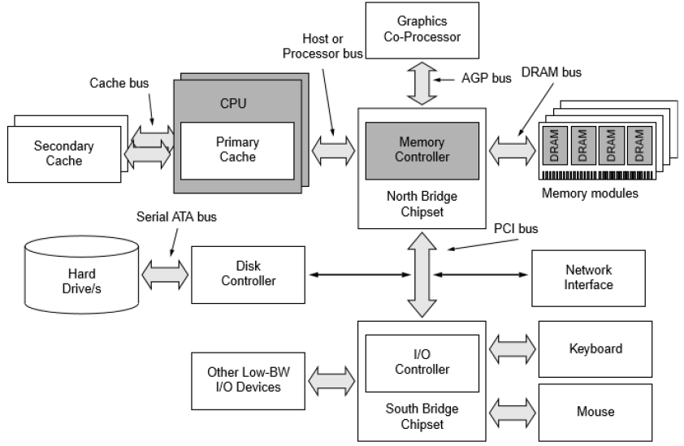

* Memory Hierarchy 存储层次

  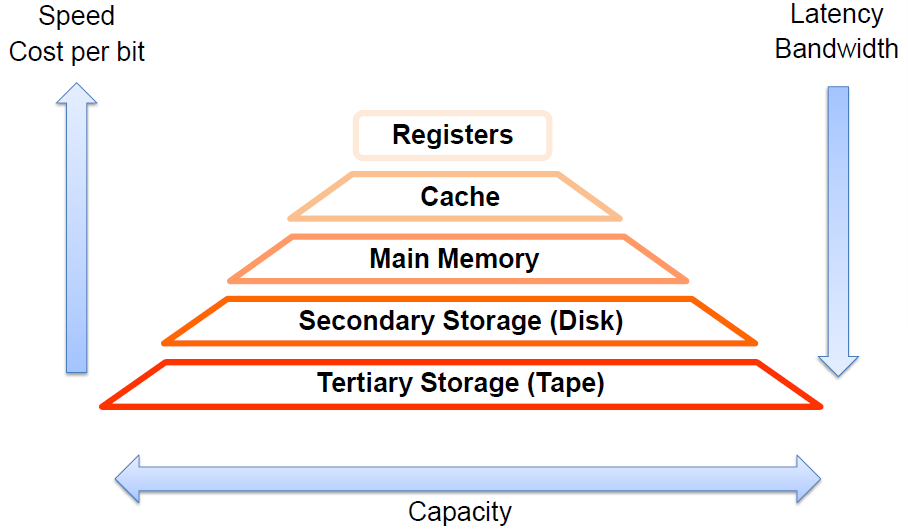

##### Cache Basics ：concepts

* About Cache

  * **Cache Concept：**这张图应该会比较重要
    
    * on-chip : 片上存储器；off-chip：片外存储器，记忆体，片外内存
    
      

  * Cache Format

    * Cache entry fields：tag，status，data

    * 32位地址的机器，cache block大小16 B (4 words)

      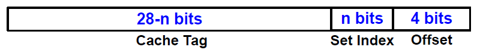

  * Cache联结方式：direct mapped 直接映射；fully associative 全相联；set associative 组相联

* About Virtual Memory

  * 程序地址是虚拟地址；基本思想是不需要将整个代码加载到内存中，以便CPU开始执行；一个页面或虚拟页面是一个固定长度的连续虚拟内存块

  * **Page Table：将virtual pages映射到physical pages的 PTE 的序列**

  * 32位地址空间，4K的page大小，4 byte的PTE

    * 需要2^32 / 2^12 =2^20个PTE
    * Page table的大小为2^22 (4MB)

  * Address translation

    * 处理器向MMU(1)发送虚拟地址 -> MMU从内存页表中取出PTE (2-3) -> MMU向L1缓存发送物理地址 -> L1缓存将数据字发送到处理器

  * 与其他内存字一样，PTE也可以缓存在L1 cache中(或者TLB)：可以被其他数据引用驱逐，PTE命中仍然需要1个周期的延迟

    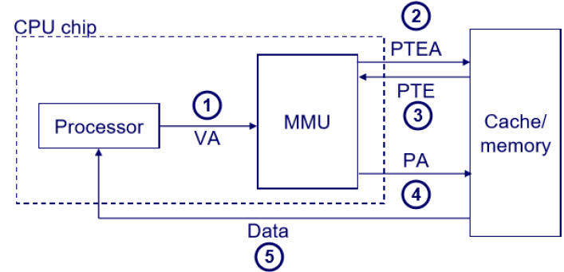

    

##### Cache Basics : Optimizations

* Locality Principles 局部性原则

  * Temporal locality 时间局部性，程序在执行过程中反复使用数据项的倾向
* Spatial locality 空间局部性，程序员和编译器在内存空间中把相关对象聚在一起的倾向
  
* Algorithmic locality 算法局部性，当程序重复访问数据项或执行广泛分布于内存空间中的代码块
  
* Cache Optimization

  * 利用局部性：Temporal locality 时间局部性，Spatial locality 空间局部性，Algorithm locality

  * 3C model：Compulsory miss 冷不命中，Capacity miss 容量不命中，Conflict miss 冲突不命中

* Cache Optimization #1 Locality

  * **Miss Caching**
    * 定义：在L1和L2 cache中的一个全相联cache，包含2-5个cache line的数据，旨在减少conflict miss
    
    * 当L1 cache miss时，检查miss cache中有否有，如果有就把cache line加到L1 cache；否则就从L2 cache中获取，在L1 cache和miss cache中都存一份；L1 cache  移除某cache line时，miss cache中不移除
    
      
  * **Victim Caching**
    
    * 定义：修改replacement策略；比miss cache更好的地方：更小，更好的性能；即使是一两个single line也可能effective
    
    * 当L1 cache miss时，检查victim cache，如果有，就与L1 cache中的被移除cache line交换；否则就从L2 cache中获取
    
      

* Cache Optimization #2 Prefetch

  * Prefetching
    * 当可以利用时间局部性的时候，miss cache和victim cache都会很有用
    * 提前fetch内存块是有用的：预取指令；预取顺序的data access
    * 提前fetch的内存块不一定要放在L1 cache，可以另找一个special buffer；没有被CPU用过的预取块也不会evict L1 cache中可能有用的block
  * Content Management
    * Partitioning heuristics 启发式分区：决定是否cache，应该cache在哪
    * Prefetching heuristics 启发式预取：决定是否、什么时候cache预取块
    * Locality optimizations 局部性优化：重构代码，写cache-friendly的code
  * Prefetch效果的评判标准
    * **Accuracy 精度：有用的预取数量/预取的总数**
    * **Coverage 覆盖率：有用的预取数量/没有预取时原本的总miss数**
    * 结果：It depends. 不同的环境这两个数据差距很大
  * 不能无限预取的三个理由：时间，evict，带宽

* Cache Optimization #3：Cache Write Policies

  * write cache hit：write-back和write-through（写回和直写）
  * write cache miss：write-allocate和no-write allocate
    * 在write miss时，即所要写的地址不在cache中，一种办法是把要写的内容直接写回main memory（no write allocate policy），另一种办法是把要写的地址所在的块先从main memory调入cache中，然后写cache（write allocate policy）
  * write buffer和write cache：tag-less FIFO，have tag
    * 将每个write发送到backing store可能很昂贵，一个典型的解决方案是将一个使用write-through策略的新内存结构插入进去（指memory到write buffer/cache）

* Consistency Management 一致性管理

  * 内存层次结构垂直地划分为不同的级别，每个级别可以进一步水平地划分
  * Cache Relationship (Cache的水平层次)
  * inclusive 相容：每个cache item都在另一个地方有一份拷贝
    * exclusive 互斥：交集为空

##### DRAM Basics

* 主存中的物理架构 (Main Memory / DRAM System)

  * DIMM (dual in-line memory module) 双列直插式存储模块

  * **每个DIMM包括一个/多个独立的rank**

  * **每个rank是一组运行一致的DRAM device**
    
    * rank是一组一个或多个DRAM设备，它们按照给定的命令同步操作
    
  * **每个DRAM device包括一个/多个独立的bank**

    * DRAM芯片描述为xN，其中N为输出引脚数;x4 DRAM(发音为“by 4”)表示DRAM至少有4个内存数组(在单个bank中)，列宽为4位(每列读取或写入传输4位数据)。

  * **每个bank都由slaved memory arrays组成**
    
    * 描述了DRAM devices内部的一系列独立的memory array
    
  * Channel：MC和DRAM module之间的path

  * 可以参考这篇博客 <https://blog.csdn.net/qq_39759656/article/details/81672895?tdsourcetag=s_pcqq_aiomsg>

    

    

* **Parallelism in DRAM**

  * **rank是一组可单独寻址的DRAM device，允许DIMM-level级的独立操作**
  * **每组独立运行的memory array (DRAM device中)被称为一个bank**
  * **因为有许多bank，所以可以同时执行不同的request**
  * **rank-level和bank-level的并发可以通过pipeline request来提供带宽**

* Address Mapping (Translation)

  * **通过channel ID，rank ID，bank ID，row ID，column ID就可以定位到物理地址**

  * 连续的cache line存在同一个row，可以提高row buffer的hit rate（利用局部性）

  * 连续的cache line存在不同的rank，可以提高并行性

    

* 1T1C DRAM Cell

  * T：transistor 晶体管，C：capacitor 电容

  * 一个bit位在DRAM中，要用一个transistor-capacitor来表示

  * 每个capacitor必须定期刷新(refresh)

    * 可能是因为电容里的电会漏掉
    * 如果存储电容器上存有电荷，则表示存储单元存储1，否则存储0

  * control bus由 row/col strobe(行频闪，列频闪)，clock，other signal组成

    

* SRAM 和 DRAM 的对比

  * SRAM速度快但面积大，因此相对DRAM集成度低，功耗大，但速度快，同面积上可以制造很多DRAM但是只能有很少SRAM。所以注定SRAM不可以大容量储存，所以价格更贵；
  * SRAM晶体管很多，发热量大，也限制大面积。而DRAM则需要不停地刷新电路，否则内部的数据将会消失。同时，不停刷新电路的功耗是很高的，在我们的PC待机时消耗的电量有很大一部分都来自于对内存的刷新。

* Example：DRAM Array Access

  * Row Access Strobe (RAS)，Column Access Strobe (CAS)
  * 经典DRAM系统:数据总线的宽度等于列的大小。发送N位为xN DRAM，每周期一个

* Refresh Mechanism

  * **row是bank中refresh时的最小单元**

  * 通常情况下，DRAM cell中数据的保留时间是64ms

  * Refresh操作可以在rank-level或bank-level进行 (per-rank refresh 和 per-bank refresh)

  * 在per-rank refresh中，所有bank在刷新周期中都被锁定和不可访问

    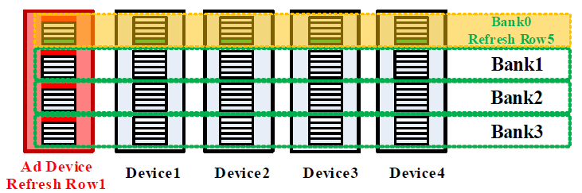

* Cost of Accessing DRAM 访问DRAM的开销

  * Row buffer hit：20 ns，必须只将数据从roe buffer移动到pin
  * Empty row buffer access：40 ns，必须先读取array，然后将数据从row buffer移动到pin
  * Row buffer conflict：60 ns，必须先write back，然后读取new row，然后移动数据

* Synchronous and Asynchronous device 同步的和异步的设备

  * 同步DRAM (SDRAM)：用时钟取代RAS和CAS，从而获得更高数据传输率

    * Row Access Strobe (RAS)，Column Access Strobe (CAS)

  * Double Data Rate (DDR) SDRAM：数据在时钟的两端传输

    

* Memory Wall and Memory Bandwidth Wall

  * **内存墙，指的是内存性能严重限制CPU性能发挥的现象。内存的性能指标主要有“带宽”(Bandwidth)和“等待时间”(Latency)**
  * 由于CPU的主频已经不再无限提高了，我们现在撞上了内存的带宽墙
  * DRAM的容量每两年翻一番，但latency没怎么提升
  * Power wall：数据中心25-40%的power是提供给DRAM system
  * Memory design challenge：**如果提升row buffer hit rate，那latency和power功耗都可以被优化，这需要智能的data row mapping和智能的request schedule**
    * 智能的数据行映射，智能的请求调度

* Discussion : MLP of Graph Workload

  * MLP (Multi-Layer Perception) ：多层感知器，是一种前向结构的人工神经网络，映射一组输入向量到一组输出向量
  * 内存带宽利用率受到高IPM (instruction per miss) 的限制
  * 随着更多的CPU内核，内存利用率不断提高

##### Summary

* Memory hierarchy, uncore and off-chip
* Cache line, block, address
* Virtual memory, page table, PTE, TLB
* Locality principle, Inclusive and exclusive relationship 
  * 相容和互斥，是两个cache之间的关系
* Miss caching, victim caching, prefetching
* Cache write policies, write buffer/cache
* rank, bank, array, channel, MC, parallelism in DRAM
* 1T1C DRAM cell, data access, DRAM refresh
* DRAM access cost, synchronous/asynchronous design
* Memory design challenges, memory wall, MLP
*  

------

#### 第六讲 数据存储和输入输出

* 目前IO性能的一些参数
  * 主频，Intel Core i5,  4.9 GHz
  * 内存带宽，5.3 G/s
  * 磁盘驱动性能：SATA 200 MB/s

##### Basic Concept

* 经典磁盘的内部结构

  * 名词解释：spindle 主轴，motor 电机，Actuator Arm，Actuator 传动装置，Flex cable 排线，Disk platter 磁盘盘片，Read/Write Head 读写磁头

    

* Disk Parameters

  * Cylinder 磁柱，Platter 盘片，Track 轨道，Sector 扇区

  * 一些典型参数：转速72000 RPM, 4096 bytes per sector, 63 sectors per track, 75 nanometers track width, 3 platters, 6 heads, 1 cylinder

    

* Access Cost 磁盘访问时间

  * 寻道时间：将head移动到目标track
  * 旋转时间：将head移动到目标sector
  * 传送时间
  * 其他时间：控制延迟和排队延迟

##### Disk Interface

* Drive Interface

  * 定义：bridge between host and the disk	

    * I/O请求的通信通道，允许读取和写入数据传输

  * Desirable Characteristics of Drive Interfaces 理想特性：
    * simple protocol，减少握手，通信开销更低
    * high autonomy ，host 处理器减少参与，计算开销更低
    * high data rate up to a point，比media的传输速度要快，否则会成为瓶颈
    * overlapping commands，支持多连接磁盘驱动的高利用率
    * command queueing，提高disk的吞吐量
    
    

* ATA，Advanced Technology Attachment 高级技术附件

* SATA，Serial ATA，串行高级技术附件

  * SATA 和 PATA 的对比
    * SATA是一对一Point-to-point的接口，在新系统中占主导地位，电缆长度可以到1米，是向后兼容的
    * PATA是并行化的接口，是老式PC的典型接口，电缆长度最多18英寸 (0.457米)，支持不同的数据传输模式
    
    

* SCSI，Small Computer System Interface，小型计算机系统接口

  * 定义：**一个更高级的接口**，具有ATA中没有的一些功能和特性，在parallel和serial接口都可用
  * SATA 和 SAS (Serial Attached SCSI) 的比较
    * SATA比较便宜，存储量大，功耗低，适用于PC和普通的存储
    
    * SAS读写数据速率快，可靠性高，电缆长，适用于企业级的服务器系统
    
      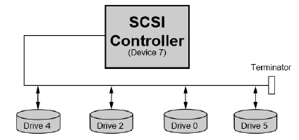

* FC，Fibre Channel，光纤信道

  * 定义：光纤信道是一种高速网络技术标准，主要应用于SAN (存储局域网)，是一种高端，功能丰富的串行接口
  * 其拓扑结构分为三种：点到点 (Point-to-point)，仲裁循环 (Arbitrated Loop)，交换结构 (Switched Fabric)，分为FC-5、4、3、2、1共5层，具有多种适配端口

##### Disk Array and RAID

* JBOD，Just a bunch of disks

  * 定义：没有逻辑关联的一组磁盘驱动器；仅用于分享物理资源，如电源

* Data striping，数据条带化

  * stripe factor/width：磁盘数量

  * stripe unit：固定大小的数据块

  * stripe size/depth：stripe unit的大小

    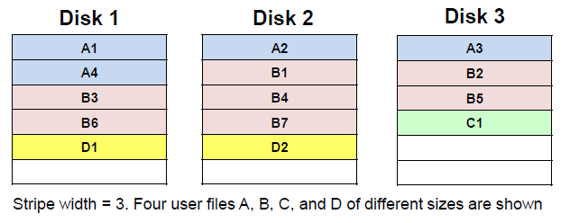

* Date Mirroring，数据镜像，单纯的复制一份

  * 分为Basic mirroring 和 Chain cluster mirroring，后者是错开来镜像的

    

* RAID，Redundant Array of Inexpensive Drives，廉价驱动器的冗余阵列

  * RAID 0，只有数据条带化，没有冗余，其实不算真正意义的RAID

  * RAID 1，只有数据镜像，开销很大，利用率只有50%，但实现很方便

  * RAID 10，先做镜像，再做条带

  * RAID 01，先做条带，再做镜像

    * RAID 10更稳定

    

    

* Fault Tolerance 
  
  * 数据存储需要高数据可用性
    * Data replication 数据复制，开销较大
    * Error correcting coding (ECC)，错误校验码
      * Parity Bit，奇偶校验码
      * XOR-based Redundancy Scheme，核心还是做一个Parity Disk
  
  * RAID 2，使用专用汉明码奇偶校验的位级分段(存储行业不使用)
  
    * bit级条带，汉明码parity
  
  * RAID 3，具有专用奇偶校验的字节级条带(存储行业很少使用)
  
    * byte级条带，带parity
  
    
  
  * RAID 4，具有专用奇偶校验的块级条带(不常用)
    
    * block级条带，带parity
  * RAID 5，具有分布式奇偶校验的块级条带，提供单一驱动器故障保护
    
    * parity分布式
  * RAID 6，具有双分布奇偶校验的块级条带，提供双重故障保护
    * 校验位再加一，两块盘校验，可以坏两块，至少4块组
    * RAID-6和RAID-5一样对逻辑盘进行条带化然后存储数据和校验位，只是对每一位数据又增加了一位校验位。这样在使用RAID-6时会有两块硬盘用来存储校验位，增强了容错功能，同时必然会减少硬盘的实际使用容量容量。以前的raid级别一般只允许一块硬盘坏掉，而RAID-6可以允许坏掉两块硬盘，因此，RAID-6 要求至少4块硬盘。

##### NAS and SAN

* DAS，Direct Access Storage，直接存取存储器

  * 定义：数据存储的管理是分布式的；**服务器通过LAN/WAN发送数据**；通过网络进行额外的服务器访问

    

  * DAS 的优点：初始规模低
  * DAS 的局限性
    * 在局域网中访问不同机器上的数据会导致性能下降
    * 通过LAN/WAN发送大量数据会影响其他通信
    * 如果服务器宕机，DAS对系统的其他部分也不可用了

* NAS，Network Attached Storage 网络附属存储

  * 定义：NAS是一种专门的设备，由存储器、处理器和操作系统组成，**专门用作文件服务器**

    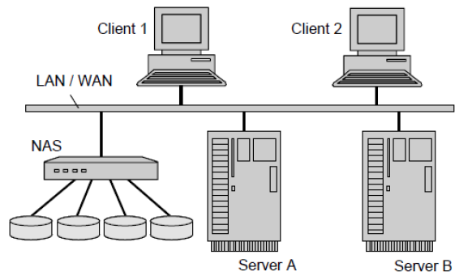

  * NAS的优点
    
    * 经济的存储共享方式；更容易设置和配置；容易支持RAID；更高的存储资源利用率
  * NAS 的缺点：文件请求比块请求慢，不适合不采用文件系统管理存储的系统

* SAN，Storage Area Network，存储区域网络

  * 定义：大量的标准存储设备；专用、高速、可伸缩的后端网络；将存储与服务器的直接连接解耦

    * 存储设为组成单独的网络，服务器和存储任意链接，IO直接发到存储，高层仍然用SCSI

    

  * SAN 的优点

    * **节省局域网/广域网带宽；更好的数据可用性；维护变得更容易；支持异构设备；易于接受集中管理；更高的硬件利用率和高性能**
    * 将存储和服务器隔离，简化了存储管理，能够统一、集中的管理各种资源。
    * 使存储更为高效。通常网络中，可能一个服务器可用空间用完了，另一个服务器还有很多可用空间。SAN把所有存储空间有效的汇集在一起，每个服务器都享有访问组织内部的所有存储空间的同等权利。这一方法能降低文件冗余
    * SAN能屏蔽系统的硬件，可以同时采用不同厂商的存储设备

  * SAN 的不足：跨平台性能没有NAS好，价格偏高，搭建SAN比在服务器后端安装NAS要复杂的多。

* NAS 和 SAN 比较

  * NAS主要是服务于文件，使用以太网，数据访问是文件层面，开销上比较经济

  * SAN主要针对任务的关键型数据，使用光纤信道，数据访问时data block层面，开销非常高

* ##### DAS, NAS, SAN三种存储方式的概念及应用

  * 存储分类

    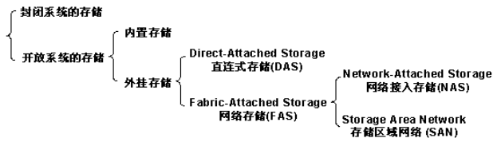

  * DAS 直连存储：

    * 直连式存储与服务器主机之间的连接通常采用SCSI连接，SCSI通道是IO瓶颈;服务器主机SCSI ID资源有限，能够建立的SCSI通道连接有限。
    * 无论直连式存储还是服务器主机的扩展，从一台服务器扩展为多台服务器组成的群集(Cluster)，或存储阵列容量的扩展，都会造成业务系统的停机。

  * NAS  网络附加存储——是一个网络上的文件系统：

    * 存储设备通过标准的网络拓扑结构(以太网)添加到一群计算机上。应用：文档图片电影共享，云存储。NAS即插即用，支持多平台。
    * NAS有一关键问题，即备份过程中的带宽消耗，NAS仍使用网络进行备份和恢复。NAS的一个缺点是它将存储事务由并行SCSI连接转移到网络上，也就是说LAN除了必须处理正常的最终用户传输流外，还必须处理包括备份操作的存储磁盘请求。
    * NAS需要服务器自己搜索它的硬盘

  * SAN 存储区域网络——是一个网络上的磁盘

    * 通过光纤通道交换机连接存储阵列和服务器主机，最后成为一个专用存储网络。SAN提供了一种与现有LAN连接的简易方法，并且通过同一物理通道支持广泛使用的SCSI和IP协议。SAN允许企业独立地增加它们的存储容量。SAN的结构允许任何服务器连接到任何存储阵列，这样不管数据放在哪里，服务器都可以直接存取所需的数据。因为采用了光纤接口，SAN还具有更高的带宽。
    
    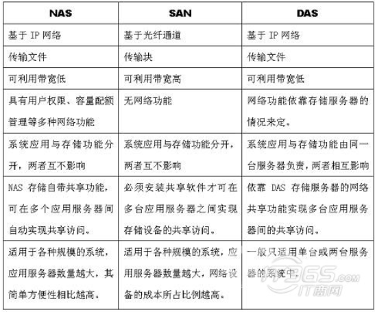
    
    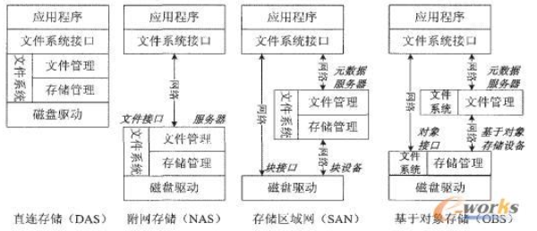

##### Flash Storage Device

* SSD的架构

  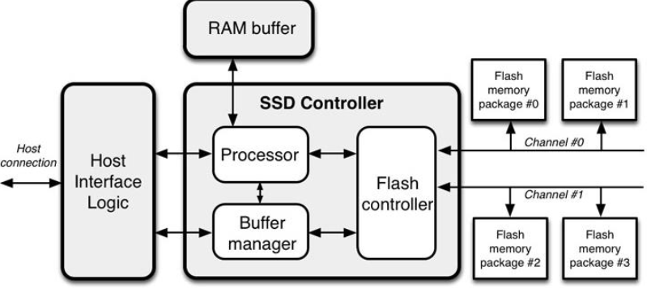

* NAND Flash Cell

  * NAND-flash存储器是flash存储器的一种，其内部采用非线性宏单元模式，为固态大容量内存的实现提供了廉价有效的解决方案。**NAND-flash存储器具有容量较大，改写速度快等优点，适用于大量数据的存储**，因而在业界得到了越来越广泛的应用，如嵌入式产品中包括数码相机、MP3随身听记忆卡、体积小巧的U盘等。
  * NAND Flash有三种类型：SLC, MLC, TLC

* Write Amplification

  * 定义：物理上写入存储媒体的实际信息量是要写入的逻辑信息量的倍数
  * 写入放大（WA）是闪存和固态硬盘之间相关联的一个属性，**因为闪存必须先删除才能改写**，在执行这些操作的时候，移动（或重写）用户数 据和元数据(metadata)不止一次。这些多次的操作，不但增加了写入数据量，减少了SSD的使用寿命，而且还吃光了闪存的带宽（间接地影响了随机写 入性能）

* SLC 和 MLC，Single-Level Cell单层单元和Multi-Level Cell多层单元

  * SLC 每个cell中存 1 个bit，开销更高，密度更稀疏，power cons比较低，寿命相对短
  * MLC每个cell中存 2 个bit，开销更低，密度更大，power cons比较到，寿命相对长

* SSD的优点

  * 很低的延迟：容量数量级小于HDD，没有寻道时间
  * 非常快的读写速度：2700 MB/s，在小文件读写上性能更好
  * 物理上更健壮：耐冲击，没有会移动的部件 (磁头)
  * 没有数据碎片的问题

* SSD在现有存储系统中的应用

  * 混合设计 Hybrid design：SSD + non-volatile cache
    * Improved power management
    * Improved drive reliability
    * Faster boot and loading times
    * Cost efficiency
  * Flash-only
    * Guaranteed high performance
    * Much simpler to manage
    * No mechanical moving parts
    * Capacity and cost issue

##### Summary

* Disk concept; platter/track/sector
* Design good drive Interfaces
* Parallel/Serial ATA; Parallel/Serial SCSI
* RAID Organization
* DAS, NAS, SAN
* Flash memory cell, SLC/MLC
* SSD advantages, hybrid storage
*  

------

#### 第七讲 性能分析与评测简介

##### Quantitative Analysis

* Evaluation Metrics 评价指标
  
  * 典型的指标：Events frequency; Interval durations; Parameter sizes
  
* Amdahl's Law
  * f 是课并行化部分的代码，1-f 是完全串行的
  
  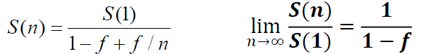
  
* CPI，Clock cycle Per Instruction，指令的平均时钟周期数

  

* Memory performance analysis

  

##### Analytical Modeling

* Little’s Law，科特尔法则

  * 定义：科特尔理论是基于等候理论，可以用于一个稳定的、非抢占式的系统中
  * **λ，平均工作到达速率，每单位时间的个数**
  * **W，系统中一个item的平均等待时间**
  * L = λW，队列的平均长度
  * Example：Assume requests arrive at 100 per minute and stay on average of 30 seconds. This means the average number of requests in the buffer is L= 100 × 0.5 = 50

* Example：BW Estimation，BW估计

  * 影响BW的因素：cache miss 和 data prefetch

    

* Little’s Law 在生产实践中的作用

  * 排队系统被广泛用于计算系统性能的建模
  
* 测量响应时间是很有挑战性的，可能不切实际或非常耗时
  
  * 即时评估系统反应：间接估计方法；队列长度可以即时测量；利用Little定律估计响应时间
  
    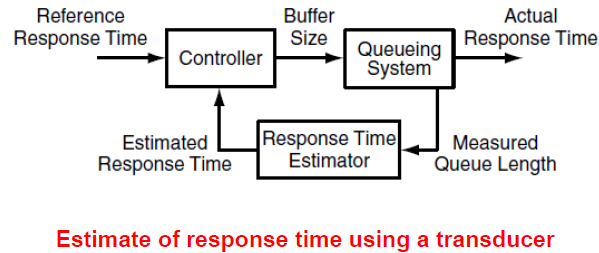

* Dynamic Power 动态功率估计，On The Evaluation of Energy and Power

  * C 负载电容，V 电源电压，a 活动因子 (0-1之间的分数)，f 工作频率
  * 公式：`P = a * CV^2 * Af`
  * 频率通常与电压成线性关系，即:f = kV，因此,结合𝑉2𝑓部分，**voltage对dynamic power有一个立方的影响**
  
* Server Speed and Server Power

  * frequency 和 voltage 也是线性的关系
  * CPU power - frequency关系是立方的 (这是一个推理关系)
  * server speed 通常取决于 server frequency (这个大概也是个理论关系)
  * **实验结果表明，power - speed 关系几乎是线性的 (这是个实际测量结果)**
    * 由于电压/频率水平有限
    * 不适用于服务器中的许多组件

  ​	

* Computer Power 计算机功率估计

  * Pdyn 动态功率，Pidle 空闲功率/静态功率，U 系统利用率，系统活动的指标
  * 公式：`Ptotal = Pdyn * U + Pidle`
  * Example：Assume the average CPU utilization is 30%, the nameplate power (maximum power demand) is 180W and the idle power is 100W. This means the average power is P = 100+ (180-100)×0.3 = 124W
    * **the idle power 空转功率**
    * **the nameplate power 铭牌功率/额定功率**
  * 这种估算方式的优点：
    *  给出了整个系统平均功率的估算
    * 使用server/CPU utilization来作为机器级的活动
    * 当服务器数量较大时，这种估算方法很棒
  * 这种估算方式的不足：没办法预测峰值power

##### Architecture Simulation

* Computer Architect's Toolbox 做架构的时候会考虑的问题

  * 仿真模型有多精确
  * 运行仿真需要多长时间
  * 开发仿真模拟器虚拟多长时间
  * 可以探索设计空间的那一部分：accuracy, evaluation time, development time, coverage

* Functional Simulation 功能仿真

  * 功能仿真是只考虑对ISA的功能特性建模：不考虑时间问题，基本上是一个指令集模拟器
  * 一个重要的应用是对设计的验证，而不是评估系统的性能指标
  * 功能仿真还可以生成指令和地址跟踪，可作为其他仿真工具的输入
  * 大概就是最后仿真结果对了就行了

* Trace-Driven Simulation 记录驱动的仿真 / timing simulation

  * 将程序指令和地址跟踪 记录到详细的为体系结构计时模拟器中 (micro architecture timing simulator) - 可以从某个特定status开始运行
  * 将功能模拟和时间模拟分离
  * 不仅仿真结果要对，整个过程都要记录下来
  * 缺点：
    * 需要存储跟踪文件 (容量有点大)
    * 无法精准的模拟沿错误预测路径的影响 (错误预测的指令无效——它们不会出现在通过函数模拟生成的跟踪文件中，尽管它们可能影响缓存和/或预测器内容)

* Execution-Driven Simulation 执行驱动的仿真

  * 目前采用的实际模拟方法

  * 功能模拟与记录模拟想结合，以增加开发/评估时间为代价，实现比trace-driven更高的精度

  * Full system simulation：Trace-driven simulation and execution-driven simulation

    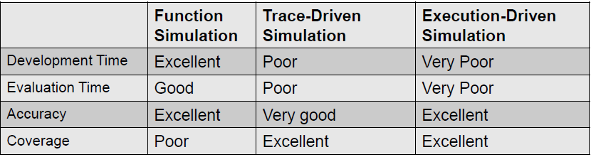

* **Simulation Acceleration**
  
  * 循环精确模拟 (Cycle-accurate simulation) 是很慢的：在cycle-by-cycle的基础上模拟一个微架构；这个是最基本情况
  
  * 采样模拟 (Sampled Simulation)：只有一小部分指令采取很慢的循环精确模拟；要求提供采样裁员的架构启动映像，即寄存器和内存状态；就是只有一小部分采个样
    
    * 架构启动映像 architecture starting image (ASI)
    
  * 快速转发 (Fast-Forwarding)：通过功能仿真构建体系结构状态；功能模拟和执行驱动模拟之间的切换
  
    * 感觉是基于采样模拟的再优化，采样之间用功能模拟快速过掉
  
  * 检查点 (checkpoint)：在采样单元之前存储寄存器/内存状态；只需要加载运行期间的数据和模拟器状态；过一段时间做一个总结
  
    * 感觉也是采样模拟的优化，采样后就checkpoint一下
    
    

##### Workload Design

* Workload 负载
  
  * 定义：用户在机器上运行的程序和操作系统命令的总称
    * 最好是Real Applications 或者 Modified Applications
  * 在特定情况下负载也可以使用稍微简单一点的，比如kernel、toy benchmark、synthetic benchmarks
  
* Benchmark Suite 基准组件

  * 将benchmark集合放在一起，来定量度量具有各种application的系统的性能

* Example：CloudSuite
  
  * 数据分析，数据缓存，数据服务，图分析，内存分析，流媒体，网络搜索，Web服务
  
* Workload Design 需要考虑的地方

  * Workload Characterization 负载特性：
    * 了解各种benchmarks的行为
    * 使用各种硬件监视器和模拟器
  * 主成分分析 Principal Component Analysis (PCA)：
    * 依赖成熟的统计数据分析技术，把一些可能相关的变量转换成少量不相关的主成分 **possibly correlated variables -> uncorrelated principal component**
    * 通过正交变换将一组可能存在相关性的变量转换为一组线性不相关的变量，转换后的这组变量叫主成分
  * 聚类分析 Cluster analysis
  * **确定一个reduced (较少)但有代表性的workload**
    * 这个是workload设计的核心

* PCA，Principle Component Analysis，主成分分析的主要应用

  * 主成分分析的作用：降低所研究的数据空间的维数；多维数据的图形标识；构造回归模型；筛选回归变量
  * Workload Analysis
    * 可视化workload space，分析benchmark之间存在差异的原因
  * Workload Reduction：建立以小组有代表性的基准测试 benchmark

* Multi-Program Benchmark

  * Single-Program Benchmark 
    * 比较简单，benchmark 就是一个程序加上一个特定的输入
  * Multi-Program Benchmark 
    * 比较复杂，每个程序都可能有不同的runtime，不同的互动interaction取决于他们如何互相匹配 (align with)
  * Multi-Program Benchmark
    * 多程序基准测试的问题：负载不平衡，资源竞争 (program alignment matter)
  * Example：<B, T, F, S0>
    * B 是一组single benchmark；T 是benchmark的终止条件；F 函数，可以决定和哪个B运行在一个特定的core；S F的初始状态

* 性能测试的综合指标

  * SPEC Ratio：为了简化测试结果，SPEC决定使用单一的数字来归纳所有12种整数基准程序。具体方法是将被测计算机的执行时间标准化，即将被测计算机的执行时间除一个参考处理器的执行时间，结果称为SPEC ratio。SPEC ratio值越大，表示性能越快（因为SPEC ratio是执行时间的倒数）；SPEC是个比例，而不是绝对执行时间

  * 几何平均值：连乘积开项数次方根

  * 算术平均值：就是普通的平均值

  * 调和平均值：又称倒数平均数，是总体各统计变量倒数的算术平均数的倒数

    

* Example: System Throughput

  * Normalized Turnaround Time (NTT)，是个比例，T(mutli program) / T(single program)
  * Average Normalized Turnaround Time (ANTT)，算术平均
  * IPC Throughput，算术平均

* Experimental Lifecycle 实验生命周期
  * Vague idea 模糊的概念 => “groping around” experiences 摸索的经历 => Initial observations 初步观察
  * Hypothesis 假设 => Model 建模 => Experiment 实验 => Data, analysis, interpretation 数据分析解释 (循环)
  * Results & final Presentation 结果陈述

##### Summary

* Amdahl’s Law
* Calculating CPI （公式）
* Analyzing memory access time （公式）
* Little’s Law
* Estimating server power
* Trace-/Execution- driven simulation
* Simulation acceleration
  * sample simulation, fast-forwarding, checkpointing 
* Concepts of workload characterization （如何设计一个好的workload）
  * 确定一个reduced (较少)但有代表性的workload
* Multi-programmed workload
*  

------

#### 第八讲 多处理器和线程级并行

* speedup 和 scaleup
  * speedup：如果资源变成n倍，对于同一个task，处理速度可以快n倍
  * scaleup：如果资源变成n倍，就可以处理n倍规模的task

* Flynn 对并行架构的分类

  * SISD，Single Instruction Single Data 单指令流单数据流
  * SIMD，Single Instruction Multiple Data 单指令流多数据流
    * 对不相交的数据集应用相同的指令流；vector supercomputer
  * MISD，Multiple Instruction Single Data 多指令流单数据流
    * 目前还没有商用
  * MIMD，Multiple Instruction Multiple Data 多指令流多数据流
    * 每个节点在自己的数据集上执行自己的数据流
    * 通用的多处理器选择的体系结构

* **The Increased Importance of Multiprocessing** 
* 再继续做ILP (指令级并行) 可能是低效率的，特别是针对服务器级别的应用程序
  * 云处理计算，Cloud-oriented processing，海量数据和互联网请求
  * scale up差不多到头了，提高桌面级的性能已经不那么重要了
  * 多处理器研发有更好的投资回报，因为做得好就只是复制就可以了，不用独特的设计
  
* 不同的并行化层级

  * Thread-Level Parallelism 线程级并行
    * 多处理器是由多个chip组成的，每个chip上多个core
  * Data-Level Parallelism 数据级并行
    * many-core accelerator 多核加速器，通过互联网络
  * Request-Level Parallelism 请求级并行
    * 多计算机系统，即一组服务器；数据中心和仓储式计算机

##### Multiprocessor Architecture

* 多处理器中的内存架构

  * Shared Cache；Bus-based Shared Memory；Dance-hall；Distributed Memory

    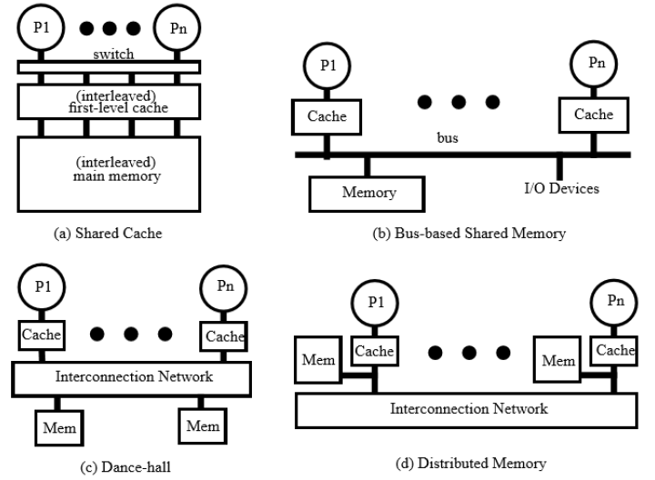

* multiprocessor的两种分类：根据内存的组织形式分类

  * Centralized Shared-Memory，UMA架构
    * 多个处理器共享相同的物理内存，上述的a/b类型
    * 通常被称为 **SMPs (symmetric multiprocessors**，对称多处理器)，处理器对任何内存位置都具有相同的访问时间 (因为共享地址空间)
  * Distributed Shared-Memory (DSM)，NUMA架构
    * 物理上内存被处理器分离开，上述的c/d类型
    * 两个主要的优势：内存带宽是scalable的，只要继续加就可以；本地访问的延迟很低
    * 主要的缺点：通信比较复杂，node到node之间的延迟比较高
  * 共享内存意味着地址空间也是共享的，SMP和DSM都是

* 两种不同MIMD系统的比较，多处理器和多机(集群)

  * **Multiprocessors，SMP和DSM**
    * 紧密耦合的体系结构
    * 处理器通过总线或者互联网络链接
    * 由许多处理器组成，2个以上，多的几十个
    * 同一个共享地址空间
    * 通过load/store，隐式通信数据
    * 线程级并行
  * **Multicomputers, Clusters，WSCs**
    * 松散耦合的体系结构
    * 通过局域网连接的PC
    * 由许多结点组成 node
    * 有多个私有地址空间
    * 在处理器之间 显示传递信息
    * 请求级并行

##### Cache Coherence Problem

* 共享内存系统希望做到的事情
  * 通过并行性来提高性能
  * more important，使用多个进程的并行程序在不同物理处理器上运行的结果 和 在相同物理处理器上运行时的结果应该 没什么不同
  
* Cache Coherence的问题
  * 主要原因：私有数据和共享数据同时存在
  * 私有数据在本地，只供一个处理器使用，共享数据在全局，由多个处理器同时使用
  * 共享数据有多个copy副本，分布在不同的缓存中，并由不同的处理器操作
  * 当不同的CPU看到相同内存位置的不同值的时候，就会出现cache  coherence的问题
  * cache coherence的问题在 write-back 系统和 write-through 系统中都是存在的

* 单处理器中的一致性问题 (Uniprocessors)
  * 即使是单处理器都可能出现问题
  * Device可以通过DMA直接读取内存，而最新的数据可能还在write-back cache中，没有被flush到内存中去
  * **Memory 要做到读取内存地址X，应该返回任何处理器在地址X处写入的最新的值**
    
    * 但最新这个概念也很难定义，如果两个cpu同时写呢？如果时间很接近呢？
    
    
  
* Cache Coherency 的精确定义
  * **定义1：program order**，单处理器的 “read after write”，如果之前写了新值n，之后的读就要读到这个新值
  * **定义2：write propagation**，处理器A的写操作 **eventually** 会被处理器B看到
    * 这两个条件还不够充分，如果有两个处理器同时写操作，不同处理器可能会看到不同的值
  * **定义3：write serialization**，其他处理器read的顺序和真实的write顺序应该是一致的
  
* Cache Coherency 的正式定义
  
  * 一个coherent的共享内存系统应该是：读取内存地址X应该返回任何处理器在地址X处写入的最后一个值
    
  * 对于每个位置，都可以构造一个在此位置的、所有操作的串行顺序，该顺序与执行的结果一致，并且 ( hypothetical serial order )
    * 任何特定处理器发出的内存操作都按照上述处理器发出的顺序执行
    * 每个读操作返回的值是最后一次按串行顺序写入该位置的值
  * 就像一个没有cache的共享内存系统，会强制保证顺序
  
* Coherence 和 Consistency 的区别
  * Coherence 一致性，强调读出值的异同
    * 定义读取可以返回哪些值，查看相同的内存位置
  
  * Consistency 一贯性，强调读的时间概念，有一个顺序的概念
    * 定义读操作何时返回写值，包括到其他位置的操作
  

##### Snooping Protocol 

* Enforcing Coherence

  * 实现一致性的关键是跟踪数据块的任何共享状态
  * **Snooping Protocol**
    * 监视interconnect上的所有事务
    * 每个缓存都有一个共享状态的副本
    * 通常会更快，如果有足够的带宽
  * **Directory-based Protocol**
    * 不在interconnect上广播
    * 共享状态保存在一个single的目录中
    * 更容易支持大量处理器

* Cache Coherence Through Bus Snooping

  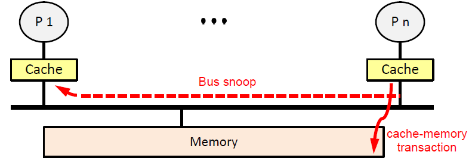

  * 具有本地缓存的多个处理器被放置在共享总线上
  * 所有写操作都将在总线上以事务的形式显示到内存中
  * 所有事务都以相同的顺序对所有处理器可见
  * 每个处理器不断地“窥探”总线 (snoops)

* Snooping Protocol

  * 协议是一种分布式算法
  * 维护缓存一致性的两种方法
    * update-based：写时更新其他缓存副本
    
    * invalidation-based：写操作时是其他缓存副本失效
    
      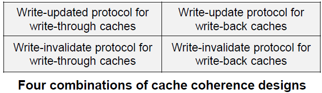

* A simple Example: Write-through Invalidation

  * interconnect互联和内存事务是原子性的：一次只处理一个总线事务

  * 对一个位置的所有写操作都按照它们出现在share bus上的顺序序列化(bus order)

  * 处理器写入后，广播invalidation；下一次读取其他处理器将触发缓存未命中
  
    
  
* Problem with write-through cache

  * 所有写操作都进入share bus和内存，write-through对带宽有很高的要求
  * write-back cache为SMPs节省了带宽，但需要更复杂的一致性协议

* **A 3-state (MSI) Write-Back Invalidation Protocol**

  

  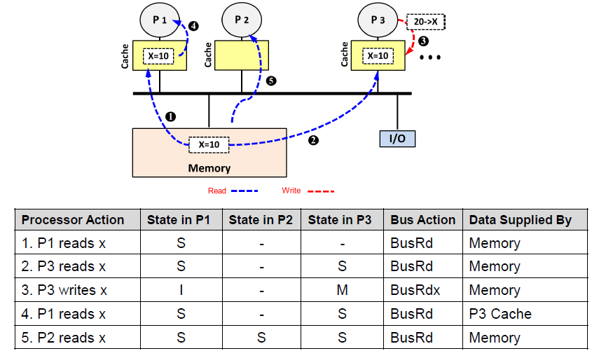

  * Features 3 states: modified (M), Shared (S), Invalid (I)
  * 2 possible processor requests: PrRd and PrWr
  * 3 possible bus-side requests:
    * Bus Read (BusRd)
    * Bus Read Exclusive (BusRdX): ensures write propagation
    * Bus Write Back (BusWB)

##### Summary

* SIMD, MIMD, TLP
  * Single Instruction Multiple Data, Multiple Instruction Multiple Data
* Multiprocessors, UMA and NUMA
* Definition of cache coherency
  * program order, write propagation, write serialization
* Cache coherency and memory consistency
* Basic facts of the snooping protocol
* A simple write-through invalidation protocol
* 3-state MSI protocol
*  

------

#### 第九讲 片上多处理器与多核系统

##### Thread-Level Parallelism

* Thread：处理器执行程序的最小单元

  * 具有执行所必须的所有状态；同一个进程中的线程是共享代码和数据的
  * 线程的用法比较casual，可以指并行程序中的真实的thread，也可以只是一段独立的程序

* Thread-Level Parallelism

  * 使用本质上并行的多线程执行
  * **粒度是指线程的计算量大小** 
    * the amount of computation within each thread 

* multithreading 的必要性

  * 指令级并行无法掩盖长时间的memory stall，比如load/store，FU的利用率比较低
  * 现代处理器大部分是用 hardware multi threading 来提高资源利用率的
  * multithreading processor可以在不同的线程并行执行不同的指令流
    * 多分processor resource，比如register和PC
    * 往pipeline中添加了 thread swtich的逻辑
  
    ​	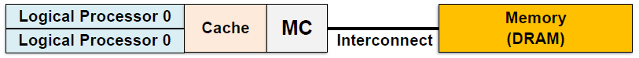

* multithreading 的类型

  * Fine-grained (interleaved) multithreading 细粒度
    * 线程切换的间隔是clock cycle
    * 降低了单个线程的执行速度
    
  * Coarse-grained multithreading 粗粒度
    * 当有长延迟的stall时，触发线程切换
    * short-latency的时间无法被隐藏 
    
  * **Simultaneous multithreading (SMT 同步多线程)**
    
    * multithreading processor在提高了硬件的利用率
    
    * 指令会被多线程同时执行，在同一个clock cycle
    
    * 较大地提升了资源的利用率
    
      

  * SMT在利用率上的影响
    * SMT 可以利用程序的独立性来实现并行性，也可以在单个程序中利用并行性
    * 调度、指令的mix 都是由硬件来完成的，没有compiler的事
    * 需要从多个program counter中获取数据并访问多个复杂的register set

* **Chip Multi-Processor (CMP) 片上多处理器**

  * multiprocessor 其实流行过一段时间
  * CMP是multiprocessor的一种特殊类型，多核聚集在单个processor socket上
    * 一个processor socket就是一个chip
  * CMP 和 multicore processor 似乎是两回事
    * multicore processor主要有前面讲过的shared-memory multiprocessor，MIMD
  
* **CMP 和 SMT的比较**
  
  * CMP中，Chip Multi-Processor，多processor，多个物理核是有各自独立的资源的，比如 L1 cache, TLB, PC, GPR是独立的，L2 cache 可能是共享的
  * SMT中，Simultaneous multithreading，多thread，多线程是共享处理器资源的，PC，GPR是独立的，cache 和 TLB 是共享的 (可能这里还是个单process)
  * HT，hyper threading，超线程技术，Intel 的SMT技术实现
  
* Parallelism comparison 并行化程度比较

  *  **SMPs (symmetric multiprocessors**，对称多处理器

  * 纵坐标granularity是粒度
  
    

##### Introduction to Multicore

* Multicore 出现的理由：单个superscalar处理器无法充分利用线程级并行，而multi core可以

  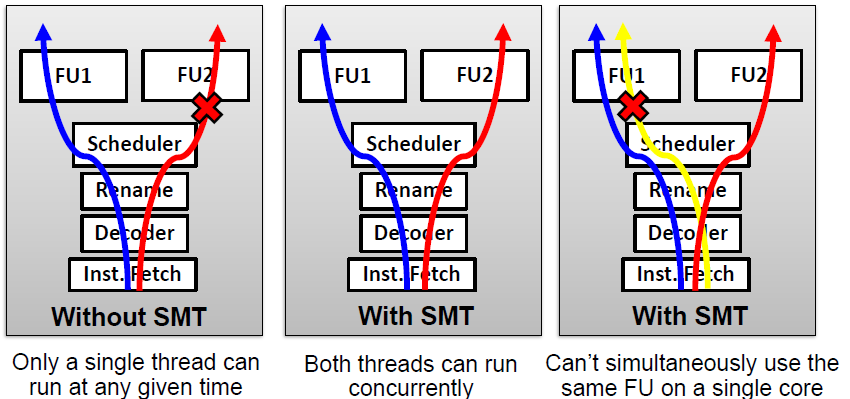

  

* 回顾，指令级并行，superscalar

  

* **Single core SMT 和 Multicore solution 对比**

  * Single core SMT：大多数情况只能充分利用指令级并行；要运行的更快只能提高时钟频率；会大幅增加功耗和散热；设计越来越趋向耗时，难以验证有效性，因为是在scale up
  * Multicore (multicore的优点)：很适应线程级并行；在同一块chip上集成了两个或更多的核；充分利用核的性能，选用一个比较高效的主频；采用经过验证的/成熟的处理器设计，制造成本更低

* **Large Superscalar 和 CMP 对比**

  * Large Superscalar：就是单线程做ILP，需要一点程序员的工作
  * CMP：一些ILP和一些细粒度的TLP，需要比较多的程序员工作，倾向于大量的并行

* Typical Multicore Cache Organization

  * Private L1 +  Shared L2，例子：Dual-core Xeon Processors

  * Private L1 and L2，例子：AMD Athlon，Intel Pentium D

    

* 一些多核设计的案例

  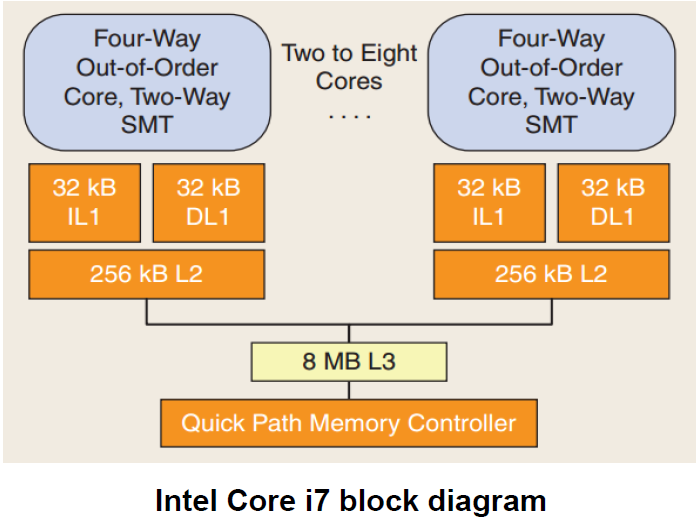

  

  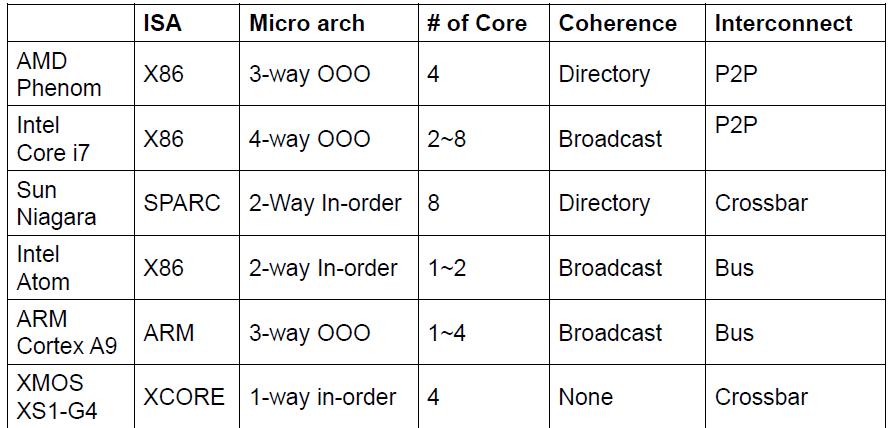

  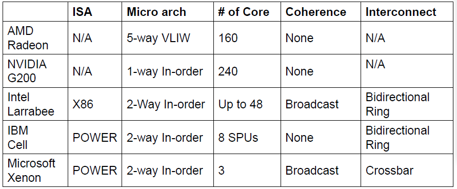

* **多核 Multicore 架构设计的挑战**
  
  * Shared resource management，共享资源管理
  * ILP and TLP tradeoffs balance，指令级并行和线程级并行的平行
  * Grain size vs. number of cores，粒度和核数
  * On -/Off -chip bandwidth requirements，片上/外带宽要求
  * Latencies (execution, cache, memory) reduction，减少延迟 (执行、缓存、访存)
  * Multiple domains in terms of power management，电源管理的多个领域
  * Partitioning resources between threads/cores，在线程/内核之间对资源进行分区
  * On-die interconnect，on-die 互联
  
* Core 的概念：core不是独立的processor，而是与其他core共享资源的更大的片上系统的一部分

##### Design Space Exploration

* 如何混合不同的核，两种方案

  * 少量，复杂，重量级的核，更强调低线程延迟
  * 大量，简单，轻量级的核，更强调核心区域 (core area)
  * general processor core 普通的核
    * small，power-efficient
    * large，high-performance
  * specialized core 专门定制的核
    
    * 特定任务中使用的加速器
  *  EV4 - EV8，规模从小到大，Alpha processor core用EV数值来衡量core的规模
    * EV4：每个CMOS管的微内核
    * EV5：chip上有二级缓存
    * EV6：支持乱序执行 OoO
    * EV8：包含 SMT 同步多线程
    
    

* Heterogeneous chip multiprocessors 异构多处理器芯片

  * 也被叫做 asymmetric chip multiprocessors，非对称多处理器芯片
    * 将每个应用程序都匹配到最合适其性能需求的核心
    * 为所有工作负载需求提供更有效的区域覆盖
  * Single ISA Heterogeneous CMP：CMP由一组异构的处理器核心组成，所有这些核心都可以执行相同的ISA
  * 异构是体现在不同的 execution bandwidth，cache size，in-order / out-of-order

* Heterogeneous-ISA chip multiprocessors 异构指令集架构多处理器芯片

  * 可以在选择ISA这一点上做的多样化一点
  
  * 应用程序应该能在核心之间自由迁移
  
* challenge：运行时状态是和ISA相关的，迁移的开销会比较大
  
  * 常见的迁移过程包括：process scheduling，page table manipulation，binary translation，state transformation 进程调度,页表操作,二进制翻译,状态转换
  
    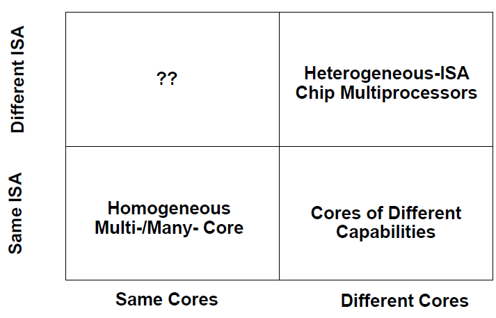
  

##### From Multicore to Manycore

* Manycore 和 Multicore 对比
  * Manycore：核的数量很多，在往更高的并行度优化，有更好的整体吞吐量性能，但单个线程的性能一般般
  * Multicore：核的数量不多，在并行化和串行代码都会做优化，乱序执行，深度流水线，更强调单个线程的性能
* Intel Many Integrated Core (MIC) 架构
  * 一个manycore的处理器 + 61 个single的 in-order core
  * 每个core都支持 4个 hyper thread
  * L2 cache是完全一致的
  * 在内部运行一个OS，会占用一个core
* Intel Single-Chip Cloud Computer (SCC)
  * 总的来说还是一个manycore架构；但更重要的是这个云数据中心的一个浓缩
  * 并没有在硬件层面上做cache coherence，交给软件去做了
  * 使用message passing当做主要的通信方式

##### Parallelism Classify

* Parallel level：ILP(Instruction-level Parallelism)，TLP(Thread-level Parallelism)，DLP(Data-level Parallelism)，RLP(Request-level Parallelism)
* ILP：pipeline，superscalar pipeline，superpipelined，VLIW(Very Long Instruction Word)，EPIC(Explicitly Parallel Instruction Computing)
* Parallel Architectures：SISD, SIMD, MISD, MIMD

* Multiprocessor
  * UMA架构，SMPs(symmetric multiprocessors)，对称多处理器
  * NUMA架构，DSM(Distributed Shared-Memory)
* Multicomputers
  * Clusters, WSCs(warehouse-scale computer)
* Multithreading processor
  * Fine-grained multithreading
  * Coarse-grained multithreading
  * SMT(Simultaneous multithreading)，同步多线程
    * HT(hyper threading)，超线程技术
* CMP(Chip Multiprocessor)
* Multicore processor
  * Homogeneous，same core，same ISA (Multicore, Manycore)
  * Heterogeneous chip multiprocessors，different core，same ISA
  * Heterogeneous-ISA chip multiprocessors，different core，different ISA
* Manycore
  * MIC(Intel Many Integrated Core)
  * SCC(Intel Single-Chip Cloud Computer)
* Vector processor
* SIMT

##### Summary

* Thread, Multithreading, SMT
* CMP and multicore
* Benefits of multicore 
* Multicore system architecture
* Heterogeneous multicore system
* Heterogeneous-ISA CMP
* Multicore and manycore
* Design challenge
*  

------

#### 第十讲 数据级并行化与GPGPU

##### DLP Overview

* 数据级并行 DLP：并行性来自跨大数据集的同步操作，而不是来自多个线程

  * 比较适用于大型的科学研究/工程项目
  
  * SISD，Single Instruction Single Data 单指令流单数据流

  * SIMD，Single Instruction Multiple Data 单指令流多数据流
  
    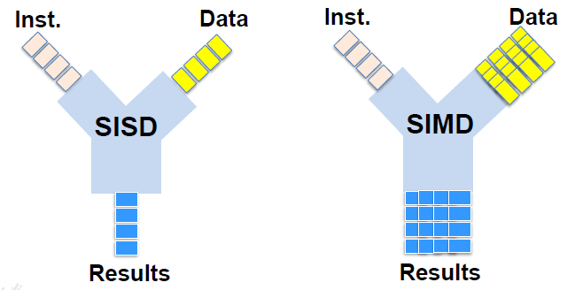
  

##### Vector Processor

* Vector Operation，向量操作
  * 向量操作通常包括：读取一组数据元素，在element array上操作
  * 我可以理解成向量指令是把若干条数据操作一起做吗
* Vector Instruction，向量指令
  * 定义：向量指令对一系列数据项进行操作
  * 向量指令的一系列优势
    * 减少获取指令需要的带宽，单个vector指令指定了大量的工作
    * 在检查硬件的时候data hazard会比较少，同一个vector中的独立运算
    * 内存访问的延迟会均摊，vector指令有自己的内存访问模式

* Vector Architecture，向量架构

  * 两种主要的向量架构
    * memory-memory vector processors：所有vector操作都是内存对内存的
    * vector-register processors：vector操作等价于load/store操作

* key components of Vector Process，向量处理器

  * vector processor通常是由vector units 和 ordinary pipelined scalar units组成的

  * Vector Register，内存中固定大小的bank来装一个vector，通常包含64-128个 FP/浮点元素，需要确定最大向量长度 (MVL) 

  * Vector Register file，是指8-32 个vector register

    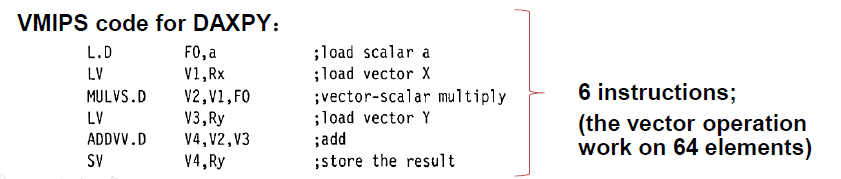

* VMIPS的参数：

  * Vector registers：64-element register，16个读端口，8个写端口
  * Vector functional units：5个完全流水线化的FU，hazard检测
  * Vector load/store unit：load/store一个vector，每个clock cycle 一个word

* Multiple Lanes 

  * 使用multiple parallel pipeline，或者说叫lanes，可以实现在一个cycle这个产生多个结果

  * 比如`ADDV C,A,B`，vector register A的元素和vector register B的元素是 硬连接的，hardwired

    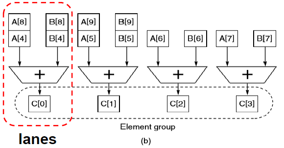

* Vector Instruction Execution

  * Vector 操作的执行时间主要取决于：vector操作的长度，结构冒险，vector操作中的数据依赖

  * Start-up time 的定义：pipeline latency，FU pipeline的深度

  * VMIPS，基于vector register的体系架构

  * VMIPS的FU，consume one element per cycle，执行时间大概和vector length差不多

  * Pipelined multi-lane vector execution：

    `T vector = T scalar + (vector length/lane number) - 1`

* Vector Chaining
  * Chaining 就是vector版本的register bypassing
  * Convoy  就是指可以一起执行的vector 指令，整个convoy中没有结构冒险，没有数据冒险
* Vector Length Register (VLR)
  * vector的长度不一定就恰好的是64怎么办呢
  * 控制任何向量运算的长度，不能大于最大值 maximum vector length (MVL)
  * 对长度超过MVL的可以使用 strip mining操作，第一个循环做短段 (n mod MVL)，后面的都做成 VL = MVL 
* Vector Mask Register
  * 如果有if操作怎么办
  * 提供每个元素的条件执行操作，基于一个boolean vector，也就是vector mask register (矢量掩码寄存器)
  * 指令仅仅对掩码寄存器中对应项为 1 的向量元素执行操作

##### GPGPU

* GPU 概述
  * GPU是指图像处理单元，graphics processing unit，基本上是一个大规模的并行架构
  * GPGPU，general-purpose computation on GPU，GPU上的通用计算
    * 利用可用的GPU执行单元加速
    * cpu代码运行在host上，GPU代码运行在device上
  * GPGPU通过高级编程接口把大规模多线程硬件暴露出来了

* Graphics Pipeline 

  * 现代GPU把图形计算组织在graphics pipeline 中

  * 名词解释：vertices 顶点，primitives (triangle，points，lines) 原始结构，fragments 碎片，pixels 像素

    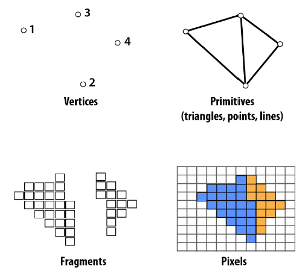

* Graphics Workload，通常是一些 相同的，独立的，基于像素流的计算

  * Identical, independent computation on multiple data inputs

* Processing Data Parallel Workloads

  * MIMD, Multiprocessor Approach, 把独立的任务分配到多个CPU上

  * SPMD Approach, Single Program Multiple Data，把相同的、独立的任务分配到多个CPU上

  * SIMD / Vector Approach，消除冗余单元，把相同的、独立的任务分配到多个执行单元 (execution unit)，只有一个CPU

  * SIMD / Vector Approach，single PC，single register file，1 heavy thread + data parallel ops，把相同的、独立的任务分配到多个执行单元 (execution unit)，只有一个CPU

  * SIMT Approach，multiple threads + scalar ops (single PC, multiple register file)

    

    

    

* SIMT 和 SIMD 的区别

  * SIMT中文译为单指令多线程，英文全称为Single Instruction Multiple Threads
  * GPU中的SIMT体系结构相对于CPU的SIMD中的概念。为了有效地管理和执行多个单线程，多处理器采用了SIMT架构。此架构在第一个unified computing GPU中由NVIDIA公司生产的GPU引入。
  * 不同于CPU中通过SIMD（单指令多数据）来处理矢量数据；GPU则使用SIMT，SIMT的好处是无需开发者费力把数据凑成合适的矢量长度，并且SIMT允许每个线程有不同的分支。 纯粹使用SIMD不能并行的执行有条件跳转的函数，很显然条件跳转会根据输入数据不同在不同的线程中有不同表现，这个只有利用SIMT才能做到。
  * SIMT与SIMD本质相同：都是单指令多数据。
  * SIMT比SIMD更灵活，允许一条指令的多数据分开寻址；SIMD是必须连续在一起的片段
  * SIMT形式上是多线程，本质上还是一个线程，只不过数据可以零散的分散开。但是如果你真的将数据分散开的话，执行效率上又会大打折扣，因为不满足并行访问的要求。
  * 总之SIMT是SIMD的一种推广，更灵活而已。

* Execution Model

  * 可以用CUDA或者OpenCL 编写 GPGPUs

* CUDA Parallel Computing Model

  * **CUDA, Stands for Compute Unified Device Architecture**， CUDA™是一种由NVIDIA推出的通用并行计算架构，该架构使GPU能够解决复杂的计算问题。 它包含了CUDA指令集架构（ISA）以及GPU内部的并行计算引擎。 开发人员现在可以使用C语言来为CUDA架构编写程序
  * CUDA 是 HW/SW 架构，使 NVIDIA GPU能够执行 C，c++等编写的程序
  * GPU 实例化一个内核程序，由大量CUDA线程并行执行
  * Grid：一组执行相同内核的线程块

* Hardware Execution

  * GPU 硬件包含一组多线程SIMD处理器，执行一个线程块网格 grid of thread block
  * SIMD处理器必须有并行的功能单元：SIMD lane(每个SIMD的通道数随GPU而异)

  * 线程阻塞调度程序 Thread Block Scheduler
    * 将线程块分配给多线程SIMD处理器
  * SIMD线程调度程序 SIMD Thread Scheduler
    * 调度 SIMD指令的线程何时应该运行

* Example：Tesla GPU Architecture

  * Tesla的主要设计目标是在相同的统一处理器架构上执行 顶点和像素碎片 的着色器程序

  * **TPC，texture/processor cluster**

  * **SM，streaming multiprocessors**

  * **SP，steaming processor**

  * GPC，Graphics Processor Cluster

    

* Warps

  * GPU依赖于大量的硬件多线程来保持算术单元的占用
  * **Wrap是指32条相同类型的并行CUDA线程**
    * 都从同一个程序地址开始，所有wrap中的线程都使用一个common PC，wrap的调度单元在SM中

* Warp Scheduling

  * **线程调度发生在warp的粒度上** 
  * 调度程序从pool中选择要执行的warp：考虑指令类型和公平性等
  * 最好所有的SIMD lane都被占用，warp的所有32个线程都采用相同的执行路径
  * GPGPU的延时隐藏功能
    * 快速上下文切换，大量的warp，warp可能是out-of-order的
  * 可能引起warp execution delay的原因
    * Scheduling policies
    * Instruction/Data cache miss
    * Structural/Control/Data hazard
    * Synchronization primitives 同步原语

* Branch Divergence 分支分散

  * warp的所有线程通常都以相同的方式执行，但也可能因control flow而分叉
  * Warp divergence：分支指令可能会导致一些线程跳转，而另一些线程会在经线中掉落
  * 分叉的warp会有一些inactive thread lane，Diverging paths execute serially 发散路径串行执行

* Stack Based Re-Convergence 再汇合

  * Re-convergence stack 是用于合并回线程：保存Re-convergence PC，active mask，execution PC

* Dynamic Warp Formation

  * 通过组合PC值相同的线程，从准备好的线程池中形成新的warp

* Resource Limit

  * 在GPU中，最大的并行度常常受到register file capacity的限制
    * 具有高TLP的应用程序触发更多的active warp
  * register file是一个大型的SRAM结构
    * register file是处理器可用的最快内存块
    * 存储来自ALU等单元的中间结果
    * 非常需要power的结构

* GPU Register File：通常大于L2/L1，而且还在不断扩大

  

* Design Considerations

  * Large register file capacity 的优点
    * 可以容纳更多active thread
    * 以较低的开销启用频繁的上下文切换
    * 允许GPU充分利用其内存带宽
  * 缺点：功耗高，硅片面积大等。
  * 优化方法：缩小寄存器文件大小，或使用新的存储技术

##### Summay

* Throughput computing and data-level parallelism
* Vector processor and vector instruction
* VMIPS, vector registers, DAXPY, execution latency
* SIMD lanes, chaining, vector length register
* GPGPU, SIMT, CUDA programming model
* TPC, SM, SP, warp and warp scheduling
* Branch divergence
* GPU register file
*  

------

#### 第十一讲 片上互联网络简介

##### Introduction and Terminology 简介和术语

* A simple dedicated link network 简单的专用链接网络
  * 一个channel由transmitter，link，receiver组成
  * link，携带signal的一束电线
  * channel，host和switch之间的single link
  * buffer，传输时hold data
  * node，连接到router/switch的网络端结点
  * switch/router，连接一系列input channel和output channel，这个数值叫switch degree或者radix
  * route/path，一组channel和switch的序列，次数被称为hop count
  * message，network client收发的信息单元，可以被拆分成packet
  * network interface，组成和处理message
* network characters
  * topology，拓扑结构，physical interconnection structure
  * routing algorithm，路由算法
    * Determines which routes messages may flow through the network
    * 确定哪些路由消息可能流经网络
  * switching strategy，决定下一跳
    * Determines how the data in a message traverses its route 
    * 确定消息中的数据如何遍历其路由
  * flow control mechanism
    * Determines when the message, or portions of it, move along its route
    * 确定消息或消息的一部分何时沿着其路由移动，控制流量
* properties of network topology
  * **diameter，直径，任意两个节点间的最短路径的最大值**
  * routing distance，link数+hop数
  * average distance，平均路由距离
  * non-blocking，可以从任意的input到output
* direct network, indirect network 直连网络和间接网络
* packet format
  * 由 header，data payload，trailer组成(trailer checksum)
  * flow control unit，可以通过link传输的最小信息单元，被称为flit
  * header包括destination port，message id，sequence number，type等
* network switch
  * 实现了routing，arbitration仲裁(？)，和一些switching function
  * network switch包含的组件：input port，receiver，input buffer，cross bar，control routing/scheduling，output buffer，transmiter，output port
* switch strategy 
  * 例如，circuit switching，专用的通信通道，流通道
  * 例如，packet switching，把data划分成packet，在网络间传输和共享
  * circuit和packet的比较：circuit switching的带宽性能更好，但需要更长的setup时间
* performance evaluation，性能分析指标
  * link width - w
  * unit interval - i，单位时间
  * signaling rate - f = 1/i，信号传导率
  * channel bandwidth, b = w*f
  * total bandwidth of all channel
  * latency
    * sending overhead, receiving overhead
    
    * total routing time, arbitration time, switching time
    
    * total time of flight of the packet，包的飞行时间？
    
      

##### Interconnection Topologies 互联拓扑

* switch network topologies

  * 可以把switched network看做一张图，vertices和edge就是node/switch 和 link
  * 描述network graph的结构：
    * distributed switch，Direct network have a host node connected to each switch, 有个host连到所有交换机了
    * centralized switch，Indirect network have hosts connected only to certain switches ，host只连接到部分交换机
  * regular比irregular更广泛使用grid/tree之类的东西

* Bus 结构

  * 把所有input和output全连在同一个switch上

  * diameter = 1，degree = N

  * 没有容错性能，会单点故障

  * 因为发消息要独占bus，同时只能有一个事务，所以带宽不太好，O(1)

  * frequency受限于物理条件

    

* crossbar结构

  * 一种full-connected的网络结构，每个结点都和其他所有结点直连

  * diameter = 1

  * 带宽挺好的，O(N)；但开销很大，O(N2)

  * 如果结点数量不是很多，全连是挺好的选择；但随着结点数量增加，复杂度增加比较爆炸，如果合理采用多级连接multistage interconnection可以有效降低复杂度

    

* linear arrays and rings

  * 线性结构或者成环，适用于单向link

  * diameter = N-1，平均距离是2/3 N，bisection width = 1（array）

  * diameter = N-1，平均距离是1/2 N，bisection width = 1（ring）

    

* multidimensional topology，2D mesh

  * 高维度的array，2D的话结点就像网格一样连接起来，两个node之间可能存在不同的routing

  * 结点之间的latency是non-uniform的（不均匀的），开销是O(n)

    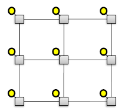

  * 高维度的ring，更短的latency，更高的cost

    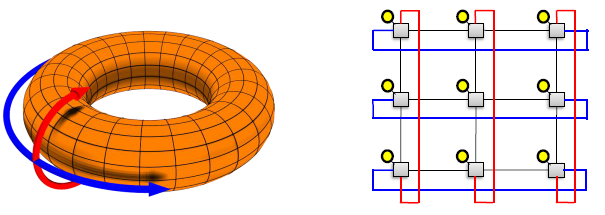

* Tree结构

  * tree的特点是平面，层次的拓扑结构

  * 是间接网络的实现方式，host都作为leaf结点

  * routing距离按照log增长

    

* Multistage interconnection network，层级网络

  * 间接连接，有多层的switch

  * mega 网络，log(N)个层级，N/2个switching unit

    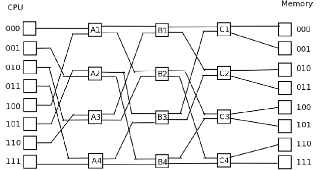

* Butterfly Topology

  * butterfly 也是log级的network，可以看做是有多个root结点的tree结构
  * d-dimensional indirect butterfly的特性
    
    * 连接 N=2的d次方的node，d是switch的层级数
    
      

* hypercube 超立方体

  * 结点数也是 N=2的d次方，d是switch degree

  * 具有良好的 bisection bandwidth

    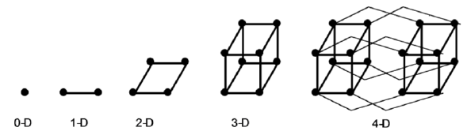

##### Summary

* basic concepts, link/channel/buffer
* switch degree, average distance
* non-blocking network, direct/indirect network
* network performance, latency estimation
* network switch and switch strategy
* bus and crossbar
* array ring mesh torus tree butterfly hypercube
*  

------

#### 第十二讲 数据中心即计算机

##### Data Center Infrastructure

* 云计算的三个A： AWS 亚马逊、AliCloud 阿里、Azure 微软

* data center 概述

  * data center的功能：
    * data processing/computation (request level parallelism)
    * data storage (large-scale，highly dependable)
    * data communication (high bisection bandwidth 对分带宽)
    * 用一截面将网络划分成对等的两半时(或者两个结点数目都相同的子网)时，穿过该截面的最大传输率；对分带宽越大，网络的通信能力越强。
  * data center的组成部分：ICT equipment，power system，cooling system，other support modules (lighting，security)
    * Information and Communication Technology，信息和通信技术

* layers in data center

  * 数据中心最基本的单位：1 U，4.445 cm
  * Layer in a WSC， WSC (Warehouse-Scale Machines)
    - server / node level
    - rack 机架/ cluster level
    - facility level / data center level

* data center operation efficiency，数据中心的效率计算

  * PUE： power usage effectiveness，PUT的值一般都会大于1

  * WUE： water usage effectiveness

  * CUE： carbon usage effectiveness

    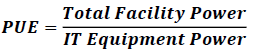

    

* data center tier standard，数据中心层级划分

  * 这个分级架构描述了从硬件获取数据并处理的可靠性

  * 分级架构有四级，第四级是最可靠的，国内大概都在第三级别左右

  * 指标有 availability，downtime per year，power backup等

    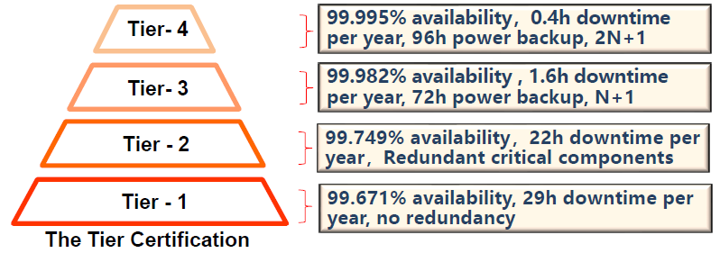

* datacenter infrastructure - power system

  * transformer，变压器；

  * Generator，发电机；

  * panel，面板

  * ATS, 自动转换开关电器，Automatic transfer switching equipment，mechanical switch，这是基于继电器的切换单元

  * STS, 静态转换开关，static transfer switching equipment，super fast，electronic switch，这是基于电子电路的切换单元，所以超快
    
    * ATS和STS的区别：速度不一样；容量差别，STS的容量会小很多，只能支撑一两个rack；STS可靠性更好，没有moving part
    
  * UPS, 不间断电源，Uninterruptible Power System ，可能会有两个UPS为了防止单点故障

  * PDU , 电源分配单元，Power Distribution Unit，可以降压，ATS过来的电压都比较高 (300+)，比如降到220或者48

  * PSU：power supply unit，电力供应单元

    

    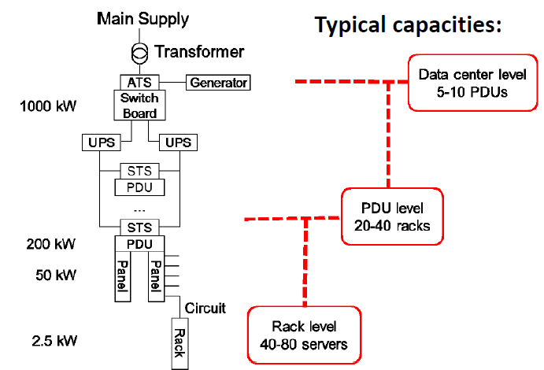

* datacenter infrastructure - cooling system

  * CRAC：computer room air conditioning 
  * COP指数，coefficient of performance，性能系数，热量与输出功之比
    - 通常来说在data center中是1.0-1.5，有的时候是0.5-1.0

* datacenter infrastructure - ICT system

  * rack 机架之间都是用 switch和cable连接的
    
    * switch的分类：top-of-rack TOR, end-of-row ROW
  * 水平网络拓扑：Entrance facility，MDA，HDA，EDA
    * MDA，main distribution area 主要分布区
    
  * HDA，horizontal distribution area 水平分布区
    
    * EDA，equipment distribution area 设备分布区
    
      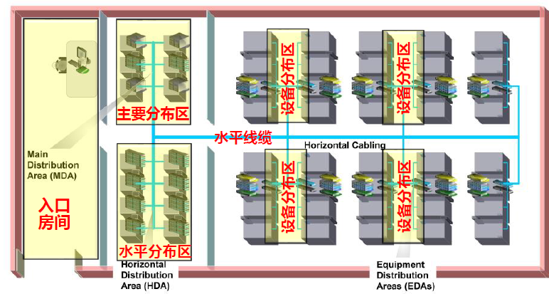
  

##### Key Design Consideration

* Design consideration of WSC
  * WSC (Warehouse-Scale Machines)
  * WSC的设计在许多方面都受到挑战，performance，energy efficiency，dependability/availability，networking
  * service-level agreement，SLA
    * 如何提供服务，要在服务的provider和user之间达成共识
  * service-level objectives
    * 衡量service的一个性能指标
* Discussion：the tail at scale，扩展的尽头
  * Zipf’s Law：语言学专家Zipf在研究英文单词出现的频率时,发现**如果把单词出现的频率按由大到小的顺序排列,则每个单词出现的频率与它的名次的常数次幂存在简单的反比关系**，这种分布就称为Zipf定律,它表明在英语单词中,只有极少数的词被经常使用,而绝大多数词很少被使用
  * 抑制延迟可变性的一个简单方法是向多个副本发出相同的请求，并使用最先响应的副本的结果

* Discussion：Utilization Matter
  * workload consolidation 工作负载整合可以提高利用率
    * 使用虚拟机技术，最小化online physical server
  * D2D，die to die；C2C，core to core

* Discussion：Power Provisioning Problem
  * nameplate power 铭牌功率
  * over-provisioning，超额供给，需要1000 W，提供2000 W；over-provisioning server，power不变，增加server的数量；over-provisioning power，所需功率不变，但提供高于需求的功率，优点在于，虽然成本高了，但可扩展性好，容灾备份也很好了
  * over-subscribing，超额认购，总server nameplate power大于data center power capacity
  * power shaving，移峰填谷
  * distributed battery and battery-based peak shaving 调峰技术
* Discussion：Cooling Approach
  * power system的冷空气是从顶部来的，FaceBook中是三个机架rack配一组Battery Cabinet
  * MDC，Module data center，制冷效率高，是一种portable(轻便的)的方法来部署data center capacity
  * 惠普，单列顶端制冷
  * Sun，双列柜间制冷
  * SGI，柜间循环制冷

##### Summary

* what is a data center
* major metrics of data center design
* data center infrastructure
  * power system
  * cooling system
  * ICT system
* the long tail concept
* data center capacity utilization
* types of power provisioning
* modular data center and cooling 

*  

------

#### 第十三讲 面向功效和节能的设计

##### Computer Power Management Basics

* power demand 和 overall performance 是一对tradeoff的关系

* ACPI，高级功率配置接口，advanced configuration and power interface

  - 这个接口在OS之下，driver之上

    

  - processor state记录了什么？处理器状态，记录了寄存器状态，又称为architecture state
  - processor state和power state是有区别的

* Global system states (G-states)

  * G-state在highlevel描述了platform的性能，数字越大是越节能的
  * g0：working，g1：sleeping，g2：soft off，g3：hard off (mechanical off，把电源拔了)

* Sleep states (S-states)

  * g0 对应 s0 正常运行，g1对应s1-s4，g2对应s5 停机
  * S1，processor clock is off；S2，processor is off
  * S3，suspend to RAM；S4，suspend to disk
    * S3的断电时间比S4/S5好一点
  * PLL (Phase Locked Loop)： 为锁相回路或锁相环，用来统一整合时钟信号，使高频器件正常工作，如内存的存取资料等
  * DRAM的功耗很大，因为有很多 动态刷新，refresh

* Processor Power State (C-states)

  * C0，normal operating state，正常运行状态
  * C1，clock gated
    - clock gating 和 power gating
  * C3，sleep状态，将系统执行中的一些关键数据都存储，其他的一些无用数据都存在了LLC
  * C6，架构状态都存进了SRAM，core voltage降到零
  * **S-state和C-state的区别：S强调服务器，C在英特尔处理器中描述，可能更加针对处理器**；ACPI中最关键定义的是C state

* Processor Performance State (P-states)

  * P state其实是对C0 normal operating state的展开，是最常见的
  * P0是对应最高性能， Pn的n可以很大(6-8)，Pn的frequency和voltage随着n变大是越来越小的，但对un-core的部分没有任何的影响 (为什么呢?)
    - un-core 是什么？传统芯片分为 on-chip 和 off-chip
      - 片上：processor，cache，MC
      - 片下：DRAM，memory
    - 还可以分为core和un-core，只有processor在core上，cache，MC，DRAM/memory 在uncore部分
  * 人眼的识别大概在100毫秒
  * 能源成比型计算机，这太难做到了

* thermal limitations

  - TDP thermal design power, 热设计功耗
  - 用于处理器热解决方案设计的最大持续功率

* 总结

  * G-states, S-states, C-states, P-states
  * G是比较highlevel的，0-3分别是working，sleeping，soft off，hard off
  * S存在BIOS中，由system配置，基本是把G的sleeping状态展开分析了
  * G和S共同定义了working platform state，基于这个C是定义来save power的
  * C0是normal operating state，P基本是C0的展开分析

##### Discussion and Case Studies

* MPP，maximal power point，提供最大电力的特殊工作点

  

* PTP，performance-time-product

  * 吞吐量×运行时/天=提交的指令总数
  * 需要有效的优化跟踪

* TPR，improve PTP using throughput-power ratio

  * 每瓦性能评估计算效率

* Per-core Load Adaptation Policy

  * 不断优化单个核心，直到达到其最高或最低V/F级别
  * 将额外的可再生能源以循环方式均匀地分配到所有核心
  * 根据吞吐量-功率比(TPR)指标选择内核

##### Summary

* G-States, S-States, C-States, P-States
* TDP, Turbo Boost
* Power management can be challenging
*  

------

#### 第十四讲 面向可靠性和可用性的设计

##### Reliability and Availability

- fault，error，failure

  - fault，故障
  - fault会导致error，但不一定会导致系统failure
  - transient fault 瞬态故障只发生一次，然后不会持久；由瞬态故障引起的误差称为软误差 soft error

- 可用性 availability 和 可靠性 reliability 的不同

  - 可用性指 在某个时间点 t 能不能正常工作，通常是9的个数

  - 可靠性指 连续正常运行的时间 t

  - 可用性好但可靠性差：坏的非常频繁但是修的时间非常短

    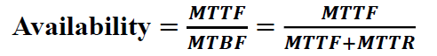

- Discussion：ACE and AVF

  - ACE：architecturally correct execution bit

    - 程序的正确性需要ACE位的正确性
    - un-ACE，不影响结果的bit位，对程序正确性不重要的位

  - AVF：architectural vulnerability factor，体系结构脆弱因子

    - 捕获结构中的fault将在程序输出中显示为error的概率
    
  - 硬件结构H在N个周期内包含B位的AVF可以表示为
    
      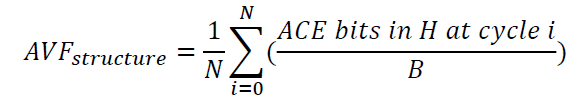
    

- Discussion：SMT for fault tolerance

  - symmetric multithread，对称多线程
  - 为应用程序想要运行的每个线程创建两个独立的线程
    - 执行相同的代码并接收相同的输入
    
    - 输出的差异表示故障
    
      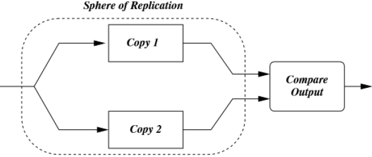

- Redundancy ：power delivery

  - 3-D architecture：Dual Power Delivery Path + Dual-Corded Servers
    - 双电源传输 + 双电缆服务器

- Redundancy ：power supply

  - Dual-corded（双电缆），每个服务器用两个PSU，高可用性，但是效率不是很高
    - power supply unit，电力供应单元
  - Single-corded（单电缆），采用单PSU，可以在dual-path环境中见到

- Redundancy ：cooling system

  - Dual Rotor Fan vs. Single Rotor Fan

- Redundancy ：network system

  - Fault-Tolerant Load Balancing

##### Summary

* Faults, error, and failure
* MTTF, MTBF, MTTR
* Availability, reliability
* ACE, AVF
* Redundancy