## 数字部件设计

------

### 第0讲 概述

* 单周期CPU

  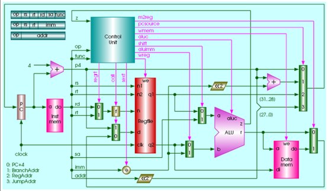

* 流水线CPU

  

------

### 第1讲 电路逻辑

* 运算器：能进行加减乘除等算术和逻辑运算的器件

* 图灵机：

  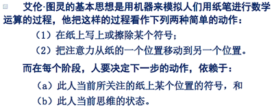

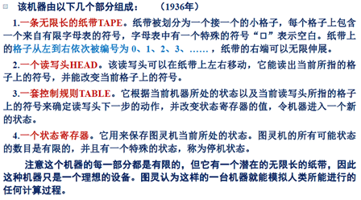

* 冯诺依曼结构（普林斯顿结构）：是一种将程序执行存储器和数据存储器合并在一起的电脑设计概念结构，描述了一种实际通用的图灵机计算装置。结构提出了将储存装置与中央处理器分开的概念，依该架构设计出的计算机又称存储程序计算机

  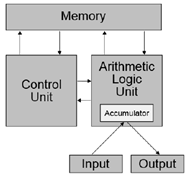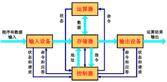

* 哈佛结构：将程序执行储存和数据储存分开的存储器结构。数据和指令的储存可以同时进行，可以使指令和数据有不同的数据宽度，程序需要由操作者加载，处理器无法自行初始化

  

* Machine Structure

  

* FPGA(Field Programmable Gate Array现场可编辑逻辑门阵列)

  * FPGA作为特殊应用集成电路领域中的一种半定制电路而出现

  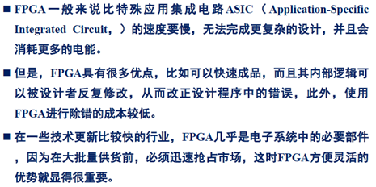

  * FPGA的基本逻辑单元：查找表LUT-look up table，触发器Flip-flop，多路器

  

* HDL(hardware description language硬件描述语言)

  * 定义：能够描述description硬件结构的一种语言，不是设计design

  * 硬件描述的目的：刻画表达出所设计的硬件逻

  

* Verilog

  

* 逻辑门

  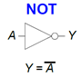

* 逻辑电平

  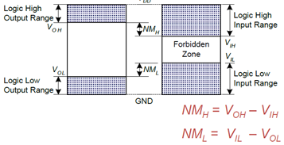

* **数字器件动态功率和静态功率**

  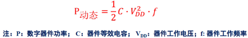

  

  

* MOS场效应管

  * nMOS: gate = 0, OFF; gate = 1, ON
  * pMOS: gate = 0, ON; gate = 1, OFF

  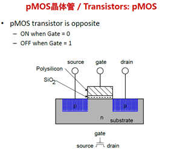

  

* **用场效应管构造逻辑门**

  * nMOS: gate = 0, OFF; gate = 1, ON

  * pMOS: gate = 0, ON; gate = 1, OFF

  

* 用场效应管构造传送门 transmission gates

  

* 用逻辑门构造多路选择器 multiplex

  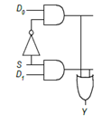 

* 用多路器实现查找表

  

* 译码器

  

* SR锁存器

  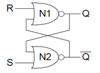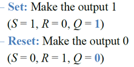

* D锁存器

  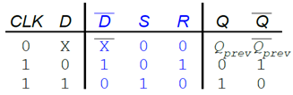

  

* **D触发器**

  

  

* **寄存器**：本质就是触发器

  

  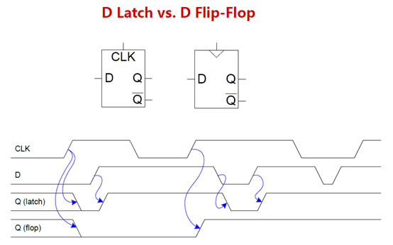

* 

------

### 第2讲 电路器件

* 电阻

  * 在高频应用和某些场合，电阻的寄生电容和寄生电感不容忽视
  * 电阻的种类和封装形式众多，还有功率、精度等表征参数

  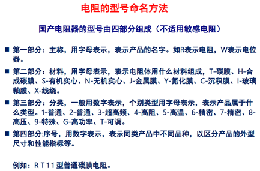

* 忆阻器

  * 忆阻器具有电阻的量纲，但他的阻值由流经他的电荷确定
  * 纳米忆阻器件的出现，有望实现非易失性随机存储器

* 电容

  * 定义式：C=Q/V

     

  

  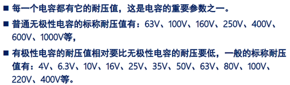

  *  超级电容的功率密度大（W/kg），但能量密度小（Wh/kg）

  

  * 电容的电压和能量计算

    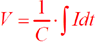

  * 低通滤波器以及容抗计算式：低通滤波器是容许低于截止频率的信号通过， 但高于截止频率的信号不能通过的电子滤波装置

    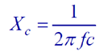

*  电感

  * 定义式 L = φ/i

    

  * 反电动势、能量

    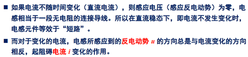

    

* 四种电路基本元件之间的关系

   

* 电容、电感的基本用途小结

  * 滤波（包括电容的去耦作用，电感的隔离作用）
  * 储能
  * 构成振荡器（包括谐振天线等）或者选频网络

* 二极管

  * P型半导体：空穴是多子，自由电子是少子

    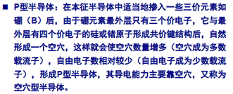

  * N型半导体：自由电子是多子，空穴是少子

    

  * PN结的原理

    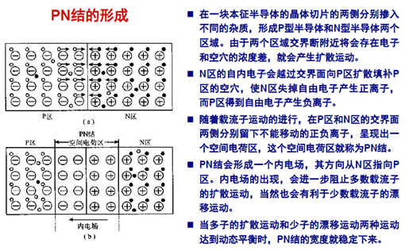

    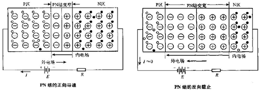

  * 晶体二极管

    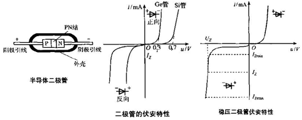

  * 常用二极管 

    

* 三极管

  * 三极管的工作原理：工艺上保证发射结的面积比集电结的面积小

    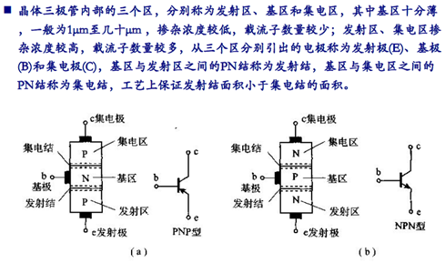

  * 晶体三极管的放大作用

    

    

  * 特性曲线

    

  * 3种放大电路：

    * 共射电路是放大电路中应用最广泛的三极管接法，信号由三极管基极和发射极输入，从集电极和发射极输出。因为发射极为共同接地端，故命名共射极放大电路。
    * 共集电极放大电路，输入信号是由三极管的基极与发射极两端输入的（在原图里看），再在交流通路里看，输出信号由三极管的发射极两端获得。因为对交流信号而言，（即交流通路里）集电极是共同端，所以称为共集电极放大电路

    

* MOS管

  * 原理

    

  * 图标

    

  * 特性曲线

    

  * 漏极电流Id的计算

    

  * 场效应管与三极管的对比

    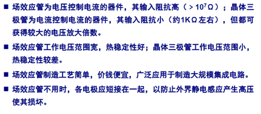

* 集成运算放大器

  * 定义

    

  * 运算放大器

    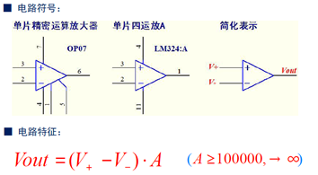

  * 跟随器，缓冲器

    

  * 反相放大器 

    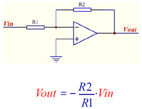

*  

------

### 第3/4/5讲 课本内容

* Art of managing complexity

  

* Binary Value (基带信号，波特率，调制)

* 组合逻辑和时序逻辑

  * 组合逻辑是memoryless的，输出由当前输入的值决定

  * 时序逻辑有memory，输出由当前和先前输入的值决定

   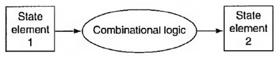 

* SOP form / POS form 与或式

* 卡诺图：由真值表向与或式转变的方法

  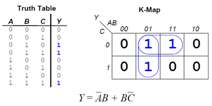 

*  

------

### 第6讲 单周期

*  

 

