#### 操作系统

------

#### 第一讲 Introduction & 8 Important Problems in Modern Operating Systems

* 操作系统是什么
  * 定义：操作系统是管理硬件资源、控制程序运行、改善人机界面和为应用软件提供支持的一种系统软件；**向上提供公共服务，向下管理各种资源**
    * OS对apps管理和隐藏资源，隐藏tedious/complex的底层细节，为apps提供执行环境
  * 广义定义：包括管理程序，操作系统，运行时环境

* 操作系统发展的两个观点
  * 硬件与应用蓬勃发展，在端和数据中心侧可能孕育新的操作系统
  * 传统操作系统如Linux进入架构稳定期，难以根本上适应新硬件与应用需求

* **8 Important Problems of OS**

  * **Scale Up；**
  * **Security & Trustworthy；**
  * **Energy Efficiency；**
  * **Mobility；**
  * **Write Correct (Parallel) Code；**
  * **Scale out；**
  * **Non-Volatile Storage；**
  * **Virtualization**

* Issue 1 ：Scale Up (Performance Scalability) 纵向扩展

  * Challenge：make software performance follow Moore's Law
  * Andy-Bill’s Law：安迪指英特尔前CEO安迪·格鲁夫，比尔指微软前任CEO比尔·盖茨，这句话的意思是，硬件提高的性能，很快被软件消耗掉了。
  * Scalability 扩展性
    * 理论上应用在多核(N)上运行应该比单核快N倍
    * 但实际上受限于Amdahl's Law，没有达到完全理想的性能 (Lock，共享数据结构，共享硬件DRAM/NIC)
  * Scale Up OS 的发展方向
    * 核心：隐藏底层信息，为cpp提供运行环境
    * 对用户apps提供更好的抽象
    * 消除不可扩展的同步
    * 最小化共享数据结构
    * 跨过memory wall：内存墙，指的是内存性能严重限制CPU性能发挥的现象。内存的性能指标主要有“带宽”(Bandwidth)和“等待时间”(Latency)。

* Issue 2 ：Security & Trustworthy 安全问题

  * Meltdown和Spectre攻击：利用分支预测和乱序执行的漏洞

    * Meltdown的思想：利用cache中存有的信息，访问 buf[key]，对buf[i] 依次比对，可以通过遍历的方法试出key
    * 防御Meltdown的方法：原本user和kernel是共享页表的，现在分成两个页表提高隔离性，mapped in GPT & EPT
    * KPTI (Kernel Page Table Isolation)，内核页表隔离来预防meltdown攻击

    

  * Formal verification 形式化验证 (seL4)，针对Trustworthy问题

  * Trustworthy 的定义：要让别人相信你是安全的

* Issue 3 ：Power Efficiency 能源效率

  * 典型服务器各组件的耗电情况

    

  * 关于Power，OS可以做的事

    * 动态电压、频率适应：根据overload来调整CPU的主频
    * 关闭设备来省电：disk，LCD 液晶显示器，memory
    * 问题：能源消耗是不随overload的增加而增加的 (Static power, leakage power)
    * Threshold Voltage 阈值/临界电压

* Issue 4 ：Mobility 移动性

  * 智能手机的操作系统：Symbian，Windows Mobile，RIM Blackberry OS，Apple iOS，Google Android，Palm WebOS，Windows Phone 7

  * Android操作系统的架构

    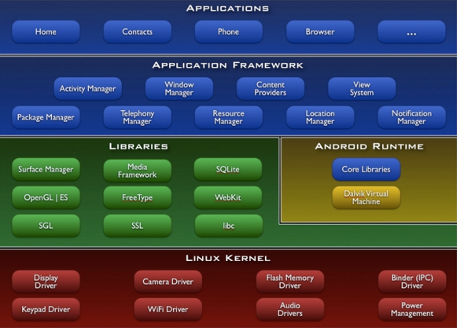

  * 移动端OS的特殊性，跟PC中不一样的可能出现的问题

    * 更高的能源利用效率；更丰富的用户体验；更有限的资源；更严峻的安全问题 (更多的user data存在OS中)

* Issue 5 ：Write Correct Parallel Code 正确的并发代码

  * Parallel Code的难点
    * 并发程序容易出现并发错误
    * 并发bug的特点：不确定性，难以复现/debug
    * 并发bug的类型：data detection，违背atomicity，deadlock
  * 解决问题的方法
    * 并发错误检测：race detection, atomicity violation detection, deadlock bug detection
    * 并发程序测试：详尽的测试，不同的涵盖范围准则
    * 并发编程语言/模型设计：transactional memory
  * 关于并发，OS可以做的事
    * 减少资源的不确定性
    * 容忍应用的bug
    * 忠实地捕获并发bug并进行复制
    * 提供更好的编程接口来简化编程

* Issue 6 ：Scale Out  (use distributed systems) 横向扩展

  * 分布式系统需要解决的问题
    * Ease-of-use：解决地理隔离；给用户/应用提供位置透明性
    * Availability：用一些unreliable的组件构建reliable的系统
    * Scalable capacity：聚合许多computer的资源
    * Modular functionality：只需要构建能完成single task的service就行
  * Scale Out的挑战
    * System Design 系统设计：interface，abstraction
    * Consistency 一致性
    * Fault Tolerance 容错
    * Different deployment scenarios 不同的部署场景：Clusters, wide area distribution, sensor network
    * Security 安全：authenticate clients/servers，defend misbehaving server
    * Implementation 实现：bottleneck

* Issue 7 ：Non-Volatile Storage 非易失性内存

  * 新式的存储

    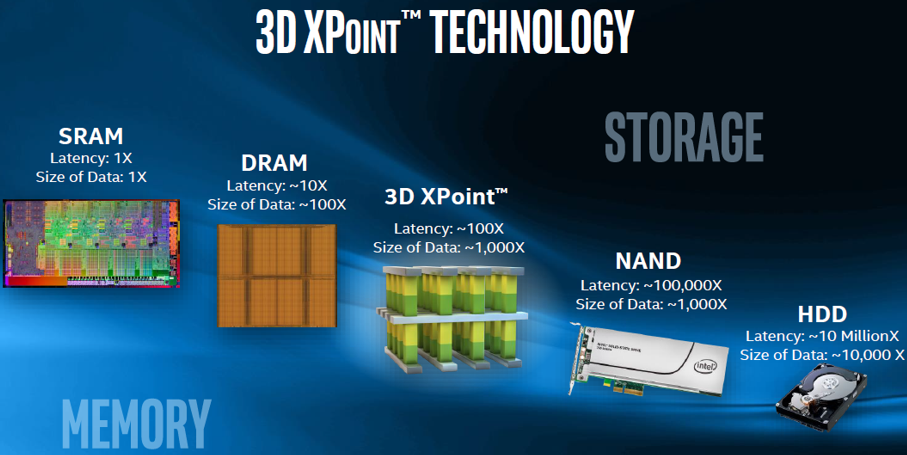

  * 关于存储，OS可以做的事

    * 适应新的存储模型
    * 非易失性内存会改变OS的管理存储资源的方式
    * 提供更好的IO performance
    
  * 非易失性内存和普通内存(DRAM) 的比较

    * 优点：空间大，断电有数据，内存版的磁盘
    * 缺点：慢，比DRAM latency高大概十倍

* Issue 8 ：Virtualization 虚拟化

  * 虚拟化架构

    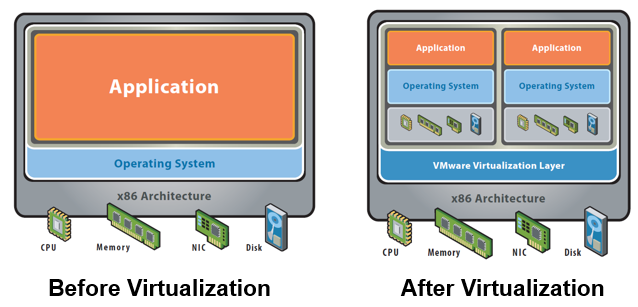

  * 虚拟化的优势

    * 最大化资源利用率：多个操作系统环境可以共存于同一台计算机上，彼此隔离；server consolidation
    * 容错：fault and migrate
    * 轻便：可以使用各种OS
    * 易于管理

  * 虚拟化的方法：process & OS 使用的硬件资源也要虚拟化

    
    
  * ISA是硬件软件的接口，例如MIPS指令集，理解为system级别的所有指令集 & syscall

  * ABI理解为user级别的指令集 & syscall

##### Summary

* 操作系统的定义：操作系统是管理硬件资源、控制程序运行、改善人机界面和为应用软件提供支持的一种系统软件；**向上提供公共服务，向下管理各种资源**
* **8 Important Problems of OS**
  - **Scale Up；**
  - **Security & Trustworthy；**
  - **Energy Efficiency；**
  - **Mobility；**
  - **Write Correct (Parallel) Code；**
  - **Scale out；**
  - **Non-Volatile Storage；**
  - **Virtualization**
* Scale Up 和 Scale Out
  * scale up的本质是放大和性能可伸缩性，处理器本身性能的提升
  * scale out 的本质是处理器数量增加导致性能提升

------

#### 第二讲 OS Structures

* OS Design and Implementation

  * Worse is Better design 设计原则
  * User goal 和 System goal
    * 用户会希望操作系统方便使用，容易学，可靠，安全，还快
    * 系统开发者希望操作系统容易设计/实现，可靠，可扩展，容错，高效

* **Kernel 分类：Monolithic, Microkernel, Exokernel, Hybrid**

  * Monolithic 宏内核：OS在kernel space运行，在supervisor mode 运行 （Linux BSD)；

    * 运行在一个单独的地址空间，所有内核段都在一个地址空间运行
    * 宏内核的优点：简单高效，技术成熟

  * Microkernel 微内核：low-level address space management, thread management, and inter-process communication (IPC)等技术，（Mach  L4 kernel

    * 微内核的优点：模块化程度高，一个服务失效不会影响另一个服务
    * 功能划分为独立的进程process，process间通过IPC通信

  * Hybrid kernel 复合内核：Windows ，NT kernel

    

  * DOS：没有模块的划分，接口和实现没有很好的分离。DOS以后开始有一些Layered Approach，将OS分为若干level来实现

    

  * UNIX：UNIX OS包括System program和kernel部分

    * UNIX system structure的结构如图所示
    
    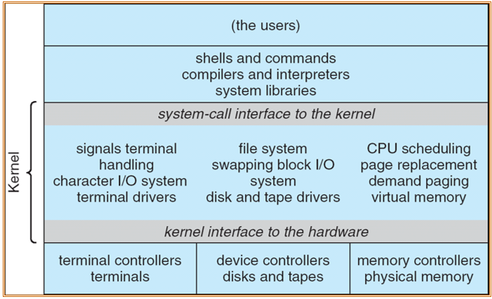
    
    * UNIX的kernel定义：由系统调用接口之下和物理硬件之上的所有内容组成，提供文件系统、CPU调度、内存管理等操作系统功能；一个级别的大量函数

* Microkernel 系统架构

  * 本质：user模块间的通信

  * 思想：将尽可能多的功能从kernel态移到user态

  * 优势：易于扩展；易于将OS移植到其他体系结构；因为kernel代码更少，所以更可靠，更安全

  * 缺点：kernel和user之间频繁通信的overhead，会降低性能

    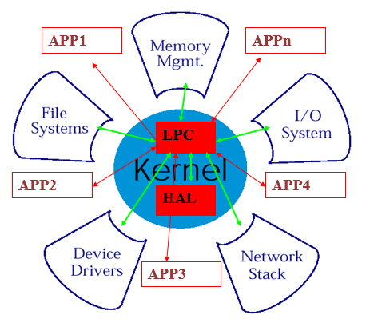

##### Microkernel

* 微内核相较于宏内核的改变，what does Mach do？
  * Task and thread management
    * 任务(过程)分配单元
    * 线程，执行单元
    * 实现CPU调度：公开给应用程序，应用程序/环境可以实现它们自己的调度策略
  * Interprocess communication
    * 通过端口的线程之间，Secured by capabilities

  * Memory object management
    * 主要是virtual memory；本质上的虚拟内存，通过IPC访问的持久存储
  * System call redirection
    * 通过trap来切换mode；
    * 允许捕获系统调用并将控制转移到用户模式
    * 本质上使应用程序能够修改/扩展系统调用的行为和功能，例如，启用环境的二进制模拟、跟踪和调试
  * Device support
  * User multiprocessing
  * Multicomputer support
* L3 - > L4
* Asynchronous IPCs 异步IPC
  * 同步IPC的缺点
    * 必须阻塞I/O操作；
    * 强制应用程序使用多线程
    * 多核的糟糕选择(如果IO在另一个核上执行，则不需要阻塞)
  * 希望异步IPC做的事情
    * 希望在Unix中类似于select()/poll()/epoll()

##### Exokernel

* **Exokernel微内核的核心观点是：只要内核还提供对系统资源的抽象，就不能实现性能的最大优化；**内核应该支持一个最小的、高度优化的原语集，而不是提供对系统资源的抽象。从这个观点上来说，IPC也是一个太高级的抽象因而不能达到最高的性能。Exokernel微内核的核心是支持一个高度优化的原语名叫保护控制转移(protected control transfer, PCT)。PCT是一个不带参数的跨地址空间的过程调用，其功能类似于一个硬件中断。在PCT的基础上，可以实现高级的IPC抽象如RPC。在MIPS R3000处理器上，一个基于PCT的RPC实现了仅10µs的开销，而在同一硬件上运行的Mach RPC为95µs。
* Exokernel overview：让内核将机器的物理资源分配给多个应用程序，并且让每个程序决定如何使用这些资源。该程序可以链接到实现OS抽象的操作系统库(libOS)
* Exokernel的libOS和传统不一样的地方
  * **核心：传统的读硬件是需要经过kernel的，exkernel的lib可以跳过kernel直接访问hardware**
  * 大多数程序都要与库链接，而不是直接与exokernel通信；库隐藏底层资源
  * 应用程序可以选择最适合其需要的库，甚至可以构建自己的库；内核只确保请求的资源是空闲的，并且允许应用程序访问它。
  * 优点：允许程序员实现自定义抽象，省略不必要的抽象，通常是为了提高性能
* Exokernel chanllenge
  * 内核有了新的角色：跟踪资源的所有权，确保资源保护，可以撤销资源访问
  * **三种技术：Secure binding，Visible revocation，Abort protocol**
    * 安全绑定，可见撤销，中止协议
  * Secure binding：application可以安全的绑定到硬件资源并处理事件
  * Visible revocation：回收资源，并删除对应的secure binding；通常revocation对app是不可见的，但在exokernel中对app 是的可见的；libOS需要维护resouce list
  * Abort protocol：强行打破secure binding，即使app不响应不配合也没有关系，是revocation失败后的一种保险机制，效果是kernel break所有的secure binding并通知libOS
* Exokernel 的评价
  * 优点：允许programmer自行设计抽象接口（lib），省略不必要的代码，可以提升性能
  * 缺点：
    * 它使客户支持问题变得更加复杂，因为您不再知道您的每个客户正在运行哪个操作系统
    * 由于app的需求非常广泛，所以接口若要满足所有app就需要预测所有可能的需求

##### Summary

* Microkernel

  * 优点：易于扩展；易于将OS移植到其他体系结构；因为kernel代码更少，所以更可靠，更安全
  * 缺点：kernel和user之间频繁通信的overhead，会降低性能

* Exokernel和Microkernel的区别：

  * Exokernel只分配功能，不提供底层硬件的抽象；Microkernel是提供底层抽象的
  * Exokernel中kernel的作用：确认resource是否free，确认app是否有访问权限
  * 三种技术：Secure binding，Visible revocation，Abort protocol

  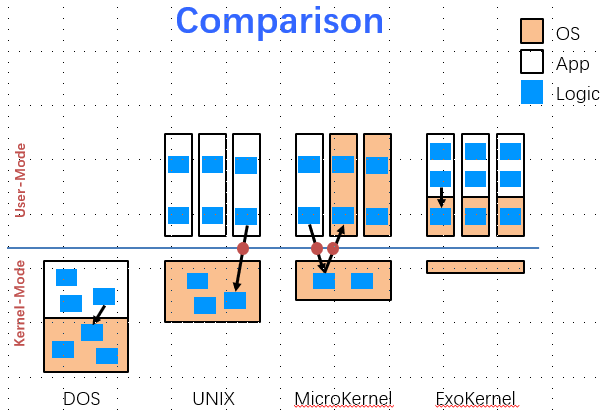

* 这张图引申出的question

  * Q1: what are difference? Consider file system, page fault handler, device driver, cpu scheduling
  * Q2: what is address space? Note that the kernel and apps share the same space
  * Q3: which one has the best performance
  * Q4: what is virtual machine’s architecture? Both Xen and KVM

------

#### 第三讲 PC Programming & Booting

##### PC Architecture

* x86架构 (32-bit)
  * EIP随着指令增加；指令是不定长的；EIP会被call, ret, jmp, cond. jmp修改

##### 五种CPU工作模式 (modes) {

* 定义：Real Mode, Protected Mode, Virtual-8086 Mode, IA-32e Mode, System Management Mode

* 名词解释：
  * PE，Protection Mode的开关
  * SMI，System Management Interrupt，系统管理中断，使系统进入SMM的特殊中断
  * SCI，System Control Interrupt，系统控制中断，专门用于ACPI电源管理的一个IRQ，需要OS支持
  
* Real-Address Mode是在bootloader阶段的运行模式，存在时间很短。内存寻址方式和8086相同，没有虚拟地址，由16位段寄存器（CS/SS/DS/ES）乘以0x10当做基地址，再加上16位偏移地址形成20位的物理地址，最大寻址空间1MB，最大分段64KB。

* Protected Mode是最常用的模式，内存寻址采用32位段和偏移量（现在64位），最大寻址4GB，最大分段4GB。它提供了一些增强多工和系统稳定性的设计，比如内存保护，分页系统，虚拟内存等，防止程序随意访问地址，也拥有更大的内存访问空间。

* Virtual-8086 Mode是在保护模式下运行的虚拟实模式环境，寻址方式与实模式相同。

* IA-32e Mode是64位操作系统运行的模式，具有兼容模式和64位模式两种子模式。兼容模式可以运行在32位兼容环境，但不能运行虚拟8086程序；64位模式则完全处理64位指令

* System Management Mode有独立于OS的地址空间，用来执行电源管理或系统安全方面的指令。

  

 }

##### x86中的EFLAGS寄存器  {

* 作用：提供程序的状态，进行相应的控制
  * 包含一组状态标志，系统标志和一个控制标志
  * 初始化后 EFLAGS register的值为0x0000 0002

```
ID: Identifiction Flag - 程序能够设置或清除这个标志指示了处理器对CPUID指令的支持
VIP: Virtual Interrupt Pending - 该位置1以指示一个中断正在被挂起，当没有中断挂起时该位清零
VIF: Virtual Interrupt Flag - 使用这个标志以及VIP标志，并设置CR4控制寄存器中的VME标志就可以允许虚拟模式扩展(virtual mode extensions)
AC: Alignment Check - 该标志以及在CR0寄存器中的AM位置1时将允许内存引用的对齐检查，以上两个标志中至少有一个被清零则禁用对齐检查
VM: Virtual-8086 Mode - 置1以允许虚拟8086模式，清除则返回保护模式
RF: Resume Flag - 控制处理器对调试异常的响应
NT: Nested Task Flag - 这个标志控制中断链和被调用任务。若当前任务与前一个执行任务相关则置1，反之则清零
IOPL: I/O Privilege Level - 指示当前运行任务的I/O特权级，正在运行任务的当前特权级(CPL)必须小于或等于I/O特权级才能允许访问I/O地址空间
IF: Interrupt Enable Flag - 该标志用于控制处理器对可屏蔽中断请求的响应。置1以响应可屏蔽中断，反之则禁止可屏蔽中断
TF: Trap Flag - 将该位设置为1以允许单步调试模式，清零则禁用该模式
```

```
状态标志 status flag
CF：标志无符号整数运算是否溢出
PF：若结果最低字节包含偶数个1，则该位置为1
IF：若结果为0，则置为1
SF：标志有符号整型的最高有效位（0为正，1为负）
OF：标志带符号整型运算的溢出状态
DF：控制串指令，1表示串指令递增，0表示串指令递减
IOPL：用于控制操作系统执行操作，不允许被应用程序修改
```

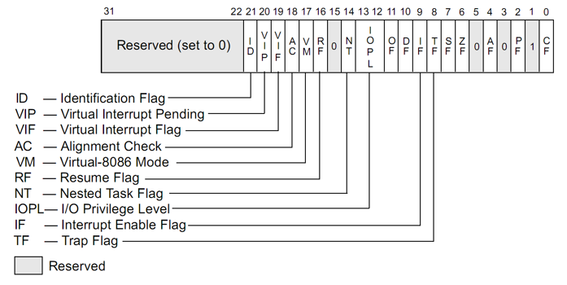

 }

##### 控制寄存器 Control Register { 

* CR0中含有控制处理器操作模式和状态的系统控制标志；

* CR1保留不用；

* CR2含有导致page fault的线性地址 linear address；

* CR3中含有页目录表物理内存基地址，因此该寄存器也被称为页目录基地址寄存器PDBR（Page-Directory Base address Register）

* CR4包含处理器扩展功能的标志位

* CR8提供对任务优先级寄存器 (Task priority register)的读写，仅在64位下存在

* 可以参考这一片博客 <https://blog.csdn.net/qq_37414405/article/details/84487591>

  

 } 

##### Memory

##### 内存管理寄存器 Memory-Management Register {

* Memory-Management Registers

  * GDTR (Global Descriptor Table Register)，全局描述符表寄存器，Base Address, Limit …
  * IDTR (Interrupt Descriptor Table Register)，中断描述符表寄存器，Handler Address, Ring Level …
  * TR (Task Register)，任务寄存器，TSS 

* 段选择符 segment registers：32位汇编中16位段寄存器(CS、DS、ES、SS、FS、GS)中不再存放段基址,而 是段描述符在段描述符表中的索引值,D3-D15位是索引值,D0-D1位是优先级(RPL)用于特权检查,D2位是描述符表引用指示位TI,TI=0指 示从全局描述表GDT中读取描述符，TI=1指示从局部描述符中LDT中读取描述符。这些信息总称段选择符(段选择子)

  

* 段描述符表：IA-32处理器把所有段描述符按顺序组织成线性表放在内存中，称为段描述符表。分为三类：全局描述符表GDT，局部描述符表LDT和中断描述符表IDT。GDT和IDT在整个系统中只有一张，而每个任务 都有自己私有的一张局部描述符表LDT，用于记录本任务中涉及的各个代码段、数据段和堆栈段以及本任务的使用的门描述符。GDT包含系统使用的代码段、数据段、堆栈段和特殊数据段描述符，以及所有任务局部描述符表LDT的描述符

  

  

 }

##### 内存寻址模型 Memory Model {

* 8086寻址适用于16位微处理器，在Real-Address Mode时使用，没有虚拟地址，最大寻址空间64KB。
* External address寻址由16位段寄存器（CS/SS/DS/ES）乘以0x10当做基地址，再加上16位offset形成20位的物理地址，最大寻址空间1MB。
* 80386寻址适用于32位数据和总线地址，在Protected Mode时使用，存在虚拟地址到物理地址的映射关系，有分页系统，最大寻址空间4GB。

* Physical Address Space Layout
  
  * 1MB以上被称为extended memory；640KB-1MB是一个内存空洞
  
    

 }

* Memory-mapped IO
  * I/O设备被放置在内存空间而不是I/O空间。从处理器的角度看，内存映射I/O后系统设备访问起来和内存一样
  * side effect是什么？？
* **IO的直接映射（Port映射）和MMIO的区别**
  * 前者不占用CPU的物理地址空间，后者占有（这是对x86架构说的，一些架构，如IA64，port I/O占用物理地址空间），对它的访问可以使用CPU访问内存的指令进行，一个形象的比喻是把文件用mmap() 后，可以像访问内存一样访问文件、同样，MMIO是用访问内存一样的方式访问I/O资源，如设备上的内存。MMIO不能被cache（有特殊情况，如VGA）
  * 前者是顺序访问。也就是说在一条I/O指令完成前，下一条指令不会执行。例如通过Port I/O对设备发起了操作，造成了设备寄存器状态变化，这个变化在下一条指令执行前生效。uncache的MMIO通过uncahce memory的特性保证顺序性。
  * 使用方式不同：由于port I/O有独立的64K I/O地址空间，但CPU的地址线只有一套，所以必须区分地址属于物理地址空间还是I/O地址空间。
  * 可以参考这篇博客 <https://www.cnblogs.com/idorax/p/7691334.html>

##### Execution

##### xv6源码分析 bootasm.S, bootmain.c, entry.S {

* BIOS会将磁盘的第一个扇区load到物理地址0x7c00，并以real mode开始执行
* Intel 8088的地址线只有20根 (A0~A19)，当时计算机的 RAM 只有几百 KB 或不到 1MB 时，20 根地址线已足够用来寻址；其所能寻址的最高地址是0xffff : 0xffff，即0x10ffef，对于超出0x100000 (1MB)的寻址地址，将默认回卷到0x0ffef
* 在机器启动时，默认条件下，A20 地址线是禁止的，所以操作系统必须使用适当的方法来开启它。但是由于各种兼容机所使用的芯片集不同，有键盘控制器，端口0x92，INT 15中断，0xee端口等方法 <refs https://blog.csdn.net/longintchar/article/details/79365928>
* 从实模式进入保护模式：置上CR0的PE位；用ljmp重载cs和eip

```assembly
ljmp    $(SEG_KCODE<<3), $start32
```

* readsect(...) 中用到的I/O端口

```
1F0H　　 0号硬盘数据寄存器 
1F1H　　 0号硬盘错误寄存器 
1F2H　　 0号硬盘数据扇区计数 
1F3H　　 0号硬盘扇区数 
1F4H　　 0号硬盘柱面（低字节） 
1F5H　　 0号硬盘柱面（高字节） 
1F6H　　 0号硬盘驱动器/磁头寄存器 
1F7H　　 0号硬盘状态寄存器 
```

* 在entry.S中，cr4打开PSE大页，cr3设置entrypgdir基地址，cr0置上PG位和WP位

* Boot loader的模式切换是从实模式切换到保护模式

  * 寻址方式改变了，不再是16*CS+IP，地址空间从1MB变成16MB

  * 可以使用paging和virtual memory

  * 直接从磁盘读取了kernel

  * 切换模式的代码

    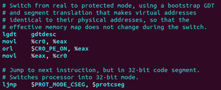

* 从分段模式到分页模式：

  

* Booting: enabling segment and paging
  * Segment: set GDT & use long jmp (ljmp)
  * Paging: temporary page table (entrypgdir) with kernel mapped at both 0x80100000 and 0x100000

}

* 仿真 PC Emulation：用于OS test和debug；能提高利用率

##### Summary and Extension

* EIP insturction pointer 和 PC 的区别

  * EIP insturction pointer 是指针IP/EIP/RIP的下一条指令的地址，作用是指向执行
  * PC指向正在执行的执行，IP指向下一条指令

* CPU实模式

  * 被特殊定义为20位地址内存可访问空间，2的20次幂 可访问内存空间；软件可通过这些地址直接访问BIOS和外围硬件
  * 为了向下兼容，80286的x86处理器仍开机启动在实模式下
  * 由于BIOS的映射作用，即BIOS占用了部分地址空间，真正能使用的物理地址在640K-924K之间
  * 1M地址空间：16位段地址和16位段内偏移，物理地址（20位）
  * 实模式的寻址方式：用分段寻址，16位基地址(ds) << 4 + 16位偏移(EA)

* A20-Gate

  * 高端内存HMA：对于可表示的最大地址 max = 0xffff << 4 + 0xffff (大于1M)，20根地址线不一定够用，这就需要第21根线HMA(并没有)，那个时候就用A20来解决了；后来为了向下兼容，要禁用地址，算这个的话实际地址是addr和1M求模

  * 在保护模式下A20-gate被禁用，可访问的只有1M段
  * 当发展到80286后，地址总线有24根，16M空间，因为向下兼容，实模式下仍然只用20根线，IBM用键盘控制器上剩余的输出线管理第21根地址线的有效性
  * A20-gate，打开真正访问HMA，关闭采用取模方式，通过BIOS控制A20-gate

* CPU保护模式

  * 为了能够访问更高的内存，必须进入保护模式

  * 优点：访问更高的地址，提供分段/分页两种寻址，提供内存的保护，硬件虚拟存储

  * 寻址方式：

    * GDTR：由于描述符表存放在内存中，GDTR存着段描述符表的首地址
    * GDT：全局描述符，包含所有app都可使用的基本描述符
    * LDT：存放的是局部的，不需要全局共享的描述符

    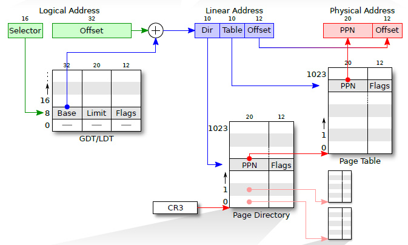

* 

------

#### 第四讲 Memory init：xv6 & VM

* Core i7的内存结构

  

* 页表项结构 PTE：高20位是页索引号，低12位是PTE属性

  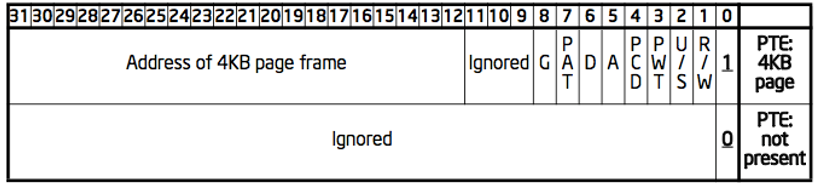

```
P: present
R/W: readable / writable
U/S: user / supervisor
WT: write-through (1) / write-back (0) - 写策略：写穿和写回
CD: cache disabled - 该页是否能被放到cache中，有些页可能是外部设备DMA修改的，不能放在cache中 
A: accessed (set by CPU, clear by OS)
D: dirty
PAT: page table attribute index
G: global page (no TLB updating on the address if CR3 is reset) - 一直放在TLB中不会被刷掉的页；比如处理page fault的handler所在的页
```

* 页目录项结构 PDE

  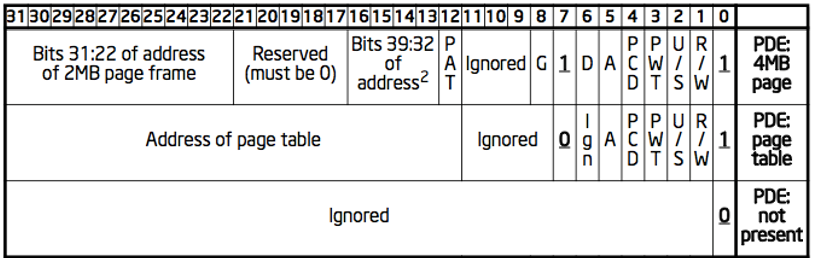

```
PS: page size (0=4KB, 1=4MB) - 4MB: super page
大页对data-intensive的workload更好，能减少TLB miss，降低地址翻译的平均时间；小页对CPU-intensive的workload更好，内存使用更精致
```

* PSE：Page size Extension
  * 开启PSE后，采用4M大页会减小TLB 中存储的page table的数目，会减少TLB miss的数目，提高address translateion的效率
* PAE：Physical Address Extension
  * x86和x86-64处理器的一个特色，即如果操作系统提供适当支持，则可以在32位的系统中使用超过4G的内存
  * x86的处理器增加了额外的地址线以选择那些增加了的内存地址，所以支持的内存寻址大小从32bit增加到36bit。最大支持内存由4G增加到64G，32位的虚拟地址则没有变，所以一般的应用软件可以继续使用地址为32位的指令
  * 4种页表结构（32bit机器）：未启用PAE, 4 KB的页；未启用PAE, 4 MB的页；启用PAE, 4 KB的页；启用PAE, 2MB的页
    * 32位机器是页表层次是 2 - 9 - 9 -12，有四个page directory
    * 32位机器的另一种页表层次 10 - 10 - 12，只有一个page directory

##### xv6源码分析 main.c, vm.c {

* 内存层次结构
  
  
  
* big picture of xv6 virtual addressing scheme
  
  ```
  0x00000000:0x80000000 ：user addresses below KERNBASE
  0x80000000:0x80100000 ：map low 1MB devices (for kernel) 
  0x80100000:? ：kernel instructions/data 
  ? :0x8E000000：224 MB of DRAM mapped here
  0xFE000000:0x00000000：more memory-mapped devices
  ```
  
* 调用顺序：
  
  * (main.c) main() 
  * -> (vm.c) void kvmalloc() 
  * -> pde_t *setupkvm()，给kernel段申请页表，并做最基本的映射
    * -> int mappages(pde_t *pgdir, void *va, uint size, uint pa, int perm)，对将pa映射到va的size大小perm权限的页，为其创建一个PTE；va和size可能并不是page-align的
    * -> pte_t *walkpgdir(pde_t *pgdir, const void *va, int alloc)，返回va处的PTE，如果alloc不为0就创建一个
  * -> void switchkvm()，通过lcr3切换到kernel页表
  * -> (proc.c) void userinit()，配置第一个用户进程
  
* 结构体kmap
  * 每个进程只有一个page table，加上CPU不运行任何process时使用的页表(kpgdir)
  * kernel在system call和interrupt期间会直接只用当前进程的页表
  * 页的protection位防止用户代码使用内核的映射

```c++
static struct kmap {
  void *virt;
  uint phys_start;	
  uint phys_end;
  int perm;
} kmap[] = {
 { (void*)KERNBASE, 0,             EXTMEM,    PTE_W}, // I/O space
 { (void*)KERNLINK, V2P(KERNLINK), V2P(data), 0},     // kern text+rodata
 { (void*)data,     V2P(data),     PHYSTOP,   PTE_W}, // kern data+memory
 { (void*)DEVSPACE, DEVSPACE,      0,         PTE_W}, // more devices
};
```

* User VM 映射的接口

```
创建进程：Inituvm : initialized user VM
	Loaduvm: load program segment
上下文切换：switchuvm
增加/减少/释放VM：allocuvm，deallocuvm，freeuvm
Fork：copyuvm
```

 }

------

#### 第五讲 Process

* 逻辑地址 - 线性地址 - 物理地址的转换

  * 线性地址就是虚拟地址
  * TODO：逻辑地址和线性地址有什么区别？

  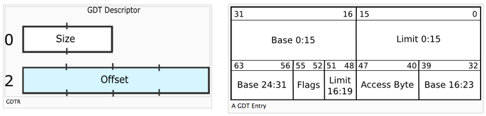

  

* Boot阶段的主要工作：

  * 进入Protected Mode，开启Segment，配置GDT (ljmp指令)
  * 打开页表 (CR0_PG)，初始化entrypgdir，将kernel映射到高地址和低地址 (0x80100000, 0x100000)

* 一些概念

  * Process：

    * 设计进程的出发点：程序比处理器多；程序并不需要持续占用处理器，因此可以在不用的时候释放资源；
    * 进程是资源分配的最小单位，拥有一个地址空间和若干线程；
    * 包含program counter, stack, data section等数据块
    * 一个地址空间，多个线程

  * Thread：线程的抽象定义：停止活动并在稍后某个 时刻恢复活动所需要的最小状态，通常是一些程序寄存器；线程是程序运行的最小单位

  * Context：xv6中的数据结构，包含edi、esi、ebx、ebp、eip五个field

  * Address spaces：**地址空间，原则上和线程是独立的概念；**可以在同一个地址空间从一个线程切换到另一个线程；也可以在不同地址空间切换

  * Process State：进程状态，一般有new，running，waiting，ready，terminated；xv6中为UNUSED, EMBRYO胚胎, SLEEPING, RUNNABLE, RUNNING, ZOMBIE

    * ENBRYO可以理解为到RUNNABLE之前的一个过渡。allocproc会在进程表中找到一个标记为UNUSED的位置。当它找到这样一个没有被使用的位置后，allocproc将其状态设置为EMBRYO，使其标记为被使用并给这个进程一个独有的pid。接下来，它尝试为进程的内核线程分配内核栈。如果分配失败了，allocproc会把这个位置的状态恢复为UNUSED并返回0来标记失败。

      
    

* **Process Control Block，PCB**

  * 这个相当于是process的名牌

  * 作用：是操作系统kernel中的一个数据结构，主要表示进程状态；使一个在多道程序环境下不能独立运行的程序，成为一个能独立运行的基本单位或与其他进程并发执行的进程

  * 每个process都会有一个PCB，内容包括Process state, Process counter, CPU registers, CPU scheduling information, Memory management information, Accounting information, I/O status information

  * 主要功能是在中断的时候保存数据，以便调度回来之后还能继续使用

    

  * xv6 中的进程数据结构

    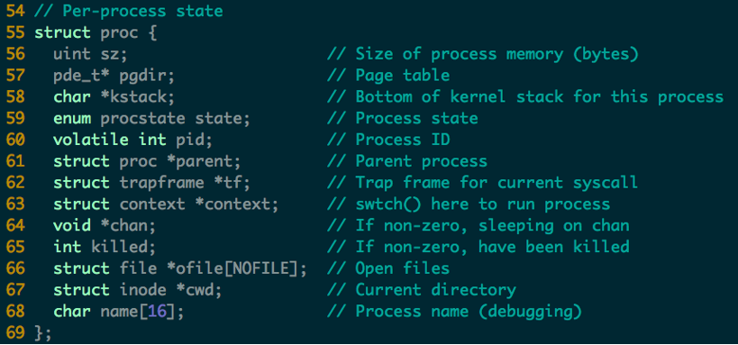

* Context Switch 上下文切换

  * **调用syscall触发中断 - save当前进程的PCB - reload目标进程的PCB - 继续执行**

  * 上下文切换需要保存的内容应该是存在进程对应的kernel stack中的

  * 上下文切换换栈的瞬间

    

* Process Scheduling Queue 进程调度队列

  * Job Queue：系统中所有的process
  * Ready Queue：系统中所有等待执行的process
  * Device Queue：系统中所有等待IO设备的process

* 两种Schedulers
  * Long-term scheduler / job scheduler：调度即将进入ready queue的进程，完成时间在秒/分钟级别，**决定了multiprogramming的程度 **degree of multiprogramming
    * Long-term scheduler被调度不是很频繁，所以慢点也还好
    * Long-term scheduler从缓存中选出等待执行的process加载进内存，进入ready queue
* Short-term scheduler / CPU scheduler：调度即将执行的进程，完成时间在微秒级别
    * Short-term scheduler会很频繁的被调度，所以一定要做的快
    * Short-term scheduler从ready queue中选出一个process执行，并分配cpu资源给它
  * Middle-term scheduler，将一些process从内存中暂时移出
  * scheduler对process的分类：IO-bound process和CPU-bound process
  
  
  
* Process creation

  * fork，一次执行两次返回；execute，一次执行没有返回；奇妙的机制
  * Resource sharing policies：分享所有的资源，共享父资源的子集，共享任何资源
  * Execution：父进程和子进程并行执行，父进程等待子进程终止

  

* Process Termination

  * Process执行最后一条语句，并要求操作系统删除它(exit)
    *  从子节点到父节点的输出数据(wait)
    *  进程资源由操作系统分配
  * 父进程可以终止子进程的执行(abort)
    *  子元素已超出分配的资源
    *  不再需要给孩子分配任务

------

#### 第六讲 IPC 

* Review Thread
  
  * 这张图中有三个stack，三个context，两个thread
  
  * scheduler不是thread，只是运行在内存中的一个context
  
  * thread的定义是可以被scheduler看到的
  
    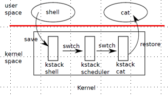
  
* Review Questions
  
  * Q: What is the difference between context and thread?
  
  * A：thread比context更大一些，context只有`edi/esi/ebx/ebp/eip`五个寄存器，thread还有thread info这个结构
  
    
  
  * Q: What is the difference between a kernel thread and a user thread?
  
  * A：kernel thread 和 user thread 有多种对应方式
  
    * 1对n是使用user-level scheduler的技术，用户自己yield自己调度，没办法用多核
  
    * m对n是内核有一段代码可以动态作线程匹配
  
      
  
  * Q: Does every user-level thread has a kernel-level thread?
  
  * A：应该是对的，但反过来就不对了（参考问题2）
  
  * Q: Which one is selected by a scheduler? Context, thread or process?
  
  * A：scheduler看到的是thread
  
  * Q: The number of kernel stack equals to the number of which: context, thread or process?
  
  * A：kernel stack的数量等于context的数量；不是thread可以用schedule距离，scheduler就是一种不是thread的context
  
  * Q: Can a kernel thread has multiple contexts?
  
  * A：可以的，调度的过程其实就有一个thread穿过三个context的情况
  
  * Q: When all CPU cores are running in user-level, all the kernel stacks are empty?
  
  * A：不是的，kernel stack = context 数量 = kernel only stack + 对应user的stack
  
    * 以上面调度的图为例，shell的kernel stack不为空，schedule也不为空(需要保存调用函数的返回地址)，cat最后为空
  
  * Q：Context is a concept in kernel, because user cannot switch stack
  
  * A：不是的，也存在user-level scheduler；但如果仅在xv6中讨论这个问题的话，这句话是对的
  
  * Q: To fully utilize a multi-core CPU, which threading model should be used: user-level thread or kernel thread?
  
  * A：应该用kernel thread，一个kernel thread对应一个core，可以用满资源
  
  * Q: What is the difference between user-level threading and co-routine?
  
  * A：user-level threading是依赖于函数lib，协同例程是语言级的技术
  
    * 协同例程是一个能够按照伪并行方式独立地执行的程序单位。协同例程像一个由主程序激活的process，但和process不同，协同例程能够在任何一处，控制转移到另一个协同例程，而且当控制转移返回到原协同例程时，在其执行被挂起的地方恢复先前的执行。

* Threading Model

  

##### IPC

* Cooperating process

  * 独立进程不能影响或受另一个进程执行的影响
  * 协作流程可以影响或受另一个流程执行的影响
  * Process cooperation的优点：
    * information sharing, computation speed-up, modularity, convenience
    * 信息共享, 计算加速, 模块化, 方便

* IPC的两种模型：如上图，message passing 和 shared memory

  

* xv6中实现IPC的数据结构：struct pipe

  

* IPC - Message Passing

  * 不依赖共享变量的进程间交流方式，提供send和receive两种接口
  * physical comminication link：shared memory，hardware bus
  * logical communication link：logical properties

* Direct Communication

  * 接口：每个进程显示的调用send(P, message), receive(Q, message)
  * Communication link的实现细节：link是自动构建的；link和pair of process是一对一的；link可能是单向的unidirectional，但通常是双向的bidirectional

* Indirect Communication

  * 进程通过mailbox (port) 定位和接受message；每个maibox都有id，只有相互共享mailbox的进程才可以互相通信
  * 接口：每个进程通过mailbox中转通信，send(A, message), receive(A, message)
  * Communication link的实现细节：link仅当进程共享mailbox时才构建；link和pair of process是多对多的；link可以是单向的，也可以是双向的 
  * <Problem> P1/P2/P3共享mailbox A，P1 send，P2/P3 receive，谁收到？
    * 解决方法：link至多连接两个process；只允许同时一个process做receive；允许显示指定receiver

* 同步/异步消息
  * 同步消息 synchronous：block sender直到返回，block receiver直到收到消息
  * 异步消息 asynchronous：sender和receiver都不做block
  
* Buffering的实现有三种模式：Zero capacity (sender一直等待)，bounded capacity (当link被占满后sender等待)，unbounded capacity (无限长，sender不等待)

##### LRPC - Lightweight Remote Procedure Call

* Unix IPC 的方式：
  * 管道 pipes，信号 signals，Unix-domain sockets (用于同一主机)
  * 信号量 POSIX semaphores，FIFOS nmaed piped，共享内存 Shared memory segments，POSIX message queues
  * System V semaphore sets, System V message queues
  
* Unix IPC的问题
  * 比较重量级 heavyweight
  * 通常会使用polling

* Lightweight RPC Basic concepts
  * 简单的控制传输：client线程在server domain执行
  * 简单的数据传输：共享参数栈，增加寄存器
  * 简单的stub：highly optimized marshalling
  * 并发性设计：避免共享数据结构
  * 统计性结果：大多数message都比较短，几百byte的占到90%+
  
* IPC之前设计高开销的地方
  * stub会复制大量数据
  * message buffer会通过内核复制内容，4次
  * 访问验证
  * 消息传输 (队列)
  * scheduling，程序员看到线程跨域，系统实际上在不同的域中汇合两个线程
  * context switch，2次
  * dispatch，找一个接收线程来interpret消息，然后分派另一个线程，或者让另一个线程等待更多消息
  
* LRPC Binding：connection setup phase
  * 为调用接口中的每个procedure在内核中注册过程描述符(PDs)
  * 对于每个PD，参数栈(A‐stack)都在两个域中预先分配和映射读/写
  * 内核预先分配linkage record，以便从A‐stack返回
  * 将A‐stack列表作为绑定对象返回给客户端

* client thread上的调用顺序

  

*  

------

第七讲 Exception

* Review

  * 两种IPC模型：shared memory，message passing
  * POSIX中的IPC方式：pipe，message passing，signal，shared memory，semaphore，etc.
* 辨析：Exception，Interrupt，System call

  * Exception：一种非法程序操作，能复现
  * Interrupt：由硬件设备产生的信号，不能复现
  * System call：用户程序可以请求OS操作，能复现

##### Exception

* Intel CPU上的Exception簇

  

* IDT / Trap Vector in xv6

  * IDT是exception table的别称；有256个entry，每个entry都是handler；在处理相对应的interrupt时，需要给出 %cs 和 %eip
  * 可以通过 `int n` 调用System call

* Exception Handler

  * 处理器在栈上push return address的时候，可能是当前指令(page fault指令)，或者下一条指令(硬件中断)

  * 处理器还会在栈上push一些额外的处理器状态，当handler返回的时重启中断程序的必要内容，比如当前的condition code

  * 在user向kernel切换的时候，所有item都是被push到kernel stack，而不是user stack

  * exception handler在kernel mode运行，可以完全访问所有系统资源

  * 要往kernel stack中push的内容

    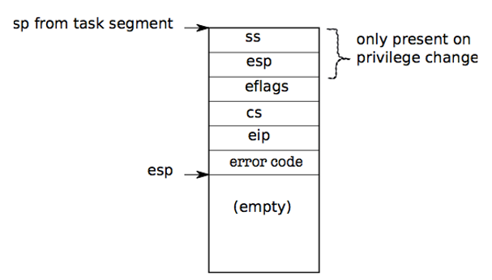

  * 为什么一定要push到kernel stack？

* 会触发user到kernel的几种事件 

  * Device interrupt：来自外部的中断，输入引脚 NMI引脚上 (nonmaskable interrupt)，输入引脚 INTR

  * Software interrupt：中断指令的执行，INT

  * Program fault：程序错误，执行出现错误的情况，除零错误

    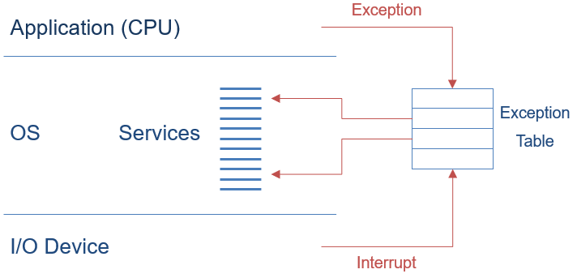

* 硬件中断和软中断

  * 硬件中断是由与系统相连的外设(比如网卡 硬盘 键盘等)自动产生的. 每个设备或设备集都有他自己的IRQ(中断请求), 基于IRQ, CPU可以将相应的请求分发到相应的硬件驱动上(注: 硬件驱动通常是内核中的一个子程序, 而不是一个独立的进程).处理中断的驱动是需要运行在CPU上的, 因此, 当中断产生时, CPU会暂时停止当前程序的程序转而执行中断请求.
  * 软中断不会直接中断CPU, 也只有当前正在运行的代码(或进程)才会产生软中断. 软中断是一种需要内核为正在运行的进程去做一些事情(通常为I/O)的请求
  * 硬件中断和软中断的区别
    * 硬件中断是由外设引发的, 软中断是执行中断指令产生的.
    * 硬件中断的中断号是由中断控制器提供的, 软中断的中断号由指令直接指出, 无需使用中断控制器.
    * 硬件中断是可屏蔽的, 软中断不可屏蔽.
    * 硬件中断处理程序要确保它能快速地完成任务, 这样程序执行时才不会等待较长时间, 称为上半部.
    * 软中断处理硬中断未完成的工作, 是一种推后执行的机制, 属于下半部.

* Exception 发生的时候，有哪些必须满足的条件

  * 必须保存处理器的寄存器，用来恢复
  * 必须set成在kernel中执行
  * 必须要从kernel中挑一个位置来开始执行
  * 必须能够获取事件的各种信息，比如说system call argument
  * 必须能够安全的完成
  * 必须保证用户进程和kernel的隔离

* kernel中的interrupt函数的返回

  * iret指令：需要恢复上下文，从kernel切回user mode，继续执行用户程序

------

### 第八讲 Interrupt

* Intel 中的不同术语
  * Interrupt 异步的，设备生成
    * maskable：device生成，与IRQs相关联，可以被暂时禁用
    * nonmaskable：一些关键的硬件故障
  * Exception 同步的，来自软件
    * Processor-detected
      * Fault 故障，可纠正，可重新启动，如page fault
      * Traps 陷阱，不需要重新执行，例如断点
      * Aborts 中止，严重错误，进程通常会通过signal终止
    * Programmed exception 软件中断
      * int (system call), int3 (breakpoint)
      * into (overflow), bounds (address check)
  
* 一些术语
  * Vector, Interrupt vector, Trap number
  * IRQ: Interrupt Request
  * Interrupt, trap, fault, exception
  * Software interrupt / system call
  * IDT: Interrupt Descriptor Table 中断描述符表
  * ISP: Interrupt Service Procedure 中断服务程序

* 中断号有256个可能的值，Intel为 exception保留了前32个，剩下的可以用于自己的目的，例如处理device服务请求，或者处理system call

* Interrupt 概念

  * 中断有点像system call，但设备可以在任何时候产生中断
  * 主板上的硬件在device需要被 ”注意到“ 的时候，向cpu发乎信号，比如键盘信号；所以要对设备编程生成中断，并安排cpu 接受中断

* Interrupt 执行的顺序

  * push FLAGS 寄存器
  * 清除 IF 和 TF，EFLAGS中的interrupt able flag和trap flag
  * push CS
  * push IP
  * 获取interrupt vector的内容，置上IP和CS，开始执行ISP

* Interrupt hardware

  * IO 设备有唯一的/共享的 IRQ，IRQ由特殊的硬件映射到interrupt vector，然后传递给CPU，这种硬件叫做PIC programmable interrupt controller

    

* APIC，IO-APIC 和 LAPIC

  * APIC，Advanced PIC，用于SMP系统 (对称多处理器，UMA架构)
    
    * 适用于所有现代系统，中断通过system bus路由到cpu
  * LAPIC 和 前端 IO-APIC
    
    * device是连接到 IO-APIC的，IO-APIC通过bus和LAPIC相连
  * interrupt路由
    
    * 有一点像网络的实现，允许广播或者选择性的route 中断，能够分配中断处理负载，路由到最低优先级的进程，如果同等优先级就仲裁或round robin
    
      

* 为设备分配IRQ 

  * IRQ的分配因硬件不同为不同，有的是hardwire硬连线，有的是物理设置，有的是可编程的，PCI总线就是在引导分配IRQ
  * 一些IRQ的设计是由架构决定的：IRQ0:间隔计时器，IRQ2: 8259A级联引脚
  * Linux设备驱动程序在设备打开时请求IRQ
  * 一些硬件IRQ是预设定的
    * 系统定时器(IRQ0)，键盘控制器(IRQ1)，软盘控制器(IRQ6)，实时时钟(IRQ8)和数学协处理器(IRQ13)
  * 其他大部分IRQ是通过user决定的，可以通过硬件/跳线，也可以通过软件，如可安装的驱动程序和固件PNP
  * 还有一些可用于附加设备的IRQ
    * 调制解调器(IRQ5)，打印机(IRQ7)，声卡(IRQ9/IRQ10)，视频卡(IRQ11)和PS/2鼠标(IRQ12)，IRQ3和IRQ4通常用于串行端口，IRQ14和IRQ15用于IDE (primary和secondary)
  * interrupt vector中为IRQ所做的分配：32以下是不可屏蔽的 interrupt和exception，128 是system call，251-255用于IPI inter-processor interrupt 处理器间中断，IRQ的编号都是 IRQ# + 32

* Interrupt Priority 中断优先级

  * NMI：Non Maskable Interrupt 不可屏蔽中断

    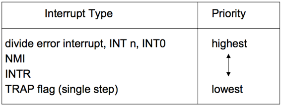

* 中断处理分为四个阶段：

  ```
  1、保存被中断程序的现场，其目的是为了在中断处理完之后，可以返回到原来被中断的地方继续执行；
  2、分析中断源，判断中断原因，当同时有多个中断同时请求的时候还要考虑中断的优先级；
  3、转去执行相应的处理程序；
  4、恢复被中断程序现场，继续执行被中断程序。
  ```

* EOI：End of Interrupt

  * 在一个基于IRQ的中断程序结束时，会给PIC芯片发送EOI信号
  * 如果IRQ来自Master PIC，那么只向主PIC发出这个命令就足够了；如果IRQ来自Salve PIC，则需要向两个PIC芯片发出命令

* OS设计原则：Maximizing Parallelism

  * 让所有IO设备尽可能繁忙
  * 通常IO中断表示某项操作的结束，另一项要求应尽快发出
  * 大多数device是互不干扰彼此的数据结构的，没有屏蔽其他device的理由

* Handle Nested Interrupt

  * 尽快 unmask global interrupt
  * 只要reasonable，就re-enable来自该IRQ的中断；但这可能会导致重新进入相同的处理程序
  * 中断处理期间不启用 IRQ-specific的掩码

* Nested Execution

  * 中断可以被中断
    * 对于不同的不断，handler并不需要要重入reentrant；一小部分需要在禁用中断的情况下handle
  * 异常也可以被中断
    * 通过中断 (需要服务的设备)
  * 异常最多嵌套两层
    * 异常表示编码错误，可以exception - page fault，两层肯定到kernel了，这时候的代码不应该有bug，否则就是一个triple fault
    * 当发生故障时，CPU调用exception handler。如果此时发生错误，则称为double fault，CPU将尝试使用另一个exception handler处理该错误。如果该调用也导致错误，则系统将因为triple fault 而 reboot

* Interrupt Masking

  * mask的两种不同类型：global，selective
    * global就是延迟所有interrupt，selective就是mask掉单个IRQ，因为通常来自同一类型的几个中断的干扰最常见

* 有关 interrupt 和 exception 的三个关键数据结构

  * GDT，The global descriptor table
    * 定义系统的内存段及其访问特权，CPU有义务强制执行这些特权
  * IDT, The interrupt descriptor table
    * 为处理所有“中断”和“异常”的各种代码例程定义入口点
  * TSS，The task-state segment
    * 保存寄存器SS和ESP的值，CPU将在进入内核模式时加载这些值

* CPU 如何找到 GDT/IDT 存在哪里

  * 有两个专用的寄存器：GDTR和IDTR，两者都有相同的48位格式
  
  * 内核必须在系统启动期间设置这些寄存器(set-and-forget)
  
  * 特权指令:LGDT和LIDT用于设置这些寄存器值；非特权指令:用于读取寄存器值的SGDT和SIDT
  
    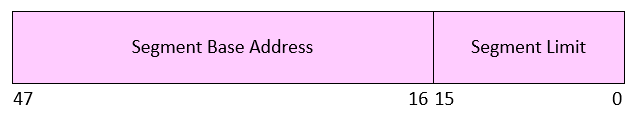

* CPU 如何找到 TSS 存在哪里

  * 专用系统段寄存器TR将描述符的偏移量保存到GDT中

    
  

##### Bottom Half

* 中断处理的哲学/核心思想
  * 在interrupt handler中尽可能少地执行操作，把不重要的行动推迟到后面做，就形成了top和bottom上下两半

    * 上半部分：完成最小的工作量并返回 (ISR, interrupt service routines 中断服务程序)
    
    * 下半部分：延迟处理 (四种方法：softirqs, tasklets, workqueues,
  kernel threads，软中断，微线程，工作队列，内核线程)
      
    
    
  
* Top Half 中做的事 ：Do it Now !
  * 只执行最小的公共函数：保存寄存器，unmask其他中断，最后撤销此次操作：恢复寄存器，返回到以前的上下文
  * 通常为了快，使用汇编写的；然后调用device driver中的合适的interrupt handler (用C写的)
  * IRQ在上半部分通常是被屏蔽的
  * 不要试图在top half中做太多工作，因为IRQ是被屏蔽的，让可能会让stack涨的太大；通常会在下半部分对request进行一个派对，并为延迟处理设置一个flag
* Top Half 如何找到handler
  * 在现代的硬件设备中，多个IO设备可以共享一个IRQ，因此可以共享interrupt vector
  * 多个ISR可以和一个vector相关联
  * Each device's ISR for that IRQ is called
  * Device determines whether IRQ is for it
* Bottom Half : Do it Later !
  * 中断 (与异常相反) 不与特定instruction相关联，也不和process相关联
  * 当前运行的process，在中断发生的时候，和这个中断没有任何关系
  * interrupt handler不能sleep ！
* interrupt handler不能sleep 所意味的事情
  * 不能 sleep 或 做任何可能导致sleep的事
  * 不能应用 current
  * 不能用 GPF_KERNEL 申请内存，它可能会sleep；只能用GPF_ATOMIC，它会失败
  * 不能调用schedule
  * 不能执行down的信号量操作，但可以使用up
  * 不能和user space进行数据通信，比如copy_to_user, copy_from_user
* Interrupt stack
  * 中断发生时使用的stack是哪一个
    * exception，当前process的kernel stack
    * interrupt，hard IRQ stack，1 per processor
    * softirqs：soft IRQ stack，1 per processor
  * 这些stack都会在boot的时候被kernel设置进IDT和TSS
* Softirqs
  * 静态分配:在内核编译时指定
  * 优先级从高到低：High-priority tasklets 高优先级微线程，Timer interrupts 定时器中断，Network transmission 网络传输，Network reception 网络接受，Block devices 块设备，Regular tasklets 正则微线程
* Softirqs 在什么时候运行
  * 在kernel 的一些行为之后：system call后，exception后，interrupt后 (上半部分，IRQs，定时器intr)，当scheduler运行ksoftirqs的时候
  * 软中断可以在多个CPU上同时执行，代码必须是可重入的
  * 当软中断运行时，硬件中断一直是enable的
  * 软中断可以重新安排自己的时间，这可能会饿死用户级process
  * 软中断调度一次只能运行有限数量的请求
  * 其余的由内核线程ksoftirqd执行，它与用户进程争夺CPU时间

* Tasklets
  * 建立在软中断之上，可以动态创建和销毁
  * 在schedule它的cpu上运行 (cache affinity 缓存关联)
  * 单个tasklets在执行期间会被lock，没有重入性的问题
  * tasklets可以在多个cpu上同时运行，同一个tasklet只能在一个cpu上运行
  * tasklets的问题
    * 比较难get right，要谨慎提防sleep，比系统中的其他task有更高的优先级，如果编码不好会产生无法控制的延迟，正在进行是否要消除tasklet的讨论
* Work Queue
  * 始终在kernel stack运行，是由scheduler调度的
  * softirqs和tasklets运行在中断上下文，work queue在伪进程上下文
    * 即一个有内核上下文，但没有用户上下文的进程
  * 因为这是一个伪流程上下文所以可以sleep
    * work queue可以被多个device共享，因此sleep会延迟队列中的其他工作
  * work queue是kernel-only的，没有user mode跟它相关联，所以不要尝试把数据复制到user space
* Kernel threads
  
  * 总是在kernel mode运行，也没有user context
  
    

* 为什么interrupt handler不能sleep：防止死锁出现

  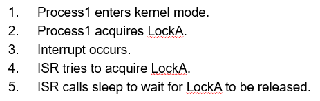

------

### 第九讲 System call

* 部分system call 列表

  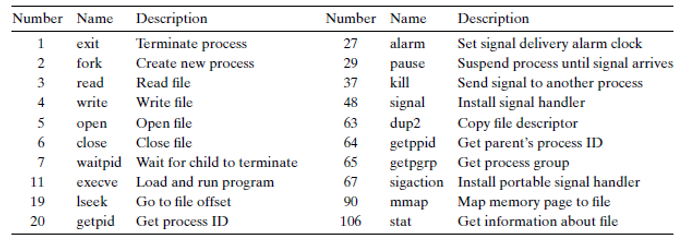

* 跟踪system call的执行

  * Linux可以使用ptrace 和strace来跟踪syscall，每次执行syscall时都会打印输出，包括参数和返回代码

    

*  调用syscall的方法
  * 从代码角度来看：application层通过library层，调用lib函数；application层直接写汇编 “int 0x80”
  * 从机器角度来看：int 0x80；SYSENTER；SYSCALL
  
* 库函数和syscall 的返回代码
  
  * 库调用在出错时返回-1，并在全局变量errno中放置特定的错误代码，系统调用返回特定的负值来指示 %eax 中存放的错误
  
* 传递syscall的参数
  * 第一个参数总是 syscall #
  * Linux允许最多6个附加参数，ebx，ecx，edx，esi，edi，ebp
  * 需要更多参数的syscall会把剩下的参数打包在一个struct中，并将该struct的指针作为第六个参数传递
  * Problem，必须要验证指针的合法性，可能是invalid的，如果NULL就会导致OS崩溃
  
* 如何验证user指针的合法性
  * 做一次彻底的检查cost太大了，要完全检查指针是否处于调用进程的所有有效区域之内
  * 解决方法是做一个不完全的检查：Linux对地址指针做一个简单的检查，并且只确定指针变量是否在用户内存的最大可能范围内(在用户空间里就可以了)，即使指针值通过此检查，特定值仍然可能无效
  * 在内核代码中取消对无效指针的引用通常会被解释为内核bug，并在控制台上生成Oops消息，然后杀死出错的进程。Linux做了一些非常复杂的事情来避免这种情况


* 处理user pointer带来的fault

  * 内核必须要用一段奇怪的代码 (paranoid) 来访问用户指针，比如 copy_from_user ，kernel知道哪些地址会抛出无效的内存访问异常

  * 当page fault的时候，kernel的page fault handler会检查出错的eip

  * 如果eip在一段 paranoid routines中，kernel就不会报错，相反就会调用 fixup代码

  * 这些paranoid的核心理念是：不直接访问用户的内存，用户都是危险的

    

* 新的指令 SYSENTER/SYSEXIT 和 SYSCALL/SYSRET

  * int 0x80已经过时了
  * SYSENTER/SYSEXIT是intel先提出的，SYSCALL/SYSRET是AMD先提出的
  * 在32位kernel中，只兼容SYSENTER/SYSEXIT；64位kernel只兼容SYSCALL/SYSRET
  * SYSCALL/SYSRET 的延迟更低，大概快个25%
    * 简化了OS的调用和返回，消除了不必要的检查，加载预先确定的值到CS和SS两个段寄存器

* System call的执行流

  * 找到IDT中对应的第n个描述符
  * 检查%cs中的CPL是否 <= DPL，DPL是描述符中的特权级别，0是kernel，3是user
  * 将%esp和%ss保存在cpu内置的寄存器中，仅当目标段选择器的PL < CPL时才这样做
  * 从task segment descriptor加载%ss和%esp (TSS结构)
  * 按照%ss，%esp，%eflags，%cs，%eip的顺序，push到kernel stack上
  * 清除%eflags的一些位，IF和TF吧
  * 将%cs和%eip设为描述符中的值

##### VDSO 

##### Virtual Dynamic Shared Object 虚拟动态共享对象

* VDSO的动机
  * syscall造成的延迟不能忽略 (negligible)，比如说在syscall gettimeoftoday中，一点延迟的影响就特别大
  * 如何降低syscall的延迟？大部分的时间都用来save/restore上下文，如果没有mode switch，就不需要save/restore状态了
* gettimeofday的具体实现
  * 函数由kernel定义，在编译过程中作为kernel代码的一部分
  * 但运行的时候是在user space运行，代码被load到用户共享的页面中，称为VDSO，time通过只读的方式映射到了用户控件，只能在kernel mode下更改
* vsyscall 和 VDSO
  * vsyscall：用来执行特定的系统调用，减少系统调用的开销。某些系统调用并不会向内核提交参数，而仅仅只是从内核里请求读取某个数据，例如gettimeofday()，内核在处理这部分系统调用时可以把系统当前时间写在一个固定的位置(由内核在每个时间中断里去完成这个更新动作)，mmap映射到用户空间。这样会更快速，避免了传统系统调用模式INT 0x80/SYSCALL造成的内核空间和用户空间的上下文切换。
  * vsyscall的局限：分配的内存较小；只允许4个系统调用；Vsyscall页面在每个进程中是静态分配了相同的地址；
  * VDSO：提供和vsyscall相同的功能，同时解决了其局限；vDSO是动态分配的，地址是随机的；可以提供超过4个系统调用；vDSO是glibc库提供的功能

##### FLEX-SC

##### Flexible System Call Scheduling with Exception-Less System Call

* FLEX-SC的动机

  * 如何进一步降低syscall的延迟？延迟的来源主要在于state switch，要save/restore和check privilege，还有一些cache pollution

* Flexible System Call

  * 新的syscall机制，介绍了用户和内核共享的system call page

  * 用户线程可以把syscall请求push到system call page

  * 内核线程用轮询syscall到system call page

  * 通过将调用和执行解耦来消除同步

    

*  

------

### 第十讲 IO

* 为什么需要 IO 子系统
  * device的种类特别多，每一种都不同，我们需要为他们设计标准化的设备接口
  * device都是 unreliable 的，会产生媒体错误和传输错误，我们要想办法让他们可靠
  * device都是 unpredictable 的，有的时候还比较 slow，我们要有合适的办法去管理他们
* IO 子系统的设计目标
  * 为不同种类的device提供统一的接口
  * 提供IO硬加的抽象层，用于管理和硬件的交互，隐藏硬件和操作的具体细节

* 三种类型的Device Interface

  * Character devices；Block devices；Network devices

    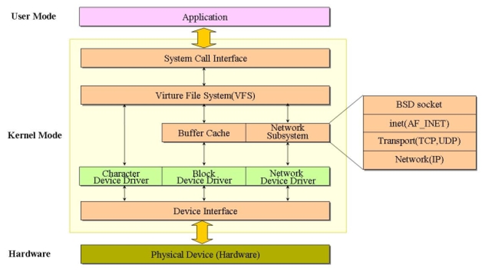

* Character Device 字符设备

  * 比如：键盘鼠标，串口，USB设备
  * 顺序访问，每次一个字符；经常使用开放的文件接口
  * IO command：get()，put()

* xv6 中的IO指令：inb(port)，outb(port, data)

* Block Device 块设备

  * 比如：disk driver，tape driver，DVD-ROM
  * 通过统一的块IO接口访问数据块；用原始的IO或者文件系统访问；通过memory-mapped的方式访问是可能的

* Network Device 网络设备

  * 比如：以太网，无线，蓝牙
  * 不同于block/character device，network device是有自己的接口的，不需要用文件接口；它提供特殊的网络接口，支持各种网络协议，可以收发网络数据包

* user 如何处理device带来的timing问题

  * Blocking IO：Wait

    * read/write时都将进程置于waiting状态，直到数据就绪

  * Non-blocking IO：Don‘t Wait

    * 从read/write请求立即返回，并成功传输字节数，但read可能什么都不返回，write也可能什么都没写进去

  * Asynchronous IO：Tell Me Later

    * read/write都会访问用户缓冲区的指针然后立即返回，稍后内核将填充缓冲区/接受数据，然后通知user

  * 同步和异步IO

    

* DMA transfer的步骤

* DMA响应、DMA传输、DMA结束4个步骤

  * 请求：CPU对DMA控制器初始化，并向I/O接口发出操作命令，I/O接口提出DMA请求
  * 响应：DMA控制器对DMA请求判别优先级及屏蔽，向总线裁决逻辑提出总线请求。当CPU执行完当前总线周期即可释放总线控制权。此时，总线裁决逻辑输出总线应答，表示DMA已经响应，通过DMA控制器通知I/O接口开始DMA传输。
  * 传输：DMA控制器获得总线控制权后，CPU即刻挂起或只执行内部操作，由DMA控制器输出读写命令，直接控制RAM与I/O接口进行DMA传输；在DMA控制器的控制下，在存储器和外部设备之间直接进行数据传送，在传送过程中不需要中央处理器的参与。开始时需提供要传送的数据的起始位置和数据长度。
  * 结束：当完成规定的成批数据传送后，DMA控制器即释放总线控制权，并向I/O接口发出结束信号。当I/O接口收到结束信号后，一方面停 止I/O设备的工作，另一方面向CPU提出中断请求，使CPU从不介入的状态解脱，并执行一段检查本次DMA传输操作正确性的代码。最后，带着本次操作结果及状态继续执行原来的程序。
  * 由此可见，**DMA传输方式无需CPU直接控制传输，也没有中断处理方式那样保留现场和恢复现场的过程**，通过硬件为RAM与I/O设备开辟一条直接传送数据的通路，使CPU的效率大为提高。

* IO设备通知 (notifying) OS的方式
  * OS必须要被notify的情况：IO设备完成操作或出现错误
  * 两种notify method：polling，interrupt-driven
  * polling轮询：IO设备将完成/错误的信息放入device-specific的状态寄存器中，OS定期检查状态寄存器
    * 优点：低开销
    * 缺点：如有不频繁或者不可预测的IO操作，可能要浪费很多轮询周期
  * Interrupt-driven 中断驱动：优点：能很好地处理不可预知的事件；缺点：中断的开销相对较高
  * 有的设备融合了polling和interrupt，高带宽网络对第一个传入的包interrupt，之后就一直polling，知道hardware为空
* Device Driver
  * 定义：内核中与device直接交互的device-specific的代码
    * 支持标准的内部接口
    * 相同的kernel IO系统可以轻松地与不同的device driver交互
    * 使用 ioctl() syscall，支持特定于device的特殊配置

* IDE 端口

  * 端口 0x1F0-0x1F7
    * 0x1f0: write/read port
    * 0x1f2: number of sectors 
    * 0x1f3-0x1f5: sector number
    * 0x1f6: diskno and sector number
    * 0x1f7: command registers, status bit

  * 端口 0x3F6 interrupt control line   

*  

------

#### 第十一讲 File System：xv6 ~ ext4

* Virtual File System Interface
  * 现实中存在的问题：OS可能挂载了不同底层文件系统的多个分区，如果进程针对不同的文件系统还要提供不同的API的话就很麻烦
  * Linux使用虚拟文件系统接口（VFS)，向进程暴露POSIX的api，将请求转发到低层文件系统特定的驱动程序；windows的也差不多
  * 文件系统有ext2-4，NTFS，FAT32等
* xv6 FS design
  * xv6的文件系统实现了最低限度的Unix fs interface，包括`superblock，inode，dentry`
  * 缺点：设计不是很注重文件系统的layout，没有磁盘调度，cache策略是write-through，简化了磁盘数据一致性的麻烦，但性能不好
  * xv6的block size是512 byte

* xv6 FS disk layout

  * block 0是不用的，block 1是superblock，block 2之后分别是inode，bitmap，data block和log block

    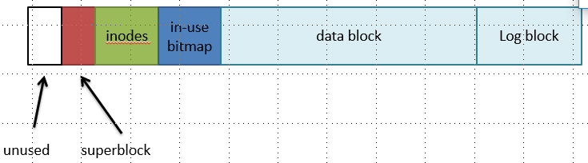

* 概述：Free-space list bit vector

  * 就是in-use bitmap的意思，将空闲块列表表示为位向量
  * 2TB磁盘-> 512M块（block size 4M byte？？？）-> 64MB位 （1B=8bit）

* 概述：Multi-level Indexed Allocation
  * 主要是在描述inode的direct和indirect

  * ```
    [fs.h]
    #define NADDRS    (NDIRECT+1)
    #define NDIRECT   12
    #define INDIRECT  12
    #define NINDIRECT (BSIZE / sizeof(uint))
    #define MAXFILE   (NDIRECT  + NINDIRECT)
    ```

  * 文件大小，不用indirect最多12个块，用了的话最多12+128个块，每个块又512byte了

    * inode中的最后一个地址作为128个磁盘地址(512 / 4)的块的磁盘地址

  * 目录 directory，是特殊的文件，包含多个dirent结构

    * dirent是目录内的文件，field有 inode-num和filename

##### EXT File system

* inode 的优点
  * 优化了有很多小文件的文件系统的性能：每个inode都可以直接指向48KB的数，4MB文件只需要一个layer
  * 更快的文件访问：metadata的局部性更好，随机访问的时间会更少，因为都放在一起，不需要遍历FAT那样的链式结构
  * 更容易的自由空间管理：bitmap可以缓存在内存中，以便快速访问；inode和date space可以分开处理

* ext file system 概况
  * Ext文件系统是使用inode的：inode是数据块的imbalaneced tree，针对小文件很多这个常见情况进行了优化
  * 问题：ext的locality较差：inode与它们对应的数据离得很远，这将导致长时间的磁盘搜索
  * 问题：ext容易出现碎片，ext为新数据选择第一个可用块，并不尝试保持文件块的连续

* Fast File System (FFS) and Ext2

  * FFS的主要贡献：又花了spinning disk的性能
  * 发现：进程倾向于访问相同目录中的文件，有空间局部性
  * 关键思想：将directory groups和它的文件都放在cylinder group中，这个设计引入到了ext2中，称为block group

* block group

  * 在ext中，只有一组关键数据结构
    * 一个data bitmap，一个inodebitmap
    * 一个inode table，一个data block array
    
  * 在ext2中，每个block group都包含自己的关键数据结构

    

* ext2的分配策略：ext2尝试将相关文件和目录保存在同一个block group中

* ext2的优点和缺点
  * 优点：ext2支持所有其他ext的特性，甚至还能做的很好，因为在空间局部性上做的很ok
  * 缺点：大文件必须跨block grooup；随着文件系统变得越来越复杂，文件系统损坏的几率也会增加；例如无效的inode、不正确的directory entry等，就是说有点脆

* 数据块寻址的文件大小上限

  

* Extent 概述

  * 问题：对于大文件来说，indirect实际上非常低效，每1024个块读取(并查找)一个额外的块，这一点在删除大的CD/DVD图像文件时非常明显

  * extent用单一的descriptor描述了是一组连续的/相邻的块
    
    * 这是一种表示大文件的有效方法，更好的CPU利用率，更少的元数据IO，就是多了一个length的参数
    
  * 现代文件系统尽量减少碎片，因为它导致了很多的seek，性能低下；entent更适合于连续文件

    

* 实现extent特性
  * ext4和NTFS都用了extent
  * ext4 inode包含4个extent，而不是块指针
    * 每个extent最多可以处理128MB的连续空间(假设为4KB块)
    * 如果需要更多区段，则分配一个data block；这就类似于一个indirect了

* Revisiting Directories
  * 在ext、ext2和ext3中，每个目录都是一个包含很多entry的文件
    * entry不是顺序存储的；有些被删除的entry还在，只是它们可能是空的
  * 问题：在大目录中搜索文件需要O(n)时间
    * 实际上，不能在目录中存储>10K文件，不然查找和打开文件花费的时间太长了（10k？）
  
* From Lists to B-Trees，目录entry的优化
  * ext4和NTFS将目录编码为b树，以将查找时间提高到O(log N)
  * b树是一种平衡树，它为磁盘上的存储进行了优化，项目以块的顺序存储

* ext4的优点和缺点
  * ext4的两个改变：使用extent，目录存储用b树
  * 优点：ext4(和NTFS)支持所有基本的文件系统功能，改进了ext3 block group的性能，extent和b树目录文件性能很好
  * 缺点：下一代文件系统有更好的特性，写时复制语义 copy-on-write semantics (btrfs和ZFS)
  
* 

------

#### 第十二讲 Crash Consistency

##### File System Durability & Crash Recovery

* Durability：耐用性
* 为什么 fs crash recovery比较困难
  * 这里举了一个文件系统crash的例子
* Terms for properties of fs ops 一些术语
  * durable/persistence，操作效果是可见的，a和b都是可见的
  * atomic，所有操作步骤可见或不可见；要么a和b是可见的，要么不可见
  * ordered，操作的顺序是保证的，如果b是可见的，那么a也是可见的

##### Sync Metadata Update + fsck

* FS必须确保它可以恢复它的元数据(对实际FS的最低需求)：
  * 内部一致性，没有悬空的引用  dangling references，Inode和block free list 只包含used的item，一个目录中的名称要唯一等等
  * 弱语义FS提供了有限的保证：create、rename、delete的原子性，通常任何东西都没有持久性

* 应用怎么handle 弱语义？weak semantics
  * Fsync和rename(shadow copy技术)
  * Fsync强制持久性，仅当文件实际写在磁盘上时才return
  * rename是一个原子操作，只有旧名称或新名称，而不是半旧半新
  * Mac OS集中使用rename来确保原子性

* FSCK会做什么
  * check superblock：如，确保文件系统大小大于分配的块数，如果出现错误就使用superblock的另一个副本
  * check free blocks：扫描inode、indirect block、double indirect block，生成正确的bitmap
  * check inode state：检查类型，常规文件、目录、symbolic link等，清除可疑inode并清除inode bitmap
  * check inode links：通过扫描整个fs树来检查链接数是否对的上，如果count不匹配，修复inode；如果分配了inode，但没有dir包含它，则lost+found
  * check duplicate：两个inode指向同一个块
  * check bad block：指向某个超出范围的地址，fsck应该会移除指针
  * check directory：唯一一个fsck知道更多语义的文件，确保`. 和 ..`没问题，确保没有dir link超过一次，在一个目录中没有相同的文件名

* fsck的问题：太慢了！！

* Xv6-rev0策略：谨慎地安排磁盘写操作，以避免挂起引用

  ```
  1. initialize a new inode before creating dirent 
  2. delete dirent before marking inode free 
  3. mark block in-use before adding it to inode addrs[] 
  4. remove block from addrs[] before marking free  
  5. zero block before marking free 
  ```

* app-visible syscall semantics
  * durable：使用写穿缓存，同步I/O, O_SYNC
  * atomic：通常，Mkdir是一个例外
  * ordered：如果所有写入都是同步的

* Sync I/O vs. Async I/O
  * 异步I/O是一个很差的抽象，在很多方面：Reliability，Ordering，Durability，Ease of programming

  * 同步I/O更好，但是速度慢100倍，调用者被阻塞，直到操作完成


* Barrier: Flush the Disk
  * 磁盘的write buffer，磁盘将通知OS写入完成时，可能只是简单地放在write buffer里，数据没有在磁盘上，不durable，不ordered
  * 一种方案是禁用buffer，另一种方案是flush，强制将数据写入磁盘媒体
*  

------

#### 第十三讲 Journaling and ext3

* 概述：Recovery approach
  * 同步元数据更新 Synchronous meta-data update + fsck：用于xv6-rev0，在检查期间，同步元数据，比如文件大小
    * 同步元数据更新的要点在于有一个commit point
  * 日志(ext 3/4)、xv6-rev6和以下版本：在进行实际的元数据更新之前先写log，崩溃后，从日志中恢复
  * 软更新soft update(在FFS上修改FreeBSD fs)

* JFS：Journaling FS
  * 主要功能：加速崩溃后的恢复时间；大磁盘上的fsck可能非常慢，“消除崩溃后文件系统恢复时间非常长”
  * 使用JFS，只需在崩溃后从最后一个checkpoint重新阅读日志

* JFS 和 log-structured file system，LFS 论文读过
  * LFS只包含一个日志，所有内容都append到末尾
  * LFS指定了数据如何存储在磁盘上，JFS没有规定数据如何存储在磁盘上（是指layout吗）
* JFS的工作原理
  * 原理一：每一次disk update都看做是一个事务(原子更新)
    * 将新数据写入磁盘(日志)；在update commit之前，更新都不是最终的
  * 原理二：每一次block write的commit都是原子的（通过log保证）
    * 提交块是磁盘上的一个数据块；不一定要刷新到磁盘!

* 如何从日志中获取数据呢
  * commit之后，新的数据就会出现在日志中
    * 它需要被写回磁盘上的home location（先写log再写data）
    * 在将数据重新同步到磁盘之前，无法回收该日志空间（保证原子性）
* checkpoint
  * 关闭transaction，所有后续的文件系统操作都将进入另一个事务
  * 将事务刷新到磁盘(日志)，锁定缓冲区
  * 将所有内容刷新到日志后，更新journal header block
  * 只有在缓冲区同步到磁盘之后，才能在日志中解开缓冲区的锁定（缓冲区中是新更新的log部分）
  * 在日志中释放空间（相当于打了一个checkpoint）
* ext3 和 JFS 的对比
  * ext3相对ext2的一个主要改变就是增加了log，ext2是以前类似于xv6的无日志文件系统
  * 两者在两个独立的层
    * /fs/ext3，只是添加了事务的文件系统；/fs/jdb，记录日志的stuff(JFS)
  * ext3根据需要调用JFS：启动/停止事务，在unclean reboot（通常是crash发生了）之后请求日志恢复
  * 做复合事务：具有多个更新的事务

* Ext3 Structures
  * 在内存中：write-back block cache，per-transaction info
  * 在磁盘中：fs，circular log

* ext3的log中有什么
  * log superblock，记录starting offset and starting seq 
  * descriptor blocks
  * data block
  * commit block
  * 大概的结构就是：|super: offset+seq #|... |Descriptor 4|...blocks...|Commit 4| |Descriptor 5|... 

* ext3 如果实现比较好的性能

  * 方法一：批处理，每隔几秒提交一次，而不是在每次系统调用之后，因此每个事务都包含许多系统调用
  * 解释一：为什么批处理有助于性能?
    * 将固定事务成本分摊到多个事务中，包括描述符和data block
    * “写吸收” write absorbtion，批处理中的许多系统调用其实修改的都是相同的块，批处理就一起写了，省了一部分写(i-node、bitmap、dirent)
    * 更好的并发性，等待前一个系统调用完成了再继续做别的事，这样的情况会少一点
  * 方法二：Ext3允许并发事务和系统调用
    * 和批处理有一点细微的区别
    * 可能同时有多个事务状态：有些已经完全提交到磁盘日志中，有些人日志写入才做了一部分，还比如有的刚刚接收新系统调用的“open”
    * ext3每隔几秒提交一次当前事务 (或者用fsync())

* 一个事务完全提交到disk的整个过程

  ```
    1. block new syscalls，阻塞别的syscall
    2. wait for in-progress syscalls to stop()
    3. open a new transaction, unblock new syscalls
    4. write descriptor to log on disk w/ list of block #s
    5. write each block from cache to log on disk
    6. wait for all log writes to finish
    7. write the commit record
    8. wait for the commit write to finish
    9. now cached blocks allowed to go to homes on disk (but not forced)
    # log commit以后其实就好了，现在data cache里的内容允许被写进磁盘home了，但它是不是现在写都没事
  ```

* ext3 log体系在并发的时候能否保持正确性呢？

  * 没问题的，还会有lock保护，比如在同一个目录同时创建两个相同名字的文件是做不到的，因为第一个开始create的进程会拿到目录锁
  * 但也有其他东西是可以真正并发的(缓存中的不同块)，或者事务组合了两个系统调用的update也是在并发


* ext3 log体系有没有可能出现因乱序导致的脏读或者更新没读到呢？
  * 看ppt的意思好像是会的
  * 比较重要的一点，commit顺序必须与系统调用读/写状态的顺序一致，不然问题很大（如果顺序不对），Ext3牺牲了一些性能来获得正确性（也没办法吧？）
*  ext3 log体系允不允许 其他事务T2写T1事务要写的block？
  * ext3 allows T2 to start before T1 finishes committing -- 允许有一定程序的交错
    * T1: |-syscalls-|-commitWrites-|
    * T2:            |-syscalls-|-commitWrites-|
  * 好像有点危险，可能会破坏原子性
  * 解决方案：当T1关闭时，ext3向T1提供block cache的私有副本，T1从缓存的这个快照提交，使用copy-on-write是有效的；当T1提交时，副本允许T2中的系统调用继续进行（？？？）
  * 要点：正确性需要崩溃后+恢复状态，就好像syscalls是按原子顺序执行的一样，Ext3使用各种技巧来允许一些并发

* ext3 log体系什么时候可以重用之前事务使用的log space呢
  * 重用是肯定要有的，因为ext3是circular的
  * 一旦在日志中释放了T1之前的所有事务，并且T1缓存的块都被写到磁盘上的FS中，T1的部分就可以重用（这是一个check条件吧）；好像是有一个指针在维护当前最新的可以被重用的block在哪的
* ext3 log体系如何应对syscall的时候已经没有足够的空间的呢
  * 场景：假设我们把syscall的block添加到T2事务，到一半的时候，意识到T2不适合放在磁盘上（太大了之类的），我们不能提交T2，因为系统调用还没有完成；我们也不能退出这个系统，无法撤消系统扫描，T2中的其他系统调用程序可能已经阅读了它的修改（问题很大
  * 解决方法：reservation 预留
  * syscall提前声明一下它要用多少log space，不够就算了，panic掉返回一点信息

* ext3的性能测试案例
  * 测试1：在一个目录中创建100个小文件，xv6需要超过10秒(每个系统调用需要很多磁盘写操作)
  * 测试2：重复修改缓存中相同的direntry、inode、bitmap，因为批处理写吸收的存在好像问题不大
  * 测试3：然后提交几个元数据块和100个文件块
* ext3 crash了以后怎么recovery
  * 第一步，找到日志的开头——第一个non-free的描述符，可能可以根据日志“superblock”中的offset和seq#找
  * 第二步，找到日志的末尾，扫描到坏magic或没有出现预期的seq号，返回到上次提交记录
  * 第三步，replay第一步和第二步框定的所有块通过最后一个完整的事务（就是被crash整崩的那个）
* Durability of ext3
  * 综述，ext3不像xv6那样立即耐久稳定，
    * creat()返回 -> 可能数据还不在磁盘上，这时候crash事务就被撤销
    * 需要fsync(fd)强制提交当前事务，然后wait
    * 如果在每次系统调用之后都提交ext3，它的性能是否会很好?
      * 会log更多的块，但没有写吸收了
      * 每个系统调用均摊10毫秒，而不是0毫秒
* Ordered Mode vs Journaled Mode
  * Journal file content比较慢，每个数据块写两次，写log，写data
    * 那不这样做会更好吗？并没有；log肯定要先写，如果先更新metadata，crash可能会让文件指向带有其他人数据的块
  * 简单来说，journal mode的写顺序应该是：log meta，log data，home meta，不知道什么时候home data **（这个可能写错了，等我之后看笔记check一下）**
  * ext3 ordered mode
    * 不要将file content写入日志
  * 简单来说，ordered mode 的写顺序是log meta，home meta，不知道什么时候home data，log data省略了
  * 这样当然也是可能带来一些问题的
    * 问题：rmdir, re-use block for write() to some file, crash before rmdir or write committed
    * 解决：re-use 超危险，一定要syscall commit 以后才行，别还没commit就自说自话开始reuse了
* checksum
  * ext4相对于ext3的一点优化
  * 问题：在编写提交块之前，事务的日志块必须位于磁盘上，ext3在启动提交块写入之前等待磁盘显示“done”；为了提高性能，磁盘通常有write caches和re-order writes
  * 解决：提交块包含所有数据块的校验和
* xv6 和 ext3 比较
  * 咦这个还没比过吗
  * ext3修复了xv6日志的许多性能问题
    * 一次只有一个事务，现在可以并发
    * 同步写入磁盘日志，但是5秒窗口
    * 微小更新->整个块写入——yes(间接)
    * 提交后同步写入到home
  * ext3的log系统非常成功，但是没有checksum，ext4加上了
  * 但是对于使用fsync()的应用程序不是很有效

##### Virtual Disk & VMRAM

* 虚拟磁盘的特性 feature
  * 动态增长的image size，snapshot，de-duplication
  * 这些特性可以显著地简化VM部署、备份等任务
  * 虚拟磁盘在主要的云基础设施中得到了广泛的应用，例如OpenStack

------

#### 第十四讲 FS：FAT32 & NTFS

##### FAT File system

* cluster 和 sector

  * sector是磁盘上最小的存储单元，512 byte

  * cluster是可以用来保存文件的最小磁盘空间：**data cluster位于分区的元数据后面，不同的cluster大小取决于volume大小**

    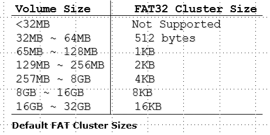

* FAT的结构

  

  * boot sector：卷volume的layout，fs structure，boot code
  * reserve sector：描述分区根目录中的文件和文件夹
  * FAT 1，original FAT，File allocation table 
  * FAT 2,dupliacte
  * root folder，描述root的file和folder
  * other folders and all files：主要就是data部分

* 结构：FAT boot sector

  * 位于每个分区的第一个逻辑扇区，在格式化volume时创建，以2字节扇区标记结束(总是0x55AA)


  * 组件 component：
    * 一个基于x86的CPU跳转指令
    * 原始设备制造商标识(OEM ID)
    * BIOS参数块(BPB)
    * Extented BPB
    * 可执行的启动代码

* 结构：FAT 1 and FAT 2

  * 将所有cluster标识为这样几种状态：unused, cluster in use by a file, bad cluster, last cluster in a file

  * FAT 2用于一致性检查程序

  * FAT是一种链式结构，这样一个个块块就是cluster

    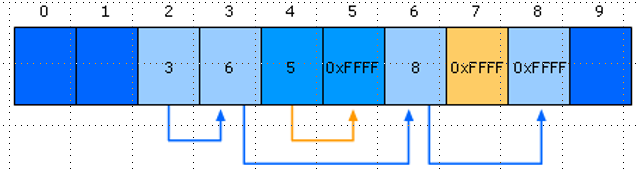

* 结构：FAT root folder

  * FAT Root Folder Structure的entry：name，attribute byte，create time/date，last access date，last modification time/date，first cluster，file size

  * file naming：支持长文件名，main folder entry存8.3 short file name，secondary folder entry存long file name

    

  * 短文件名要保证长度最多就那么长，THEQUI~1FOX，如果重了就THEQUI~2FOX，最后可以搞到T~999999FOX，再conflict就error

* ExFAT 的 file name search
  
* 首先按照hash搜索名称，通过比较哈希值来搜索目录中的每条记录；当找到匹配项时，将对文件名进行比较，以确保在发生冲突时找到了正确的文件
  
* FAT的优点和缺点
  * FAT的优点：
    * 目录和文件的层次树 Hierarchical tree
    * 可变长度的文件
    * 基本文件和目录元数据
  * FAT的缺点：
    * FAT32最多支持2TB磁盘（还好吧？不过FAT是u盘用的多）
    * 定位free chunk需要扫描整个FAT（这个太坑了
    * 容易出现内部和外部碎片，大文件的时候
    * 因为链式结构，读需要大量的随机搜索

##### NTFS

* NTFS Cluster
  * cluster：smallest allocated disk space to hold file，跟上面FAT一样的定义
  
  * 从分区开始按顺序排列逻辑集群号
  
  * 集群从扇区0开始(与FAT不同)
  
* 软盘floppy disk不使用NTFS
  
  * 不同的集群大小取决于卷大小
  
    
  
* NTFS的结构

  

  * NTFS boot sector：卷volume的layout，fs structure，boot code
  * Master File Table，这个是最重要的，包含file和folder的attribute
  * File System Data，Data no contained within MFT
  * Master File Table Copy， a copy of MFT

* 结构：Master File Table，MFT

  * 包含的属性：一个关系型数据库；rows：文件记录；columns：文件属性；每个文件至少包含一个条目entry

  * MFT的metadata file：master file table, master file table, log file, volume file, attribute definitions, root file name index, cluster bitmap .... 太多了不想写了我也没仔细看
  * MFT Zone
    * 作用有防止碎片，默认情况下占有12.5%的volume，按需分配额外的MFT区域

* NTFS File Record Attributes

  * File attribute 的定义：将每个文件和文件夹视为一组文件属性
  * Resident Attributes vs. Nonresident Attributes 常驻属性和非常驻属性
    * 小文件和文件夹完全包含在文件的MFT记录中(通常小于900字节)
  * File attribute 的类型：标准信息（访问模式，时间戳，link cnt），属性列表，文件名，data/index，object ID

* NTFS File naming

  * 如何生成简短的文件名：删掉不支持的字符（空格等），删掉多余的间隔符（逗号句号什么的），把文件名截断成6个字符，然后加~和数字
  * 这不就是FAT的操作吗

* NTFS Compression（file and folder）

  * NTFS压缩：在NTFS中实现，仅在磁盘中压缩，在将数据移动到内存之前解压
  * 移动和复制文件或文件夹：改变压缩状态，增加系统开销

* NTFS hard link
  * 在不复制原始文件的情况下为硬链接添加目录项
  * 应用程序可以使用任何硬链接修改文件
  * 不能在每个硬链接的基础上为文件提供不同的安全描述符

* NTFS Sparse Files 稀疏文件？？：该文件包含由零组成的大量数据

##### MBR & MOUNT

* Master Boot Record：MBR
  * 我印象中是一个磁盘分区的时候要用到的东西
  
  
  
* 磁盘分区最多可以分四个，第四可以弄成extended partitions，就可以继续加

* Mounting a File System 安装文件系统
  * 读取目标文件系统的superblock，包含关于文件系统的元数据，版本、大小、磁盘上关键结构的位置等
  * 确定安装点 mount point
    * Windows操作系统：选择一个驱动器字母
    * 在Linux上：将新文件系统挂载到特定目录下

* 为什么要“安全地弹出”一个设备?
  * 刷新缓存到该设备的写入
  * 干净地卸载该设备上的文件系统

------

#### 第十五讲 File System Flash FS

* xv6中的Transaction Semantics 

  * begin_trans, log_write, commit_trans, recovery

* 事务提交到磁盘的完整步骤

  * 为syscall开启一个transaction -> 把transaction标记为done -> 等待正在进行的syscall stop/return -> 写描述符对于要写的block s，写log -> 把每个块的内容从cache写到log上 -> 等待log写完 -> 添加commit记录 -> （可选）把块的内容写到home disk

* NV-RAM 中存在的一些问题

  * NV-RAM是被当disk用的，cpu的cache被视为memory，crash会丢失还没有write back的cache内容；层次结构已经发生变化了
  
* CPU拥有cache flush 到 memory的指令
  
    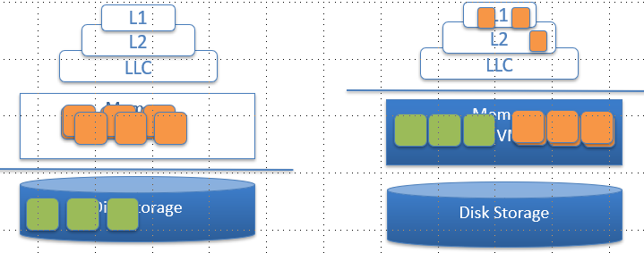


##### Intro to flash file system

* 定义：flash file system

  * Flash文件系统是为在闪存设备上存储文件而设计的；传统的文件系统不能在flash文件系统上使用吗

* 闪存盘和普通磁盘的区别
  * flash disk organization：A chip (e.g. 1GB) => blocks (e.g. 512KB) =>    pages (e.g. 4KB) => cells（有点像体系结构那个）

    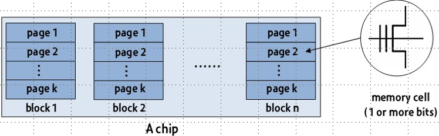

  * flash cell：是一个浮动栅晶体管，分为SLC和MLC
  
* 浮栅上的电子数决定了阈值电压V，阈值电压表示逻辑位值(0或1)
  
* SLC和MLC flash的区别：SLC一个cell存一个bit，性能好，耐久，容量小；MLC一个cell存两个bit，性能差，不耐久，容量大
  
* 闪存盘的特点

  * 不对称的读写，以及擦除erase特性
    * 读/写的unit是page，8-16KB
    * erase的unit的block，4-8MB
  * 物理限制，每次write都要erase一块block，erase-before-write的限制，以及每个block可以被erase的次数应该是有限的
  * 随机存取 random access：优化磁盘文件系统，尽可能避免磁盘查找；Flash设备没有机械盘那个寻道时间
  * wear leaving，当一个块被反复erase时，闪存设备就会磨损；所以写的block要设计的比较均匀
  * Heterogeneous cells：指MLC和SLC两种cell

* 用flash进行file storage 需要注意什么
  * naive的操作，直接1:1映射，适用于read-only，没有wear levelling，容易写穿block，不是很安全（在电源损耗方面）
  * Flash Translation Layer (FTL)，增加了一层manager抽象，适用于可写的file system，磨损比较平整，But, one journalling FS on top of the other

* 实例学习，真实的flash file system，flexFS

  * 目标：高性能，高容量，高耐久（什么都要
  * 方法：flexiable cell programming，SLC和MLC平衡着用，各取其长
    * MLC通过将数据同时写入LSB和MSB位，使用单元格的所有四个值
    * SLC通过将数据写入LSB位(或MSB位)，只使用单元格的两个值
  * 具体操作：利用flexible cell programming，提供高性能的SLC和高容量的MLC，提供一种处理MLC磨损特性差的机制

* flexFS的架构分析

  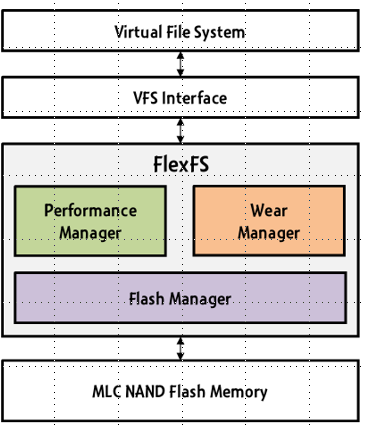

  * flash manager：管理不同的cell
  * performance manager：利用I/O特性，实现高性能、高容量
  * wear manager：保证合理的使用寿命，均匀分布erase

* 架构：flash manager

  * 有三种类型的block：SLC, MLC, free

    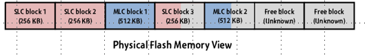

* 架构：performance manager

  * 关键技术：hot-and-cold，把经常读写的东西放在耐久性更好的SLC中

    * dynamic allocation, background migration, locality-aware data management

      

  * migration 的过程通常是放在background执行的，为了防止一整块出现IO request的response time delay，做一个切片

    

  * dynamic allocation的算法
    * 有一个参数 α
    
      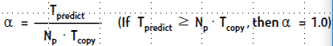
    
    * α 越大表示性能越好，迁移时间越短，SLC的页数少，写时间长，可以往SLC多放一点内容
    
    * copy is the time required to copy a single page from SLC to MLC
    
    * Np is the number of pages in SLC
    
    * Tpredict is the idle time of next time window predicted

* 架构：wear manager

  * wearing rate跟α的值是直接相关的，α比较大的话，涉及到的block数也会比较多
  * 尽量保证当前的wearing rate和expect rate相同（虽然不知道为什么要这样做），如果当前rate过低可以适当上调α，rate过高可以降低一点α

* 架构结论：提出了一种新的MLC NAND闪存文件系统，利用灵活的单元编程实现SLC性能和MLC容量，同时确保合理的wearing/lifetime

* 另一个可以的架构：SLC/MLC hybrid storage

  

  * 由单片SLC芯片和多片MLC芯片组成
  * 使用SLC芯片作为MLC芯片的写缓冲区
    * 将经常访问的小数据重定向到SLC芯片
    * 将大量数据重定向到MLC芯片

##### Log-based File Systems，LFS

* 背景：

  * 计算机硬件一直在发展，RAM变得又便宜又大，但随机存取还是很慢
  * 这让我们希望改变磁盘的使用方式，把更多的数据缓存的放在RAM里，就可以做更少的磁盘读取
  * 可以做一个针对顺序写操作进行优化的文件系统，LFS

* LFS 概述

  * key idea：buffer内存中的所有写操作(包括元数据)，将这些segment按顺序写入磁盘，将磁盘视为循环缓冲区，陈旧的数据不会被覆盖（而是替换）

  * 优点：所有的写操作都是大的、连续的

  * 问题：如何在这种设计中管理元数据和维护结构?

    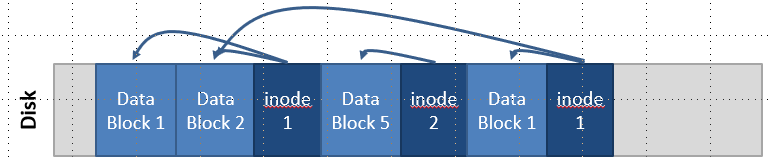

* LFS 具体一些问题的解决

  * buffering write，每一个inode指向自己文件中所包含的block

  * 如何找到inode：甚至要找的inode还可能有很多个副本

    * 解决方法，增加一个inode map的间接影射

  * inode映射分散在整个log中，怎么找到最新的inode map呢

    * 解决方法，加一个checkpoint模块指向最新的inode map，CR固定，总是cache在内存中，定期写入磁盘，例如30秒之类的

* LFS 读取文件实例分析

  ```
  1. Look up inode 1 in the checkpoint region
  	inode map containing inode 1 is in sector X
  2. Read the inode map at sector X
  	inode 1 is in sector Y
  3. Read inode 1
  	File data is in sectors A, B, C, etc.
  ```

* LFS的directory

  * LFS中的目录和普通文件存的方法也没什么不一样，由inode指向
  * 目录包含 name 到 inode 的一个 map

* LFS 垃圾回收

  * 每一个cluster都会有一个summary block（跟checkpoint好像不是一个东西），这个块中包含 block-inode的一个反向映射
  * garbage collector就读取summary block中的信息，查找过期的块

* LFS failure recovery
  * 主要还是依赖checkpoint
  * 整个恢复过程貌似很快，这里没有fsck（这应该是ext2，xv6里有的东西）
  * 恢复最后一个checkpoint，并查看在checkpoint之后可以恢复多少数据，可能会丢掉一部分

* LFS 总结
  * 这是一个很奇怪的设计，跟传统的文件系统结构都不太一样，不能很好地映射目录层次的关系，不是很清晰；但现在LFS被广泛接受了
  * 回顾一下SSD磁盘对file system的要求，要实现wear leveling，写最好分散一点；要定期进行垃圾收集，防止写放大；LFS看起来是SSD的理想文件系统
  * write amplification 和 write absorbtion
    * write absorbtion 是 ext3的批处理特性
    * write amplification体系结构里提过，写入放大（WA）是闪存和固态硬盘之间相关联的一个属性，因为闪存必须先删除才能改写，在执行这些操作的时候，移动（或重写）用户数 据和元数据(metadata)不止一次。这些多次的操作，不但增加了写入数据量，减少了SSD的使用寿命，而且还吃光了闪存的带宽（间接地影响了随机写 入性能）

* 新型的文件系统特性：copy-on-write
  * 现代文件系统吸收了LFS的思想，实现了copy-on-write
  * 更新后的数据被写入磁盘上的空空间，而不是覆盖原始数据，防止数据损坏，提高顺序写性能
  * 由LFS开创，现在用于ZFS和btrfs；btrfs可能是Linux中的下一个默认文件系统
  * 另外，默认情况下，LFS保存数据的旧副本，旧版本的文件可能有用，例如:意外删除文件

------

#### 第十六讲 File System GFS

##### Intro to GFS

- Flash的特点：读写不对称；读可以随便读，写最小是一个block而且要擦除原先的内容；所以要做一些load balance，加一层抽象做映射，减少flash的写操作数量

- GFS是基于任何人都可以买到的便宜结点来做的 (commodity)；上层有很多google自己的应用，比如google search，big table等

- GFS需要满足的特性：

  - 性能好，可扩展/可伸缩/scalability，可靠性，availability
  - failure比之前的分布式文件系统更加normal
  - 文件通常会比较大，google做search存的文件类型大多都是网页 (做index/存图片)
  - 文件的操作更多是append而不是overwrite
  - 做一个co-design，去掉文件系统中一些不必要的东西

- GFS的设计假设 design assumption

  - 硬件很容易坏掉；文件的容量都很大
  - 两种类型的读操作：large streaming reads, small random reads，大型流读取，小型随机读取
  - 一种类型的写操作：large sequential writes (大型顺序写入，但是有很高的并发度，因此更重要的是bandwidth)
  - 保证来自多个client的并发写中的原子性
  - 高持续带宽比低延迟更有价值

- 典型的workload类型

  - 读操作：large streaming reads, small random reads
    - 大型流读取通常要读1MB或更多，可能还是连续区域
    - 小的随机读取通常只是在任意偏移量上的几个KBs
  - 写操作：sequential writes，主要是append
    - 文件一旦写好，就很少再修改了
    - 在任意偏移量上的小的写并不是很高效的操作
  - 多个client(例如~100)并发地写一个文件，append操作
    - 例如，生产者-消费者队列，多路合并

- GFS 的 interface

  - 常见API：不是POSIX兼容的，create, delete, open, close, read, write
  - 特殊API：
    - snapshot 很快的构建文件/目录的tree，操作很快因为数据根本不改
    - record append 允许多个client同时向一个文件进行写操作

- 架构：design architecture

  - **组件：GFS client，GFS master，GFS chunkserver**

    

  - GFS client, GFS master（一个，元数据）, GFS chunkserver（多个，数据）
  - chunkserver的size是fix的（对比于file），每个chunkserver都有一个64-bit的handle/类似于id
  - master存有file到chunk的映射，chunk的位置
  - **Important principle：**
    - **data flow和control flow分开，分别和master/chunkserver交互**；client直接与chunkserver交互所有文件操作，意味着可以通过基于网络拓扑的昂贵数据流调度来提高性能
    - **chunkserver和client都不会cache数据，因为数据太大了**；工作集通常太大而无法缓存，chunkserver可以使用Linux的缓存

- Single Master node

  - client不通过master进行读写，master将相关的chunkserver位置信息传递给client；client临时缓存chunkserver数据并直接访问chunkserver

  - master中只存着metadata，大概只是做一个分发
  - 有shadow master做容错 / 类似fat

- Metadata on Master

  - 三种meta：chunk namespace, map file - chunk, location of chunk replica
  - Master通过每个块的心跳消息监视chunkserver是不是还活着
  - GFS中没有inode，也没有symbolic link 和 hard link，每个文件和目录都表示为查找表中的一个节点，将路径名映射到元数据，使用前缀压缩有效地存储
    - `/foo/bar`就是文件名，所以删目录/改目录名很慢，但google本身就没这种操作

- The operation log

  - operation log是用来记录metadata的变化的（元数据是persistent存储的），要保证order以便于做恢复
  - master的恢复操作时通过operating log来做的
    - 为了最小化启动时间，主节点定期检查日志
    - 检查点以b树形式表示，可以直接映射到内存中，但是存储在dis中

- Chunkserver node

  - 通过心跳消息与master对话
  - **chunkserver对它自己的磁盘上有什么块或没有什么块拥有最终决定权——而不是master**

- Chunk size：chunk size是fix的，64 MB

  - 缺点：内部碎片造成空间浪费；小文件很少，大文件很多，所以浪费不算太过分（没看懂）；GFS的每个数据要存三备份；小文件由几个块组成，然后这些块从并发客户机获得大量流量3 ， 
  - 优点：client和master通信次数会变少；减少master上存储的metadata数量；由于客户机很可能对给定块执行许多操作，因此保持到chunkserver的持久TCP连接可以减少网络开销
  - chunk和master之间会有heartbeat

- Single master 采用这种设计的原因是什么？

  - 可以在master上有global knowledge，因为就一个
  - master不会成为瓶颈，client不会在master这里做读写操作，只是问chunk的location
  - master崩了以后，client会很快发现，会启动新的master，然后做一个新的DNS
    - 使用操作log和checkpoint，还可以在多台机器上复制主状态，以保证可靠；如果主进程失败，GFS可以在这些副本中的任何一个启动一个新的主进程，并相应地修改DNS别名
  - master和shadow之间的一系列问题
    - 一致性的问题？shadow master其实一直都可以提供读文件的能力，几乎是同步的
    - 可以先读shadow，写稍微等一会，等到master恢复
    - shadow会读master的operation log和checkpoint，master崩了的时候还可以先暂时对外提供master的服务
    - shadow不是master的镜像：它们比primary master慢了几分之一秒
  - 为什么不把shadow直接变成primary呢？
    - 因为有很多shadow，为了一致性还是等primary恢复比较好

- System interactions

  - mutation：几乎都是append的写操作，要写三备份
    - write，append，acts on all of the chunk’s replicas
  - lease：60秒，类似cse的lab 3，有renew和revoke
  - data flow，与control flow 分离
    - 线性push数据以避免瓶颈和高延迟link

- read/write algorithm

  - 如果写操作的时候secondary挂了，选择client重试，而不是primary重试；读操作没事(没看懂)

  ```
  Read algorithm
  1. 应用程序发出读取请求。
  2. GFS客户机从(文件名，byte range)->(文件名，chunk index)转换请求，并将其发送给master。
  3. master响应块chunk和replica位置(即存储副本的chunkserver)。
  4. 客户端选择一个位置并将(chunk handle、byte range)请求发送到该位置。
  5. chunkserver将请求的数据发送到client。
  6. client将数据转发给应用程序。
  ```

  ```
  Write algorithm
  1. 应用程序发出写请求。
  2. GFS客户机从(文件名，byte range)->(文件名，chunk index)转换请求，并将其发送给master。
  3. master响应chunk handle和(primary+secondary)复制位置。
  4. client将写数据推送到所有位置。数据存储在chunkserver的内部缓冲区中。
  5. client向primary发送写命令。
  6. primary确定存储在其缓冲区中的数据实例的串行顺序，并将该顺序的实例写入块。
  7. primary向secondary发送串行命令，并告诉它们执行写操作。
  8. seconary对primary有反应。
  9. primary response 返回client。
  
  注意:如果其中一个块服务器上的写操作失败，则通知客户机并重试写操作。
  ```

- master operation，职能范围：

  - replica placement;
  - creation, re-replication, rebalancing; 
  - garbage collection; 
  - stale replica detection

- Fault tolerance 和 diagnose 诊断

  - 快速恢复，Master和chunkserver的设计目的是恢复它们的状态并在几秒钟内启动
  - chunk replica，3-way mirror，可以跨多机器，跨多机架
  - 主要的机制 Master Mechanisms：有一个进程一直在后台扫，观察有DK的chunk
    - 记录对元数据所做的所有更改
    - log定期设置checkpoint
    - 在多台机器上复制log和checkpoint
    - 在多台机器上复制master state
  - 数据完整性 data integrity
    * chunk会分成64 KB的block，还有32 bit的checksum（多一层保护），还有read/write times校验，还可以对很少使用的数据进行background scan

- GFS 总结

  - 这是可以工业应用的强大文件系统，可以跑在商用的硬件上，比较scalable
  - 对于前面提到的指定任务和假设，性能良好
  - GFS的创新
    - 文件系统API是为程式化工作负载而定制的
    - single-master设计，简化协调
    - 元数据适合内存
  - flat namespace
  - 对组件故障有专门的处理：硬盘故障、数据损坏、网络断开等
  - 吞吐量很高：
    - 最小化master干涉操作，chunkserver本身发送和接收客户机数据

##### Intro to NFS

* 如何访问远端的文件

  * ftp，telnet等，都是很明确的访问远程资源的用户定向连接
  * 我们希望这个过程具有更高的透明度，允许用户像访问本地资源一样的访问远程资源
  * NAS，network attached storage

* file service typrs

  * upload/download model	
    * 优点当然是很简单
    * 缺点：浪费，可能用户只需要文件的一小部分；如果用户没有足够的空间把文件下载下来呢；如果其他人修改了要读到的文件呢
  * remote access model
    * 就像是api一样，提供远程的功能接口，比如create, delete, read, write
    * 优点是client可以只得到他们需要的部分东西，server可以管理文件系统的一致性
    * 缺点：可能server和network会出现拥塞，部分data可能会反复不停的被要求访问

* remote file service

  * file service：为client提供文件访问的接口
  * directory service，将文件的textual name（文本名称）映射到文件服务可以使用的内部位置（不是很懂）
  * client module，文件和目录服务的客户端接口
    
    * 如果操作正确，有助于提供访问透明性；例如在VFS层下实现FS
    
      

* Server，stateful和stateless，有状态和无状态
  * stateful，server需要维护client-specific的状态
    * 更短的请求，处理request的时候性能更好
    * 维持cache coherence，因为server掌握了谁在做什么的信息
    * file locking是可能的（这是什么
  * stateless，server并没有client的任何信息
    * 每个request都要识别file和offset
    * server/client 可以崩溃后恢复
    * 不需要open/close
    * 如果在server上删除文件，则会出现问题
    * 不可能做file locing

* 应对repeat access的方法：cache
  
  * data在很多地方都有replica：server buffer cache，client buffer cache，client disk
* 实现cache的若干种策略
  * write-through：将数据缓存在客户机上，但将修改发送到服务器
  * delayed writes，write-behind/write-back：数据在本地缓存(注意一致性——其他数据不会看到更新)，定期(立即)更新远程文件，一次批量写入比多次少量写入更有效
  * read-ahead，prefetch：在需要数据之前请求数据块，在实际需要的时候最小化等待
  * write on close，承认我们有会话语义
  * centralized control，跟踪谁在每个节点上打开和缓存了什么，有状态文件系统，signaling traffic
* NFS，network file system 的设计目标
  * 任何机器都可以是client或server
  * 必须支持diskless工作站
  * 必须支持异构系统，因为会有不同的HW, OS，底层文件系统
  * 访问透明性
  * 从failure中恢复：无状态，UDP，客户端重试
  * 高性能，使用cache和prefetch

* NFS一些问题的解决
  * mount，Request access to exported directory tree
  * access，Access files and directories (read, mkdir, …)

* NFS的性能
  * 通常比本地慢一点，也正常吧
  * 通过在client上cache来改进
    * 目标:减少远程操作的数量
    * 缓存:read, readlink, getattr, lookup, readdir
      * Cache file data at client (buffer cache)
      * Cache file attribute information at client
      * Cache pathname bindings for faster lookup
  * server side
    * cache是通过buffer cache“自动”进行的
    * 所有NFS写操作都是直接写到磁盘的，write through

* NFS的问题

  * 文件的一致性
  * NFS假设了时钟是同步的
  * 不能保证能用使用append打开
  * lock不能工作，因为无状态，可以添加单独的锁管理器(有状态的)
  * 没有打开文件的引用计数，就可以删除自己/别人打开的文件
  * 假设有全局UID空间

  * 怎么看起来问题很多的样子....

------

#### 第十七讲 Scalable locking

##### Scalability tutorials

- scalability受限于阿姆达定律，取决于并行和串行的比例是多少

- 一些可能需要有点概念的常数（单位是访问时间）

  - LLC，最末级缓存

    

  

  

- 三种内存模型：共享cache，共享mem，私有mem

  

- fd是有POSIX语义的，第一个打开的fd一定是3

##### Non-Scalable locking are dangerous

- spinlock是non-scalable的，在竞争很激烈的时候表现出的性能就不好

- 具体危险的地方在：当添加更多内核时，会导致性能崩溃；即使是很小的临界区也会导致性能崩溃

- xv6代码分析

  - `xchg`，类似`TestAndSet`，acquire锁之后第一件事是关中断 `pushcli()`；release最后 `popcli()`；放锁后下一个拿锁应该是随机的，但这建立在每个core访问那一块mem的时间都一样 (这个假设不一定成立) 
  - `xadd`，类似`TicketLock`，解决了公平性的问题；在保持cache coherence上开销很大

- Directory-based cache coherence

  

- cache coherence维持的方法

  - 这个在体系结构中讲的更多
  - directory和snooping是常用的两种方式
  - 即使经过了cache coherence的修正，ticket lock的开销还是太大了，每一次更新ticket后，所有想要锁的人都会来问他要新的ticket值，几百几千个cycle就过去了

##### Scalable locking

- while太快了，在while中稍微做一些loop延长时间；通过wait减少等待lock的数量

  - 但这个提议被Linux否决了，没什么实质性的作用

- 问题的核心：大量的程序在等single cache中的`curr_ticket`这个成员

- MCS Lock：这是一个全局变量

  - waiting 只有0和1两个值，next是下一个要锁的，MCS结构体就两个成员

  - release 只有一次写操作，holder 改掉自己 next 的 wait值（从1改成0），程序都 spin 在 wait 这里

  - `fetch_and_store` 的作用是确定前一个是谁，返回他，并让它的 next 指向自己

  - `compare_and_swap`

    ```c++
    int compare_and_swap (int* reg, int oldval, int newval) 
    {
      ATOMIC();
      int old_reg_val = *reg;
      if (old_reg_val == oldval) 
         *reg = newval;
      END_ATOMIC();
      return old_reg_val;
    }
    ```

- 具体实现的一些边界情况

  - lock函数中，predecessor == NULL表示前面没人占着锁，如果 !=NULL就进if去排队
  - unlock函数中，如果还有下一个在等的，就要让拿走锁，改他的is_lock，他就从while loop出来了；如果没有在等了，还要再判断一遍...可能刚刚那个判断又过期了

```c++
mcs_node{
  mcs_node next;
  int is_locked;
}
mcs_lock{
  mcs_node queue;
}
function lock(mcs_lock lock, mcs_node my_node){
  my_node.next = NULL;
  mcs_node predecessor = 
        fetch_and_store(lock.queue, my_node);
  if(predecessor != NULL){
    my_node.is_locked = true;
    predecessor.next = my_node;
    while(my_node.is_locked){};
  }
}
```

```c++
function unlock(mcs_lock lock, mcs_node my_node){
  if(my_node.next == NULL){
    if(compare_and_swap(lock.queue, my_node, NULL){
      return;
    }else{
      while(my_node.next == NULL){};
    }
  }
  my_node.next.is_locked = false;
}
```

* 

------

#### 第十八讲 Synchronization Constructs 

- scalable locking：随着资源增长性能也线性增长
- non-scalable locking的危险性：会有cache coherence
- 上节课讲的两种scalable locking：MCS lock
  - 基本原理：链表，用wait来选择下一个
  - MCS锁比Ticket好的地方：core越多的情况下，吞吐量下降幅度比较小；MCS锁在core少的情况下，因为要新建node，所以开销比ticket大一些

##### Synchronization constructs 同步构造

##### Read-Write Lock 

- Example：OS网站的Calendar
- 互斥锁到读写锁
  - 四个接口：readerStart, readerFinish, writerStart, writerFinish
  - 有shared data，numreader，numwriter 标识读者写者的数量；但实际上writer number只可能是0或者1
  - 不能同时有读写，首先尝试用condition variable来实现
- 读写锁的实现

```
readerStart
	lock(metalock)
	while (numwriter != 0) wait(readcv, metalock)
	numreader++
	unlock(metalock)
	
readerFinish
	lock(metalock)
	numreader--
	if (numreader == 0) broadcast(writecv, metalock)
	unlock(metalock)
```

* 原子指令是锁住cache line，所有CPU拥有这个cache line都会被lock住，直到这条指令完成。这是在体系结构层面的，所以开销很大

- 读写锁存在的问题
  - 需要等待消息(当前#reader)
  - 需要发送消息(下一个阅读器)
  - 消息序列化获取，会占用大量的消息带宽
  - 解决方法：减少等待消息的时间 GOLL，减少消息数量 BR lock
- 经典问题
  - 初始情况 x=0, y=0
  - T1： x=1; if (y==0) print("a");
  - T2： y=1; if (x==0) print("b");
  - 有可能同时输出a和b，因为乱序执行或者write buffer；指令执行后不一定真的写进cache里了，可能还在write buffer里面
  - 怎么避免这种事情：加一条fence()，这条指令是等待直到write buffer刷进cache中，并不会直接催write buffer
  - 和原子指令的联系：原子指令自带fence效果，一定是cache层面顺序执行的

##### RCU Synchronization

- 原则上不想让读者没有任何block和metadata，对写者没有感知，在任何时候都可以直接读
- 由体系结构决定，8 bytes以下的读写都是原子的，所以对指针的修改是原子的
- 增加写者的cost，每次写的时候都copy一份，read-copy-update；但这样就会增加很多旧的资源（每次写都会有旧资源）
- 什么时候删除旧的资源：换完pointer以后，标识所有reader，当他们都结束以后就可以删了；（naive的实现方法）

##### Lock-free Synchronization

* 使用无锁的“乐观”同步，不受约束地执行临界区，并在最后检查是不是只剩自己一个（？？？）

------

#### 第十九讲 Bug survey

- Review：Read-Write Lock
  - 实现中存在的问题：writer被饿死的概率会比较大
  - 优化，当读者没有的时候再唤醒写者

##### Concurrency Bug Characteristics

- LOC： line of code
- 这个survey探讨了105个真实的并行错误，来自4个大型开源企业项目中
  - bug pattern
  - manifestation conditon
  - diagnosing strategy
  - fixing methods
- Non-Deadlock Bug Pattern
  - atomicity violation，违背了原子性：before-or-after，有的操作一定要用lock保护
  - order violation，违背了执行顺序：执行有严格的先后顺序，malloc struct初始化一般是memset成0
- 如何触发bug？这是为了能够让bug可以被复现出来，思考这样几个问题
  - 要使用多少个thread？
  - 要使用多少个变量会参与进来？
  - 要访问多少次变量？
  - 统计结果，66%的bug只包含一个变量，Multi-Variable Concurrency Bug不是很多
  - 统计结果，触发bug大概3次访存左右就够了
  - 统计结果，96%的bug只有两个thread参与就够了
- other finding
  - 70%的concurrency bug导致程序crash或者hang
  - 重现bug是critical的，不然没法debug
  - 程序员缺少debug工具，或者是可以直接发现代码bug的工具
  - 60%的patch（补丁）都包含了bug，太惨了
- summary
  - Bug检测需要查看order-violation Bug和multi-variable concurrency  Bug
  - 测试可以针对更现实的交叉覆盖目标 interleaving coverage
  - 修复并发性bug并不简单，也不容易纠正
  - 需要来自自动化工具的支持

##### Bugs in Exception Handler

- 不是很大的bug，但因为handler处理的不好，问题变得更大了
- other finding
  - 触发一个bug大概三个node够用了
  - failure大多数可以通过unit test触发，大多数可以看system log看出来的
  - 如果有各failure并不是每次发生，但会发生，就要认为它是会发生的

##### OS Bugs

- belief set：MUST set，MAY set
  - 常见错误一：NULL pointers
  - 常见错误二：copy-paste error

* general rules
  * 不调用禁用interrupt或者禁止spin lock的blocking function
  * 检查NULL结果
  * 不分配大的堆栈变量
  * 不重用已分配的内存
  * 在内核模式下使用用户指针之前，请检查它们
  * 记得释放锁

* 在 JOS 中没有说明的规则
  * kernel mode禁用interrupt
  * 只有env 1可以访问磁盘
  * 所有寄存器在上下文切换时都会被save/restore
  * 应用程序代码永远不会用CPL 0执行
  * 不要分配已经分配的物理页面
  * 要将错误消息传播给用户应用程序(例如，资源不足)
  * 派生程序用的时候要应该打开文件描述符0、1和2
  * 用户指针用在kernel之前，要通过一次TRUP

------

#### 第二十讲 Lock Race & Dead Lock

* Review : Bug survey
  - order-violation bug, multi-variable concurrency bug
  - Fancy way of finding bug 
    - error handlers
    - C-P pattern miner, copy-paste
    - iComment
    - Invariable in the kernel
* Checking function pointers
  - current_task和kernel stack是共享一个4K的页
  - 内核中的函数指针总量大概4000个，大概4个页就能存完 (32位)
  - OSck，从根目录开始出发遍历所有数据结构，run queue记录了所有runnable的task，是给scheduler看的
  - 如果有进程在run queue，但不在task structure里 => 可以跑，看没办法被ps发现 (黑客攻击)
    - ps aux，展示所有活跃的进程
  - FSck，对文件系统做一遍扫描，处理一下refcnt等

##### Data race 

- data race的定义：
  - 针对一个共享变量，同时两个或两个以上的操作
  - 至少有一个是写操作
  - 线程没有使用显示的机制来阻止访问的同时进行
- data race detector：主要有两种策略
  - Happens-before based
  - Lockset based
- data race并不总是会导致bug：比如不那么care数字的精确值的时候 (淘宝商品的浏览量)
- 其他上课讲的零零碎碎
  - 单核的情况会有data race吗？会的哦，只要multi thread就行了
  - event-driven 和 multithread
  - cli 和 sti 都在关中断
  - exception handler尽量不要拿锁

##### happens-before based

- 两种情况：sequential thread 和 different thread
  - different thread 通过 lock和join 等sycn方法来判断在不同thread上的先后关系
  - happen before具有传递性
- Happy-before情况下，data race 的定义
  - 针对相同内存位置，同时两个或两个以上的操作
  - 至少有一个是写操作
  - 这两件事与另一件事都没有happen-before的关系
- Happy-before策略的评价
  - 优点：被它找到的data race一定是真的
  - 缺点：
    - 实现比较困难，开销太大了：可以标记一下部分变量不做happen before，只对shared 的变量做，相当于剪枝，thread_local的变量就不用在意了
    - 有时候会错过一些data race，并不一定能找出全部

##### Lockset based

* lockset-based情况下，data race 的定义
  * 针对相同内存位置，同时两个或两个以上的操作
  * 至少有一个是写操作
  * 没有锁可以保护对相同数据的所有访问

- lockset的算法

  - 记录哪些lock保护着哪些变量，这东西出自eraser那篇论文

    
  
    
    
    
  
- lockset 方法的 challenge：
  - 问题一：初始化 (因为第一次共享变量初始化大概是没有锁的，memset)，那第一次判断就凉凉
  - 问题二：read-only shared variable (有些变量就是只写一次的，static const，其实后面就不会有问题了，没拿着锁也没事
  - 问题三：read-write lock (读写锁，有时候被读锁保护，有时候被写锁保护，但在算法算两个不同的锁，交一下就warning)

* 解决问题一和二
  * 延迟refinement的判断，先等初始化以后再说，初始化那下读不判断
    * 但没有很简单的办法知道什么时候算初始化完成了
    * 启发式的方法：当第一次被第二个线程访问的时候
  * 多添加几种状态 virgin， exclusive，shared，shared-modified，等最后到了shared-modified了就可以随便用定义式判断data race了

* 解决问题三，算法改良，考虑进读写锁

  ```
  1.Let locks_held(t) and write_locks_held(t) be the set of locks held in any mode and write mode by thread t
  2.For each v, initialize Cr(v) and Cw(v) to the set of all locks
  3.On each read to v by thread t, 
    set Cr(v):= Cr(v) ∩ locks_held(t)
    if Cr(v)={ }, then issue a warning
  4.On each write to v by thread t, 
    set Cw(v):= Cw(v) ∩ write_locks_held(t)
    if Cw(v)={ }, then issue a warning
  ```

* lockset策略的评价
  * 优点：更有效的方法检测数据竞争，预测尚未显示的数据竞争
  * 缺点：可能多报，报出不是race的地方；限制了lock的同步方法

##### Deadlock

* deadlock发生的条件
  * 锁是独占锁；一个线程拿到锁了以后其他线程只能等；没有抢占
  * 这种情况下出现循环等待

* 如何处理deadlock
  * pessimistic 的方法，避免死锁的发生，维持等待没有抢占
  * optimistic 的方法，等死锁发生了再检测恢复，打破不能抢占的规矩
  * 这一部分的内容其实CSE讲的更详细，这里ppt我也没怎么细看，之后二刷的时候去看CSE吧

* Livelock
  * 类似于死锁，process的状态之间不断地发生变化，但其实啥也没干成


* Dimmunix - Teaser
  * 通常是很难处理死锁的；dimmunix是一个用于开发死锁免疫的工具，当死锁的症状第一次出现的时候，Dimmunix自动捕获它的signature，然后避免输入相同的pattern

------

#### 第二十一讲 Introduction to Virtualization

* 背景：
  - 处理器，内存，磁盘，网络的性能都在上升；处理器大概20%每年，内存/磁盘大概60%一年，存储的增长比不过数据的增长
  - 利用率通常都低于20%；比如在黑五用的很多但平时不太用的
  - 机器的maintenance很贵，电费，空调，维修
  - virtualization的重要性：简化管理

##### What is virtualization

* isomorphism 同构，在形式上，虚拟化涉及到从客户状态到主机状态的同构的构建
* 虚拟化的三个好处：isolation 隔离, Encapsulation 封装, interposition 干涉
  * Isolation，隔离的分类：fault isolation，software isolation，performance isolation
    * DLL-Hell in windows
  * Encapsulation 封装，所有VM状态都可以被捕获到一个文件中，通过对文件进行操作来操作VM
  * interposition，VM中所有的guest操作都要经过monitor，这样monitor就可以做inspect，modify，deny之类的操作
    * 具体一点就是，压缩 Compression，加密 Encryption，profiling 分析，translation 翻译
    * side-channel
* 为什么一定要用虚拟化技术，不用OS？
  - VMM是在hardware interface操作的，硬件接口通常比软件接口更小，定义的更好
  - OS提供的抽象太多了，状态比较多，迁移会比较麻烦，用的software interface
  - hypervisor和microkernel有一些相似性
  - VMM的缺点，semantic gap 语义鸿沟，VMM不知道guest在做什么；OS会知道guest在做什么(software interface)/(process，pipe，thread，file system)等，知道data和metadata，VMM是不知道这些东西的

* spinlock和condition variable (这应该是上课插播的一段复习)
  - spinlock的原理在于关闭中断，一直check某个变量，在变量产生变化后结束spin，整个过程应该是比较简短的，大概几个cycle吧
  - VMM没有办法真正的关掉中断，(中断是物理层面的)，物理中断会由hypervisor接管，然后可能被schedule掉
  - 虚拟机(xen)调度的时间片 30ms，有点大，这对spinlock的打击是很大的
  - 提高性能的方式是减掉一层抽象；hypervisor观察一下猜测一下VMM是不是正在spinlock中，要让底层知道一点信息
* virtualization benefit
  - server consolidation，提高资源利用率 (整合服务器)
  - mobility: load balance 
  - enhance security：可以把一些安全的虚拟机放在防火墙的保护之后
  - trusted computing，可信计算，把可能有问题的放在VM里面跑

##### How to virtualization

* 如何做到虚拟化

  * 在另一个平台上运行现有的软件组件
    * 组件可能是application,OS，平台可能是硬件也可以是软件
  * 保证隔离，组件不能访问其他的数据或环境
  * 保证透明，不能修改组件；相当于组件和平台双向隔离

* architecture & interface

  - ISA：instruction set architecture，硬件软件的接口

  - ABI：application binary interface，提供可访问系统中可用的硬件资源和服务的程序，**ABI提供了进程和机器之间的接口**；**还有张图表示 ABI = system call + user ISA**

  - API：application programming interface，关键元素是标准库(或多个库)，通常在高级语言的源代码级定义

    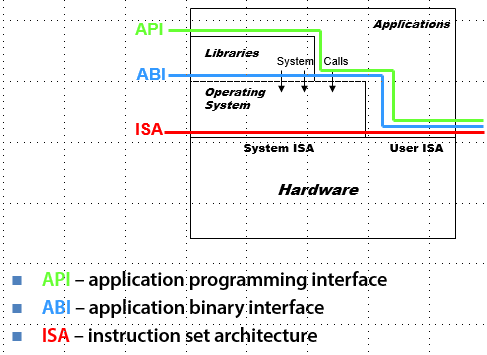

  - WINE的作用是虚拟化ABI，windows emulation，linux里跑windows?? 代码实现的是win32的API，就是windows给application提供的接口
  - VM的作用是虚拟化ISA
  - python是基于API的

* 问答题，at which layer ? 大概是这样吧

  * hello world，API
  * web game，API
  * dota，API
  * office 2013，API
  * window 8，ISA
  * java application，ABI/API
  * python scripts，API

##### Types of hypervisor

* virtualization 的种类
  * process virtualization
  * device virtualization：RAID
  * system virtualization：VMware, Xen

* Design  space 

  - QEMU user mode，process VM，same ISA
  - JVM，process VM, different ISA
  - KVM，Xen，system VM，same ISA
  - Android Studio ARM代码，system VM，different ISA
    
    - Android Studio内嵌了QEMU
    
      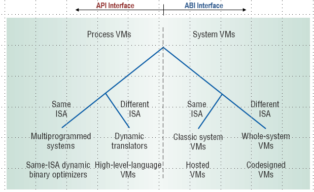

* system VM，same ISA

  - **type 1：Hypervisor (VMM)**，hardware上直接运行VMM，上面是guest OS, eg. Xen, VMware ESX Server

  - **type 2：Hosted Virtual Machines**，hardware上有host OS，再是VMM和guest OS，虽然多了一层抽象，但是更常用，效率更高，用起来更简单，eg. VM workstation

    
  
    
  


* VMM的三种不同的架构：

  - type 1，Xen

  - type 2，Linux KVM， QEMU，但又有点不一样
    - type 2的设计目标，在现有操作系统上像跑应用程序一样跑虚拟机
    - 这样做可以重用现有的device driver，可以获得OS的支持（文件系统和调度层面）,总之就是弄起来方便
    
  - 一个虚拟机就是一个进程，这个进程有多少线程，是分配这个虚拟机的CPU的个数

    

* Host Monitor Architecture

  ```
  备注中很长的好几段话：
  	world switch：虚拟机监视器在内核级运行在它自己的地址空间中。VMM时间与主机共享硬件。当UserApp在主机中运行时，它通过一个World开关切换到VMM。world switch保存主机的所有寄存器、页表等，然后加载VMM的状态。最初，VMM的状态由UserApp设置。这包括寄存器应该是什么以及页表的结构和内容。当VMM自愿放弃CPU时，它会切换回主机。
  	CPU/Memory virtualization：为了提高性能，所有CPU和内存虚拟化都在VMM内部处理。这就是这个架构背后的整个思想。VMM可以访问CPU的所有特权状态，以提供尽可能快的CPU/内存虚拟化。
  	Device IO(network,disk,display,keyboard,timer,USB)：为了利用操作系统抽象和现有设备驱动程序，VMM将所有设备请求转发给用户应用程序。然后UserApp使用系统调用接口访问设备。
  	Interrupts：因为VMM不处理设备，所以它只是将所有中断转发到主机。注意，VMM必须处理CPU生成的异常，比如页面错误和非法指令错误。
  ```

  

* Host Monitor Scheduling

  ```
  备注中描述的调度的过程：从blue调度到green
  1. The CPU scheduler runs the blue UserApp .
  2. The UserApp switches to its VMM.
  3. The blue guest is run and gets CPU time.
  4. A time interrupt comes in.
  5. The VMM forwards the timer interrupt to the host. The host scheduler runs.
  6. The host scheduler deschedules the blue UserApp and schedules the green UserApp.
  7. The green UserApp switch to its VMM.
  8. The green guest gets CPU Time
  ```

  

* Hosted Architecture Tradeoffs
  * 优点：
    * 可以像应用程序一样安装（不需要磁盘分区，虚拟磁盘是主机文件系统上的一个文件，不需要host-rebooting）
    * 可以像应用程序一样运行，使用主机的调度器
  * 缺点：
    * I/O路径很慢，需要多次world switches
    * 依赖于主机调度，可能不适合密集的VM工作负载

* Hypervisor

  * 特点：small size，以特殊的hardware mode运行，guest OS运行在正常的特权级别

  * 用途：安全，系统管理，容错

    

* 

------

#### 第二十二讲 Virtualization：CPU and Memory

* Review

  * OS的不同架构

    

  * VMM的不同架构

    * type1和type2的区别在于有没有host OS，type 1没有host os
      - Linux KVM和QEMU都是type2
      - Xen是只有一个VMM的，是type1
      - 平时常用的应该是有host OS的那个type
    
  * QEMU是一个用户态的应用程序，对于host OS来说，QEMU就是一个普通的应用程序就是进程，QEMU负责读取vm镜像，按照每条指令的顺序执行；QEMU就像是个解释执行器，python解释我们自己写的脚本，QEMU解释的是二进制解释器
  
    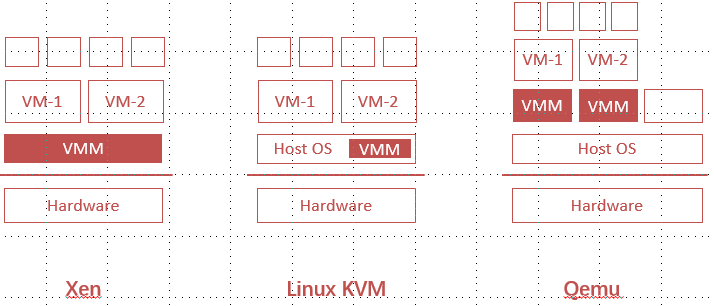
  
  * 虚拟化的三个层次，API，ABI，ISA

##### CPU Virtualization

* Formal Requirement of Virtualization 对虚拟化提出的要求
  * 本质上相同的执行环境(与实际机器相同)
  * VM中程序的性能损失很小
  * VMM完全控制系统资源

* CPU虚拟化的方法：trap & emulate
  * 比如，cli是一条特权指令，不能在user mode运行，但运行change CR3和set IDT两条指令也可以模拟出一样的效果
  * trap，在用户模式下运行特权指令将会trap到VMM
  * emulate，这些指令在VMM中通过函数方法实现；系统状态保存在VMM的内存中，并根据需要进行更改

* 问题：x86的语法并不能完全虚拟化
  * 比如，popf指令在kernel和user mode的意义不同，popf从堆栈中取出一个单词并放入flags寄存器，该寄存器中的一个标志是中断启用标志(IF)；在system kevek，IF标志由popf更新，在user level，IF标志没有更新，CPU悄悄地把IF的更新删除了
  * 有17条不能trap&emulate的指令：SGDT, SIDT, SLDT, SMSW, PUSHF, POPF, LAR,
    LSL, VERR, VERW, POP, PUSH, CALL, JMP, INT n, RET, STR, MOV
* 解决：如何处理这17条指令
  * instruction interpretation，指令解释，用软件的方式去emulate
  * binary translation，二进制翻译，把它们翻译成其他指令
  * para-virtualization，半虚拟化，在源码中替换掉它们
  * new hardware，改变CPU
* 方法一：instruction interpretation
  * 使用内存模拟所有系统状态，例如在通用寄存器中使用数组GPR[8]；没有guest指令直接在硬件上执行
  * 优点：很容易实现，复杂度很低
  * 缺点：太慢
* 方法二：binary translation
  * Translate before execution，把17条指令转换为函数调用，由VMM完成这种操作
  * VMware和QEMU采取了这样的方法，VMware在这方面做得很厉害
  * 需要注意的问题
    * 中断时的PC同步，这种方法可能有假设中断只会发生在基本块边缘(基本块是编译里的一个概念)，但实际上任何指令都可能发生中断
    * 要小心地处理self-modifying code SMC，会自己改自己的代码

* 方法三：para-virtualization
  * 修改OS，让它和VMM合作；把那些特殊的指令更改为对VMM的调用，也称为hypercall，逻辑上有点像trap
  * Xen是这样做的，亚马逊的EC2广泛使用了这种技术

* 方法四：hardware supprot CPU virtualization

  * 新增VMX，root mode和non-root mode

  * VMX root operation：完全特权，用于虚拟机监视器

  * VMX non-root operation：没有完全的特权，用于客户软件

    * 减少guest依赖于ring的SW特权，解决ring aliasing和ring compression的问题

  * 这两种操作形式都支持从0到3的所有四个特权级别

  * CPU virtualization with VT-x，就是关于这个root mode和non-root mode

    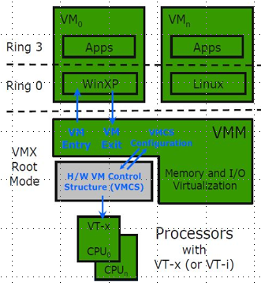

- VM entry and VM exit

  - VM entry：从VMM到guest，进入VMX non-root mode，从VMCS加载guest state，VMLAUNCH用于初始化条目，VMRESUME用于后续条目
  
- VM exit：从guest到VMM，进入VMX root mode，将guest state保存到VMCS，从VMCS中加载VMM state
  
    


* VMCS (Virtual Machine Control Structure)

  * 管理VM entry和VM exit的数据结构
  * VM entry从guest-state area加载处理器状态
  * VM exit将处理器状态保存guest-state area和exit reason area，然后从host-state area加载处理器状态

* VMCS的具体条目

  ```
  Guest-state area，Host-state area，存储processor state的字段
  VM-execution control fields，在VMX non-root操作中控制处理器操作的字段
  VM-exit control fields，控制VM exit的字段
  VM-entry control fields，控制VM entry的字段
  VM-exit information fields: 只读字段，用于接收关于VM exit的信息，这些信息描述VM exit的原因和性质
  ```

* VT-x的新指令
  * VMXON, VMXOFF，开启/关闭VMX root mode
  * VMLAUNCH，启动一个VM guest
  * VMEXIT, VMRESUME，一组指令
  * VMPTRST, VMPTRLD，读写VMCS指针
  * VMREAD, VMWRITE, VMCLEAR，读写VMCS

##### Memory Virtualization

* Memory virtualization 概述

  * VMM构造一个apge table，将guest address映射到host physical address
  * 不同的host physical address用于存储这些VMM的内存位置的数据

* 问题描述

  * 现在有三种页表，GVA**->**GPA**->**HPA  (Guest virtual. Guest physical.
    Host physical)
  * 直接set CR3是没用的，因为VM以为的CR3地址是GPA，实际设置的CR3和HPA
  * 三种解决方案
    * shadow paging，影子页表
    * direct paging (Para-virtualization)，直接映射
    * new hardware，新的硬件支持

* 方法一：shadow paging

  * 核心思想，将两个页表合二为一
    * VMM拦截guest OS并设置虚拟CR3
    * VMM遍历GPT，构造一个对应的shadow page table
    * 在shadow page table中，每个GPA都被转换成HPA
    * 最后，VMM加载shadow page table的HPA
    
  * 如果guest OS修改了页表怎么办
    * real hardware会使用新的页表映射，虚拟机监视器有一个单独的影子页表
    * 目标：当guest OS修改页表时，VMM需要拦截，相应地更新影子页表
    * 解决：
      * 使用PTE中的读/写位将GPT的页面标记为只读
      * 如果guest OS试图修改它们，硬件将触发page fault
      * VMM处理的page fault，更新影子页面表并重启客户端
    
  * 如何有选择地允许/拒绝访问guest page table中kernel-only的页面?
    * 硬件是不知道虚拟的user/kernel位的
    * 解决：
      * 生成两个影子页表，一个用于U，一个用于K
      * 当guest os切换到U模式时，VMM必须调用set_ptp(current, 0)
    
    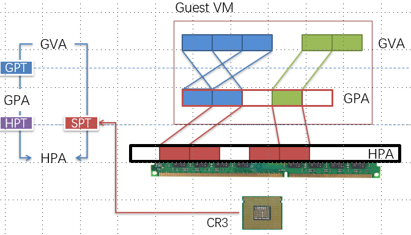
    
    

* 方法二：Direct Paging (Para-virtualization)
  * 修改guest OS的实现
    * 核心在于让guest OS知道了一点它其实不是真正的物理机
    * 不需要GPA，只需要GVA和HPA；Guest OS直接管理它的HPA空间
    * 使用hypercall让VMM更新页表
    * 硬件CR3将指向guest page table
  * VMM将检查所有页表操作（权限检查），guest page table对guest来说是只读的
  * 优点：易于实现，架构更清晰；性能更好，guest可以把trap batch起来
  * 缺点：虚拟机对guest OS不完全透明了；guest现在知道很多信息，比如HPA；可以使用这些信息触发rowhammer攻击

* 方法三：Hardware Supported Memory Virtualization

  * 英特尔EPT(扩展页表)，AMD的NPT(嵌套页表)

    
  

##### Case Study：VMware

* 给VM分配比 实际可用内存 更多的内存
* 当内存耗尽时会发生什么
  * strawman 稻草人，在VMM中使用LRU；回收刚刚分页的VMM页面；最好是random eviction
* VMware ESX，reclaming paging
  * 想法：欺骗OS返回内存到VMM
  * ESX技巧：balloon driver

* ESX，sharing pages across VM
  * 许多虚拟机运行相同的操作系统和程序，比如带有Apache服务器的Linux机器
  * 想法：对相同的物理页面使用一个机器页面
  * 优化：定期扫描以找到相同的机器页面，copy-on-write消除冗余，使用由哈希键控的哈希表，允许基于页面内容快速查找

------

#### 第二十三讲 I/O Virtualization

##### Review

- CPU virtualization的不同实现方法
  - trap & emulation
  - instruction interpretation，指令解释，用软件的方式去emulate
  - binary translation，二进制翻译，把它们翻译成其他指令
  - para-virtualization，半虚拟化，在源码中替换掉它们
  - new hardware，改变CPU
- Memory virtualization的不同实现方法
  - shadow paging，影子页表
  - direct paging (Para-virtualization)，直接映射
  - new hardware，新的硬件支持
- VMCS，VM control structure，新CPU的重要的数据结构
  - root模式运行在host，non-root模式运行在guest
  - 层次结构，guest app，guest kernel，host kernel，中间那一层GK省略掉的体系结构也是存在的（google的Gvison架构）

##### Case Study：KVM & QEMU

- 这两个是用的最多的虚拟化技术

- KVM / QEMU introduction

  - KVM是作为linux的模块来运行的(/dev/KVM)，运行在kernel态，可以利用linux的功能，例如内存管理和进程调度；QEMU是运行在user态的

  - 利用硬件虚拟化，可以trap & emulate所有特权指令，利用EPT在GVA、GPA、HPA之间进行地址转换

  - IO虚拟化，利用QEMU来做更方便，可以用SR-IOV提高性能，可以用Virtio的半虚拟化技术

  - 在KVM中，VM就是一个QEMU process

  - QEMU可以分配内存，占用的内存空间是GPA，对QEMU来说它认为是连续的；GPA guest physical address

    

- KVM的基本控制流

  - 用/dev/kvm操作硬件虚拟化，不同参数的ioctl
  - CREATE_VM, CREATE_VCPU, RUN
  - VM_launch，VM_enter是CPU指令，这里的CREATE_VM是软件定义的宏

- 以host的视角来看QEMU

  - host kernel把QEMU调度为一个常规进程

  - host无法看到guest内部运行的进程

  - 每个虚拟cpu都有一个vcpu线程，iothread是一个特殊的thread

  - 一个专用的iothread运行一个select()事件循环来处理I/O，比如网络包和磁盘I/O完成

    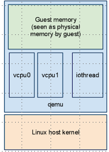

- 当运行`ioctl(KVM_RUN)`之后发生了什么

  - kernel找到VMCS数据结构
  
  - 通过VMENTRY把VMCS加载到处理器
  
- 处理器从root mode切换到non-root mode
  
  - IP被更改为VMCS->IP，开始运行guest VM的代码
  
    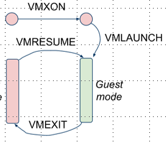
  

* KVM model的架构优势
  * KVM很轻量级，提出以后很快就被linux接受了
  * guest和user space管理程序的接近性
    * 只有一个地址空间开关：guest↔host
    * 更少的rescheduling
  * 大规模Linux内核重用
    * 调度，内存管理，I/O堆栈
    * 电源管理，主机CPU热插拔
  * 大规模的Linux用户代码重用
    * 网络配置；处理虚拟机镜像
    * 日志记录、跟踪、调试

##### I/O Virtualization

* Device Virtualization 的方法

  * emulated，模拟
  * para-virtualized，半虚拟化
  * direct access（passthrough）
  * hardware assisted IO virtualization

* 方法一：Emulated device

  * 用软件的方法来模拟IO；以前的两款popular的网卡，8139网卡，x1000；硬件在软件眼里就是“一组寄存器”，发不同的命令做不同的事情

  * abstraction和virtualization的区别

    如果我还有时间再看到这里，我记得去年的CSE里有一段讲过这个问题

    

  * Emulated device 的具体操作
    * 在类中模拟设备，包括模拟寄存器、MMIO/programmed IO两种方法
    * 转换 convert，形成中间表示
  * case study，xen domain 0 (full-virtualization)
    * 用QEMU进行device emulation
      * 在domain-0中运行的用户级应用程序
      * 在软件中实现NIC(如8139)
      * 每个VM都运行自己的Qemu实例
    * IO请求重定向
      * 客户VM的I/O请求被发送到domain-0，然后domain-0发送给Qemu，最终，Qemu将使用domain-0的NIC驱动程序
    * QEMU接受硬件底层的命令，然后通过syscall告诉host该做什么 (send syscall)
    * Xen的结构比较复杂，有一个domain-0，相当于在做QEMU做的事情
  * 优点：平台稳定性好，允许interposition，不需要特殊的硬件支持（隔离，多路复用有monitor实现）
  * 缺点：可能会很慢，monitor或者host中需要驱动程序

* 方法二：para-virtualization

  * para-virtualization 概述

    * Guest更高抽象级别上把request传递给monitor：monitor call可以发起请求的调用，guest和monitor共享buffer

    * 优点：monitor的实现简单了很多，而且快
    * 缺点：monitor需要提供guest-specfic的驱动程序，存在引导的问题 bootstrapping

  * VirtIO: Unified Para-virtualized I/O 统一虚拟化IO

    * 动机：:Linux至少支持8个虚拟化平台，每个平台都有自己的准虚拟化I/O设计接口

    * VirtIO：能够为半虚拟化设备提供统一的I/O模式，已经被KVM和lguest采用

      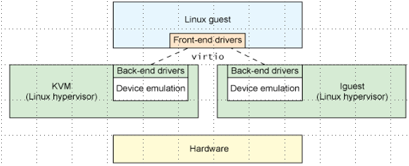

  * KVM 中的virtio：Virtio由一个框架和一组驱动程序组成

    * 一个与管理程序hypervisor无关、与域domain无关、与总线bus无关的协议，用于传输缓冲区
    * 用于将virtio附加到总线(如PCI)上的绑定层
    * 特定于域的客户驱动程序(网络、存储等)
    * 特定于hypervisor的host支持

  * storage stack

    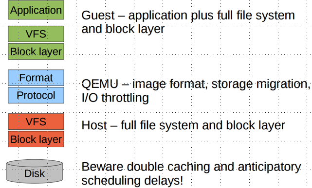

  * Walkthrough，virtio-blk disk read request

    ```
    1. Guest fills in request descriptors
    2. Guest writes to virtio-blk virqueue notify register
    3. QEMU issues I/O request on behalf of guest
    4. QEMU fills in request footer and injects completion interrupt
    5. Guest receives interrupt and executes handler
    6. Guest reads data from buffer
    ```

* 方法三：hardware assisted （这一段我真看不懂

  * Directed I/O
    * **概述：硬件直接允许guest，通过driver，绕过hypervisor，直接访问physical device；好处是绕过了一层抽象，速度更快，但是可能有安全性的问题**
    * 由于仿真层的存在，基于软件的共享给每个I/O增加了开销
      * 这种间接性还有一个额外的影响，即消除了物理设备中可用的硬件加速的使用
    * 定向I/O增加了增强功能，以促进内存转换，并确保保护内存，使设备能够直接DMA到/形成主机内存
      * 绕过VMM的I/O仿真层,提高vm的吞吐量
  * Direct Access Device Virtualization
    * 允许guest OS直接访问底层设备
    * 直接用DMA访问host memory，会拿到其他的guest的东西
    * IO MMU，为了安全性加的模块
      - page table的数量和虚拟机数量是一样的
      - 能不能用EPT代替IO MMU，GPA-HPA（为什么我记得不太一样的）但是可以
    * 优点：快，简化monitor，需要的设备驱动程序很有限
    * 缺点：安全需要硬件支持(IOMMU)；需要多路复用的硬件支持；硬件接口对客户可见；VM的迁移限制；根据定义，很难插入interposition

  * Issues to Address 需要解决的问题

    * I/O地址转换，如何将I/O地址转换为主机物理地址
    * 中断的映射，如何将中断正确路由到guest VM
    * 多路复用设备，如何在多个虚拟机之间对单个硬件设备进行多路复用
    * 最重要的，提供强大的隔离，同时减少hypervisor的介入

  * VT-d，intel针对directed IO开发的虚拟化技术

    * 提供确保改进I/O资源隔离的功能，从而提高可靠性、安全性和可用性。
    * 支持重映射I/O DMA传输和设备生成的中断。
    * 提供灵活性来支持多种使用模型，这些模型可以运行未经修改的、特殊用途的或“虚拟化感知的”客户操作系统

  * VT-d Feature: Interrupt Remapping

    * 由I/O设备生成的中断请求必须由VMM控制
    * 当中断发生时，VMM必须将中断呈现给客户机。这不是通过硬件实现的。
    * VT-d中断映射体系结构通过重新定义中断消息格式来解决这个问题。
    * 中断请求指定请求者id和中断id，并重新映射硬件，将这些请求转换为物理中断

  * Directed IO的缺点

    * Directed IO直接分配的一个问题是它的可伸缩性有限
    * 一个物理设备只能分配给一个VM。例如，双端口NIC允许直接分配到两个vm。(每个VM一个端口)，考虑一下在不久的将来相当可观的服务器
      * 4个物理CPU的，每个CPU 12个核，如果我们使用每个内核一个VM的规则，那么它将需要48个物理端口。

  * SR-IOV，Single Root I/O Virtualization

    * 单根I/O虚拟化(SR-IOV)是一种外围组件互连特殊兴趣组(PCI-SIG)规范。

    * SR-IOV为设备提供了一种标准机制，以宣传它们能够在多个虚拟机之间同时共享。

    * SR-IOV允许将PCI函数划分为许多虚拟接口，以便在虚拟环境中共享PCI Express (PCIe)设备的资源

      

##### Summary

* virtualization techs

  

* 

------

#### 第二十四讲 Serverless

* 写不动了实在写不动了

* Serverless Computing – Function as a Service (FaaS)

* servless 的优点

  * event-driven：stateless，无状态
  * auto-scale：为新请求实例化新的runtime，当请求完成时销毁runtime，实例之间的隔离
  * easier dev-ops：应用程序开发人员关注应用程序逻辑，没有服务器管理
  * fine-grained billing：低成本的短期应用，有限细粒度(例如AWS Lambda: 100ms)

* Serveless computing 对比 microservices

  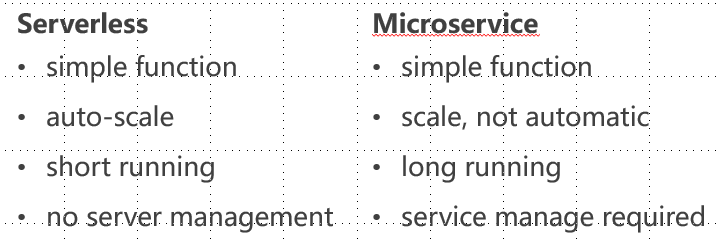

* Service Providers

  

* A real-life example ：dragon quest
  * 减少处理时间：几个小时-> 10秒
  * 降低处理成本：1/20在前提下
  * 减少基础设施和劳动力成本：消除与操作、维护和服务器替换相关的劳动

* 一个任务是交给虚拟机做还是交给容器做好呢？速度和安全/隔离的tradeoff

* Sandbox Technologies：Virutal machine

  * 每个虚拟机都有自己的操作系统；强大的隔离；重量级；极其缓慢的启动

* Sandbox Technologies：Container

  * 所有容器共享OS；弱隔离；重量轻；更快的启动，数百毫秒

* Sandbox Technologies – gVisor

  * 用于容器的用户空间内核，具有更强的隔离性

  * 哨兵处理大多数来自应用程序的系统调用

  * Gofer处理I/O操作

  * 岗哨和岗哨通过9P协议进行通信

    

* Sandbox Technologies – Kata Container

  * 使用轻量级VM保护容器运行时

* Sandbox Technologies – Firecracker

  * microVM使用KVM，平稳快速启动(125ms)，受聘于AWS Lambda
  * 只启动部分的vm功能

* 启动速度和隔离的tradeoff

  

* Challenge : latency

  * fast start-up and shut-down
    * serverless functions are shot-lived. AWS Lambda默认最长执行时间15min （半年前还是5Min），总的来说function的执行时间一般在秒级、毫秒级，甚至更少。
    * 对于传统Long-lived web server（动辄几个月的执行时间）可以忽略的启动和结束时间，在serverless场景中可能是不可接受的。
    * 启动时间直接影响到用户体验，结束时间影响平台灵活性。
  * fast communication
    * request -> platform gateway 
    * platform gateway -> function instance：gate way 和instance并不一定在一台机器/一个datacenter，尤其在burst的情况下，通信压力还是很大的
    * function results -> result receiver
    * function -> function (chained function)：因为function一般只做一些简单的工作，很多application是由一些function相互串联而成的，类似microservice架构。
  * tail latency
    * serverless应用中由于细粒度架构，使得各个环节的tail latency可能极大影响用户体验。
    * tail latency可能使burst场景下满足SLA更困难。

* Challenge : Resource
  * resource footprint
    * 影响同样host上能hold的instance数量
    * 影响启动时间等
  * resource allocation/assignment speed
    * 影响启动时间，同理deallocation速度影响结束时间
    * 为了做到快速，资源可能事先分配好，在idle的时候是其他应用在使用，那么event trigger时需要很快速地把这部分资源使用权从别的应用程序那里拿过来。
  * resource utilization
    * 如果为了速度，过于激进地给Instance分配资源，不给别人用，在idle的时候utilization会非常低，不能接受	
* Challenge : State handling
  * 现实生活中的应用程序通常是有状态的
  * 在链接函数之间传递的中间状态
  * 通过外部存储(例如Amazon S3)：存储还需要快速、自动伸缩和细粒度