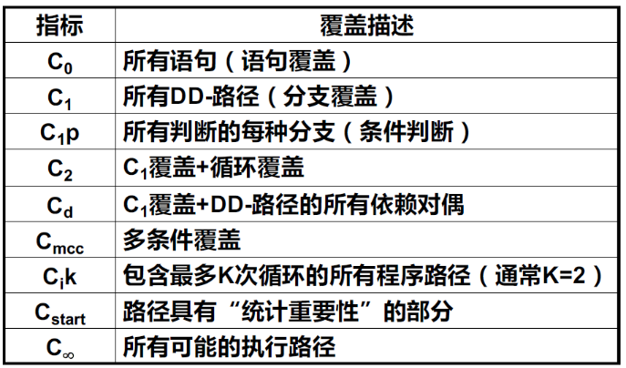

### 软件测试

------

#### Chapter 7，Structure Test

* 白盒测试/结构性测试
  * 方法：路径测试，数据流测试等
  * 目的：提高测试覆盖率；发现程序中的隐患（内存泄漏，误差累计等）

* 黑盒测试和白盒测试的区别
  * 黑盒是根据程序外部特性进行测试，白盒是根据程序内部逻辑结构进行测试
  * 单元测试大都采用白盒，系统测试大都采用黑盒

##### 路径测试

* 程序流图：节点表示语句片段，边表示控制流（有向图）

* DD-路径图：所有程序流图都可以简化为**唯一的**DD-路径来表示
  * 由一个节点组成，入度=0
  * 由一个节点组成，出度=0
  * 由一个节点组成，入度≥2或出度≥2
  * 由一个节点组成，入度=1并且出度=1
  * 长度≥1的最大链（单入单出的最大序列）

* 测试的主要评测方法是覆盖和质量

  * 最常用的覆盖评测是基于需求的测试覆盖和基于代码的测试覆盖

* 测试覆盖指标

  

* 测试覆盖指标

  * 语句覆盖 C0：使程序中每一可执行语句至少执行一次
  * 分支覆盖 C1：使程序中的每个逻辑判断的取真取假分支至少经历一次
  * 条件覆盖 C1p：所有判断的各种分支
  * 多条件覆盖 Cmcc：条件组合覆盖
  * 分支/条件覆盖：使分支中每个条件取到各种可能的值，并使每个分支取到各种可能的结果
  * 路径测试 C∞：覆盖被测试对象中的所有可能路径
  * 循环测试：单循环测试，嵌套循环测试，级联循环测试，不规则循环测试（重新设计）
    * 单循环的跳数（循环N次）：0,1,2，M，N-1

* McCabe圈数

  * 基路径：程序流图中相互独立的一组路径，使得该程序中的所有路径都可以用基路径表示
  * 圈复杂度：定量程序逻辑复杂度，用于计算程序的基本路径数目
  * **McCabe圈数V(G)计算方法：**
    * 计算公式1：V(G)= e-n+2p，e表示控制流图中边的数量，n表示控制流图中节点的数量，p图的连接组件数目（图的组件数是相连节点的最大集合）。因为控制流图都是连通的，所以p为1.
    * 计算公式2：V(G)=R。其中R代表平面被控制流图划分成的区域数。
    * 计算公式3：V(G)=区域数=判定节点数+1
  * 路径的的加法是一条路径后连接另一条路径，乘法是路径的重复，减法只有数学意义而没有实际意义
  * 寻找McCabe路径的方法：图的搜索和遍历，BFS和DFS
  * 一般的，一个单元模块的最大复杂度V(G)<10

* 基于路径的测试讨论

  

##### 数据流测试

* 数据流测试：类似一种路径测试覆盖，但关心数据变量而非程序结构
* 定义-使用（def-use）测试
  * def(v,n)：程序结点n是变量v的定义结点
    * 输入语句，赋值语句，循环控制语句，过程调用语句：向内存地址写入值的语句
  * use(v,n)：程序结点n是变量v的使用结点
    * 输出语句，赋值语句，条件语句，循环控制语句，过程调用语句：从内存地址读取值的语句
  * P-use：谓词使用，当且仅当语句n是谓词语句
  * C-use：计算使用
  * du-path：定义-使用路径，对于变量v，存在定义节点def(v,m)和使用节点use(v,n)，是该路径的起始和终止节点
  * dc-path：定义-清除路径，对于变量v，存在定义节点def(v,m)和使用节点use(v,n)，是该路径的起始和终止节点，且**该路径中没有其他节点是v的定义节点**
* 定义-使用路径测试覆盖指标
  * 全定义准则：每个定义节点，一个使用节点，dc-path
  * 全使用准则：每个定义节点，所有使用节点/所有后续节点，dc-path
  * 全谓词使用/部分计算使用准则：每个定义节点，所有谓词使用，dc-path
  * 全计算使用/部分谓词使用准则：每个定义节点，所有计算使用，dc-path
  * 全定义-使用路径准则：每个定义节点，所有使用节点/所有后续节点，dc-path；包括有一次环路和无环路的路径
* 基于程序片的测试
  * 定义：程序P，变量集合V，语句n，S(V,n)记作P中所有对V的变量值作出贡献的所有语句的集合，包括use和def

##### 测试的效率

* 测试停止的时期：当继续测试没有产生新失效时；当继续测试没有发现新缺陷时

* 用于方法评估的指标：方法M，m个测试用例，s个元素的结构测试指标，n个结构性测试

  * C(M,S) = n/s：方法M关于指标S的覆盖
  * R(M,S) = m/s：方法M关于指标S的冗余
  * NR(M,S) = m/n：方法M关于指标S的净冗余

* 测试覆盖项的趋势

  

* 测试方法作用的趋势

  

* 

------

#### Chapter 8-1，基于生命周期的测试

* 传统的软件生命周期：需求规格设计，概要设计，详细设计，编码，单元测试，集成测试，系统测试 (瀑布式)

  * 单元测试，面向详细设计，完成对软件独立模块的测试
  * 集成测试，面向概要设计，完成软件模块之间的组合测试
  * 系统测试，面向需求分析，完成系统的功能测试

* 瀑布模型的优缺点

  

* 瀑布模型的变体：增量开发模型 (将产品分成若干次产品进行提交)，演化开发模型 (需求分析前提供一个最终产品的原型)，螺旋模型 (每个阶段增加了风险分析和验证)
* 回归测试 (regression test)：对已经完成测试的软件进行修改和增加之后，重新测试软件
* 敏捷开发
  * 核心思想：以人为本，适应变化
  * 个体和交互 胜过 过程和工具
  * 可用的软件 胜过 完备的文档
  * 客户协作 胜过 合同谈判
  * 响应变化 胜过 遵循计划
  * 常见的敏捷开发流程：Scrum敏捷开发，极限编程，
* XP (exterme program) 的一些典型活动：现场客户，计划游戏，系统隐喻，简单设计，代码集体所有，结对变成，测试驱动，小型发布，重构，持续集成，每周40小时工作制，代码规范
  * 系统隐喻是指有共识和共享的术语空间
* 自动回归测试系统的 5 个功能模块：测试用例设计，脚本生成器，业务流管理器(可选)，数据管理器(可选)，测试调度器

------

#### Chapter 8-2 集成测试与系统测试

* 集成测试和系统测试
  * 集成测试 需要了解程序的结构，是结构化的测试方法，有路径覆盖的含义
  * 系统测试 不需要了解程序的结构，是黑盒的测试方法，有功能覆盖的含义
  * 集成测试是由软件开发人员完成的，系统测试往往是需要用户的参与

##### 集成测试

* 集成测试的方法

  * 自顶向下集成，从顶层开始，所有下层程序都以“桩程序”出现
    * 桩程序 stub，模拟被调用程序的代码，一般以表格形式存在
  * 自底向上集成，从底层开始，通过编写“驱动器”完成测试
    * 驱动器，模拟对测试结点的调用驱动
  * 三明治集成：自顶向下和自底向上的组合
  * 大爆炸测试：所有单元一起编译测试

* 基于调用图的集成

  

  * 成对集成：免除桩程序和驱动器的开发
  * 相邻集成：减少测试的数量，以相邻结点为集合，进行测试

* 基于路径的集成

  * 源节点，程序开始或重新开始的语句片段

  * 汇节点，程序执行结束处的语句片段

  * 执行路径，源节点到汇节点的一系列语句，中间没有汇节点

  * 消息，一个单元将控制转移给另一个单元

  * MM-路径，穿插出现模块执行路径和消息的序列

    

  * MM路径，给定一组单元，MM路径是一种有向图，节点表示模块执行路径，边表示消息和单元之间的返回；实线表示消息，虚线表示返回

    

  * DD路径：模块内的程序执行路径；MM路径：模块间的模块执行路径序列

  * MM路径的圈复杂度：V(G) = e - n + 2p，e是边数，n是节点数，参考书本P168图13-13

* 集成测试策略比较

  

##### 系统测试

* 线索 thread

  * 单元级线索，执行执行路径，或DD路径
  * 集成测试线程，MM路径，模块执行和消息交替序列
  * 系统级线索，原则系统功能序列

* 原子系统功能 ASF，一种在系统层可以观察得到的端口输入和输出事件的行动

* 基于模型的线索：有限状态机FSM 是研究系统功能级线索的有效手段

  * FSM：节点=ASF，边=事件和行动

  

* 基于用例的线索
  * 用例的层次：高级用例，基本用例，基本扩展用例
* 基于规格说明系统测试的覆盖率
* 基于事件的线索测试
* 基于端口的线索测试
* 基于风险的测试
* 齐夫定理 Zipf‘s Law：80%的活动发生在20%的空间里

------

#### Chapter 9 Regression Testing 回归测试

