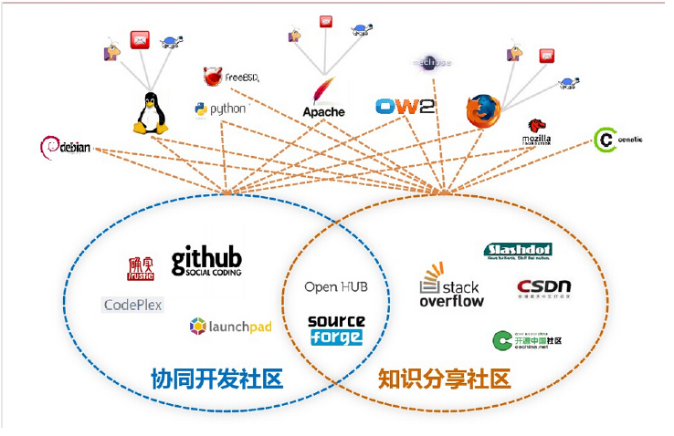

#### 学术写作、规范与伦理

李国强 姚建国 软件学院3101 周二10.00-11.40

---

##### 学术抄袭与剽窃

第五周 2020.10.13

* 什么是抄袭与剽窃，两者的区别？
  * 自己抄自己也是抄袭
* 抄袭：指把比人的作品或语句抄来当做自己的
* 剽窃：指抄袭窃取（别人的著作）

第六周 2020.10.20

* 过度引用：观点过度引用；结构、内容过度引用
* 转引：直接引用中介文献或二次文献给出的关于原始文献的信息
* 不规范引用现象：著而不引；引而不著；崇引；滥引；过度自引
* 开源软件

---

#### 软件开源知识产权与风险

##### 软件开源与硬件开放

* 软件开源与硬件开放已成为IT产业发展主旋律
  * Linux, Android, IBM, 微软云，百度，阿里

* 自主可控和开放创新已成为各国IT产业发展的基石
  * 棱镜门
* 我国国家信息化发展战略需求
  * 中国制造2025，互联网+，云计算与大数据，大众创新万众创新

* “开源开放”对芯片厂商提出新的需求

##### 开源软件概述

* 简单来说，“开源软件”就是源代码开放的软件
* 开源软件促进会OSI（Open Source Initiative）对开源软件定义的十个条款
  * 自由再发布（Free Redistribution）
  * 源代码（Source Code）
  * 派生作品（Derived Works）
  * 作者源代码的完整性（Integrity of The Author’s Source Code）
  * 不能歧视任何个人或团体（No Discrimination Against Persons or Groups）
  * 不能歧视任何用途（No Discrimination Against Fields of Endeavor）
  * 许可证的发布（Distribution of License）
  * 许可证不能只针对某个产品（License Must Not Be Specific to a Product）
  * 许可证不能约束其他软件（License Must Not Restrict Other Software）
  * 许可证必须独立于技术（License Must Be Technology-Neutral）

* 开源软件的意义
  * 对普通用户来说：免费软件
  * 对商业用户来说：减少开发周期，降低开发成本
* 开源软件成功的原因
  * 开源社区的协同模式改变和颠覆了软件业的工作方式，可以创造出高质量的软件产品
  * 商业模式得到了验证
  * 真正释放了软件开发人员的创造力和生产力
  * 国际软件巨头也纷纷加入开源阵营
* 自由软件：自由软件是指用户运行、拷贝、研究、改进软件的自由

* 开源软件的优势
  * 较低的成本
  * 开源带来的可靠性、耐久性和安全性
  * 开放标准和摆脱供应商依赖
  * 开源软件的商业模式：双重授权，硬件捆绑，增值产品，技术支持，广告业务

* 开源软件核心技术：集体智慧
  * 集体智慧是由组成群体的个人贡献出自己的知识、技能、经验,通过个体间的协作、灵感互动、相互启迪等共享机制,产生的优于任何个人的智慧
  * 集体智慧的特征：多样性，独立性，民主性

* 开源社区
  * 社区基础设施：
    * 主页 Home Page，代码库 Code Repository，邮件列表 Mailing List
    * 缺陷追踪系统 Bug Tracking System，Wiki，实时网络聊天系统 IRC（Internet Relay Chat）
  * 项目托管网站：SourceForge，Github，Google Code，Codehaus
  * 知识共享网站：StackOverflow，Slashdot，CSDN，开源中国社区

* 开源产品
  * 语言：
    * Python, Ruby, PHP, Groovy, Perl
  * 开发平台：
    * Harmony, Android, Flex, Openlaszlo, JBoss Seam
    * Equinox, OpenStack, Cloud Foundry, Node.js
  * 框架和库：
    * Spring, Struts, Hibernate, iBATIS, AngularJS
    * SPARK, Dubbo, Lucene, Webkit
  * 服务器软件：
    * Apache HTTP, Tomcat, Jetty, Geronimo, JBoss
    * GlassFish, MySQL, PostgreSQL, Derby
    * FileZilla Server, Redis, MongoDB
  * 开发工具：
    * Eclipse, NetBeans, Apache Ant, Apache Maven, CVS
    * Subversion, GIT, Bugzilla, JUnit, TestNG
  * 桌面应用：
    * GNOME, OpenOffice.org, Emacs, Firefox, Thunderbird
    * GIMP, FreeMind, 7-Zip, RabbitMQ, Quagga
* 系统软件应用现状
  * 操作系统：Ubuntu, Android, Chrome OS
  * 编译器：GCC, Gccgo
  * 数据库：MySQL, PostgrSQL, MonogoDB, Oracle Berkeley DB
  * 文件系统管理：WebShare
  * 网络：Httplib, Androidpn, Google, API
  * 驱动管理：Synergy, OpenCL, libusb
  * 存储管理：FastDFS、SeaFile、Clouddata
  * 视频软件：SMPlayer
  * 聊天软件：Skype, iQQ
  * 浏览器：Chrome, Firefox, WaterFox, Dolphin Mini, Opera
  * 音乐播放器：Muplayer
  * 办公软件：LibreOffice、OpenOffice
* 开源软件面临的挑战
  * 知识产权问题
  * 管理和维护问题

##### 开源软件许可协议

* 典型开源组合LAMP： Linux、Apache、MySQL和Perl/PHP/Pytho
* 开源软件协议
  * GPL（GNU General Public License）：通用公共许可协议
    * 随意复制，随意传播，随意修改
    * 要想使用GPL 保护下的代码，必须把自己的软件也置于GPL 协议之下
    * 文件开头的一串注释
  * BSD（Berkeley Software Distribution）
    * 无任何限制的允许以任何目的二次分发这种软件
    * 必须保留拷贝权的声明和协议里的软件权利放弃条款
  * Apache Licence
    * 授予了用户大量的权利，这些权利可以应用于拷贝权，也可以用于专利权
  * LGPL（LESSER GNU）：次通用公共许可协议
    * LGPL 适用于一些类库，它允许这些类库能够被非GPL或非开源软件引用
    * LGPL 不要求其它程序也必须使用相同的协议才能使用这些代码程序
  * MIT
  * 共同特点：要求保障原作者的知识产权，在延伸的代码中遵守相同的协议

* 开源组织与网站
  * **开源软件促进会，opensource.org/ （OSI）**
  * Apache，apache.org/
  * Sakai基金会，sakaiproject.org/
  * Moodle社区，moodle.org/
  * Mozilla基金会，mozilla.org/
  * Open Solaris，cn.opensolaris.org/
  * Java开源，open-open/
  * PHP开源，php-open/
  * 开源项目开发，sourceforge/

##### 开源软件知识产权风险

* 知识产权问题
  * 软件的源代码、目标代码都享有版权法保护
  * 是否公开源代码取决于软件权利人的选择
  * 开源软件开发过程中的版权归属问题
  * GPL许可证对开源软件商业化的阻碍
  * BSD许可证模式下的开源软件商业化问题
* 知识产权解决策略
  * 充分了解主要开源软件许可证内容，严格遵守其条款规定
  * 谨慎使用开源软件的商标和标识
  * 建立核心软件专利库,为开源软件开发者提供指引
  * 提高开源软件企业知识产权保护意识
  * 适时可考虑建立我国自己的开源软件许可证	

##### 开源软件热点事件

* Artifex起诉Hancom违反GPL
  * Ghostscript 采用了两种许可证，GNU GPL 以及一个付费的商业授权许可证。如果Hancom 不想付费，那么它将需要开源其软件。Hancom 的决定是什么也不做，既
    不开源也不付费

* 开源项目变更开源协议事件
  * Facebook变更许可协议：2017年Apache基金会将“Facebook BSD+专利”加入禁止名单，各大厂商集体抵制“Facebook BSD+专利”，最后Facebook修改为MIT许可协议
  * Mongo DB变更许可协议

---

##### 主题

通过国内外事件的调研分析，总结中美贸易摩擦下开源软件风险

* 开源软件调研分析：
  * 美国禁用的软件：matlab？
* 中美贸易摩擦的事件
  * 禁用美方软件
  * 封禁wechat，tiktok，打压华为
  * ...