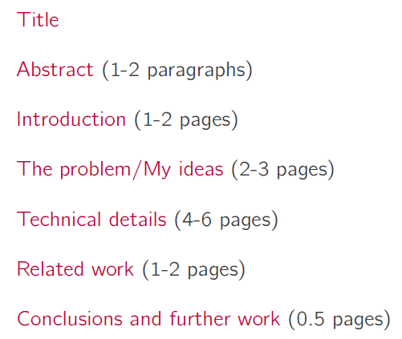

#### 学术写作、规范与伦理

李国强 姚建国 软件学院3101 周二10.00-11.40

---

##### Introduction

第一周 2020.09.15

* 成绩组成：签到 40% + Report（2次）60%
* 李国强 li.g@outlook.com，软件学院 1212，3420-4167
  * Course page: https://basics.sjtu.edu.cn/~liguoqiang/teaching/GS00001/
* Peer review
  * Conference papers, 会议论文
* Chinese characteristics
  * Journal papers, SCI EI, 期刊论文
* CCF，中国计算机学会推荐国际学术会议和期刊目录
  * https://www.ccf.org.cn/Academic_Evaluation/By_category/
  * 软件工程/系统软件/程序设计语言
  * SOSP, OSDI

* 期刊分区
  * 中科院分区：一区~四区
  * JCR分区（SCI公司，25%切开）：Q1~Q4

* 影响因子 Impact factor（IF）
  * c(Y; Y-2, Y-1)，Y-2 Y-1年发表的论文在Y年引用的次数
  * p(Y-2, Y-1)，Y-2 Y-1年发表的论文
  * JCR(C, P) = c(Y; Y-2, Y-1) / p(Y-2, Y-1)
* ESI, Essential Science Indicators
  * 被引用数量超过领域内的前1%

* 交大A类、B类

* Conference Selection
  * 目的是选取最好的paper
  * 领域圈子形成，reviewer不偏向新人
* Journal Selection
  * 选取时没有限制
  * IEEE(2013 8.785) Transactions on Industrial Informatics
  * 计算机九个一区杂志
  * JACM，journal bible，一年6期，一期5篇

---

##### Scientific Writing in CS

第二周 2020.09.22

* Suggestion 1:  Don't wait, Just write
  * Suggested: your idea -> write paper -> do research
* write paper是do research的一部分
* Suggestion 2：Identify your key idea
  * Goal: useful and re-usable idea 有用的并可重用的
  * Ping: one paper -> one clear, sharp idea，一篇论文应该只有一个主题
  * 凝练文章的idea
* Suggestion 3：Tell a story
  * 要不断地讲故事

* Paper Structure

* Title: accurately 准确地, clearly 清晰地, concisely 简洁地
* CGI模型
  * Context：描写问题场景和主题
  * Gap：解释你的特定的问题，现有的工作哪里做的还不够
  * Innovation：包含做了什么新的工作来解决Gap

* Abstract and Introduction
  * 这两者要包含context的内容
  * Introduction往往是abstract的扩写

* The problem/My ideas
  * 使用具体的说明性例子，不需要通解

* Related work
  * Related work建议放到文章结尾，在限制篇幅的情况下可以放在Introduction中
  * 给出实际的对比，可以在研究开始的阶段就做准备，进行对比
* Suggestion 1：Make Sentences and Paragraphs Flow
  * 英语写作前后需要关联
  * begin sentence提供old info，end sentence给出new info

* Suggestion 2：Make Sentences and Paragraphs Coherent 连贯的
  * 一段话应该有一个主要观点，通过一个句子来进行表现

* Suggestion 3：Name your baby
  * 给事物一个独特的命名，并连续的使用它

* English Scientific Writing vs Chinese Scientific Writing
  * Volunteer Policy VS. Employee Policy
  * Welfare VS. Revenue
  * Rare Page Charges VS. All Page Charges
* Chinese Scientific Writing：投稿篇幅限制，注重研究结果而非研究过程，歧视理论贡献，容易被desk rejected

---

##### Scientic Presentation in CS

第三周 2020.09.27（调休）

---

##### Thesis Writing and Review Response

第四周 2020.09.29

* Knowledge of PhD

###### Preparing A Thesis

* Research for a Thesis 论文（Prepare）
  * 批判性的分析，回答一个scientific的问题或假说
  * 收集证据做出解释和判断
  * 仔细设计研究方法

###### Finding Audiences

* 寻找Thesis的观众
* Skimming vs Reading
  * 浏览一般只看摘要，signposting，图表和图表文字说明
  
  * 摘要中提到的结论可以通过图表和标题来呈现

###### Structure of a Thesis

* Structure of a Thesis（仅限于CS和SE）
  * Title
  * Abstract
  * Chapter 1. Introduction
    * background
    * related work both domestic and international 国内外
    * the contribution
    * thesis origination 论文来源
  * Chapter 2. Related Techniques
  * Chapter 3. Main Body I.
  * Chapter 4. Main Body II.
  * Chapter 5. Main Body III.
  * Chapter 6. Conclusion and Future Work

* Basic Requirement 基本要求
  * 叙述前后一致，选择发表材料，标题信息丰富，避免章节孤立

* Signposting 路标
  * Title：不要夸大也不要过谦 overclaim or undersell
  * Abstract：高度总结
  * Introduction：明确问题，motivation，明确研究假设，论文贡献细节，论文章节结构
  * each chapter：每章开头和结尾

* Figures and Tables 图表
  * 图表嵌入文中，通常在最先引用那页的后面一页
  * 图表需编号并连续引用，包括标题，突出重要文字
  * 坐标轴标记，单位，误差条显示数据不确定性
  * 清除冗余数据

###### Order of Writing

* Order of Writing
  * organize, 开始写作前组织有逻辑的论点
  * make, 用图表说明观点
  * main section: introduction 背景 - observation - analysis - conclusion
  * outline, 概述主要元素，提炼章节和副章节
  * begin, 开始写作，以paragraph，sentence，word作为层次

* Alternative Order

###### Response to Reviewers, Ten Suggestions

* 0)  Identify types of Reviewers
* 1)  Provide an Overview
* 2)  Be Polite and Respectful of All Reviewers
* 3)  Accept the Blame
* 4)  Make the Responese Self-Contained
* 5)  Response to Every Point
* 6)  Use Typography to Navigate
* 7)  Begin response with a Direct Answer
* 8)  Do What the Reviewer Asks
* 9)  Be Clear About the Changes
* 10)  Write the Response Twice

