#### 宏观经济学 - 北大光华管理学院

其他：薛兆丰经济学讲义

---

##### 1 导论

* 提到的名词：国民生产总值，经济增长模式，M2，M1，基础货币，CPI，PMI，汇率制度，资本账户

* 提到的经济学家：亚当斯密，凯恩斯，萨缪尔森，弗里德曼，泰勒，索洛，罗默

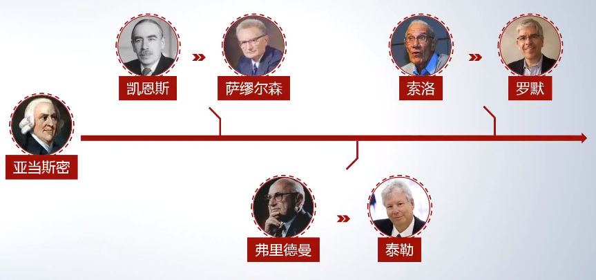

* 探讨的问题：怎样判断宏观经济的形势？长期中经济增长的奥秘在哪里？为什么有经济的短期波动？财政政策、货币政策应该怎样运用？政策的走向应该怎样判断？对外开放会给政策选择带来哪些烦恼？

---

##### 2 国内生产总值

* 国内生产总值简称GDP，这是一个关于产出的指标
  * 另外有价格和就业指标

* 数据起始于1929年经济大萧条（知道经济到底有多差）

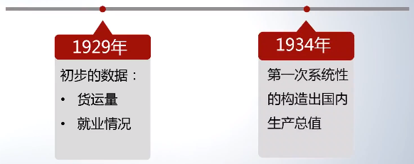

* 定义：国内生产总值是指**一个国家或者地区在给定时间内新增的最终产品和最终服务的总价值**
  * 收集的对象：产品和服务
    * 产品 - 有具体物理形态的产出；服务 - 没有物质形态的产出
  * 最终的产品和服务，不计入中间产品的价值（鸡蛋和茶叶蛋）
  * 区域范围：国内，对地理的限制，对居民的国籍身份没有限定
  * 给定时期的当期产出
    * 二次售出的产品（拍卖行卖张大千的画，买卖二手房，都不算）
  * 市场价值：用货币价格/市场价值进行加总，最终形态（矿泉水）

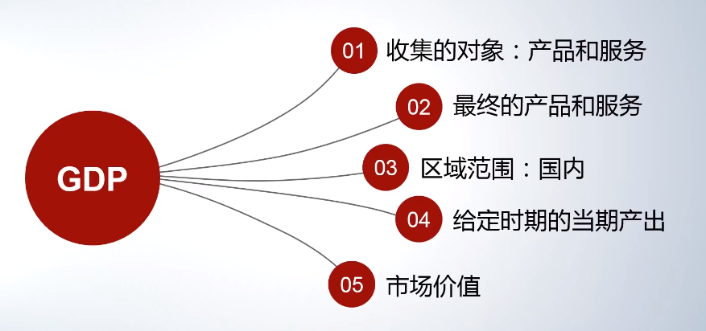

* 能否被纳入中国GDP的衡量指标

---

##### 3 从支出角度看GDP

* 两个看GDP的角度：支出的角度，生产行业的角度
* 从支出角度看GDP：从谁付钱购买的角度来看
  * **GDP是三大需求的总和：最终消费，投资，净出口**（外国人的需求）

* 最终消费
  * 2016年在GDP中占比53.6%，其中居民消费39.4%，政府消费14.3%
  * 消费品是一种可以直接消费来获得满足感的产出，产品和服务都记录在内

* 投资

  * 投资方面的支出，是用于增加或者是替换生产性资本的支出（机器设备）
  * 宏观经济学中的投资不包括金融投资（股票）
    * 股票是投资于现存的生产性资本，不构成GDP中的投资

  * GDP中的投资要形成或者替换现有的生产性资本

* 净出口
  * 进出口 = 中国的出口 - 中国的进口，是来自中国境外的需求的衡量，可以是正的，也可以是负的
* 从生产行业角度看GDP：三大产业划分
  * 第一产业：农业、林业、牧业、渔业
  * 第二产业：采矿业、制造业、电力、热力、燃气及水生产和供应业、建筑业
  * 第三产业：服务业

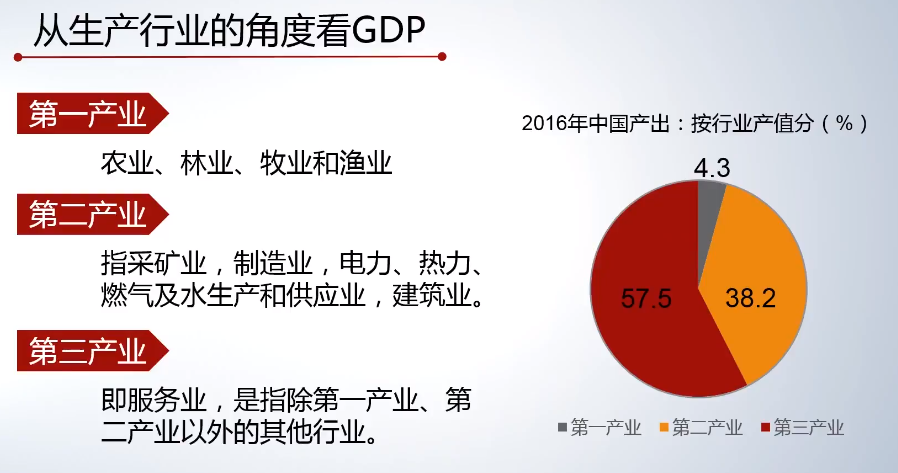

* GDP度量中存在的问题

  * 直观上我们能消费多少东西，取决于我们能生产多少东西
  * GDP用来衡量经济福利是有缺陷的，**GDP只衡量了一国经济福利的一部分**

  * GDP未包括非市场经济活动（义工，志愿者）；如果经济活动没有在市场上形成交易和价格，那么无法统计到GDP
  * 有一部分消解人们破坏性行为的经济活动会计入GDP（环境治理和保护），会夸大真正的产出和经济福利
  * GDP是一个总体的衡量，不考虑产出中的实际分配；无论分配是否均衡，总体的GDP只能反映一个总体的经济发展水平

---

##### 4 价格指数

* 通货膨胀
  * 字面上的意思：流通中的货币的量的上升
  * 经济学定义：**总体物价水平的上升**
    * 总体：单一产品价格的上升通长只是相对价格的变化，不构成通货膨胀
    * 总体物价水平上升，需要构造一个衡量总体价格的指数

* 价格指数构造步骤
  * 基期（年份或月份）

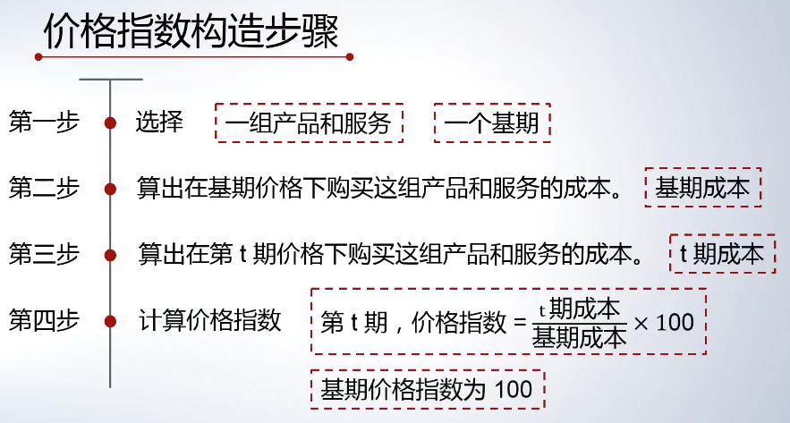

* **三个价格指数：居民消费指数，GDP平减指数，生产者出厂价格指数**
* 居民消费价格指数, Consumer Price index, CPI：包含一般消费者所购买的产品和服务，价格为市场零售价格
  * 包含国内消费品和进口的消费品（新西兰进口的奶酪）
* GDP平减指数，GDP deflator：包含一国生产的所有产品和服务，价格为市场零售价格
  * 包含中国生产的产品和服务（高铁列车，但居民没有买）

* 生产者出厂价格指数，Producer Price Index, PPI：包含一个国家生产的所有产品和服务，价格为出厂价格
  * 衡量在企业的批发环节价格的变动情况
* 总结
  * 价格指数的概念和构造：价格指数包含的产品和服务
  * 用什么价格计算价格指数
* 辨析：居民消费价格指数和GDP平减指数
  * 

---

##### 5 价格指数的运用

* 应用1： GDP平减指数的应用，计算真实的经济产出的增长
  * GDP平减指数衡量的是中国所有产出的产品和服务的价格水平的**变化**
  * 名义GDP：把今年生产的所有产品和服务，在当下价格的总成本或者市场价值称为名义GDP
    * 之所以叫名义GDP是因为这是包含了价格变动的GDP
  * 实际GDP：基期价格下的成本或者市场价值
    * 不包含价格不变的GDP
  * GDP平减指数的用途：帮助我们把名义GDP转化为实际GDP，例如用2018年的实际GDP和2017年的实际GDP相比，可计算出GDP增长率（去掉价格的影响）
    * 日常生活中GDP增长率的数据是来自实际GDP的比较

* 应用2：用价格指数计算通货膨胀率
  * 最常见的通货膨胀率是CPI通货膨胀率

* 应用3：把名义变量的变化通过价格指数转化为实际的变化

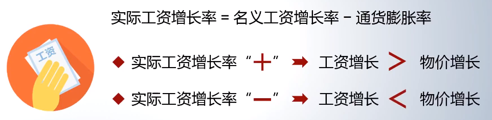

* 通货膨胀有很重要的经济作用和影响

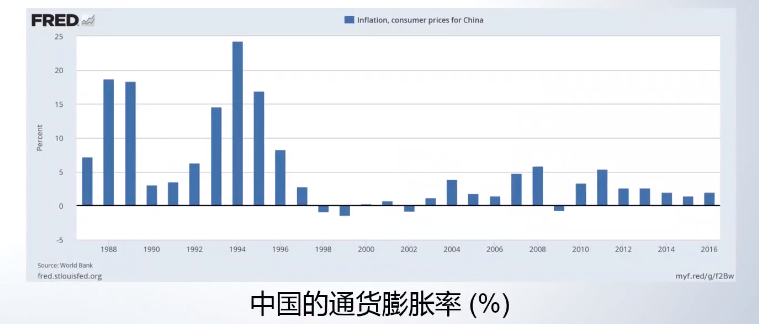

* 通货膨胀的代价

  * 在一个市场经济中，价格传递了重要的信息。如果出现通货膨胀，价格系统里面就加进了很多的噪音（包子涨价，只是包子涨价还是通货膨胀）

  * “鞋底磨损”的成本：为避免通货膨胀带来财富损失，人们要管理现金持有量（一般通货膨胀为正，现金会贬值，存钱会损耗“鞋底”和时间）
  * 财富从债权人转移到债务人，或者从存钱的人转移到借钱的人

---

##### 6 就业

* 2018年国家统计局局长 宁吉喆，“就业是最大的民生”
* 主要内容：就业指标的构造，数据的搜集，城镇调查失业率

* 就业数据的采集
  * 国家统计局抽样调查12万户城镇家庭（城镇人口是指常住人口，包括本地人口和外来人口），这些家庭中每个16周岁以上的人被分为三类：
    * **就业人口：**在上一周有全职工作或者兼职工作（只要工作最少一个小时就是兼职），或者是现在在休假或者暂时离职的人
    * **失业人口：**上一周没有工作，而且最近三个月找过工作的人
    * **非劳动力：**上一周没有就业，而且最近三个月没有找过工作的人（16周岁以上的学生，有劳动能力但不想劳动的人）
  * 中国就业人口5.7亿，失业人口0.3亿，非劳动力4亿
  * 这些数据可以用来评价中国劳动力市场的活跃程度
* 就业指标的构造
  * 劳动年龄人口：16周岁及以上的所有人口
  * 劳动人口：包括有劳动意向的人，即就业人口和失业人口
  * 劳动参与率：衡量16周岁有劳动能力的人中，有多少人愿意参与劳动
  * **失业率：**计算有意愿劳动的人当中，有多少人是没有工作/失业的

---

##### 7 失业的不同种类

* 失业的种类
  * **摩擦性失业：**劳工和雇主的匹配过程中出现的短期失业
    * 原因：劳工的特长、技能和效率有差别；企业的人才需求不同；匹配需要时间
  * **结构性失业：**在经济总体产量正常的情况下存在的长期失业
    * 原因1：劳工的技能和空缺的职位之间出现了长期的不匹配（衰退行业中失去工作的工人，打字员）
    * 原因2：劳工市场的结构性特征，工会、政府和非政府机构对劳工市场的管制、歧视（教育行业，教师资格证）
  * **周期性失业：**在经济衰退期间出现的失业
    * 例：经济比较差时，旅游业开工不足

* 由于存在摩擦性失业，在市场经济中零失业是不现实的
  * 员工寻找更好的工作；企业调整内部的员工

* **自然失业率**，Natural rate of unemployment, NRU
  * "自然"指在现有社会经济制度下，排除萧条和过度繁荣的影响，我们应该观察到的失业率
  * 自然失业率是个概念，我们不知道其准确的数值，其数值可能变化

* 失业率的数据
  * 2018年7月中国的城镇调查失业率为5.1%，表明我国的就业状况比较健康

---

##### 8 历史观察与问题

* 经济增长在历史中的现象和问题
  * 案例：收入增长，人均产出增长

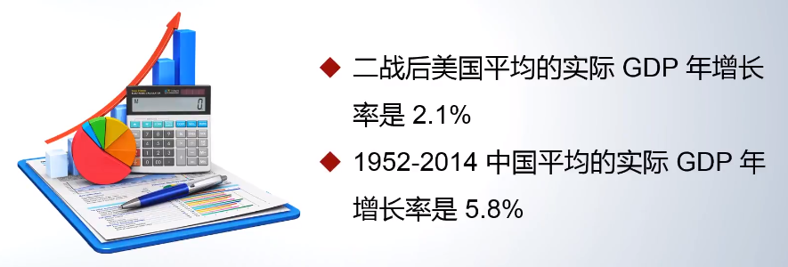

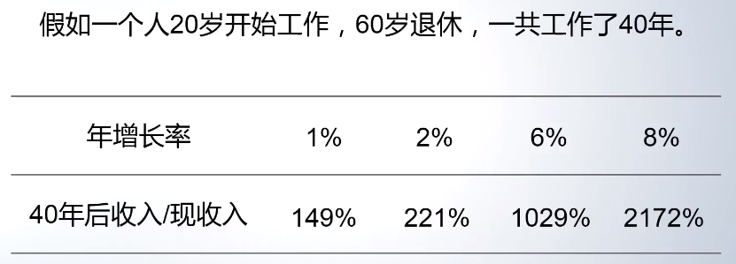

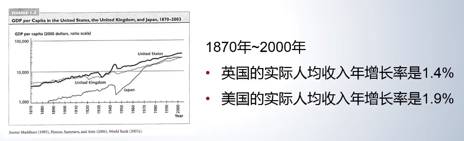

* 世界总人口和产出
  * 1000年-1800年，人均产出没有增长
  * 1800年后，人均产出有很大提高（现代意义上的经济增长）

* 增长的差异

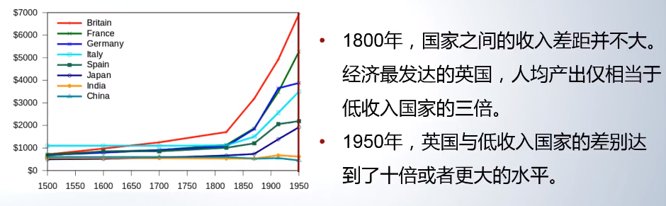

* 增长的趋同

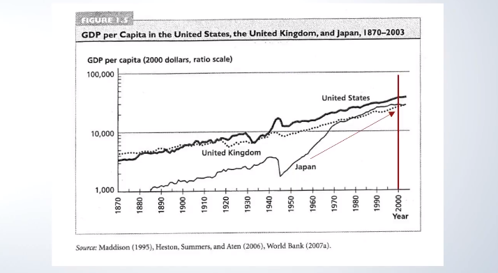

* 从历史中可以总结出的重要的现象
  * 在工业革命前全世界的人均产出基本没有增长
  * 工业革命后人均产出有持续增长
  * 增长的分布很不均匀
  * 若干发达国家的人均产出水平趋同

---

##### 9 生产要素的作用

* 问题：生产要素的积累能否带来经济增长

* 经济增长的来源
  * 生产资本（机器设备，厂房，电脑）
  * 人力资本/劳动力
  * 自然资源（土地）

* 由资本投入带来的产出增加到某一阶段会迎来极限；靠给同一个劳动力配备更多的资本，是不能带来经济增长的

* 索罗-斯旺模型（1956年）

---

##### 10 技术与效率

* 在索罗-斯旺模型中，排除了资本等要素积累后，长期增长来演是经济中对要素使用效率的提高
* 全要素生产率，total factor productivity, TFP
  * 指一个经济或者企业使用所有要素的效率，衡量经济的技术和效率水平
  * **全要素生产率 = 科技技术 + 制度效率**
  * 发达国家全要素增长率的提高来自于创新
  * 发展中国家全要素增长率的提高来自于向发达国家的学习借鉴过程

* Paul Romer在1980年代构造模型表示，企业为了利润而进行的创新，可以驱动经济的长期增长
  * 但对于一些发展中国家来说，经济增长的关键并不在于有没有进行很尖端的科技创新（他们现在还无法使用美国1980年代的技术）
  * 若干根本性的因素：制度，地理，自然资源，文化
    * 制度：宗主国类似制度/保护性制度，压榨性/掠夺性制度
    * 地理：远离海岸的内陆国家
    * 自然资源：去产业化（石油产业发达，导致制造业萎缩）
      * 资源在短期内可能对这个国家的经济有一个很强的推动作用，但是在长期中反而会导致这个国家的效率和技术比较落后
    * 文化：黑奴贸易的影响（卢旺达）

---

##### 11 对增长理论的总结

* **经济增长的来源：生产性资本，人力资本，自然资源，全要素生产率**
  * 索罗-斯旺模型揭示了生产资本本身不是长期增长的来源，原因是资本的边际产出递减（人力资本、自然资源也是类似的）
  * 最有可能在长期中推动经济增长的全要素生产率
    * 科学技术：企业的创新
    * 制度效率：公司制度，现代司法制度，合同制度（现代的生产制度）

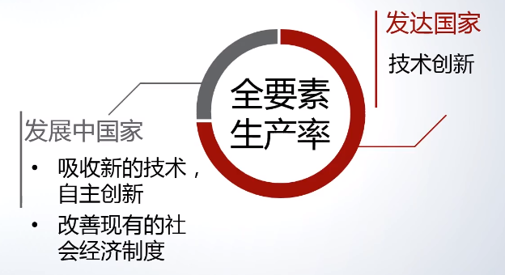

* 各个国家之间的增长和收入分布很不均匀
  * 技术的传播以及先进制度的传播，存在很大的主力或者一些阻碍因素
  * 免费的技术和先进知识，需要有相应的人力资本，才能吸收和利用
  * 制度环境也可能影响技术的传播（专利授权）

* 若干发达国家的人均产出水平趋同
  * 这些国家在使用先进技术方面的效率比较接近

---

##### 12 经济波动

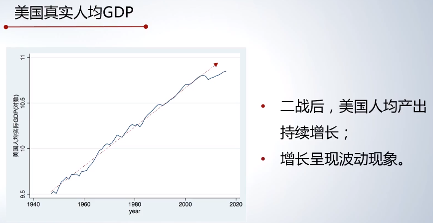

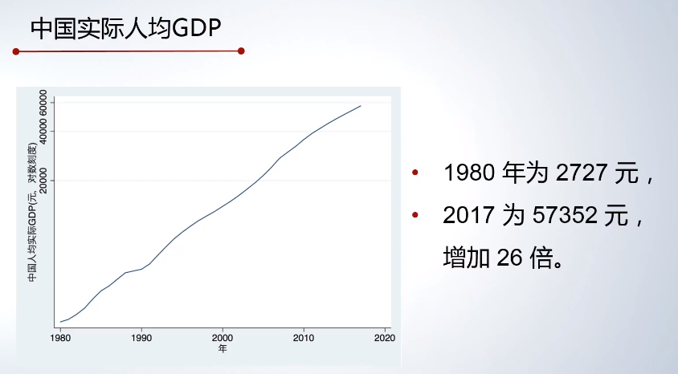

* 关注短期波动的原因
  * 有些行业和经济周期紧密相关：经济繁荣时，钢铁、有色、建筑、装修行业的警惕程度更高；经济不景气时，快餐行业更为繁忙
  * 人们讨厌失业和消费下降
  * 经济衰退长期影响衰退期间毕业的学生的长期收入和发展

* 衰退（收缩）
  * 定义：经济增长显著低于正常水平的时期
  * 简单判断方法：连续两个季度实际GDP下降
  * 萧条：非常严重的长期经济衰退（1929-1933 经济大萧条）
* 潜在产出（潜在GDP）
  * 定义：一个经济可持续的最大产出（实际GDP）
  * 在实现潜在产出时，不能出现劳动力和资本要素的过度使用（熬夜，夜间高铁维修）
* 真实GDP波动的来源
  * 潜在产出发生变化（长期变化）
  * 实际产出偏离了潜在产出（短期变化）
* 产出缺口：实际产出减去潜在产出

* 扩张：
  * 定义：经济增长率高于正常水平的阶段
  * 繁荣：特别强势及长时间的经济扩张
* 短期波动
  * 用经济周期/周期波动来指代并不是很合适，原因是波动无论是在长度和严重程度上都没有规律性

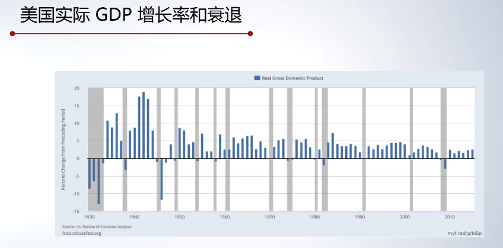

* 经济周期的起因
  * 内生波动：经济本身有内在的不稳定性
  * 外生冲击：经济内在稳定但是受到外来冲击

* 内生波动可能有固定的周期
  * 存货周期，猪肉价格和农户存栏量
  * 政治经济周期，选举引起的政府支出和货币政策（放松货币政策刺激经济增长）变化
  * 混沌理论，经济由一组数学公式描述，对应的数据看起来是随机的，但实质上是有规律的

* 外生冲击包括需求冲击和供给冲击（主要研究）

* 研究短期波动是困难的，因为缺乏数据

---

##### 13 凯恩斯主义

* 背景：
  * 1929-1930年代晚期经济大萧条，美国的GDP下降了26.3%，最高的失业率达到了23.4%
  * 内外交困：苏联计划经济的挑战，苏联经济1920/1930年代迅速崛起；当时主流的古典经济学主要关注总供给，没有很好的政策建议
* 1936年，凯恩斯发表《就业、利息和货币通论》
  * **混合经济的模式**：私营积极为主题，萧条期间辅以政府干预

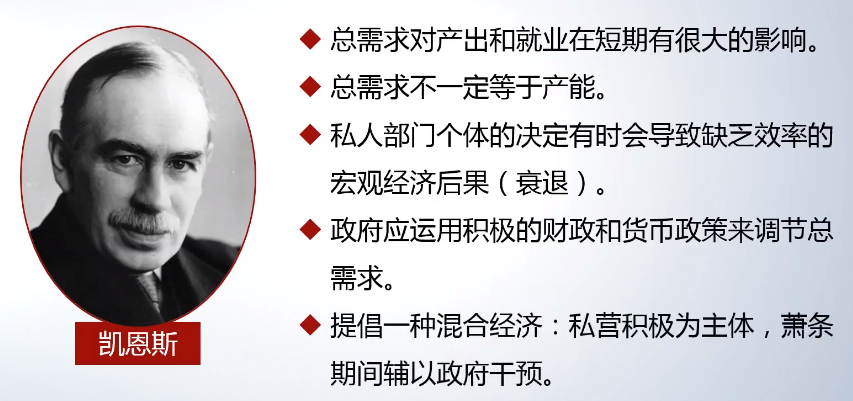

* 凯恩斯理论的影响

* 凯恩斯模型
  * 自发消费：不取决于现阶段收入的必须消费
  * 引致消费：消费中和现在的税后收入相关的消费
  * 边际消费倾向：税后收入越高，消费会同比例的上升，这个比例的系数称为边际消费倾向（收入每增加1块钱，会拿出多少用来消费），在0~1间

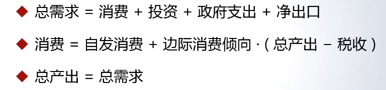

* 模型的图形：凯恩斯十字
  * 总需求是总产出的一个线性函数
  * 总需求 = 总产出 是一个均衡条件
  * 产出1的位置是**均衡产出**的水平

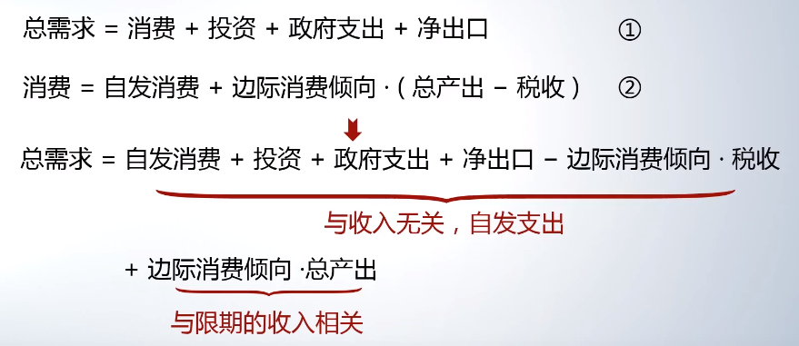

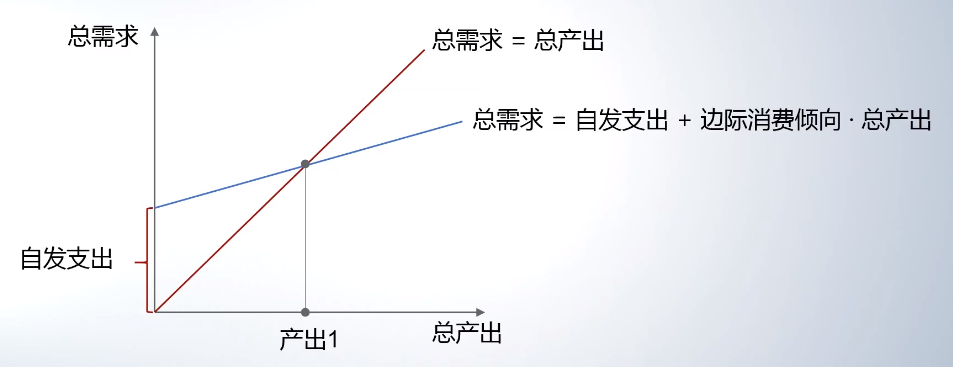

* 从凯恩斯十字看经济衰退的原因
  * 自发支出下降，蓝线截距减小，接续导致均衡产出下降
  * 边际消费倾向下降，蓝线斜率减小，导致均衡产出下降

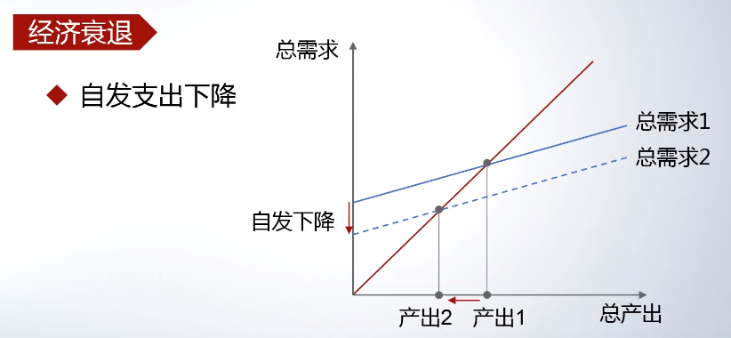

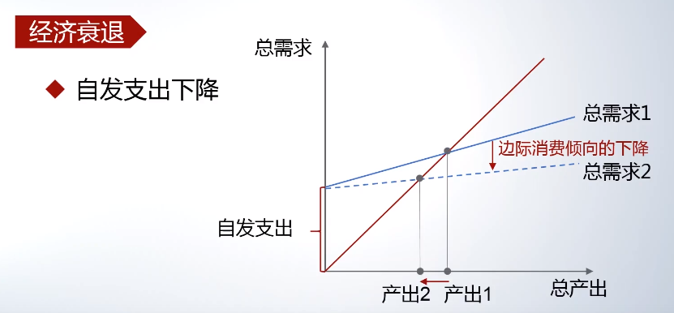

* 动物精神
  * 人在做投资、消费的决策时，并不是完全理性，很多时候是根据瞬间的情绪而做出决策
  * 凯恩斯认为，这种动物精神会影响经济的需求，从而在短期内影响经济的总产出和就业

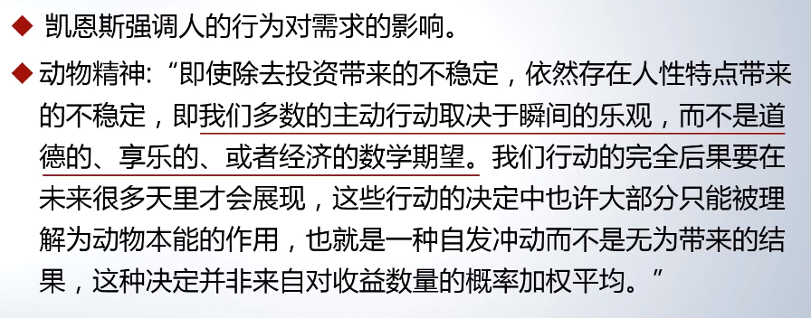

* 均衡产出的决定：代数解
  * 式子里求解的总产出是指 总产出=总需求 的均衡产出
  * **边际消费倾向越大，均衡产出/总产出 就越高**
  * 自发支出乘数
  * 在模型中，经济衰退时，（为增加总产出），政府的调节措施有：
    * 提高政府支出，可以去补足私人支出的不足
    * 通过减税的方法，提升自主的支出水平

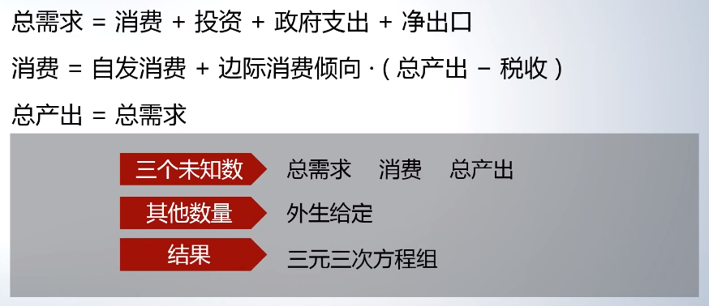

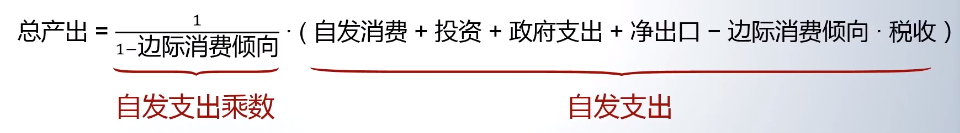

* **凯恩斯模型的两个暗含假设**
  * **模型中没有价格：**假设价格是企业预先决定的，因此模型不能用于讨论通货膨胀
  * **没有产能限制：**供给能够满足需求的变化
* 在经济衰退或者萧条时，可以采用凯恩斯模型建议的政策
  * 在经济衰退或萧条时，企业没有抬高价格的动机
  * 在经济衰退或萧条时，必然是存在剩余的产能

---

##### 14 财政政策

* 财政开支乘数
  * 定义：财政开支乘数用于衡量财政政策的有效性（一块钱财政开支的变化对产出有多大影响）
  * 财政开支乘数衡量财政开支（政府采购或者减税）对总产出的影响： Y的变化 /财政支出的变化
  * 在基本凯恩斯模型中，政府减税对经济的拉动要比直接的政府采购小

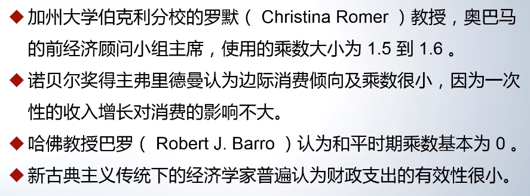

* 永久收入假说 - 弗里德曼
  * 如果某一年我们通过减税获得了额外100元的开支，我们并不期望这一年就消费上涨，然后就回到之前的水平

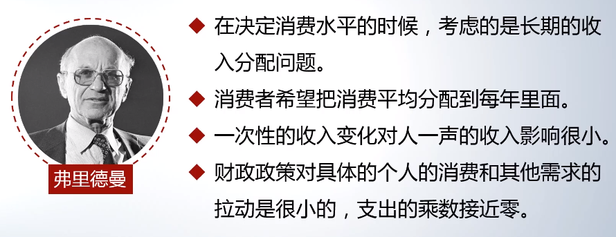

* 挤出理论
  * 政府在做财政扩张的时候，并没有囤下钱来做这件事情，而是需要向金融市场融资或者借钱来做的；通常为了支持财政扩张，政府可能会发行债券筹募资金
  * 在金融市场中，私人企业和家庭也在借钱进行投资和消费，政府就和他们形成了竞争关系；因此在需求上升的情况下，借钱的成本（利率）也会上升，高利率会反过来抑制居民和企业的投资和消费
  * 政府通过借钱提高了政府开支，但利率的提高抑制了私人企业和家庭的消费和投资，可以认为是政府支出“挤出”了私人消费和投资

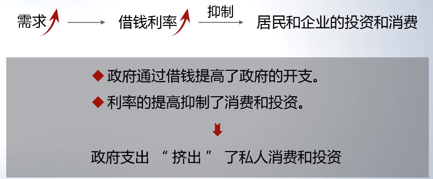

* 家庭部门的预期
  * 假设政府举债进行减税，刺激家庭进行额外消费，但因为一些原因不减少政府支出；如果消费者足够理性，他们会预期到因为现阶段政府收入减少，将来会为了弥补财政赤字进行增税，消费者一生实际的收入没有变化，消费者不会对这样短期的减税做出任何反应
  * 因此可以认为政府的财政支出对消费者支出的影响很小，对经济的拉动可以忽略不计

* 财政政策的供给效用
  * 第二条：鼓励企业和家庭增加对劳动资本的供给
  * 第三条：减税可能不能做到增加需求/增加居民消费，但可以提高供给

* 财政政策的不灵活的地方
  * 财政政策从构思到实际起作用可能有比较大的迟滞，在进行大的财政扩张的时候，需要规划论证、拨款等繁琐的流程

* 总结
  * 用财政支出乘数衡量财政政策的效果
  * 不同经济学家对财政政策的效果大小的争论
    * 经济学家一般都承认财政政策对经济有提升和拉动作用，但具体拉动程度有多大是有争议的

---

#####  15 货币定义及货币数量论

* 货币的定义
  * 联想：银行存款，现金，信用卡，金币
  * 定义：**任何可以在交换中作为一般等价物的资产**
    * 因此信用卡不是货币，信用卡实质上是一种负债的关系
* 货币在历史上的形态
  * 商品货币/金属货币（贝壳，贵金属），这些货币都有内在的使用价值
  * 法定货币，政府依照法律发型的纸币/塑料货币，这些货币的内在价值是很低的，而且政府没有把法定货币换为实物的义务
  * 电子货币
* 货币的功能
  * **交换媒介：**避免了物物交易的不便（买早饭、特定的早点铺）
  * **记账单位：**所有的商品服务都可以用元角分来定价
  * **储存价值：**退出流通的货币可以有储存价值，名义回报率为0（放进保险箱的钱3年后还能用），即以现金形态储存的货币是没有利息的

* 中国的货币统计口径
  * 基础货币 MB，中国人民银行发行在外的货币
    * 两种存在形态：成为流通中的货币/现金；商业银行把人民银行发行的货币存储在金库里，作为准备金，不参与流通
  * M0：流通中的货币
  * M1： M0 + 单位活期存款
    * 单位活期存款在支付时也可以使用，但场景比现金有限（单位支票）
  * M2： M1 + 企业定期存款 + 居民储蓄账户存款

* 为什么要有不同级别不同口径的货币统计方法呢？
  * 每个口径中的货币在交易中的使用便捷程度是有差别的
  * 近年的经济增长速度大概在6.5%-7%，货币的增长速度和GDP的增长速度基本是匹配的

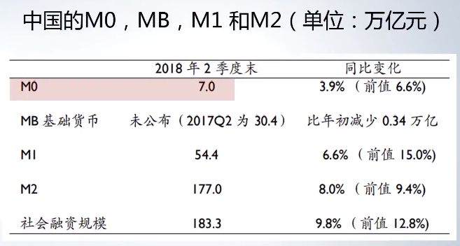

* 货币数量论
  * 交换方程式（恒等式）： M * V = P * Y
    * 前提：在所有交易中都使用货币作为媒介
    * M是货币存量，P是经济中的一般物价水平，Y是一年中的所有产出（实际GDP）
    * **货币存量 * 货币使用频率 = 整一年经济中发生的所有交易的总值 = 价格 * 实际GDP**
    * 价格 P = M * V / Y

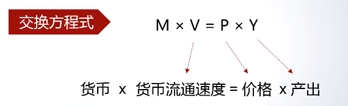

* 货币数量论的延伸
  * 通货膨胀：如果货币流通速度V和产出Y是相对稳定的，那么货币供给的增长必然会引起价格水平的同比增加
  * 价格和货币具有很紧密的关系；想要控制物价，就必须控制好货币发行量

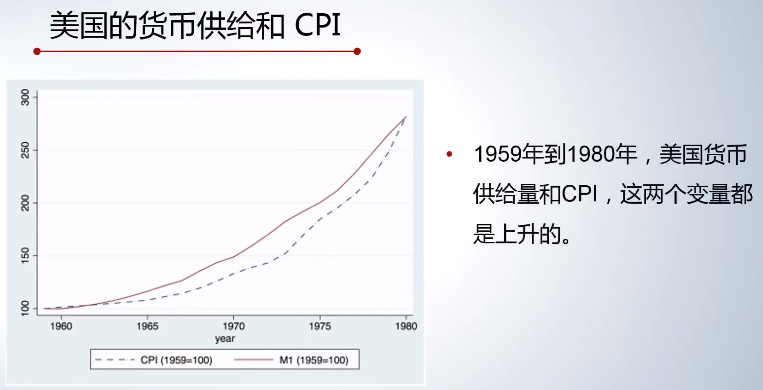

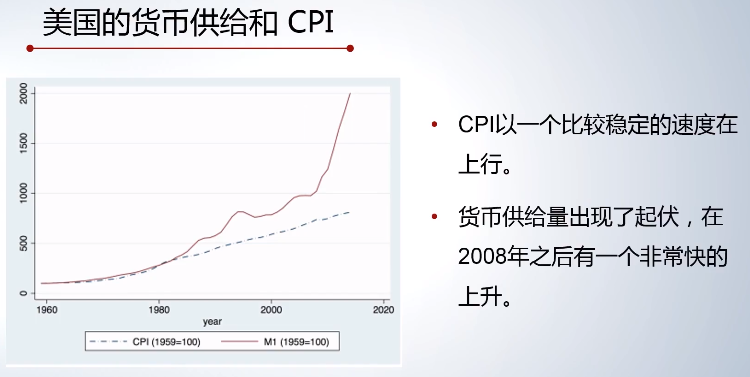

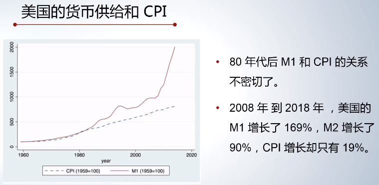

* 现象分析
  * 美联储（美国央行）发行了大量货币，但并没有通过信贷或者其他渠道形成消费，而是流向了其他经济活动；比如投资者用这些钱购买本国或者其他国家的金融资产，因此这些货币没有用来追逐美国经济中存量的消费品，没有导致消费品的价格出现一个同比例的上升

* 货币供给和通货膨胀的关系分析
  * 技术的角度看：货币主义关于货币流速稳定的假设有问题
  * 根据交换方程恒等式： 价格 V = P * Y / M （P 货币流通速度，Y 实际GDP，P*Y 名义GDP，M 货币供给量）
  * 下图为货币流通速度的历史数据

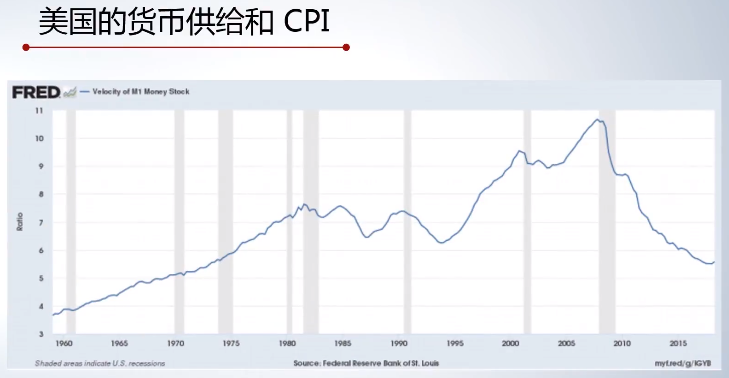

* 总结
  * 货币就是任何在交易中被广泛接受的一般等价物
  * 直觉上，货币供给越多，物价越高
  * 但是这个关系不是简单的成比例增长，具体要看货币的流向（如果货币没有流向消费，那么货币发行影响物价的能力就是有限的）

---

##### 16 货币银行与货币创造

* 了解现实中货币的供给是怎样决定的；中央银行能100%控制货币供给量吗？

* 货币供给
  * 不仅是中央银行，商业银行、居民和企业也是会影响货币供给的
  * 可以把货币统计口径简化为： 货币 = 流通中的现金 + 存款

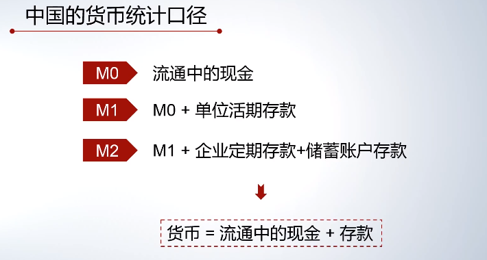

* 从商业银行角度理解货币供给：贷款创造货币
  * 如果商业银行把所有存款都缩在金库里，那这样一家银行只能通过账户管理费赚钱；现实中的银行并不是这样的
  * 现实中的银行只会留下一部分现金作为准备金，余下的钱都借出去给企业或个人，收利息，这是银行利润的最主要的来源
    * 准备金率 = 银行准备金 / 银行所有的存款
  * 如准备金率10%的图，此时银行发现准备金率过高，可以考虑向外多发放贷款
  * 如此往复，可以想象银行为了达到理想的10%准备金率，会继续向企业和居民发放贷款
  * **中央银行发行的货币数量，企业和居民持有货币的意愿，商业银行发放贷款的政策（准备金率），都会影响最终的货币供给的数量**
    * 如果企业和居民持有货币的意愿增强，所对应的货币供给数量就会降低

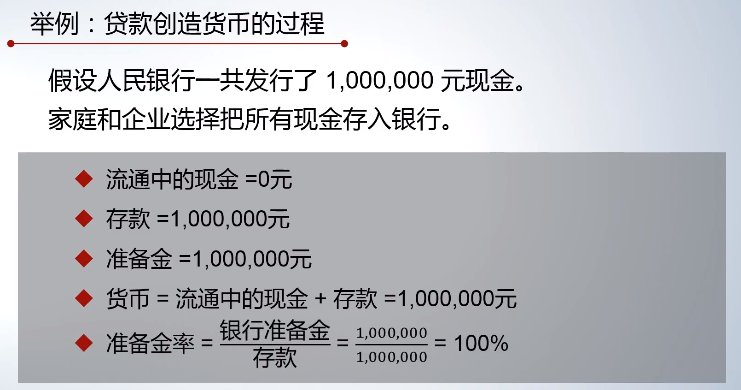

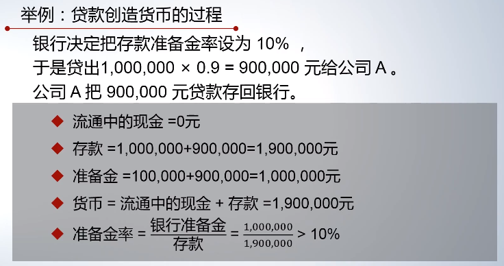

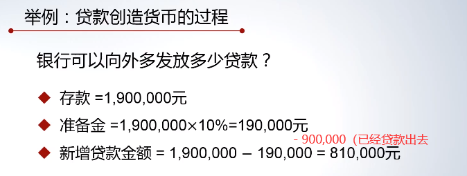

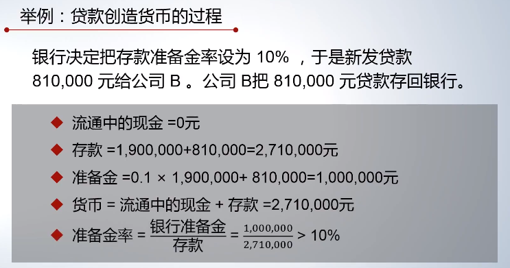

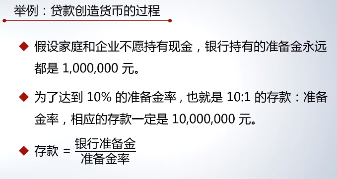

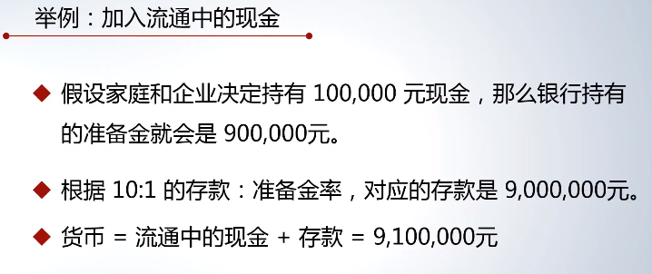

* 中国的主要货币政策工具
  * **法定准备金率：**大型金融机构的最低准备金率是14.5%，中小金融机构的最低准备金率是12.5%
  * **利率**

* 准备金制度的风险
  * 现代银行制度是建立在准备金率 < 1的基础上的，即部分准备金银行制度
  * 银行获得利润的主要方式，就是把大部分存款都贷出去收取利息
  * 风险：如果有很多存款人同时要求取现金，使得取现要求超过银行准备金，就会出现银行挤兑的情况，严重的挤兑会导致银行破产清算
    * 银行破产清算会导致两个后果，家庭失去存款从而消费降低，企业也难以贷到款

* 存款保险制度
  * 用存款保险制度来解决部分准备金制度的风险，相当于政府担保

---

##### 17 历史上的货币政策

* 主要内容：金本位/银本位，布雷顿森林体系，货币主义的理论和实践

* 金本位
  * 定义：使用含金的硬币，或者以黄金支持的纸币作为货币的货币体系
  * 在第一次世界大战之前，金本位是世界上最常见的货币制度
  * 金本位同时也是一种汇率制度，不同货币之间简单按照含金量进行兑换，所以有利于不同国家之间的贸易和投资往来
  * 在金本位制度中，中央银行的存在并不是必须的，只要私人机构能够确认货币中的含金量，交易就可以顺畅地完成
* 金本位和价格
  * 在金本位下，价格并不是必然能保持高度的稳定（还要考虑货币流通速度和实际产出）

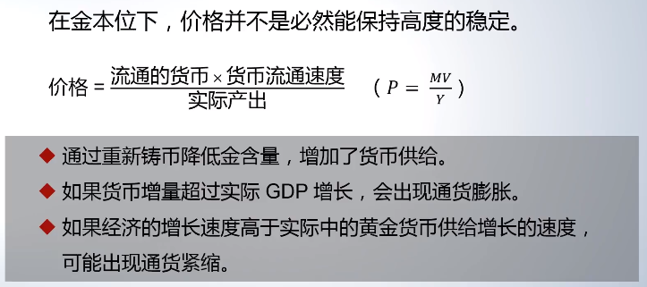

* 金本位的历史变迁
  * 一战期间，交战各国停止了互相贸易往来，金本位带来的稳定汇率不再重要；交战各国为了获得更多的财政收入，通过降低铸币含金量，在国内实行贬值来征收铸币税，从而放弃了金本位
  * 在一战后，很多国家试图回归金本位；但不久之后，1929-1933的大萧条冲击了世界经济，使得这些国家的努力半途而废
  * 在金本位之下，中央银行无法通过增加货币供给来降低利率，刺激经济，在大萧条期间，坚持金本位的国家付出了沉重代价
    * 放弃金本位的国家1935年产出比1929年高26%，通过货币政策更早地摆脱了萧条
    * 坚持金本位的国家经济复苏要晚很多
  * 二战之后，黄金的世界分布开始变得不均匀，美国占有了大多数的黄金，再次回到金本位变成不可能

* 布雷顿森林体系：美元本位
  * 本质：以美元为中心建立的货币体系
    * 美元盯住黄金，金价为35美元1盎司；其他主要货币盯住美元
    * 美国政府有义务将体系内其他政府和央行的美元换成黄金；但普通的居民不再有权利把美元（或其他纸币）换成黄金
  * 在这个体系中，美国很大程度上保持了货币政策自主
    * 在60年代的越南战争，美国急需扩大支出，货币供给上升，推高了通货膨胀
    * 其他国家逐渐无法相近美元的价值仍然和黄金保持35:1的比例
    * 1971年8月美国总统尼克松宣布结束了美元和黄金的可兑换性，终结了布雷顿森林体系

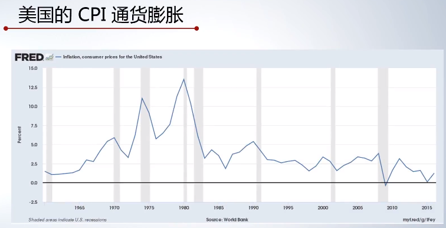

* 货币数量论/货币主义
  * 货币主义者主张，中央银行发型货币的增速应该等于实际GDP增长率加上一个较小的通货膨胀目标（弗里德曼的k%法则）
  * 这一主张还要求，政府不能将货币政策用于管理其他经济目标，如GDP和就业（经济增长率和失业率）
  * 这一制度之下，同样不适用金本位
* 货币主义在实践中产生了很大的影响
  * 1980年，Paul Volker在美国实行这一法则，成功降低了美国的高通胀
  * 在欧盟成立时，欧洲央行也规定货币供应量应该以4.5%的速度增长
  * 1960-1980年间货币的增长速度和物价的增长有很强的关系；80年代之后，货币发行量的增长和物价的增长出现了脱钩
  * 因此，简单的货币主义的理论在新时代显得不合时宜

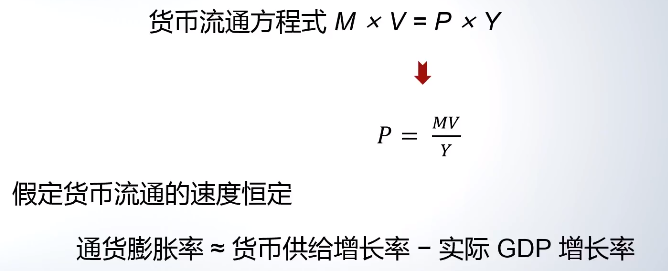

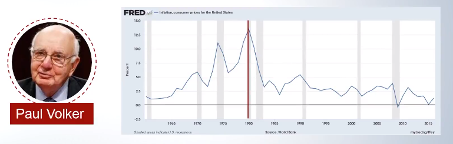

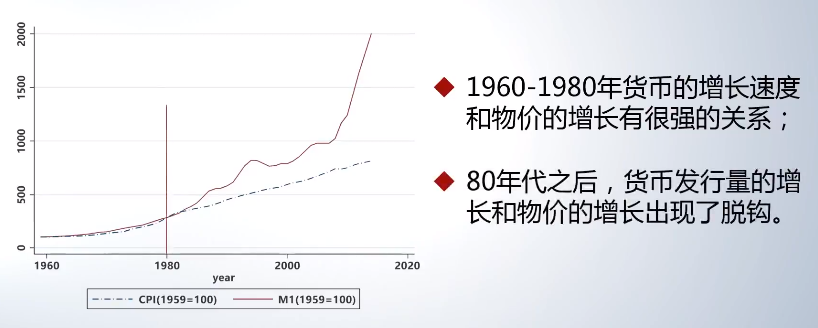

---

##### 18 现代货币政策

* 目前在多数国家，中央银行使用名义利率作为主要的货币政策的工具来调控经济
  * 名义利率指借钱时候要支付的利率，这个利率是没有考虑通货膨胀影响的
  * 实际利率（借钱的实际成本） = 名义利率 - 通货膨胀率
  * 在短期中通货膨胀率是稳定的，因此**改变名义利率就会改变实际利率，就会改变企业和居民借贷的成本**

* 泰勒法则

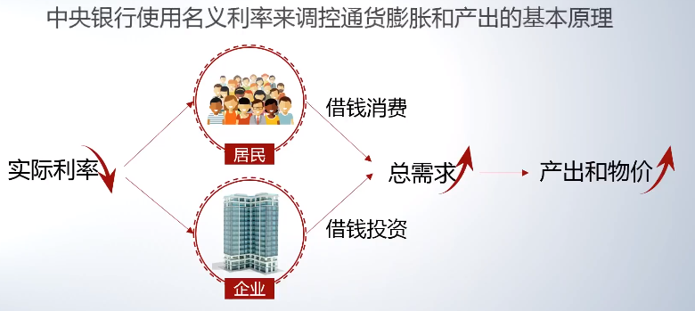

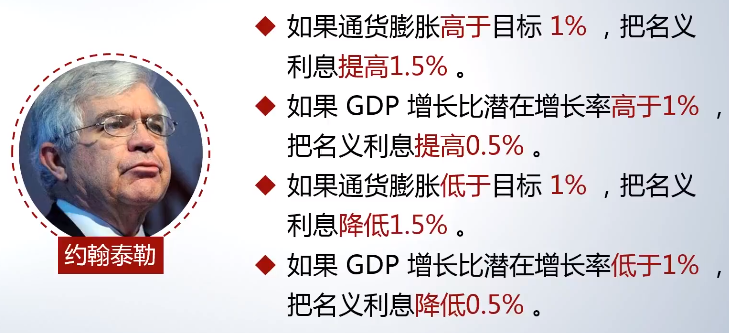

* 如何实施泰勒法则
  * 央行首先设立目标利率
  * **如果利率高于目标，央行将增加货币供给；如果利率低于目标，央行将减少货币供给**
    * 疑问：为什么货币供给可以改变利率？
  * 实际操作中，央行是通过在公开金融市场上买卖国债和其他金融资产来影响货币供给

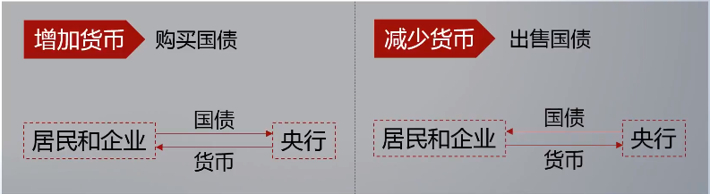

* 如果名义利率已经到0了，还可以继续用货币政策刺激经济吗？
  * 名义利率可以为负吗？答案显然是否定的；名义利率的下限是0

* 量化宽松
  * 目的：解决名义利率达到0之后，如何进一步使用货币政策刺激经济的问题
  * 理解：央行的目标利率变成0以后，仍然有很多利率高于0，因此央行仍然可以通过发行货币的方法来降低其他的利率，刺激经济的发展
  * 运作原理
    * 央行增加了货币供给，银行更有可能增加贷款的发放，实现信贷宽松和总需求增加；通过额外的货币和信贷供给，降低目标利率以外的其他名义利率
    * 同时因为货币的发行量极大增加，在金融市场上也会出现资产价格迅速上升，持有金融资产的居民财富上升，提升消费
  * 实施：央行通过购买国债或者其他金融资产的形式来实现货币的发行

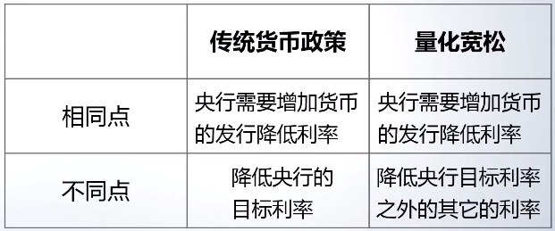

* 前瞻指引
  * 思路：对未来的利率路径提供指引
  * 问题：沟通很困难，让市场（企业和居民）相信未来利率会维持在一个低的水平

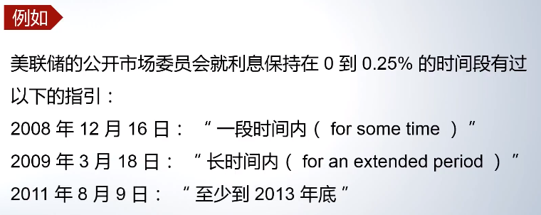

* 非常规货币政策
  * 在实践中，很难估计量化宽松和前瞻指引对GDP到底有多大的作用
  * 但我们可以考察量化宽松和前瞻指引发货作用的两个中间渠道：利率和资产价格（降低利率，抬高资产价格）
    * 包括企业发型债券的利率，居民借贷款购买房屋的利率

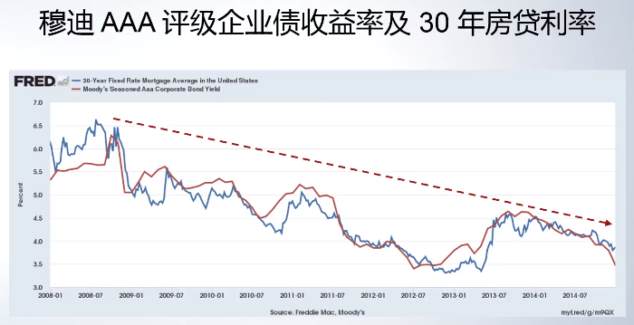

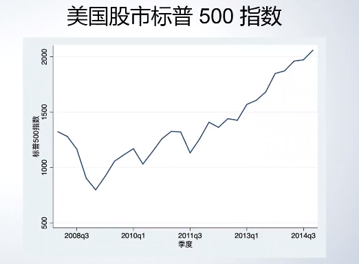

---

##### 19 总供给总需求模型的框架

