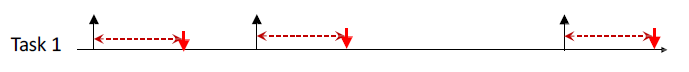

#### 实时系统与调度

姚建国 陈瑞球楼309/软件学院3101 周一10.00-11.40

---

* 分数组成：平时测试 10% + 大作业 Projects 60% + Pre 30%

##### Introduction

2020.9.14 第二周

* Embedded system，嵌入式系统
  * 嵌入物理/机械系统（physical/mechanical），执行一系列特定的功能

* Real-time system，实时系统
  * 与逻辑的正确性（logical correctness）和执行时间（produced result）均相关
  * **有执行时间的概念，有任务的截止时间**（deadline）；执行时间早于截止时间
  * eg. 刹车系统

* 嵌入式系统和实时系统
  * Real-time embedded：核反应堆控制，飞行控制，手机，无人机
  * Real-time but not embedded：股票交易系统，skype，视频流/视频处理
  * Embedded but bot real-time：温度控制，洗衣机，冰箱，血压计

* **实时系统的特征**
  * **event-driven, reactive，事件驱动，交互性高**
  * **high cost of failure，失败代价高**

* **实时系统的分类**

  * **Hard real-time，硬实时系统：**安全性要求非常高，代价非常大（human life, environment safety, final loss）
    * 一定要在实时系统设定的截止时间之前完成
  * **Soft real-time，软实时系统：**偶尔超过截止时间依然能够正常工作

  * **Firm real-time，固定实时系统：**软实时系统的一种，有一个可以容忍的固定时延
    * There is no benefit from late delivery of service. 用户体验突然消失

* Adaptive cruise control（ACC），自适应巡航控制系统

* 课程要点
  * 了解什么会影响系统的响应时间；分析系统响应时间，评估是否满足要求；设计一个可测量时间的系统
* 

***

##### Taxonomy of real-time systems, 分类

2020.9.14 第二周

* 术语：Task
  * Task是指实现系统功能的**代码**，有多个输入输出，可以激活或执行事件
  * **抽象**成计算机系统中可执行的任务，可以是周期性的，也可以是非周期性的
  * Task需要共享数据（指令），需要与其他模块交互，可以执行IO操作
* 术语：Job
  * Job是Task的一个真实执行的**实例**

* **Task的激活模式，Activation pattern**
  * **周期性 Periodic**
    * **单周期 Single rate：**所有task的周期是相同的
    * **多周期 Multi rate：** task的周期是不同的
  * **非周期性 Aperiodic**
    * 达到时间有边界 Bound arrival time, **Sporadic 零星的**
    * 达到时间无边界 Unbound arrival time, **event-based activation 事件驱动**

* 周期性任务 Periodic
  * 允许使用静态分析技术，static analysis techniques
  * Simple but inflexible
  * 广泛应用在传感器网络中 sensor networks

* 非周期性任务 Aperiodic
  * 事件驱动
  * 负载相对来说比较动态，无法预测 unpredicted

* 非周期性任务 零星的 Sporadic
  * 任务的到达时间有间隔要求 **minimum interarrival time**，eg. 下一个任务不会在10之内到达

* 非周期性任务 事件驱动 Event-based tasks
  * 对于到达时间，没有lower-bound和upper-bound

* **截止时间和周期性的关系**，Relation between deadline and period
  * **隐式的 Implicit deadline：**截止时间 = 周期
  * **限制的 Constrained deadline：**截止时间 <= 周期
  * **任意的 Arbitrary deadline：**截止时间与周期无关，难以分析

* **两种任务执行模式，Execution model**
  * **抢占任务 Preemptive execution**
  * **非抢占任务 Non-preemptive execution**

* **Task的静态和动态**
  * **静态 Static：** task的达到时间可预测
    * 可以进行静态分析 Compile-time，**WCET**
    * 能够占用高CPU资源
  * **动态 Dynamic：** task的达到时间不可预测
    * 只能对simple case做静态分析
    * CPU占用率显著降低

* 实时系统的设计论断：**fast != real-time**
  * Proving v.s. testing
  * Hard v.s. soft real-time
  * Worst-case response time v.s. best effort

* 

---

##### Online Scheduling

2020.9.21 第三周

* **实时系统建模 Modeling**

  * **计算系统建模 computation**
  * **任务执行时间建模 task execution time**
  * **任务执行建模 task execution**

* 实时活动建模

  * 特点：expressive 富有表现力的，tractable 容易处理的，（不是精确的）
  * Why/目标：analyse a system，**time analysis**

  * 要求：简化具体细节，描述指标（definition）

* 计算系统建模 modeling computation
  * 分类：System model, RTOS/OS model, Platform model

* 任务建模 modeling task：定义
  * **Task τi**, 表示某个任务
  * **ai, activation time**, 任务τi的到达时间
  * **si, start time**, 任务τi开始执行的时间
  * **ci, computation time**, 任务τi在场景中实际的执行时间
    * 最小执行时间，最大执行时间，平均执行时间，执行时间
  * **fi, finishing time**, 任务τi结束执行的时间
  * **Ri = fi - ai, response time**, 任务τi的响应时间

* 任务建模 modeling task：How to get a safe Ci？
  * Ci-min, Ci-avg, **Ci-max(考虑最坏情况，相对保守)**
  * 硬实时系统一定要按照Ci-max来设计
  * 软实时系统有时候可以用Ci-avg设计，用于提高资源利用率 

* The WCET Problem
  * 分析需要的条件：software task code，platform(OS+hardware)

* 最大执行时间的估计
  * 测量出基本块的最大执行时间
  * 潜在条件：流入执行次数 = 基本块执行次数 = 流出执行次数

* 任务建模 modeling task：定义II
  * **Di, relative deadline**, 相对截止时间
  * **di = ai + Di, absolute deadline**, 绝对截止时间
  * 任务可行的表述方式
    * fi <= di, 任务结束时间早于绝对截止时间
    * Ri <= Di, 任务相应时间短于相对截止时间
  * **slacki = di - fi**, 任务相对截止时间早完成的部分
  * **lateness，Li = fi - di,** 任务相对截止时间晚完成的部分 

* 辨析：real time 和 real-time

* **Online Scheduling**
  * **Preemption 抢占**
  * **Suspension 挂起**
  * **Dispatching 分发**

* 调度策略
  * time slice, [ti, ti+1), 每一段执行的时间片
    * 可以用分段函数来表示时间片的分配
  * context switch，上下文切换
* 调度策略类型：
  * **FIFO, first-in-first-out scheduling**
    * FCFS, first-come-first-serve
  * **Round robin**
  * **Shortest-job first**
  * **EDF, Earliest deadline first**
  * **FP, Fixed-priority scheduling**
    * Dynamic-priority scheduling
  * clock/optimal
  * JISPFF，just-invented-scheduling-policy-for-fun
* feasible 可行的(not miss) 和 schedulable
* 

---

##### Online Scheduling on Aperiodic Tasks 非周期性任务

2020.9.28 第四周

* **FIFO 先进先出原则**
  * 非抢占，不考虑deadline和priority
  * 依赖于任务 到达时间的分布(ai) 和 执行时间的长短(Ci)
  * 结果呈现随机分布，可调度性差(schedulable)
  * Pros：快，实现简单，network systems应用广泛
* **feasible 和 schedulable**
  * feasible 理论可行的(not miss) 
  * schedulable 可以用调度算法调度的

###### Properties of scheduling algorithms

* **preemptive 和 non-preemptive**
  * 抢占的和非抢占的
* **work-conserving 和 non-work-conserving**
  * work-conserving：系统中有就绪task时，处理器不会处于空闲状态
  * non-work-conserving：即使系统中有就绪task，处理器也可能空闲

* **static 和 dynamic**
  * static：调度策略依赖于fixed parameter
  * dynamic：调度策略依赖于可以随时间变化的参数，eg 还剩多少执行时间

* **offline 和 online**
  * offline：任务在布置到系统之前，调度策略就会被设计好
  * online：runtime时确定调度策略
* **optimal 和 heuristic**，最优的和次优的
* **最优的评判标准 optimality criteria**
  * feasibility 可行的
  * 最小的maximum lateness（任务延迟时间）
  * 最少的deadline miss
  * 给每个task都分配value，最大化feasible task（可行任务）的value累计值
* 更多的最优评判标准
  * average response time，平均响应时间
  * total completion time，总体完成时间
  * weighted sum of completion time，加权完成时间
  * maximum lateness，最大延迟时间
  * maximum number of late tasks，最大超时任务个数

###### Scheduling Algorithms

* **SJF，Shortest-job first 短任务优先调度**
  * static，online/offline，preemptive/non-preemptive
  * **最小化平均响应时间，average response time**
  * SJF并不一定适合real-time系统，在feasibility（调度的可行性）上SJF不是最优的
    * 一个调度算法相对于调度的可行性是最优的
    * 最优：相对于最优化目标是最优的，满足一定的约束条件

* 平均时延和伪时延

* **Fixed-priority scheduling，固定优先级调度**
  * preemptive，高优先级task可以抢占低优先级task
  * 问题：starvation，低优先级task被高优先级task反复抢占，难以在deadline之前完成

* **RR，Round robin，轮询调度**
  * preemptive，RR会产生一系列抢占
  * ready queue是FIFO的队列
  * 每个task不能连续执行超过 Q=time units（时间片单元）
  * 绝对公平和相对公平：加权时间片长度

* **Multi-level scheduling，多级调度**

---

##### Online Scheduling on Aperiodic Tasks 非周期性任务

2020.10.10 第五周（调课）

* 绝对截止时间和相对截止时间 absolute deadline v.s. relative deadline

  * Maximum lateness = Lmax = max{Li|任意ti}
  * 当Lmax ≤ 0，则没有deadline miss

* **EDF，Earliest deadline first**
* preemptive，dynamic(依赖task的activation time，计算相对deadline)
  * 需要指定deadline，因此没有大规模使用
  * Remain execution times
  * **EDF调度算法相对于调度的可行性是最优的**

* **Table-driven scheduling，基于调度表的调度**
  * 需要离线设计调度表，把调度表提前存到内存里，根据调度表分配task（路由表）
* Table-driven scheduling的优点：
  * Extremely predictable 可预测性
  * Easy to certify 容易验证实时系统的确定性
  * Extremely flexible for schedule optimizations
  * Low runtime overhead
  * Very small “code” footprint
* Table-driven scheduling的缺点：
  * 需要知道task到达/执行的具体时间，无法适应event-based system和dynamic workload
  * 构建最优的调度会非常困难
* 利用压缩调度表来节省空间
  * loss-less compression 无损压缩
* 基于时间表的调度转化成其他经典的调度方法
* **非抢占式的EDF不是最优的调度策略，抢占式的EDF是最优的调度策略**
  * CPU不空转和非抢占式限制了NP-EDF成为最优的调度策略
  * 但即使在CPU不空转和非抢占式的情况下，NP-EDF依然不是最优的

---

##### Online Scheduling on Periodic Tasks 周期性任务

2020.10.19 第七周（教学周）

* embedded system 嵌入式系统
  * **Ti, period, 周期**
  * **Ci, worst-case execution time (WCET), 最差执行时间**
  * **Di, relative deadline, 相对截止时间**
  * **φi, offset, 相位**
  * **Ui = Ci/Ti, utilizaition, 利用率，执行时间/周期**
  * **Ji, k, 任务i的第k个周期**
  * **公式1：ai,k = φi + (k-1)*Ti, k表示kth job**
  * **公式2：di,k = φi + (k-1)*Ti + Di, k表示kth job**
* 课程中的一些假设
  * 对于每个任务 τi，Ci 和 Ti 是固定的
  * 任务之间能够互相抢占
  * context switch，抢占，调度开销可以忽略不计
  * 任务之间互相是独立的

* **周期性任务的调度策略**
  * **Proportional share algorithm，比例共享调度**
  * **Cyclic scheduling，循环调度**
    * **timeline scheduling，时间表**
    * **table-driven scheduling，调度表**
  * **Online scheduling**
    * **Fix-priority policy 固定优先级策略**
      * **Rate monotonic (RM)**
      * **Deadline monotonic (DM)**
    * **Dynamic policy 动态调度策略**
      * **EDF**

* **Proportional share algorithm，比例共享调度**
  * 牛 Ccow / Tcow = 20min / 40min = 0.5
  * 猪 Cpig / Tpig = 4min / 16min = 0.25
  * 最大公约数的时间片是8，每个时间片中4用来喂牛，2用来喂猪
  * 问题：调度过程中抢占过多

* **Cyclic scheduling，循环调度**
  * δ = GCD(Ti, ∀i) 最大公约数
  * T = LCM(Ti, ∀i) 最小公倍数
  * 根据周期来分配时间片，A要求每个δ都有一个，B要求每两个δ有一个，C要求每四个δ有一个，自由组合成可能的结果
  * time slot，需要保证：
    * CA + CB ≤ δ
    * CA + CC ≤ δ
  * 循环调度的优点：
    * 实现容易实现，不严格依赖于RTOS（实时操作系统）
    * 开销相对比较小，主要是定时器
    * 任务之间运行的抖动 jitter 比较小（如果数据包时延一直保持在1ms，则 jitter 是0，系统动态性随机性较小，可预测性较好）
    * jitter = Latencymax - Latencymin
  * 循环调度的缺点：
    * 调度算法本身很小，但不太能处理干扰因素（时钟飘移等）
    * 离线设计调度表，可扩展性差，代码更新难度大
    * 不能很好地响应分周期性任务

* **Fix-priority policy 固定优先级策略**
  * Rate monotonic 速率单调
  * Deadline monotonic 截止时间单调
  * 有两种不同的方式来确定周期性任务中的优先级，分配完成以后优先级是不变的
* **Rate monotonic 速率单调**
  * rate 速率 = 1/T，周期的倒数，只和周期相关
  * Ti越短，rate越大，优先级越高
  * **RM特性的固定优先级调度算法不是optimal的**（相对于EDF）
  * **如果对于任意任务i，都有Di=Ti，那么在所有固定优先级调度算法中，RM特性的是最优的**

* **Deadline monotonic 截止时间单调**
  * 比较 1/D，相对截止时间的倒数
  * Di越短，1/Di越大，优先级越高
  * **如果对于任意任务i，都有Di≤Ti，那么在所有固定优先级调度算法中，Deadline Monotonic特性的是最优的**

* 最优性分析 Optimality

* 利用率的高低和RM调度算法的可调度性没有关系
  * 如果RM可调度，那么利用率小于1
  * 但如果利用率小于1，不一定是RM可调度的

