## 数字部件设计

------

### 第0讲 概述

* 单周期CPU

  

* 流水线CPU

  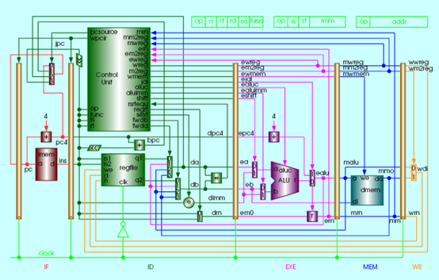

------

### 第1讲 电路逻辑

* 运算器：能进行加减乘除等算术和逻辑运算的器件

* 图灵机：

  

* 冯诺依曼结构（普林斯顿结构）：是一种将程序执行存储器和数据存储器合并在一起的电脑设计概念结构，描述了一种实际通用的图灵机计算装置。结构提出了将储存装置与中央处理器分开的概念，依该架构设计出的计算机又称存储程序计算机

  

* 哈佛结构：将程序执行储存和数据储存分开的存储器结构。数据和指令的储存可以同时进行，可以使指令和数据有不同的数据宽度，程序需要由操作者加载，处理器无法自行初始化

  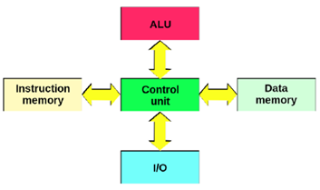

* Machine Structure

  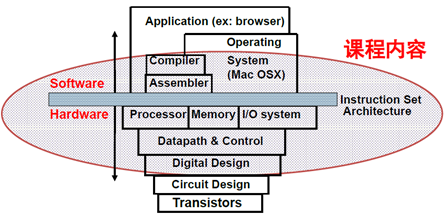

* FPGA(Field Programmable Gate Array现场可编辑逻辑门阵列)

  * FPGA作为特殊应用集成电路领域中的一种半定制电路而出现

  

  * FPGA的基本逻辑单元：查找表LUT-look up table，触发器Flip-flop，多路器

  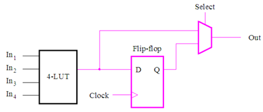

* HDL(hardware description language硬件描述语言)

  * 定义：能够描述description硬件结构的一种语言，不是设计design

  * 硬件描述的目的：刻画表达出所设计的硬件逻

  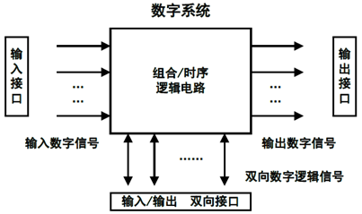

* Verilog

  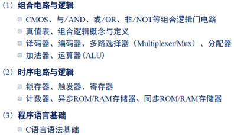

* 逻辑门

  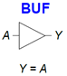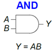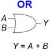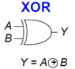

* 逻辑电平

  

* **数字器件动态功率和静态功率**

  

  

  

* MOS场效应管

  * nMOS: gate = 0, OFF; gate = 1, ON
  * pMOS: gate = 0, ON; gate = 1, OFF

  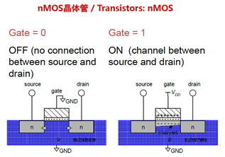

  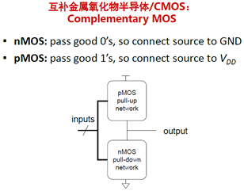

* **用场效应管构造逻辑门**

  * nMOS: gate = 0, OFF; gate = 1, ON

  * pMOS: gate = 0, ON; gate = 1, OFF

  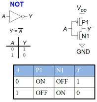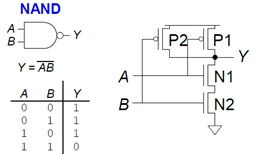

* 用场效应管构造传送门 transmission gates

  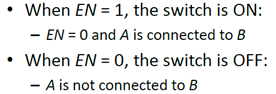

* 用逻辑门构造多路选择器 multiplex

  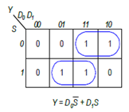 

* 用多路器实现查找表

  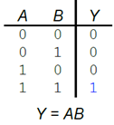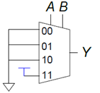

* 译码器

  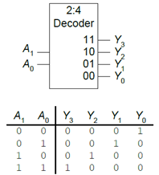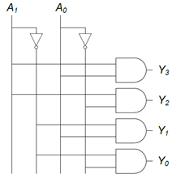

* SR锁存器

  

* D锁存器

  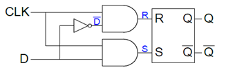

  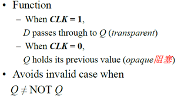

* **D触发器**

  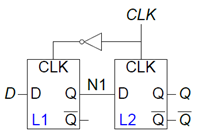

  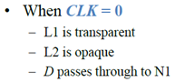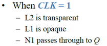

* **寄存器**：本质就是触发器

  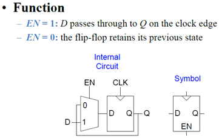

  

* 

------

### 第2讲 电路器件

* 电阻

  * 在高频应用和某些场合，电阻的寄生电容和寄生电感不容忽视
  * 电阻的种类和封装形式众多，还有功率、精度等表征参数

  

* 忆阻器

  * 忆阻器具有电阻的量纲，但他的阻值由流经他的电荷确定
  * 纳米忆阻器件的出现，有望实现非易失性随机存储器

* 电容

  * 定义式：C=Q/V

     

  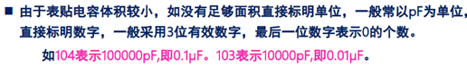

  

  *  超级电容的功率密度大（W/kg），但能量密度小（Wh/kg）

  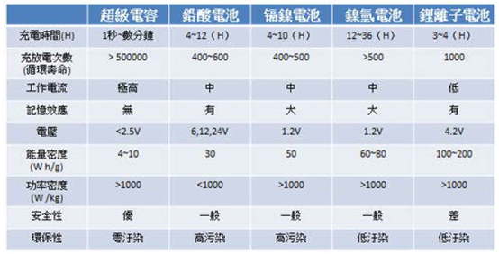

  * 电容的电压和能量计算

    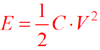

  * 低通滤波器以及容抗计算式：低通滤波器是容许低于截止频率的信号通过， 但高于截止频率的信号不能通过的电子滤波装置

    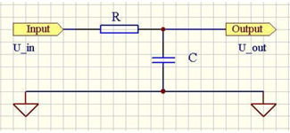

*  电感

  * 定义式 L = φ/i

    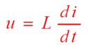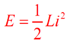

  * 反电动势、能量

    

    

* 四种电路基本元件之间的关系

  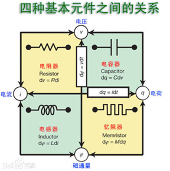 

* 电容、电感的基本用途小结

  * 滤波（包括电容的去耦作用，电感的隔离作用）
  * 储能
  * 构成振荡器（包括谐振天线等）或者选频网络

* 二极管

  * P型半导体：空穴是多子，自由电子是少子

    

  * N型半导体：自由电子是多子，空穴是少子

    

  * PN结的原理

    

    

  * 晶体二极管

    

  * 常用二极管 

    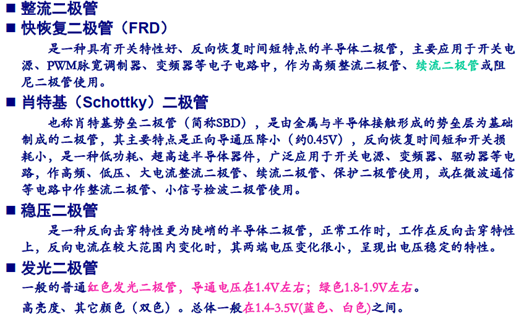

* 三极管

  * 三极管的工作原理：工艺上保证发射结的面积比集电结的面积小

    

  * 晶体三极管的放大作用

    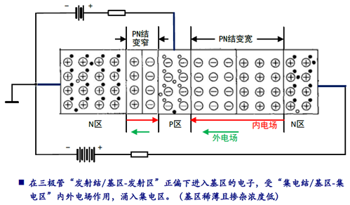

    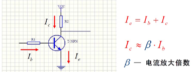

  * 特性曲线

    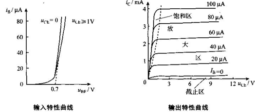

  * 3种放大电路：

    * 共射电路是放大电路中应用最广泛的三极管接法，信号由三极管基极和发射极输入，从集电极和发射极输出。因为发射极为共同接地端，故命名共射极放大电路。
    * 共集电极放大电路，输入信号是由三极管的基极与发射极两端输入的（在原图里看），再在交流通路里看，输出信号由三极管的发射极两端获得。因为对交流信号而言，（即交流通路里）集电极是共同端，所以称为共集电极放大电路

    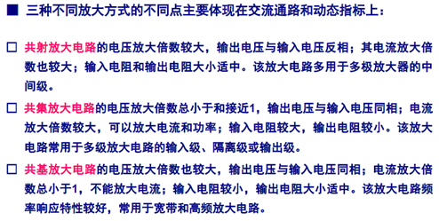

* MOS管

  * 原理

    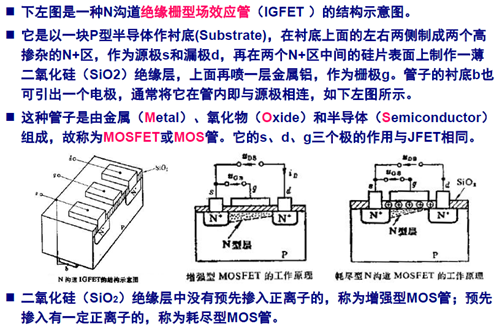

  * 图标

    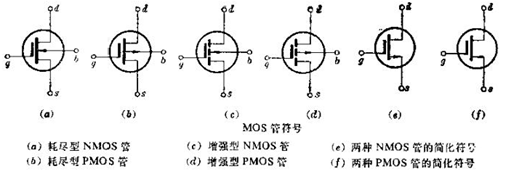

  * 特性曲线

    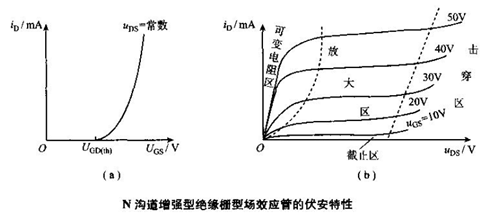

  * 漏极电流Id的计算

    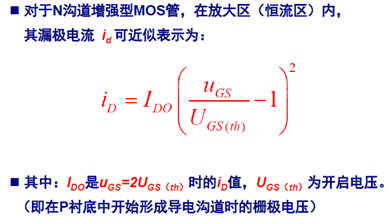

  * 场效应管与三极管的对比

    

* 集成运算放大器

  * 定义

    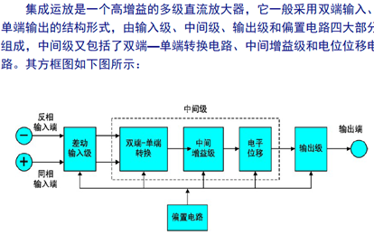

  * 运算放大器

    

  * 跟随器，缓冲器

    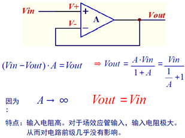

  * 反相放大器 

    

*  

------

### 第3/4/5讲 课本内容

* Art of managing complexity

  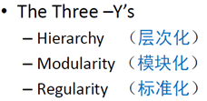

* Binary Value (基带信号，波特率，调制)

* 组合逻辑和时序逻辑

  * 组合逻辑是memoryless的，输出由当前输入的值决定

  * 时序逻辑有memory，输出由当前和先前输入的值决定

    

* SOP form / POS form 与或式

* 卡诺图：由真值表向与或式转变的方法

   

*  

------

### 第6讲 单周期

* MIPS指令的功能分类

  

* MIPS指令的三种格式

  

* Datapath element 和 program counter

  

* 双读端口的寄存器堆实现原理

  *  信号的两个读端口的寄存器号

  

* 寄存器堆写端口的实现原理

  * 信号：写使能，写寄存器号，写寄存器内容

  

* ALU中aluc的实现

  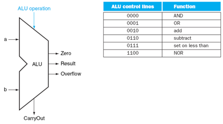

* 单周期CPU+指令寄存器+数据存储器

  

* MIPS的部分指令

  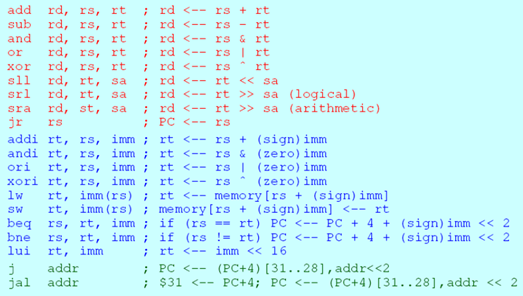 

* MIPS部分指令编码

  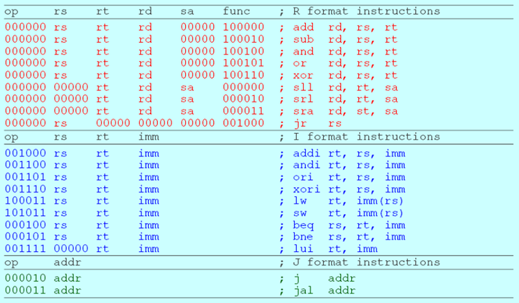

*  

------

### 第7/8讲 流水线

* 流水线不会改善每一个任务的执行时间，但它能够提升整个系统任务执行的**吞吐率**。吞吐率取决于最慢的那个流水环节。 

* 指令流水线的吞吐量定义为单位时间里流出的完成指令数，其取决于指令流出流水线的速度

* 如果每一步都得到了最佳的平衡，那么每条指令在流水线上的平均时间的理想情况下等于

  

* 流水线的分段

  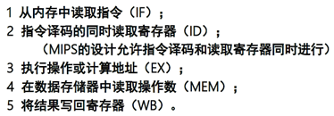

* 流水线寄存器的重要作用

  * 每个时钟周期结束后，该段的所有执行结果都保存在流水线寄存器中，在下一个时钟周期作为下一个段的输入；通过流水线寄存器，后段流水段可以向前级反馈数据和控制信息

  

* 流水线的启示

  

* 衡量指令速度的指标 CPI 

  *  Cycles per instruction，每条指令的平均时钟周期数；流水线可以减少指令的平均执行时间，可以认为是减少了每条指令的平均时钟周期数CPI，也可以认为是减少了时钟周期长度，还可以认为在这两方面都减少了

* 数据通路

  

* 在流水线中参与流水的包括：指令流（代码），数据流，控制流

* 流水线冒险

  * 结构冒险：也叫结构冲突，当硬件在指令重叠执行中不能支持指令所有可能的组合的时候，所发生的资源冒险
  * 数据冒险：在同时执行的几条指令中，一条指令依赖于前一条指令的结果数据，却得不到时发生的冒险
  * 控制冒险：流水线中的转移指令或其它改写PC的指令所造成的冒险

* 【习题1】

  

  

* 实现指令流水的两个最基本问题

  *  分段，为了重叠起来并行执行
  *  流动，能够向前同步推进执行和流水

* 结构冒险：结构冒险的问题出在指令集上

  

  

* 【习题2】

  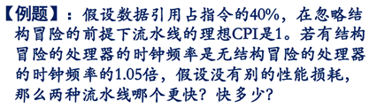

  

  * 数据引用会导致结构冒险，因为存储器只有一个，但是指令和数据可能都要用存储器，所有通常会把指令存储器和数据存储器分开

  

* 数据冒险

  

  

* 数据直通技术 

  * 代码样例： DADD R1,R2,R3;  DSUB R4,R1,R5， R1发生数据冒险

                                                    

  * 到ALU的数据来源：EX段末尾的ALU输出（e_valA），MEM段末尾的ALU输出端（M_valA, W_valA），MEM段末尾的存储器输出端（m_valM）

      

* 数据冒险的检测方法（可以用数据通路解决的部分）

  *  需要注意的问题：由于有一些指令不写寄存器，所以可能导致一些不必要的转发；对0号寄存器要特别对待

  

  

  

  *  除了要判断有regwrite，不是0号寄存器，还要保证不是上一条指令用的，不然就会转发一个过时的数据过去，这里rd是输出端口 

  

* 不能用数据通路解决的数据冒险

  * Load/use hazard: 因为rt是访存最后的输出端口

    

  * 数字部件中会有预测分支错误吗？

* 控制冒险，几种简单的编译时调度方法

  

* 动态分支预测

  

* 由各操作组件花费时间计算出来各条指令的执行时间 

  

* 流水线CPU

  

*  

------

### 第9讲 Cache

* 存储器的现状

  *  半导体存储技术相对CPU处理能力及其处理速度的发展来说，相对发展速度严重滞后
  *  人们对存储器的要求是又大又快，这本来就矛盾，而且人们还要求其价格尽可能低廉
  *  CPU的处理速度要远大于存储器响应的速度
  *  存储器的访问速度是制约计算机处理能力的瓶颈

* Cache的定义

  *  cache通常是存储器层次结构中的第一层的名字，是距离处理器最近的存储层次

  

* Cache的工作原理是基于局部性原理（时间局部性和空间局部性）

* 【习题1】

  

  解答过程如下：

  

  

  

  

* 存储器层次结构的四个问题

  *  块的位置：一个从主存来的块，可以被放置在cache的哪里？
  *  块的标记：如何找到放在cache中的块？
  *  块的替换：如果块发生缺失，cache中哪个块应该被替换出去？
  *  写时策略：CPU执行写操作时，该怎么处理

* 块的位置

  

  *  直接映射需要建立一个将主存中的每一个块对应到cache中的唯一位置的一个映射方法，通常是用“块地址 mod cache的块数”，方法简单，但是容易冲突
  *  全相联映射是哪里空就可以放哪里，按照某种算法来映射，这不容易冲突，但是映射方法和很复杂
  *  组相联：一个块首先被映射到一个组中，然后它可以被 放置到组中的任何一个块中；如果一个组中有n块，那么这种映射方法就称为n路组相联

  

* 块的标记

  *  Cache中的每一个块结构都有一个地址标记给出该块的贮存块地址信息
  *  需要在标志中加入一个有效位来标明该块是否有效

  

  *  这是一个两路组相连，一共512组的cache，一共1024个块，每个块大小64字节 

  

  *  这是一个2路组相连，一共4组，总共能放8个块的cache，而主存大小是32个块

  

  

* 替换策略

  *  因为直接映射的话要是在cache中肯定是在固定位置的，所以不用考虑，如果这个位置不是想要的东西，就替换掉

  

  

  *  对于大容量cache来说，LRU和随机替换算法几乎没有什么差别
  *  对于小容量cache，LRU替换算法最优，FIFO也比随机算法稍微好一点

* 写回策略

  *  Amdahl定律：高性能的设计不能忽视写操作速度对系统性能的影响

  

  

   

  

* cache性能评价

  *  对存储器层级结构较合理的评价方法是采用平均存储器访问时间  

  

  *  【习题】

  

  

   

   

  

* Cache性能优化

  *  Cache性能优化的方向有减少缺失次数/提高命中率，也可以是降低缺失代价，比如使用多级cache 

  

  

* 核心公式

  

  - 这个代表1000条指令有多少次缺失

  

  

   

  *  缺失率 = 1000条指令有几次data缺失/1000条指令有几条data指令，单位：次/条

  

  *  多级cache中

  

  

  

  

  

  

  *  1000次访存，667条指令，每条指令平均1.5次访存，L1 cache直接命中一次访存需要1个周期
  *  一次访存平均存储器访问时间5.4周期，所以1000次访存要5400个周期，那么一次访存平均耽搁时间就是5.4-1周期，每条指令的平均耽搁时间（停顿时间）就是4.4 * 1.5周期
  *  每条指令的平均存储器停顿周期是6.6周期，那667条指令需要停顿667 * 6.6=4400个周期，总时间是667条*（正常访存1.5个周期 + 平均指令停顿6.6周期）=5400周期

*  

------

### 第10讲 虚存 

* 虚存产生的原因

  *  消除小而受限的主存容量对程序运行及编程造成的影响
     *  允许单用户程序的大小超过主存的容量
     *  程序员能在整个CPU的地址空间范围内自由编程
  *  允许在多个程序间有效而安全的共享内存
     *  主存中只存放各个程序的活跃部分

* 虚拟存储器的本质目的

  * 解决 大的程序寻址空间 和 小的物理主存空间 之间的矛盾

  

  

* 虚拟存储器

  *  一个磁盘上的块可以放在内存中的什么位置：全相连
  *  如何在内存中查找一个块：页表
  *  当发生虚拟存储器缺失时，应该替换哪个块：LRU
  *  写操作时会发生什么：写回法

* 虚拟存储器

  

  

  

* 

 

