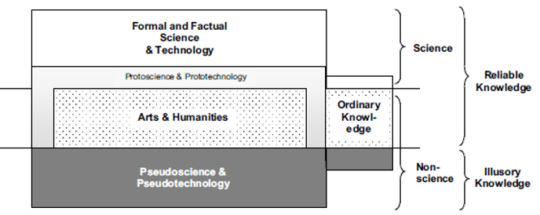
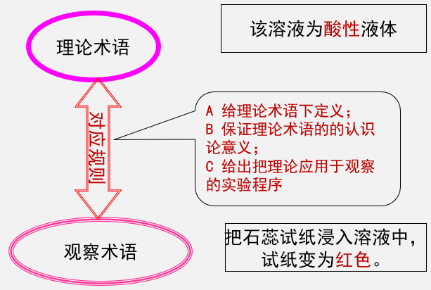
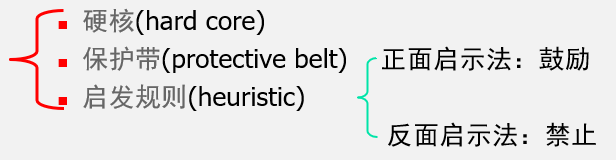
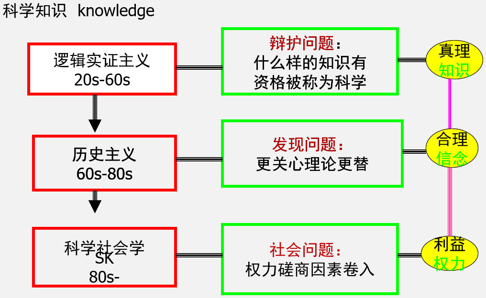
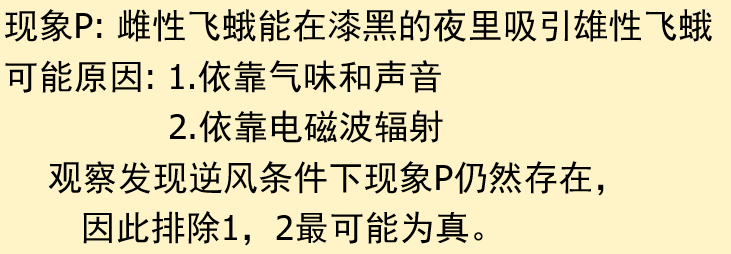
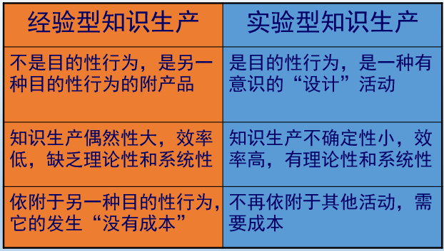
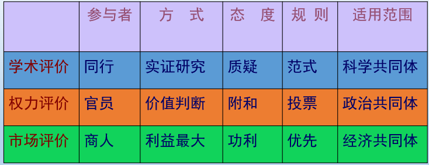
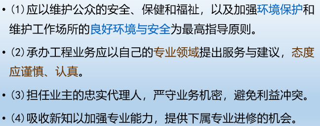
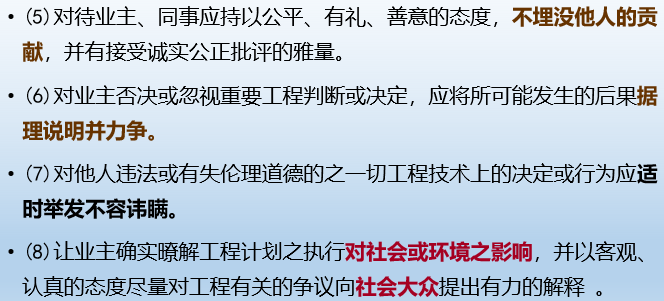

#### 自然辩证法 复习

---

#### 第一章 自然观

* 古代自然观

* 近代机械唯物主义自然观
* 辩证唯物主义自然观

##### 一/一、古代自然观

* 古代自然观
  * 神话或原始宗教的自然观
  * 古希腊、罗马自然观
  * 中世纪神学自然观
  * 中国古代自然观

* 古代自然观可以分为：神话的，巫术的，理性的
* 分析自然观要考虑：自然观、宇宙结构、人与自然的关系

##### 1.1.1 神话或原始宗教的自然观

* 神话是“ 通过人民的幻想用一种不自觉的艺术方式加工过的自然界和社会形式本身”
  * 中国有《山海经》和《淮南子》等；西方有《神谱》和荷马史诗等
  * 神话大体产生于旧石器时代晚期

* **神话的分类：创世的神话，反映技术斗争**
* 创世的神话
  * 大体产生在新石器时代，社会形态上是母系氏族社会中后期
  * 开天辟地、人类起源、民族诞生、文化发端以及宇宙万物肇始等

* 反映技术斗争
  * 巫术假定自然界是有规则的，人通过适当行为可以利用这些规则去控制自然。这是一种冒牌的自然法则体系
  * 巫术一方面直接导致宗教，另一方面又直接导致科学
  * 燧人氏、伏羲氏、神农氏、后羿射日、夸父追日、精卫填海、女娲补天、大禹治水

* 神话或原始宗教的自然观的**特点**
  * 主张**自然界与超自然界**之间存在二域的区分
  * 主张自然界中存在由超自然实体干预的**秩序**
  * 主张人能够凭借**精神的力量**去调节和控制自然

##### 1.1.2 古希腊、罗马自然观

* 古希腊、罗马自然观
  * 自然界的组成
  * 自然界运动变化的原因
  * 人与自然的关系
  * 亚里士多德的综合
* 关于自然的组成部分
  * 在自然界组成上的假说，用自然的原因解释自然：水、气、火、四根说、原子和虚空
  * 万物的本原是数（毕达哥拉斯）
* 关于自然组成的**特点**
  * 对自然宇宙作出**非神话的解释**
  * 用**物质性**的因素加以说明
  * 从朴素到**精致**

* 自然界运动变化的原因
  * 灵魂、命运、永恒的变化、爱恨之间的斗争、偶然的碰撞
* 在人与自然关系上
  * 前苏格拉底时期：关注本体论的纯自然物
  * 后苏格拉底时代： 关注社会伦理和**认识论，注重逻辑的完备性**
    * 苏格拉底：自知自己无知是最聪明的
    * 普罗塔哥拉：人是万物的尺度”，凸现相对主义和感觉主义

* **亚里士多德综合**
  * 目的论解释模式：四因说
  * 亚氏的宇宙模型：多层天球
  * 人与自然的关系

* 目的论解释模式：**四因说**
  * 质料因：砖瓦
  * 形式因：图纸
  * 动力因：建筑师
  * 目的因：居住
  * 对自然物而言，**导致运动和生长的原因**只有：质料因和目的因
  * 亚氏最终用质料与形式、潜能与现实来解释事物的运动、生成与变化

* 亚里士多德：人与自然
  * **人依赖于他所生存的环境**
  * **遵从事物的秩序即求善**
  * 顺应自然、服从命运安排的生活才是道德的生活，才是幸福的生活

##### 1.1.3 中世纪神学自然观

* 基督教神学关心的五大论题
  * 上帝创世论，人类中心论，原罪观念，神恩论，对不朽的信仰
* 基督教神学自然观
  * 宇宙观：结合宗教教义，以**托勒密的“地心说”**为核心，构造了三重世界：地狱、世间和天堂
  * 物质观：以亚里士多德的**“四元素说”**为根本
  * 运动观：同样以亚里士多德的“物理学”运动描述为根本，分为**“自然”运动和“强迫”运动**
  * 目的论解释特征：每一个自然事物的存在都有其原因
* 基督教神学自然观的**特点**
  * **上帝绝对创造观念：**具有灵魂、自主生长的自然被禁止，自然是与人无关的存在物
  * **神与自然的分离：**自然不再是令人敬畏的神灵，而是让人类去珍惜、研究和管理的“上帝的作品”
  * **异端的泛神论思想：**自然本身就是神圣的存在物

* 基督教神学自然观的**方法**
  * 论证上帝的存在和全能比什么都重要
  * 对上帝的崇拜态度，对宗教教义的崇拜态度，对古代经典作家的**文本崇拜**的态度代替了研究的态度
  * 发展了**论证的方法**而不是面向自然界的实验的研究方法；发展了高度精致的哲学思辩，锻炼了逻辑方法

* 神学自然观的社会**作用**
  * 由于占统治地位的基督教宗教成为支配西方世界的宗教性意识形态，加之这种封建性宗教的封闭性，不允许怀疑和批评存在
  * 中世纪社会具有强烈的：**封闭性、等级性、神权性**

##### 1.1.4 中国古代自然观

* 中国古代自然观
  * 5世纪～15世纪：中国在科学技术上一度领先，其标志是形成了：
    * 四大学科体系：农、医、天、算
    * 四大发明：指南针、印刷术、火药、造纸术
  * 与古希腊比较：由定律、定理表现的**理论自然科学**不如古希腊，而**实用科学**长期处于领先地位

* 宇宙的构成：**阴阳五行说**
  * 五行思想应用在气象学、矿物学、中医理论
  * 中国的思想家们制造了一个十分**全面**的关于各种事物之间关联的图解。但是过分**牵强附会**这种关系，就产生了许多荒诞的论点
* 汉代以后，中国的自然观趋向于理性
  * 儒家的自然观，见诸于《易》
  * 道家的自然观：万物的本原是先天地生的非物质的“道”，道家思想中有许多积极和可取的观点
* 宇宙的结构：盖天说、浑天说、宣夜说
* 人与自然的关系
  * 顺天说：人顺应自然
    * 如果不按天道规律行事，则人们行为的合法性将受到质疑
  * 助天说：人与自然并立
  * 制天说：天人交相胜
    * 荀子“制天命而用”，利用自然规律，顺势诱导

* **中国古代自然观的总特点**：朴素的唯物辩证法思想，也有非理性的因素
  * 强调关系**（阴阳五行）**、变化**（气）**，自发运动
  * 缺乏有形的**物质始基思想**
  * 强调自然、社会和人生统一或联系**（天人合一）**
  * 理性和非理性杂糅，分野比较晚近
  * 后期基本没有大的变革

##### 一/二、近代机械唯物主义自然观

* 近代机械唯物主义自然观
  * 机械论兴起的形而上学基础：伽利略、笛卡尔
  * 机械论自然观的科学基础：哥白尼、开普勒、伽利略、牛顿
  * 机械自然观的基本观念

##### 1.2.1 机械论兴起的形而上学基础

* 毕达哥拉斯主义的复兴
* 伽利略：现代科学之父
  * 开创**“数学—实验方法”**，排除目的论：从经院哲学在分析变化和运动时采用的模糊目的论范畴（ WHY）转向关于时间和空间的确定数学关系（HOW）
  * 自由落体运动、惯性运动、抛物运动。

* 笛卡尔
  * 二元论：对**精神与物质的严格二元划分**，使人们能够从根本上对自然界作机械论的解释，从而排除神学因素对科学研究的干扰
  * 机械类比：动物是机器VS人是机器
  * 方法论基础主义：我思故我在——怀疑一切的理性精神

##### 1.2.2 机械论自然观的科学基础：从哥白尼到牛顿

* 哥白尼：日心说
* 开普勒
  * 在第谷·布拉赫的资料基础上发现了行星运动三定律，破除了天体必须以完美正圆运行的观念；发现了运行速度不均匀的特性

* 伽利略：近代物理学之父
  * 力学成就：匀加速运动定律；自由落体定律；惯性原理；抛射体运动定律
  * 发明了天文望远镜，发现了月亮有环形山，发现木星的4个卫星
* 牛顿
  * 牛顿经典力学体系，是以绝对化的四个基本概念——空间、时间、质量、力为基础，以著名的三大定律为核心，以万有引力定律为最高的综合，用微积分来描述物体运动的因果律

* 牛顿力学的意义
  * 实现了第一次物理学大综合
  * 导致了力学科学的革命
  * 推动了力学和其他学科的全面发展
    * 分析力学、固体力学、弹性力学、流体力学
  * 开创了理性新时代

* 牛顿力学的局限
  * 绝对时空观
  * 超距作用：物体间的引力传递看作是既不需要介质又不需要时间的过程

##### 1.2.3 机械自然观的基本观念

* 机械自然观的基本观念
  * **坚持人与自然的分离**
  * **严格决定的因果关系**
  * **还原论**
  * **机器的隐喻代替机体的隐喻**

* 人与自然的区分
  * 神话自然观中自然是充满神灵的有机体，**人与自然没有区分**，人本身从属于自然界
  * 基督教神学自然观中，**人和自然都是上帝的创造物**，上帝赋予人管理自然的权利，人可以照料充满神性的自然物
  * 笛卡尔以来的**二元论划分**，使人们开始把注意力放在对自然物本身的研究上，而不必顾忌对神性的冒犯，在“征服自然”的口号下人们对自然事物进行细致的研究

* 严格决定论
  * 取消了偶然性
  * **拉普拉斯决定论**：拉普拉斯认为上帝是一个不必要的假设
  * 1846年海王星的发现
    * 扩大了牛顿体系的影响，加深了人们对严格决定论的信念

* 还原论的说明模式
  * 复杂事物由简单的微粒构成，复杂现象可以由简单现象说明
  * 坚信自然界可以用**质点**在绝对**时空座标**内的**机械运动**加以说明
  * 物体甚至力都是可以取消的
    * F=ma 彭加勒用加速度取消力的概念

* 机器的隐喻
  * 笛卡尔：**“动物是机器”**，自然图景是一种受精确的数学法则支配的完善的机器
  * 拉梅特利：**“人是机器”**

* 机械自然观的影响及后果
  * 由于牛顿力学的成功，加上近代科学诸学科中其他科学尚处于搜集材料的阶段。最先成熟的**牛顿模型**成为一切科学的典范
    * 道尔顿，库伦，卢瑟福
  * 在人文和社会科学中也力学原则
    * 洛克，亚当斯密
  * 牛顿力学原则在18世纪法国启蒙思潮中发展为**极端的机械唯物论**
  * 机械唯物论虽然在反对神学的斗争中曾起到一定的积极作用，但是其后果是使18世纪自然科学**在自然观上低于古希腊**，甚至导致**唯心主义和神秘主义的目的论**
    * 牛顿：神的第一推动；林耐：上帝创造最初的物种
    * 冯·哈勒：第一物种；居维叶：上帝的连续创造

##### 一/三、辩证唯物主义自然观

* 辩证唯物主义自然观
  * 近代自然科学的全面发展
  * 近代自然科学的特征
  * 辩证唯物主义自然观的创立

##### 1.3.1 近代科学的全面发展及其对形而上学自然观的冲击

* 天文学中的新观念：打开形而上学的**第一缺口**
  * 康德星云假说：用原始星云的吸引和排斥解释太阳系的起源，否定神的第一推动
  * 康德的潮汐摩擦理论：说明太阳系不仅有起源，还有终结死亡的演变过程
* 地质学中的新理论
  * 赖尔地质说：用魏尔纳的水成论与赫顿的火成论这组地球表面的对立力量解释地球表面的发展变化，批判了当时占统治地位的灾变说
* 物理学大综合
  * 能量守衡与转化定律的发现，揭示了各种运动形式之间的普遍联系（迈尔、焦耳）
  * 电磁理论的大统一，揭示了光、电、磁的统一（麦克斯韦）

* 化学上的新发现
  * 原子-分子学说的确立
  * 元素周期律的发现（门捷列夫）
  * 尿素的合成：揭示了无机物与有机界的联系（维勒）

* 生物学的新进展
  * 细胞理论：揭示了生物界的统一（施旺、施莱登）
  * 生物进化论：批判了目的论、神创论、不变论

##### 1.3.2 近代自然科学的特征

* 近代自然科学的特征
  * 自然科学开始**全面发展**，不再局限于某个学科
  * 自然科学开始深入研究事物的**演变发展过程**
  * 开始由搜集材料阶段转向**整理材料**阶段

##### 1.3.3 辩证自然观的创立

* 物理学新发现
  * 伦琴射线，贝克勒尔发现放射线，汤姆逊证实电子存在，居里夫人发现放射线元素
  * 动摇了几千年原子和元素观念——认为原子不可分、是物质组成最小单元；认为元素不变
* 两片乌云：
  * 黑体辐射问题：量子力学
  * 以太飘移问题：迈克耳孙-莫雷实验，相对论

* 物理学革命的后果
  * **物质和运动观：**彻底推翻了物质与运动无关的形而上学观点
  * **时空观：**时空不仅与物质关联，而且本身就是物质、运动的存在属性和方式
* 物理学革命在哲学上的后果
  * 物理学革命引发了一系列深刻的科学和哲学争论，使得科学向辩证法复归
  * 系统、人工、生态自然观

##### 一/四、总结

* 古代朴素唯物主义 - 近代机械唯物主义 - 现代辩证唯物主义：合-分-合
* 依附自然 - 支配自然 - 尊重自然
  * 启蒙理性：主客二分的机械论世界观
  * 辩证理性：人与自然和谐共生
* 人与自然是生命共同体：生产、生活、思维方式

---

#### 第二章 科技观

* 科技观
  * 什么是科学
  * 科学的发展模式
  * 科学知识的特征

##### 二/一、什么是科学

* 什么是科学
  * 作为人类精神成果的科学：知识体系
  * 作为人类创造知识的活动：科学活动
  * 作为社会组织形式的科学：社会建制
  * 作为生产力的科学：科学是第一生产力
  * 作为一种方法的科学：科学方法论
  * 作为一种文化的科学：科学文化
  * 作为人与自然对话：科学对话

* 作为知识体系的科学：古希腊认为科学是**一种知识**；中世纪经院哲学把神学也称为科学，取有体系的知识这个含义
* 作为一种活动的科学：科学还应该被理解为是形成和产生科学知识、运用科学知识的**实践活动**
* 作为一种**社会建制**的科学：所谓科学的社会建制，指科学事业成为社会构成中的一个相对独立的**社会部门和职业部类**的一种社会现象
* 作为**生产力**的科学：生产力里面也包括科学在内，科学技术进步对经济发展的贡献率是**知识经济**
* 作为一种方法的科学：所谓科学方法，是在实现科学认识活动中所遵循的**途径**和运用各种**方式和手段**的总和
* 作为一种文化的科学：科学是一种相当特殊的文化，虽然生长自民族文化环境，但科学成果一旦被公认，就具有**普遍性、公有性、无偏见性**

* 科学是人与自然间永不完结的对话
* **科学的本质：**
  * **科学是人与自然的理论关系，是一般生产力**
  * **技术是科学的物化形态，是现实生产力**
* **科学方法：**理性方法运用于感性材料

##### 二/二、科学的发展模式

* 科学的发展模式
  * 科学与非科学的划界
  * 科学的发展模式

##### 2.2.1 科学与非科学的划界

* 科学与非科学的划界
  * 反思科学需要确定科学的界限
  * 非科学、伪科学、反科学
  * 划界的社会政治意义
    * 维护科学的自治，防止宗教和政治因素对科学研究的干扰：哥白尼、李森科事件、文革
    * 科学自主权的限度：巴尔的摩事件

* 中国对自然科学的哲学批判：对科学的批判基本上是为政治服务的

##### 2.2.2 科学的发展模式

* 科学的发展模式
  * 亚里士多德以来的实证主义
  * 逻辑实证主义
  * 批判理性主义
  * 历史主义

* 亚里士多德以来的实证主义
  * 科学通过其原理的**确实可靠性**而与意见、迷信区分开来，通过**对第一因的理解**而与工艺区别开来
  * 经验证实原则，孔德
    * **经验是知识唯一的来源和基础**，一切科学的知识必须建立在来自观察和实验的经验事实基础之上
    * **把知识局限在主观经验范围之内**，不讨论经验之外是否有事物存在

* 逻辑实证主义
  * 区分科学与形而上学的“意义标准”：科学知识的最小单位是**科学命题**，当一个命题能为经验或逻辑所**证实或否证**时，它才是科学的，才是具有意义的
    * 科学理论是一个公理系统，其中术语分为三类：**逻辑术语或数学术语、理论术语、观察术语**
  * 逻辑经验主义的“经验证实”标准不断弱化
    * **科学命题的确实性弱化为方法的确实可靠性**
  * **完全证实和可能证实**
    * 完全证实：从逻辑上、经验上都能做出明确无疑的说明
    * 可能证实：指一个命题具有被证实的可能性
  * 经验证实
    * 经验的可否证实是“原则上”的
    * 经验证实有直接和间接证实两种：**“直接经验证实”**是指当下的经验证实，**“间接经验证实”**是在直接经验的基础上，通过逻辑推理来证实
    * 在实际的科学实践中，并不是所有的经验对命题的支持具有相同的权重

* 批判理性主义

  * 波珀对可证实性标准的批判：**科学与非科学的区别在于它是否具有可证伪性**
  * 理论基础：否定后件推理
    * **一个命题所包含的内容越多，其可否证度越高，就越可能被否证，也就越科学**
  * 波普尔可证伪性标准的应用

  * 局限性
    * 科学理论不那么易证伪
    * 可否证性标准太窄，随便提出个假说都可混入科学之列

* 历史主义

  * 历史主义否认唯一确定的科学标准：认为科学是一种社会事业，科学与非科学**没有绝对分明的界限**
  * 库恩：范式不可通约，没有科学与伪科学之分
    * 占星术、炼金术也是一种科学形态
    * 把科学从一种**表象**的活动看成是一种**实践**的活动
  * 拉卡托斯：进步的科学研究纲领
    * 科学哲学的目的在于提供一个规范的方法论，可以提供科学研究方案的评价，并据此评价是进步的研究纲领还是退步的研究纲领
  * 费耶阿本德：怎么都行
    * 无政府主义，认为科学与宗教迷信、理性和非理性都对认识具有重要作用
    * 从知识方面看，科学到处都在利用非科学的方法和非科学的成果来丰富自己
    * 从道德方面看，划分科学与非科学也是有害的

* 历史主义的启示
  * 我们研究科学，就是要去解释一个科学信念（belief）如何被接受并成为人们实践的基础，以及一组信念为什么被另一组信念取代

* 科学的发展模式小结
  * 纵向上，科学发展是渐进与飞跃的统一
  * 横向上，科学发展是分化与综合的统一
  * 总体上，科学发展是继承与创新的统一

##### 二/三、科学知识的特征

* 科学知识的特征
  * **解释性与预见性：**科学并非事实的简单堆积，它能够提供对事实的普遍的解释。理论越深刻，越远离常识，它的预见性也越强
  * **主体间性：**科学产物为不同认识主体所理解、交流、检验和认可
  * **精确性与系统性：**在特定条件、范围内成立，科学的应用有边界
  * **可检验性：**需要在给定相同的条件下得以重复
  * **可错性：**科学的探索结果可能会出错
* 工具理性在两个方面影响人类社会
  * 科学的客观化和定量化致力于把质变变成可测试的量
  * 主体与定量化倾向相结合就是把认识者还原为纯粹逻辑的、没有个性的、一般的人
  * **同一性就压制、侵犯了差异、特殊和他者**

* **科技异化**造成人的主体地位丧失，科技的资本化运用是科技异化的根源。改变生产资料的资本家**私人占有制**是消除科技异化的前提
  * 科技中性论受到挑战

---

#### 第三章 科学技术方法论

* 科学技术方法论
  * 科学中的方法
  * 科学思维方法
  * 非逻辑方法

##### 三/一、科学中的方法

* 优先权之争是科学史上不幸一章：由于科学探索中充满了不确定性，要在科学竞争中取得成功，恰当的科学方法尤为重要

* 方法的重要性
  * 有无正确方法对科研有重要意义和作用：良好的方法能够使得我们更好的发挥运用天赋的才能
  * 方法作用随**研究者和研究阶段**而变化：解决问题，没有一定的知识储备是不行的；有的时候，装满知识的大脑，却成为解决问题的障碍
  * 方法对准备从事研究和刚刚踏上研究道路的人更为重要

* 如何获得科学中方法
  * 通过与导师以及其他高水平科学家的接触，体验、学习方法
  * 通过学习科学史来学习方法
  * 通过专门的科学方法论，阅读科学家传记等，学习科学家的方法和研究心得
  * 通过总结自身研究的经验和研究艺术，学习方法

##### 三/二、科学思维方法

* 科学思维方法
  * 溯因推理与最佳说明推理
  * 类比与移植
  * 分析与综合
  * 归纳与演绎

##### 3.2.1 溯因推理与最佳说明推理

* 溯因推理
  * 现象P被观察到
  * 若H是真的，则P理所当然地是可解释的
  * 因此，有理由认为H是真的

* 最佳说明推理
  * E是事实、观察等数据的集合；而对此有一系列说明性假说H1、H2、H3···
  * 如果H1为真，将说明E
  * 没有其他假说像H1一样好地说明E
  * 因此，H1（可能）是真的

##### 3.2.2 类比与移植

* 类比：类比方法也称**类推方法**，是根据两类对象之间在某些方面的相似或相同而推出在别的方面也可能相似或相同的一种科学方法
  * 卢瑟福：原子结构的太阳系模型
  * 库仑电荷与引力相互作用的类比
  * 富兰克林：莱顿瓶放电与雷电类比

* 移植：移植方法是**吸取、借用**一个研究领域、一个研究对象的理论成果和科学方法，运用于其他研究领域和对象的一种方法

##### 3.2.3 分析与综合

* 分析：分析是把客观对象的整体**分解**为一定部分、单元、环节、要素并加以认识的思维方法
* 综合：综合是在分析基础上把对客观对象一定部分、单元、环节、要素的认识**联结**起来，形成对客观对象统一整体认识的思维方法

* 近代科学中的**还原主义分析方法**，从宏观物体深入原子内部，进入夸克层面，但是容易**只见树木，不见森林**，有必要辩证地系统分析

##### 3.2.4 归纳与演绎

* 归纳：归纳法是从个别或特殊事物**概括**出共同本质或一般原理的逻辑发现方法

* 历史上的归纳方法
  * 亚氏：简单枚举法、直觉归纳法
  * 穆勒五法
    * **求同法：**研究对象E在不同场合出现，若各个场合除一个条件C相同外，其他条件都不同，那么，C就是E的原因（发霉的花生和黄曲霉素）
    * **求异法：**现象E在不同场合发生，在这些场合除一点C不同外，其他情况都相同。那么C就是E的原因（茶和坏血病）
    * **求同存异共用法：**现象E在不同场合出现中只有一个共同因素C，在不出现的场合都没有C。则C是E的原因（碘和甲状腺肿）
    * **共变法：**其他条件不变情况下，C发生变化，E也随之发生变化，则C是E的原因（波义尔定律，气体体积和压强成反比）
    * **剩余法：**根据已知全部条件，都不足以说明现象A变化的原因，则必有其他某一或一些条件是现象A变化的原因（天王星轨道和海王星）

* 归纳问题
  * 归纳是从**单称命题**（观察或实验结果的报告）推导**全称陈述**（假说或理论）的推理
  * **归纳推理本身的可靠性**无法通过归纳方式加以证明，否则就是循环论证
  * **休谟**最早提出归纳问题，他把归纳问题分为**逻辑问题和心理问题**加以解答
  * 科学定律具有**先验性质**。如果过分坚持归纳，归纳问题无法避免

* 演绎
  * 演绎是从一般性原理出发，对个别的或特殊的事物进行分析、推理，从而达到相应的结论
  * **三段论**是演绎方法最一般的形式，它由大前提、小前提和结论三部分组成
* 三段论的要求
  * 前提必须为真：防止假前提真结论
  * 前提必须无法证明：防止解释的无穷倒退
  * 前提比结论更为人所知：一门科学的一般规律应该不证自明
  * 前提必须是在结论中所归属的原因。最重要的是因果关系

* 三段论的局限性
  * 拘泥于主谓结构，无法处理**众多参量和复杂的关系**
  * 从一般到特殊，虽可保持真值传递，但**并未增加知识**
* 公理化方法
  * 从尽可能少的基本概念、公理、公设出发，运用演绎推理规则，推导出一系列的命题和定理，从而建立整个理论体系的方法
  * 公理化方法最早的倡导人是**亚里士多德**（三段论），第一个古典的公理化体系是**欧几里德**
  * 公理满足的条件：无矛盾性，完备性，独立性
* 公理化方法出现的问题：**悖论**，数学史上第三次危机
  * 说谎者悖论，理发师悖论
  * 悖论在物理学中称为佯谬，在哲学中称为二律背反
  * 结论：单靠数学和逻辑是行不通的

* 归纳与演绎总结
  * 归纳是演绎的基础，归纳获得的结论可以成为演绎的前提
  * 演绎是归纳的指导，演绎得出的结论可以成为归纳的指导思想

##### 三/三、非逻辑方法

* 逻辑思维并不是科学思维的唯一类型
* 非逻辑的**形象思维和直觉思维**也是科学思维的重要类型

##### 3.3.1 形象思维与科学想象

* 形象思维同逻辑思维的区别
  * 其思维的基本单元不是抽象的**概念**，而是形象的**意象**
  * 不是运用概念进行**判断和推理**，而是运用意象进行**联想和想象**

* 形象思维的方法论意义
  * 可以直观地揭示对象的**本质和规律**
  * 可以突破思维的限制，揭示对象的本质
  * 在技术领域有更突出的意义

##### 3.3.2 直觉思维与灵感

* 直觉思维
  * 直觉思维是指不受某种固定的逻辑规则约束而**直接领悟**事物本质的一种思维方式
  * 直觉是一种**心理体验**，有时称为灵感。它是主体的创造力突然达到超水平发挥的一种特定心理状态。在直觉与灵感中还包含使问题一下子澄清的顿悟

* 总结：科学技术方法论
  * 初期：非逻辑方法
  * 中期：形式思维
  * 后期：辩证思维

---

#### 第四章 科学技术与社会

* 科学技术：一种特殊的社会建制
  * 科学技术体制化
  * 科学技术的内部运行机制
  * 科学技术的外部运行机制

* 科学家与工程师的社会责任
  * 科学家的社会责任
  * 工程伦理

##### 四/一、科学与技术：一种特殊的社会建制

* 科学与技术
  * 科学技术体制化的先决条件
  * 科学技术建制化的历程
  * 科学技术体制化的趋势

##### 4.1.1 科学技术体制化的先决条件

* 科学技术体制化的先决条件
  * 科学的建制化指的是人类在寻求知识及其发展、传播和应用的活动中形成的特殊的**价值观念、制度规范、组织体系和物质支撑**的组织体系
  * 价值观念：科学技术知识的生产、传播、和应用成为社会肯定和支持的体制目标
  * 制度规范：行为规范、奖励机制以及其他制度安排。如国家科技政策
  * 组织体系：学会、研究院所、实验室、大学
  * 物质支撑：资金、设备、教育
* 科学技术体制化的含义
  * 科学技术活动具有重要的社会功能
  * 科学技术是不可替代的特殊劳动
  * 当同一领域的科学家相互承认，开始交换科学信息的时刻，就是职业体制化的起步
* 科学技术建制化的过程包括**组织的体制化**和**认识的体制化**

##### 4.1.2 科学技术建制化的历程

* 希腊化时期的科学和科学家
  * 从哲学家中分化出专门研究某种知识的人
  * 具有经验主义和实用主义倾向
  * 有国家支持的研究和教育机构
* 中世纪后期的科学和科学家
* 文艺复兴时期
  * 学者与工匠的结合，形成科学传统
  * 航海家的冒险推动了科学的需求
* 近代科学的体制化
  * 功利主义以及对科学的兴趣：清教徒成为推动科学、赞助科学的力量
  * 私人实验室的出现
  * 新型大学的出现
  * 科学组织：伦敦 英国皇家学会、巴黎 法国科学院、莱布尼茨 柏林科学院

##### 4.1.3 科学技术体制化的趋势

* 科学技术体制化的趋势
  * **知识生产从“经验型”转向“实验型”**
  * **知识生产从“专门化”到“职业化”**
  * **走向知识社会：从“小科学”到“大科学”**
* 知识生产从“经验型”转向“实验型”

* 知识生产从“专门化”到“职业化”
  * 专业化是体制化的前提，但**专业化不等于职业化**
  * 至19世纪，科学开始发展成为一种具有广泛性的、专门的职业，这使得科学家这种社会角色在社会中稳固地确立起来

* 走向知识社会：从“小科学”到“大科学”
  * 大科学：科学在按指数规律高速增长的基础上成为全社会范围内的、以集体合作的形式**有计划地**进行研究的事业
  * 大科学的特点：科学研究的规模大，科研成果数量多，科研成果的影响大，以集体研究为主要组织形式，科研选题的有计划性
  * 在大科学时代，科学技术**全面体制化**
  * “大科学”以知识化为标准全面改变社会基础设施，**走向知识社会**成为必然趋向

##### 四/二、科学运行的内部机制：科学共同体及其行为规范

* 科学运行的内部机制
  * 科学共同体概念的提出
  * 传统的科学共同体理论
    * 体制目标
    * 行为规范
    * 科学共同体的奖励系统和社会分层
    * 马太效应、楼台效应和小镇效应
  * 科学界中的越轨行为
  * 科学共同体理论的新发展

##### 4.2.1 科学共同体概念的提出

* **科学共同体**概念的提出
  * 科学共同体是指从事相似研究活动有着一定联系**（交流、合作、竞争）**的从事科学活动的人群
  * 科学共同体是科学社会建制的**基本构成要素**，它指的是科学家集团的一般抽象存在形式，其内涵在于它的特殊的**体制目标、行为规范和精神气质**

##### 4.2.2 传统的科学共同体理论

* 传统的科学共同体理论
  * **体制目标：**科学的制度性目标是**扩展被证实的知识，增进人类知识总量**
  * 行为规范（精神气质）：科学的精神气质是引导适当科学实践的行为规范，遵守会得到回报，违反会受到惩罚

* 社会对科学家行为动机的诱导
  * 薪金——维持生计
  * 奖励——声望、信念、承认
* **传统科学共同体的行为规范**
  * **普遍主义：**科学成果只以科学本身的价值为准则，科学职业向一切有才能的人开放
  * **公有主义：**科学知识是公有的，科学家对他的发现只享有**首创权**，而不是占有权
  * **无私利性**：科学中的诚实
  * **有条理的怀疑：**在完全确证之前，科学共同体并不信任新思想，决不未加分析批判地盲目地接受一切
  * 诚实性

* **优先权和科学规范**是实现科学体制目标的两大手段

* 科学共同体的奖励系统：科学以一定的奖励系统作为内部的基本运行机制（科学发现的优先权）
* 科学的社会分层
  * 科学社会的金字塔型等级是科学家贡献差异的结果
  * 科学中的权威结构是社会分层的结果。权威结构成为科学界的代表，是科学系统资源分配的主要力量
  * **权威结构无强制性约束，科层结构有强制性约束**
  * 科学共同体内不是平等的

* 科学分层中的各种效应
  * 奖励和承认存在稀缺性，稀缺造就竞争和权威性
  * **马太效应：**科学家取得一定的优势以后，就有了更多机会去获得承认和报偿。实指科学奖励分配中的优势积累现象
  * 楼台效应：“近水楼台先得月”，科学奖励与承认的“师徒链”和“家族相关”
  * 光环效应：人们倾向于引证那些对所研究的问题或领域具有影响的工作，但同时也倾向于引证著名科学家的论文
  * 回溯效应：当一位科学家的杰出成绩得到承认后，人们可能会追溯并重新评价其早期工作
  * 波敦克效应：解释科学家在分层体系中因地位不佳而造成对获得“承认”不利的现象
  * “努道普效应”与“韦泰梅效应”：低声望机构的科学家得到承认，高声望机构的科学家不被承认
  * 普朗克效应
  * 棘轮效应：科学家一旦因为自己的工作而获得某种承认与地位，就再也不会退回到原来的地位；科学界分层结构中的流动是单向的，只能升迁不可逆下
  * 奖励的时间效应：一个人获得奖励，尤其是高层次的奖励后，即使他以后不再有新的建树，也能够在很长的时间反复受到已获得奖励带来的有效影响

##### 4.2.3 科学界中的越轨行为

* 越轨行为的表现
  * 违反无私利性：
    * 不规范公布科研成果
    * 非科学目的使用科学资源
    * 获取科学资源的恶性竞争
  * 违反公有主义
    * 不尊重他人科研成果
    * 不适当的科学保密
    * 无端占有他人成果
  * 违反合理怀疑主义
    * 缺乏学术民主
    * 为伪科学张目
    * 进行伪科学甚至反科学研究
  * 违反诚实性
    * 伪造类作伪
  * 违反普遍主义
    * 非学术标准的学术资源分布
    * 形而上学地对待科学名流
    * 科学沙文主义及标签行为
  * 违反科技伦理道德
    * 实施与社会伦理相悖的研究
    * 实施对人类生存和发展有害的研究
    * 实施对自然环境有害的研究

##### 4.2.4 科学共同体理论的新发展

* 科学共同体理论的新发展
  * 体制目标的新变化：不仅服务于人类利益，而且强调服务于国家利益和企业利益
  * 科学家行为方式的新变化：**“创新性”规范**成为中心，公有性和无私利性的规范的约束作用正在淡化
  * 科学共同体的分化：国家和企业作为重要力量介入学术研究，导致传统的“科学共同体”正在出现**分化和重组**

* 科学研究中**追求创新、客观求实、批评怀疑**的精神气质没有改变

##### 四/三、科学与国家利益：科学运行的外部环境

* 科学运行的外部环境
  * 科学与国家利益
  * 科学的政治意蕴
* 科学的政治意蕴：有用的技术和科学是**文明社会和自由政体的基础**

* 科学不能脱离社会政治的影响
  * 社会政治的制度为科学技术发展提供**可能性空间**
  * 社会政治在政策和体制上实际地决定着科学技术的**可能发展方向和道路**
  * 社会政治行为和形势对科学技术的发展提供了**一定的条件**
  * 事实上，政府部门、经济单位都参与了科学和技术活动；**科学发展是面向自然对象的社会磋商的结果**

* 科学依赖于政府的支持
  * 背景：科学知识生产方式从“经验型” 向**“实验型”**转变，科学技术活动的**专业化、职业化**并进而**体制化**
  * 科学知识的生产在资源上依赖于社会的供给，依赖于国家的支持

* 政府介入或影响科学的三种方式
  * 资源分配：通过控制投入来影响科学技术的发展
  * 科技政策与科技计划：通过计划和政策调节和控制科学技术的发展方向
  * 意识形态：通过社会政治气氛影响科学技术的运行

* 科学家与政治家的冲突
  * 政治因素介入可能危及科学发展的相对自主性
  * 政治与科学结合有使科学官僚科层化的危险
  * 科学与政治的结合有可能使科学家成为权力的附属品

* **科学与民主：相互支撑**

##### 四/四、科学家与工程师的社会责任

* 科学家与工程师的社会责任
  * 科学家的社会责任
  * 工程师伦理

##### 4.4.1 科学家的社会责任

* 科学家是不是价值中立的
  * 中立说：“中立论”中最具代表性而且在科学界影响甚广的是**逻辑实证主义**
    * 不仅科学知识本身价值中性，而且科学活动的动机、目的只在于科学自身，不参与个人的价值
  * 非中立说：从认识角度、从整体上来历史地考察科学产生及其发展的社会背景,科学对社会、尤其是现代社会的影响,那么我们只能把“中立论”看作**一种神话或一种理想**
    * “为科学而科学”的清高和超脱已不符合时代的要求。科技工作者必须考虑科学的社会后果以及自己的社会伦理责任
* 责任：从哲学角度看，作为行为者的人和行为后果之间的关系是责任的核心。**责任观念和因果性**联系在一起

* 科学家的社会责任：把科学放到社会的环境中，要考虑科学家在社会中**身份的多重性**

##### 4.4.2 工程伦理

* 工程伦理
  * 工程伦理的兴起
  * 工程伦理的核心议题
  * 案例分析
* 工程伦理的兴起
  * 早期的工程伦理准则**侧重于专业内部**，主要涉及工程师与客户（雇主）、同事以及工程师个人对工程专业的关系
  * 二战后纷纷强调工程师**对社会的责任**

* 工程伦理中的核心问题：工程和工程伦理学讨论七大主题
  * **工程项目是社会试验**，既产生新的可能，也产生风险。工程师分担创造益处、防止伤害以及拥有知会危险的责任
    * 保证安全
  * 道德价值渗透到技术发展的各个方面，因此工程中的**伦理与卓越**并行不悖
  * 在与伦理准则提出的、所有工程师都遵守的责任原则一道，**个人意义上的承诺**在工程伦理中关系重大
  * **促进负责任的行为**比惩罚不道德行为更为重要
    * 工程伦理更多是预防伦理
  * 像在其他地方一样，工程中也出现**伦理困境**，因为道德价值多种多样，可能产生冲突
    * 公司雇员和社区居民的多重身份
  * 工程伦理应既探讨**微观问题**，也探讨**宏观问题**，而且它们常常是相互关联的
    * 微观问题涉及到个人和公司做出的决定，而宏观问题关乎全球性的问题
  * 技术发展表明**谨慎的乐观主义**——谨慎的乐观主义是合理的

* 工程伦理：安利研究
  * 微观的工程伦理学，从工程学会的**伦理准则**出发，主要面向工程伦理教学
  * 宏观工程伦理学，其着眼点在于**工程整体与社会**的关系

* 世界工程组织联盟提出的伦理规范

* 伦理抉择八步法
  * 伦理问题定义或叙述：从所收集之个案定义所欲分析之伦理问题
  * 存在的事实
  * 受影响的单位
  * 违反之伦理守则：什么事实违反了那一条伦理守则
  * 寻找可行方案并继续检视事实
  * 分别评估各可行方案：评估法则可依据伦理原则及可行性原则讨论
  * 统合、建构最佳方案
  * 执行 

---

#### 第五章 科技与生态

* 科技与生态
  * 全球化困境与生态危机
  * 可持续发展理念及实践
  * 习近平生态文明思想

##### 五/一 全球化困境与生态危机

* 全球化困境与生态危机
  * 全球化进程
  * 全球性问题
  * 生态悖论与生态革命

##### 5.1.1 全球化进程

* 全球化进程
  * 走出非洲，全球迁徙
  * 形成各具特色的文明区域
    * 古埃及，古印度，古希腊，古巴比伦，夏商周
  * 区域间的军事、经济、文化交流
    * 以政治目标推动的经济交流：郑和下西洋
    * 完成宗教目标的经济交流：朝觐制度与穆斯林商人
    * 以获得利润为目标的经济扩张更为持久
  * 西方文化的取得压倒性优势
    * 殖民主义
  * 全球化与反全球化运动
    * **货物与资本的跨国流动是全球化的最初形态**
    * 地区性、国际性的经济管理组织与经济实体
    * 文化、生活方式、价值观念、意识形态等精神力量的跨国交流、碰撞、冲突与融合
  * 关于全球化的神话与现实
    * 全球性的资本主义是新近的产物
    * 资本在全球范围内流动
    * **全球性资本主义实现了世界一体化**
    * 资本主义全球化程度越高，国际间的财富差异造成的世界分裂趋势越发明显

##### 5.1.2 全球化问题

* 全球性问题
  * 人口问题
    * 世界人口增长过快：**人口问题是各问题中的首要问题**
    * 老龄化问题严重：生育意愿不足，劳动力短缺，社会保障压力大
    * 男女性别失衡
  * 不可再生资源耗竭
    * 建立在化石能源之上的现代生活
    * 构建国家能源安全机制：**积极拓展多元的能源来源；节能降耗，产业升级**
  * 环境污染加剧：空气、水、土壤
  * 生物多样性减少
    * 生物多样性的三个层次：
      * **物种多样性**（指地球上生命有机体的多样化）
      * **遗传多样性**（遗传信息的总和）
      * **生态系统多样性**
    * 食物来源单一（大熊猫），外来物种，现代化种植业
  * 有毒化学品的越境转移
    * 西方国家解决污染方式：制造业的转移
  * 森林减少，土地荒漠化加速
    * 退耕还林
  * 全球气候变暧
  * 水危机

* 思考题：**生态危机产生的原因是什么，有何解决途径？**

##### 5.1.3 生态悖论与生态革命

* 生态悖论与生态革命
  * 公地悲剧与三个悖论
    * 资本扩张的悖论
    * 权力扩张的悖论
    * 技术扩张的悖论
  * 生态革命与社会革命
    * 资本主义的宿命
    * 社会变革
  * 消费主义批判

* 公地悲剧与三个悖论
  * 作为理性人，每个企业都在追逐利润最大化的驱使下，最大限度地消耗资源，由此，**公共资源被过度消耗**，这就产生了公地悲剧
  * 资本扩张的悖论：“劳德代尔悖论”，公共财富在不具备**稀缺性**的时候没有交换价值，而自然资源一旦具有了稀缺性，就会增加私有者的财富，从而牺牲公共财富 -> 扩大**私人财富**的一个方法是摧毁**社会财富**
  * 权力扩张的悖论：权力本来应规范资本的逐利性以避免破坏生态环境，但一些错误的政策以及权力与资本联合反而加速了生态环境的恶化
  * 技术扩张的悖论

* 生态革命
  * 面对严峻的生态环境形势，需要一场全面的社会变革，但是**统治势力回避问题**，而求助于技术手段或市场机制
    * 福斯特认为，处理世界生态危机的主流方法专注于**技术手段与市场机制**，因此不过是**拒绝革命的一种策略**，这种策略是用来维护那些会因经济制度安排的改变而损失最大的**既得利益者**
  * 资本主义不可持续：福斯特借助马克思关于交换价值的分析说明资本主义的危机无法解决
  * 大地伦理与自然价值论

* 生态马克思主义对消费主义的批判
  * 西方生态马克思主义认为，当代资本主义社会的危机形式已经**由经济危机转向生态危机**：
    * **过度生产：**当代资本主义社会为了维护其统治的合法性，必须进行过度生产，最终导致生态危机
    * **消费主义：**资本主义生产以追逐利润为基础，必然在全社会内宣扬消费主义价值观和生存方式，从而进一步强化业已存在的生态危机
    * **异化消费：**资本主义异化劳动必然会导致异化消费，使人们沉溺于对物质商品的占有和消费中，导致对资源的巨大耗费，最终导致生态危机
  * **消费主义价值观必须导致人的异化和自然的异化**
    * 消费主义盛行使人们无法正确处理需要、商品和消费之间的关系
    * 消费主义价值观是**异化的生存方式**
    * 消费主义价值观的导致生态危机

##### 五/二 可持续发展理念及实践

* 可持续发展理念及实践
  * 可持续发展概念的提出
    * “增长的极限”
    * “只有一个地球”
    * 我们共同的未来
  * 可持续发展的内涵
  * 全球可持续发展治理的历史演进

* 可持续发展概念的提出
  * 1972年6月在斯德哥尔摩召开联合国人类环境会议：**《人类环境宣言》**：“我们应该做些什么，才能保持地球不仅成为现在适合人类生活的场所，而且将来也适合子孙后代居住”
* 可持续发展的内涵 I
  * 定义：**可持续发展是指既满足当代人的需要，又不损害后代人满足需要能力的发展**
  * 两个核心概念
    * **一是需求，**特别是全世界穷人的基本需求应赋予压倒性的优先权，这是可持续发展的主要目标
    * **二是限制，**强调技术状况和社会组织对环境满足眼前和将来需要的能力施加的限制

* 可持续发展的内涵 II
  * 公平性原则：经济、社会和环境发展应坚持代内公平、代际公平和种际公平
  * 可持续原则：发展要受到人类赖以生存的物质基础的约束
  * 共同性原则：不能依靠一个国家的力量，需要全球联合行动
  * 发展原则：不能限制增长，而是提倡可持续性的发展
  * 主权原则：可持续发展和相互尊重主权

* 可持续发展的内涵 III
  * **经济发展。**可持续发展突出强调的是发展，把**消除贫困**当作是实施可持续发展的一项不可缺少的条件
  * **环境保护。**可持续发展认为经济发展与环境保护相互联系，不可分割，并强调把环境保护作为发展进程的一个重要组成部分，作为**衡量发展质量、发展水平和发展程度**的客观标准之一
  * **社会公正。**可持续发展还强调人与人关系的公平性
  * 可持续发展呼吁人们改变传统的**生产方式和消费方式**
  * 可持续发展要求人们必须彻底改变**对自然界的传统态度**

* 可持续发展的内容
  * **经济的可持续发展（基础）**
    * 鼓励经济在不损害环境条件下质的增长
  * **环境的可持续发展（条件）**
    * 有限制的增长才能实现持续的发展
  * **社会的可持续发展（目标）**
    * 社会公平，健康、自由、平等、人权

* 全球可持续发展治理的历史演进
  * 全球实施可持续发展战略的行动纲领 ——《二十一世纪议程》
  * 2000年9月，全球成员国首脑在纽约联合国总部进行了会晤，设立“千年发展目标”
    * 消灭极端贫穷和饥饿
    * 实现普及初等教育
    * 促进两性平等并赋予妇女权力
    * 降低儿童死亡率
    * 改善产妇保健
    * 与艾滋病、疟疾和其他疾病作斗争
    * 确保环境的可持续能力
    * 制定促进发展的全球伙伴关系
  * 未来阶段全球可持续发展治理改革的四个重要性标志意义的时间节点
    * 《京都协议书》
    * 巴厘岛路线图
    * 2015.7《亚的斯亚贝巴行动议程》
    * 2015.9《改变我们的世界:2030年可持续发展议程》
    * 2015.12《巴黎气候协定》
    * 2016.9 G20杭州峰会

##### 五/三 习近平生态文明思想

* 习近平生态文明思想
  * 习近平生态文明思想的理论来源与实践探索
  * 习近平生态文明思想的主要内容
  * 贯彻习近平生态文明思想 推动美丽中国建设

* 习近平生态文明思想的**理论来源**
  * 马克思主义生态观
    * **习近平生态文明思想是马克思主义自然观的继承和发展**
  * 中国传统文化生态思想
  * 西方可持续发展理论

* 习近平生态文明思想的**实践探索**
  * 地方绿色实践
    * 河北正定，福建，浙江
  * 党的十八大以来大力度推进生态文明建设
    * 关于生态文明建设处于**“三期叠加”**的重大战略判断
      * **关键期：**尽管我国生态环境质量持续好转，但成效并不稳固，稍有松懈就有可能出现反复
      * **攻坚期：**当下距离百姓对美好生活的向往还有不小距离，一些深层次的问题仍待解决、仍需攻坚
      * **窗口期：**改革开放40年的发展为污染防治攻坚打下坚实基础，我们有能力、有信心完成生态文明建设的各项目标
    * 三期叠加重大意义
      * 阐释了时不我待、不进则退的**任务艰巨性**
      * 道出了加快补齐生态环保短板的**极端重要性**
      * 点明了有条件、有能力的**客观基础性**

* 习近平生态文明思想的主要内容：**六个观**
  * **生态价值观：**尊重自然、顺应自然、保护自然
  * **生态发展观：**以“两山”理念为代表的
    * 绿水青山就是金山银山
  * **生态民生观：**良好生态环境是最公平的公共产品，是最普惠的民生福祉
  * **生态整体观：**全方位、全地域、全过程
    * 山水林田湖草是生命共同体
  * **生态法治观：**用最严密法治保护生态环境
  * **生态共治观：**共谋全球生态文明建设

* 贯彻习近平生态文明思想 推动美丽中国建设
  * 公众：培育绿色发展理念 推动公众参与
  * 企业：提升科技创新能力 促进循环发展
    * **发展循环经济**——降低企业成本、减少排放
    * 发展循环经济——提升科技创新能力，提高资源利用率
    * 用提升排放标准倒逼企业创新发展
  * 政府：完善生态文明制度 构建生态文明建设保障机制