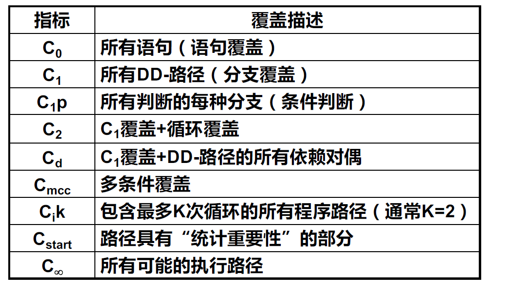

## 图论

#### n连通性

- i到j：0连通性 -> 不存在路径；1连通性 -> i到j存在半路径；2连通性 -> i到j存在路径；3连通性 -> i和j两点之间互相存在路径

#### 强分图

- 将所有三连通节点的集合压缩为一个节点，形成的压缩图

## 黑盒测试

### 边界值测试

边界值测试分为：

- 边界值分析
- 健壮性测试
- 最坏情况测试
- 健壮最坏情况测试

#### 边界值分析

- 基于单故障假设
- 取值为min，min+，normal，max-，max
- 对于n变量函数，设计$(4n+1)$个测试用例

#### 健壮性测试

- 在边界值分析的基础上进一步考虑max+和min-会出现的情况
- $(6n+1)$个测试用例

#### 最坏情况测试 & 健壮最坏情况测试

- 抛弃单故障假设

- 最坏情况测试$5^n$个测试用例，健壮最坏情况测试$7^n$个测试用例

  

### 等价类测试

假设有两个变量，将$x_1$的取值分为$m$个区间，将$x_2$的取值分为$n$个区间。

- 弱一般等价类测试：共$\max\{m, n\}$个测试用例 (单缺陷假设)
- 强一般等价类测试：共$m\cdot n$个测试用例
- 弱健壮等价类测试：
  - 纯”弱“：共$\max\{m+2, n+2\}$个测试用例，但有问题
  - 在弱一般等价类的基础上，再对无效值进行用例设计，共$\max\{m,n\}+2*变量数量（此处为2）$
  - **PPT上只强调了改进后的**
- 强健壮等价类测试：共$(m+2)\cdot (n+2)$个测试用例
- 边缘测试：对每一个分类的边缘都进行样例设计

### 基于决策表的测试

- 条件用c1, c2等来表示，动作用a1, a2等来表示
- 表格列出了在不同的条件组合下导致的动作组合情况
- 对于部分条件，可以合并，一些任取的条件可用"-"表示

## 白盒测试

### 路经测试

- **DD路径**：包含入口、出口，并将中间无分支的节点合并为一个节点。被合并的链的入度和出度都必须为1。
- **Miller覆盖指标**如下
- 

- **覆盖率**（假设程序的执行流是a->bc分支->分支汇合->de分支， bc分支的判断是c1 and c2, de分支的判断是c3 or c4)

  - **语句覆盖**： 程序中每一条可执行语句至少执行一次
  - **分支覆盖**：使程序中的每个逻辑判断的取真取假分支至少经历一次 （abd, ace两个用例可以满足）
  - **条件覆盖**：对判断中的每个条件进行覆盖。（对于c1-c4的真假都要覆盖，分别取TTTT和FFFF，共两个用例就能满足）
  - **多条件覆盖**：对于每一个判断，列出独立的所有可能，并都覆盖到（前两个要分别取到过TT，TF，FT，FF；后两个同）。因此本例子中至少设计4个样例。
  - **路径覆盖**：每一条可能的路径（abd, abe, acd, ace)
  - **循环测试**
    - **单循环测试**（假设循环次数为N）：
      - 直接跳过循环
      - 循环次数为1~N+1
    - **嵌套循环测试**
      - 先测试最内部循环，其他循环次数为1
      - 再测试第二层，其他循环次数为1
      - 直到最外层循环完成测试
    - **级联循环测试**
      - 分别采用单循环测试方法进行测试

- **基路径**

  - 取自基向量的概念。基路径是程序图中相互独立的一组路径，使得该程序中的所有路径都可以用基路径表示。
  - 基路径必须
    - 从起始点到终止点
    - 包含一条其他基路径b不曾用到的边，或至少引入一个新处理语句或者新判断的程序通路。
    - 对于循环而言，基路径应包含**不执行循环**和**执行一次循环**的路径。
  - **圈复杂度**：用于计算程序中基路径的数量。
    - V(G) = e - n + 2p
    - e为边数，n为节点数，p为连通区域数（或叫分图数，我也不知道是什么……一般取1……？）
    - 就是数圈圈……
    - 具有更高圈复杂度的程序需要更详尽的测试
- 寻找McCabe路径的方法：广搜和深搜
  
  ### 数据流测试