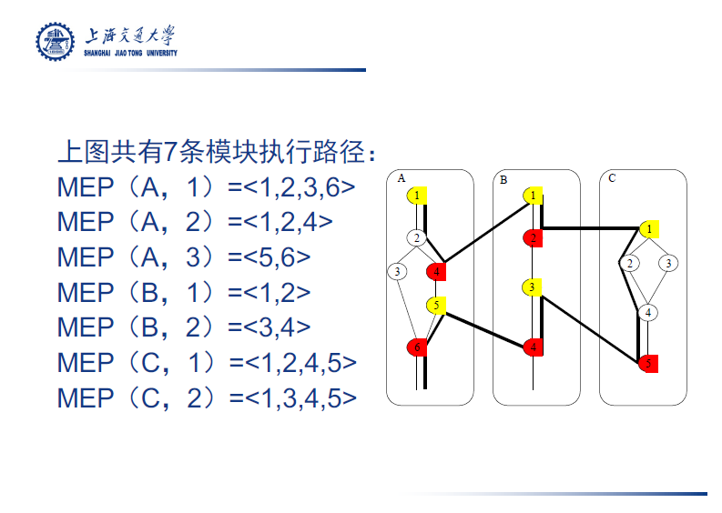
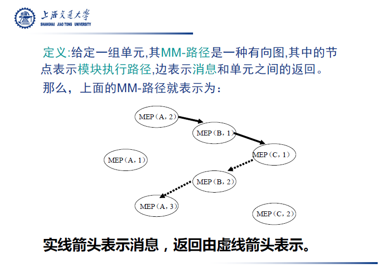
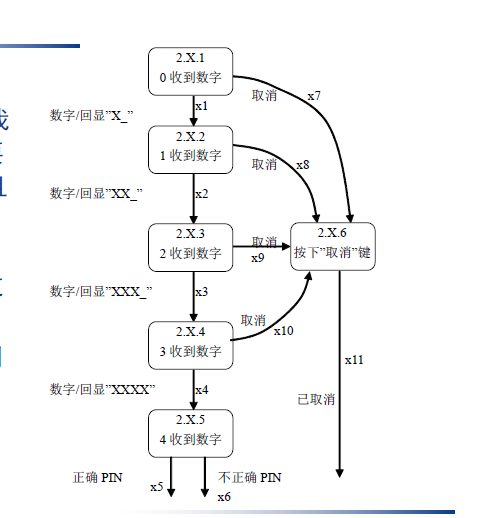

## 图论

#### n连通性

- i到j：0连通性 -> 不存在路径；1连通性 -> i到j存在半路径；2连通性 -> i到j存在路径；3连通性 -> i和j两点之间互相存在路径

#### 强分图

- 将所有三连通节点的集合压缩为一个节点，形成的压缩图

## 黑盒测试

### 边界值测试

边界值测试分为：

- 边界值分析
- 健壮性测试
- 最坏情况测试
- 健壮最坏情况测试

#### 边界值分析

- 基于单故障假设
- 取值为min，min+，normal，max-，max
- 对于n变量函数，设计$(4n+1)$个测试用例

#### 健壮性测试

- 在边界值分析的基础上进一步考虑max+和min-会出现的情况
- $(6n+1)$个测试用例

#### 最坏情况测试 & 健壮最坏情况测试

- 抛弃单故障假设

- 最坏情况测试$5^n$个测试用例，健壮最坏情况测试$7^n$个测试用例

  

### 等价类测试

假设有两个变量，将$x_1$的取值分为$m$个区间，将$x_2$的取值分为$n$个区间。

- 弱一般等价类测试：共$\max\{m, n\}$个测试用例 (单缺陷假设)
- 强一般等价类测试：共$m\cdot n$个测试用例
- 弱健壮等价类测试：
  - 纯”弱“：共$\max\{m+2, n+2\}$个测试用例，但有问题
  - 在弱一般等价类的基础上，再对无效值进行用例设计，共$\max\{m,n\}+2*变量数量（此处为2）$
  - **PPT上只强调了改进后的**
- 强健壮等价类测试：共$(m+2)\cdot (n+2)$个测试用例
- 边缘测试：对每一个分类的边缘都进行样例设计

### 基于决策表的测试

- 条件用c1, c2等来表示，动作用a1, a2等来表示
- 表格列出了在不同的条件组合下导致的动作组合情况
- 对于部分条件，可以合并，一些任取的条件可用"-"表示

## 白盒测试（单元测试）

### 路经测试

- **DD路径**：包含入口、出口，并将中间无分支的节点合并为一个节点。被合并的链的入度和出度都必须为1。
- **Miller覆盖指标**如下
- 
- **覆盖率**（假设程序的执行流是a->bc分支->分支汇合->de分支， bc分支的判断是c1 and c2, de分支的判断是c3 or c4)

  - **语句覆盖**： 程序中每一条可执行语句至少执行一次
  - **分支覆盖**：使程序中的每个逻辑判断的取真取假分支至少经历一次 （abd, ace两个用例可以满足）
  - **条件覆盖**：对判断中的每个条件进行覆盖。（对于c1-c4的真假都要覆盖，分别取TTTT和FFFF，共两个用例就能满足）
  - **多条件覆盖**：对于每一个判断，列出独立的所有可能，并都覆盖到（前两个要分别取到过TT，TF，FT，FF；后两个同）。因此本例子中至少设计4个样例。
  - **路径覆盖**：每一条可能的路径（abd, abe, acd, ace)
  - **循环测试**
    - **单循环测试**（假设循环次数为N）：
      - 直接跳过循环
      - 循环次数为1~N+1
    - **嵌套循环测试**
      - 先测试最内部循环，其他循环次数为1
      - 再测试第二层，其他循环次数为1
      - 直到最外层循环完成测试
    - **级联循环测试**
      - 分别采用单循环测试方法进行测试
- **基路径**

  - 取自基向量的概念。基路径是程序图中相互独立的一组路径，使得该程序中的所有路径都可以用基路径表示。
  - 基路径必须
    - 从起始点到终止点
    - 包含一条其他基路径b不曾用到的边，或至少引入一个新处理语句或者新判断的程序通路。
    - 对于循环而言，基路径应包含**不执行循环**和**执行一次循环**的路径。
  - **圈复杂度**：用于计算程序中基路径的数量。
    - V(G) = e - n + 2p
    - e为边数，n为节点数，p为连通区域数（或叫分图数，我也不知道是什么……一般取1……？）
    - 就是数圈圈……
    - 具有更高圈复杂度的程序需要更详尽的测试
- 寻找McCabe路径的方法：广搜和深搜

### 数据流测试

#### 概念

- 变量v由节点n代表的语句片段定义，n成为变量v的**定义节点**，记作$DEF(v,n)$
  - 包括输入语句，赋值语句，循环控制语句，（写入的）过程调用语句等
- 变量v由节点n代表的语句片段使用，n成为变量v的**使用节点**，记作$USE(v,n)$
  - 输出语句，赋值语句，循环控制语句，（读取的）过程调用语句等
  - 分为**谓词使用**和**计算使用**
    - 谓词使用：出度大于等于2，记作P-USE
    - 计算使用：出度等于1，记作C-USE
- 若存在一条路径，开始节点m满足$DEF(v,m)$，结束节点n满足$USE(v,n)$，则该路径称作变量v的**定义使用路径**
-  若存在一条路径，开始节点m满足$DEF(v,m)$，结束节点n满足$USE(v,n)$，且该路径中没有其他节点是v的定义节点，则该路径称作变量v的**定义清除路径**

#### 覆盖率

- **全定义准则：**对于每个变量，用例集合T包含v**每个定义节点**到v的**一个使用节点**的**定义清除路径**。
- **全使用准则：**对于每个变量，用例集合T包含v**每个定义节点**到v的**全部使用节点**和**后续节点**的**定义清除路径**。
- **全谓词使用/部分计算使用准则：** **每个定义节点**到**所有谓词使用**的**定义清除路径**，若无谓词使用，至少有一个计算使用的定义清除路径。
- **全计算使用/部分谓词使用准则：** **每个定义节点**到**所有计算使用**的**定义清除路径**，若无计算使用，至少有一个谓词使用的定义清除路径。 
- **全定义-使用路径准则：** **每个定义节点**到**所有节点以及后续节点**的定义清除路径。包括有一次环路或无环路的路径。

#### 程序片

- 定义：给定一个程序P和P中的一个变量集合V，变量集合V在语句n上的一个片表示P中在n**及以前**（书上的”以前“不准确）对V中的变量值做出贡献的**所有语句的集合**，记作$S(V,n)$。
- 包括（但可能不限于）
  - 该变量的定义语句
  - 该变量定义语句中涉及到的变量的定义语句
  - 该变量定义语句中涉及到的变量的定义语句涉及到的变量的定义语句……
  - 若该变量在循环内，则循环变量的判断语句
  - 通常END语句也包括在内

### 评估指标

假设功能性测试技术M生成**m个测试用例**，并且根据标识被测单元中的**s个元素**的结构性测试指标S来跟踪这些测试用例。当执行m个测试用例时，会经过**n个结构性测试单元**。

- 覆盖度$C(M,S) = \frac{n}{s}$

- 冗余度$R(M,S) = \frac{m}{s}$

- 净冗余度$NR(M,S) = \frac{m}{n}$

  

## 基于生命周期的测试

### 分类

- **单元测试**：面向详细设计，完成对软件独立模块的测试
- **集成测试**：
  - 面向概要设计，完成软件模块之间的组合测试
  - 需要了解程序的结构，是一种结构化的测试方法，有路径覆盖的含义
  - 由软件开发人员完成
- **系统测试**：
  - 面向需求分析，完成系统的功能测试
  - 不需要了解程序的结构，是一种黑盒的测试方法，是功能覆盖的含义
  - 需要用户的参与

### 集成测试

个人理解：功能分解是基于函数/过程的定义位置的，例如某个函数在一个类中定义，那么箭头由这个类指向这个函数；调用图就是调用图……

#### 基于功能分解的

- **自顶向下**集成：从主程序(顶层)开始，所有下层程序都以**桩程序**出现。完成顶层测试后，以真实程序代替桩程序，向下进行下一层测试。
  - 桩程序：模拟被调用程序的代码（一般以表格形式存在？）。
- **自底向上**集成：从程序的最下层节点（叶子）开始，通过编写**驱动器**完成测试，然后以真实程序代替**驱动器**，向上进行上一层测试。
  - 驱动器：模拟对测试节点的调用驱动。
- 三明治集成：同时从两端向中间层集成，可以减少桩程序和驱动的数量。
- 大爆炸测试：部分层次，将所有单元在一起编译，进行一次性测试。

#### 基于调用图的

- 成对集成：为减少桩程序和驱动器的开发。**测试集数量等于图中边的数量**。
- 相邻集成：以相邻节点为集合进行测试。**数量 = 节点数 - 叶子节点数**
  - 我也不知道为什么就这么记吧

#### 基于路径的

##### 定义

- 源节点：程序开始
- 汇节点：程序结束
- 执行路径：从源节点开始到汇节点
- 消息：一个单元将控制转移给另一个单元
- **MM路径**：穿插出现模块执行路径和消息的序列
  - 是一个有向图，其中的节点表示模块执行，边表示消息以及一个单元到另一个单元的返回
  - 
  - 
  - **复杂度**$V(G)=e-n+2p$, e为边数，n为节点数，p一般为1.

### 系统测试

#### 定义

- 线索（thread，跟线程还真不一样）：可以理解为从程序开始到结束的一条测试执行流
- 原子系统功能（ASF）：在系统层可以观察得到的端口输入和输出事件的行动。
  - ASF具有事件静止特性，开始于一个端口输入事件，遍历一个或多个MM路径，以一个端口输出事件结束
  - ASF具有事件序列原子化（不再细分）特性
  - 可以用类似有限状态机的方式表示
  - 

#### 覆盖率

- **基于事件**的线索测试，从1到5逐渐变强
  - PI1：每个端口输入事件发生
    - 易于达到
  - PI2：端口输入时间的常见序列发生
    - 基本可行
  - PI3：每个端口输入事在所有**相关**数据语境中发生
    - 可能形成测试爆炸
  - PI4：对于给定语境，所有**不合适**的输入事件发生
    - 和PI5都仅供参考
  - PI5：对于给定语境，所有可能的输入事件发生
- **基于端口**的线索测试
- **基于数据**的线索测试